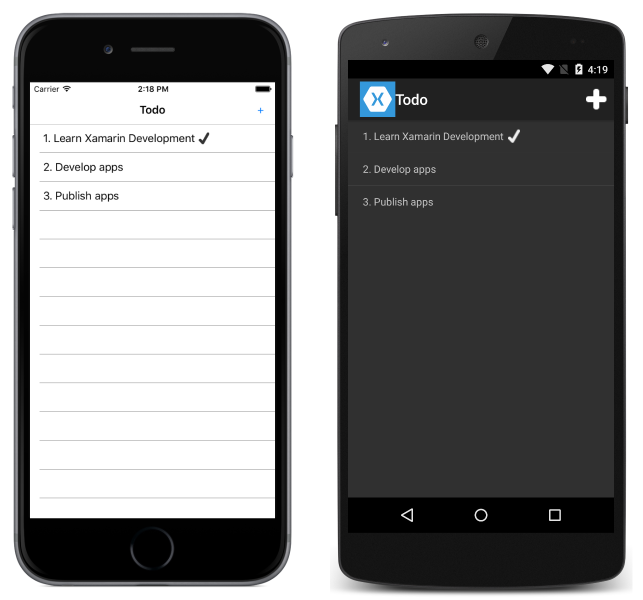
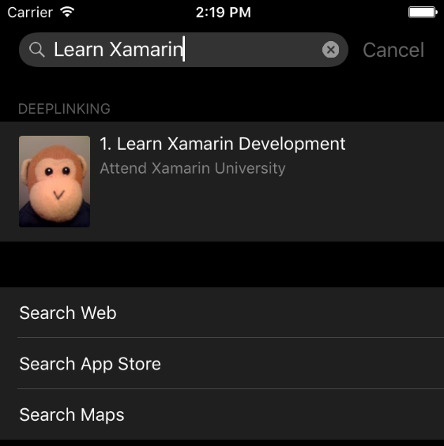

# Application Indexing and Deep Linking

_Application indexing allows applications that would otherwise be forgotten after a few uses to stay relevant by appearing in search results. Deep linking allows applications to respond to a search result that contains application data, typically by navigating to a page referenced from a deep link. This article demonstrates how to use application indexing and deep linking to make Xamarin.Forms application content searchable on iOS and Android devices._

> [!VIDEO https://youtube.com/embed/UJv4jUs7cJw]

**Deep Linking with Xamarin.Forms and Azure, by [Xamarin University](https://university.xamarin.com/)**


Xamarin.Forms application indexing and deep linking provide an API for publishing metadata for application indexing as users navigate through applications. Indexed content can then be searched for in Spotlight Search, in Google Search, or in a web search. Tapping on a search result that contains a deep link will fire an event that can be handled by an application, and is typically used to navigate to the page referenced from the deep link.

The sample application demonstrates a Todo list application where the data is stored in a local SQLite database, as shown in the following screenshots:



Each `TodoItem` instance created by the user is indexed. Platform-specific search can then be used to locate indexed data from the application. When the user taps on a search result item for the application, the application is launched, the `TodoItemPage` is navigated to, and the `TodoItem` referenced from the deep link is displayed.

For more information about using an SQLite database, see [Working with a Local Database](~/xamarin-forms/app-fundamentals/databases.md).

> [!NOTE]
> Xamarin.Forms application indexing and deep linking functionality is only available on the iOS and Android platforms, and requires iOS 9 and API 23 respectively.

## Setup

The following sections provide any additional setup instructions for using this feature on the iOS and Android platforms.

### iOS

On the iOS platform, there's no additional setup required to use this functionality.

### Android

On the Android platform, there are a number of prerequisites that must be met to use application indexing and deep linking functionality:

1. A version of your application must be live on Google Play.
1. A companion website must be registered against the application in Google's Developer Console. Once the application is associated with a website, URLs can be indexed that work for both the website and the application, which can then be served in Search results. For more information, see [App Indexing on Google Search](https://support.google.com/googleplay/android-developer/answer/6041489) on Google's website.
1. Your application must support HTTP URL intents on the `MainActivity` class, which tell application indexing what types of URL data schemes the application can respond to. For more information, see [Configuring the Intent Filter](~/android/platform/app-linking.md#configure-intent-filter).

Once these prerequisites are met, the following additional setup is required to use Xamarin.Forms application indexing and deep linking on the Android platform:

1. Install the [Xamarin.Forms.AppLinks](https://www.nuget.org/packages/Xamarin.Forms.AppLinks/) NuGet package into the Android application project.
1. In the `MainActivity.cs` file, import the `Xamarin.Forms.Platform.Android.AppLinks` namespace.
1. In the `MainActivity.OnCreate` override, add the following line of code underneath `Forms.Init(this, bundle)`:

```csharp
AndroidAppLinks.Init (this);
```

For more information, see [Deep Link Content with Xamarin.Forms URL Navigation](https://blog.xamarin.com/deep-link-content-with-xamarin-forms-url-navigation/) on the Xamarin blog.

## Indexing a Page

The process for indexing a page and exposing it to Google and Spotlight search is as follows:

1. Create an [`AppLinkEntry`](https://developer.xamarin.com/api/type/Xamarin.Forms.AppLinkEntry/) that contains the metadata required to index the page, along with a deep link to return to the page when the user selects the indexed content in search results.
1. Register the [`AppLinkEntry`](https://developer.xamarin.com/api/type/Xamarin.Forms.AppLinkEntry/) instance to index it for searching.

The following code example demonstrates how to create an [`AppLinkEntry`](https://developer.xamarin.com/api/type/Xamarin.Forms.AppLinkEntry/) instance:

```csharp
AppLinkEntry GetAppLink (TodoItem item)
{
  var pageType = GetType ().ToString ();
  var pageLink = new AppLinkEntry {
    Title = item.Name,
    Description = item.Notes,
    AppLinkUri = new Uri (string.Format ("http://{0}/{1}?id={2}",
      App.AppName, pageType, WebUtility.UrlEncode (item.ID)), UriKind.RelativeOrAbsolute),
    IsLinkActive = true,
    Thumbnail = ImageSource.FromFile ("monkey.png")
  };

  return pageLink;
}
```

The [`AppLinkEntry`](https://developer.xamarin.com/api/type/Xamarin.Forms.AppLinkEntry/) instance contains a number of properties whose values are required to index the page and create a deep link. The [`Title`](https://developer.xamarin.com/api/property/Xamarin.Forms.IAppLinkEntry.Title/), [`Description`](https://developer.xamarin.com/api/property/Xamarin.Forms.IAppLinkEntry.Description/), and [`Thumbnail`](https://developer.xamarin.com/api/property/Xamarin.Forms.IAppLinkEntry.Thumbnail/) properties are used to identify the indexed content when it appears in search results. The [`IsLinkActive`](https://developer.xamarin.com/api/property/Xamarin.Forms.IAppLinkEntry.IsLinkActive/) property is set to `true` to indicate that the indexed content is currently being viewed. The [`AppLinkUri`](https://developer.xamarin.com/api/property/Xamarin.Forms.IAppLinkEntry.AppLinkUri/) property is a `Uri` that contains the information required to return to the current page and display the current `TodoItem`. The following example shows an example `Uri` for the sample application:

```csharp
http://deeplinking/DeepLinking.TodoItemPage?id=ec38ebd1-811e-4809-8a55-0d028fce7819
```

This `Uri` contains all the information required to launch the `deeplinking` app, navigate to the `DeepLinking.TodoItemPage`, and display the `TodoItem` that has an `ID` of `ec38ebd1-811e-4809-8a55-0d028fce7819`.

## Registering Content for Indexing

Once an [`AppLinkEntry`](https://developer.xamarin.com/api/type/Xamarin.Forms.AppLinkEntry/) instance has been created, it must be registered for indexing to appear in search results. This is accomplished with the [`RegisterLink`](https://developer.xamarin.com/api/member/Xamarin.Forms.IAppLinks.RegisterLink/p/Xamarin.Forms.IAppLinkEntry/) method, as demonstrated in the following code example:

```csharp
Application.Current.AppLinks.RegisterLink (appLink);
```

This adds the [`AppLinkEntry`](https://developer.xamarin.com/api/type/Xamarin.Forms.AppLinkEntry/) instance to the application's [`AppLinks`](https://developer.xamarin.com/api/property/Xamarin.Forms.Application.AppLinks/) collection.

> [!NOTE]
> The `RegisterLink` method can also be used to update the content that's been indexed for a page.

Once an [`AppLinkEntry`](https://developer.xamarin.com/api/type/Xamarin.Forms.AppLinkEntry/) instance has been registered for indexing, it can appear in search results. The following screenshot shows indexed content appearing in search results on the iOS platform:



## De-registering Indexed Content

The [`DeregisterLink`](https://developer.xamarin.com/api/member/Xamarin.Forms.IAppLinks.DeregisterLink/p/Xamarin.Forms.IAppLinkEntry/) method is used to remove indexed content from search results, as demonstrated in the following code example:

```csharp
Application.Current.AppLinks.DeregisterLink (appLink);
```

This removes the [`AppLinkEntry`](https://developer.xamarin.com/api/type/Xamarin.Forms.AppLinkEntry/) instance from the application's [`AppLinks`](https://developer.xamarin.com/api/property/Xamarin.Forms.Application.AppLinks/) collection.

> [!NOTE]
> On Android it's not possible to remove indexed content from search results.

<a name="responding" />

## Responding to a Deep Link

When indexed content appears in search results and is selected by a user, the `App` class for the application will receive a request to handle the `Uri` contained in the indexed content. This request can be processed in the [`OnAppLinkRequestReceived`](https://developer.xamarin.com/api/member/Xamarin.Forms.Application.OnAppLinkRequestReceived/p/System.Uri/) override, as demonstrated in the following code example:

```csharp
public class App : Application
{
  ...

  protected override async void OnAppLinkRequestReceived (Uri uri)
  {
    string appDomain = "http://" + App.AppName.ToLowerInvariant () + "/";
    if (!uri.ToString ().ToLowerInvariant ().StartsWith (appDomain)) {
      return;
    }

    string pageUrl = uri.ToString ().Replace (appDomain, string.Empty).Trim ();
    var parts = pageUrl.Split ('?');
    string page = parts [0];
    string pageParameter = parts [1].Replace ("id=", string.Empty);

    var formsPage = Activator.CreateInstance (Type.GetType (page));
    var todoItemPage = formsPage as TodoItemPage;
    if (todoItemPage != null) {
      var todoItem = App.Database.Find (pageParameter);
      todoItemPage.BindingContext = todoItem;
      await MainPage.Navigation.PushAsync (formsPage as Page);
    }

    base.OnAppLinkRequestReceived (uri);
  }
}
```

The [`OnAppLinkRequestReceived`](https://developer.xamarin.com/api/member/Xamarin.Forms.Application.OnAppLinkRequestReceived/p/System.Uri/) method checks that the received `Uri` is intended for the application, before parsing the `Uri` into the page to be navigated to and the parameter to be passed to the page. An instance of the page to be navigated to is created, and the `TodoItem` represented by the page parameter is retrieved. The [`BindingContext`](https://developer.xamarin.com/api/property/Xamarin.Forms.BindableObject.BindingContext/) of the page to be navigated to is then set to the `TodoItem`. This ensures that when the `TodoItemPage` is displayed by the [`PushAsync`](https://developer.xamarin.com/api/member/Xamarin.Forms.INavigation.PushAsync/p/Xamarin.Forms.Page/) method, it will be showing the `TodoItem` whose `ID` is contained in the deep link.

## Making Content Available for Search Indexing

Each time the page represented by a deep link is displayed, the [`AppLinkEntry.IsLinkActive`](https://developer.xamarin.com/api/property/Xamarin.Forms.IAppLinkEntry.IsLinkActive/) property can be set to `true`. On iOS and Android this makes the [`AppLinkEntry`](https://developer.xamarin.com/api/type/Xamarin.Forms.AppLinkEntry/) instance available for search indexing, and on iOS only, it also makes the `AppLinkEntry` instance available for Handoff. For more information about Handoff, see [Introduction to Handoff](~/ios/platform/handoff.md).

The following code example demonstrates setting the [`AppLinkEntry.IsLinkActive`](https://developer.xamarin.com/api/property/Xamarin.Forms.IAppLinkEntry.IsLinkActive/) property to `true` in the [`Page.OnAppearing`](https://developer.xamarin.com/api/member/Xamarin.Forms.Page.OnAppearing()/) override:

```csharp
protected override void OnAppearing ()
{
  appLink = GetAppLink (BindingContext as TodoItem);
  if (appLink != null) {
    appLink.IsLinkActive = true;
  }
}
```

Similarly, when the page represented by a deep link is navigated away from, the [`AppLinkEntry.IsLinkActive`](https://developer.xamarin.com/api/property/Xamarin.Forms.IAppLinkEntry.IsLinkActive/) property can be set to `false`. On iOS and Android, this stops the [`AppLinkEntry`](https://developer.xamarin.com/api/type/Xamarin.Forms.AppLinkEntry/) instance being advertised for search indexing, and on iOS only, it also stops advertising the `AppLinkEntry` instance for Handoff. This can be accomplished in the [`Page.OnDisappearing`](https://developer.xamarin.com/api/member/Xamarin.Forms.Page.OnDisappearing()/) override, as demonstrated in the following code example:

```csharp
protected override void OnDisappearing ()
{
  if (appLink != null) {
    appLink.IsLinkActive = false;
  }
}
```

## Providing Data to Handoff

On iOS, application-specific data can be stored when indexing the page. This is achieved by adding data to the [`KeyValues`](https://developer.xamarin.com/api/property/Xamarin.Forms.IAppLinkEntry.KeyValues/) collection, which is a `Dictionary<string, string>` for storing key-value pairs that are used in Handoff. Handoff is a way for the user to start an activity on one of their devices and continue that activity on another of their devices (as identified by the user's iCloud account). The following code shows an example of storing application-specific key-value pairs:

```csharp
var pageLink = new AppLinkEntry {
  ...  
};
pageLink.KeyValues.Add("appName", App.AppName);
pageLink.KeyValues.Add("companyName", "Xamarin");
```

Values stored in the [`KeyValues`](https://developer.xamarin.com/api/property/Xamarin.Forms.IAppLinkEntry.KeyValues/) collection will be stored in the metadata for the indexed page, and will be restored when the user taps on a search result that contains a deep link (or when Handoff is used to view the content on another signed-in device).

In addition, values for the following keys can be specified:

- `contentType` – a `string` that specifies the uniform type identifier of the indexed content. The recommended convention to use for this value is the type name of the page containing the indexed content.
- `associatedWebPage` – a `string` that represents the web page to visit if the indexed content can also be viewed on the web, or if the application supports Safari's deep links.
- `shouldAddToPublicIndex` – a `string` of either `true` or `false` that controls whether or not to add the indexed content to Apple's public cloud index, which can then be presented to users who haven't installed the application on their iOS device. However, just because content has been set for public indexing, it doesn't mean that it will be automatically added to Apple's public cloud index. For more information, see [Public Search Indexing](~/ios/platform/search/nsuseractivity.md). Note that this key should be set to `false` when adding personal data to the [`KeyValues`](https://developer.xamarin.com/api/property/Xamarin.Forms.IAppLinkEntry.KeyValues/) collection.

> [!NOTE]
> The `KeyValues` collection isn't used on the Android platform.

For more information about Handoff, see [Introduction to Handoff](~/ios/platform/handoff.md).

## Summary

This article demonstrated how to use application indexing and deep linking to make Xamarin.Forms application content searchable on iOS and Android devices. Application indexing allows applications to stay relevant by appearing in search results that would otherwise be forgotten about after a few uses.


## Related Links

- [Deep Linking (sample)](https://developer.xamarin.com/samples/xamarin-forms/deeplinking/)
- [iOS Search APIs](~/ios/platform/search/index.md)
- [App-Linking in Android 6.0](~/android/platform/app-linking.md)
- [AppLinkEntry](https://developer.xamarin.com/api/type/Xamarin.Forms.AppLinkEntry/)
- [IAppLinkEntry](https://developer.xamarin.com/api/type/Xamarin.Forms.IAppLinkEntry/)
- [IAppLinks](https://developer.xamarin.com/api/type/Xamarin.Forms.IAppLinks/)
