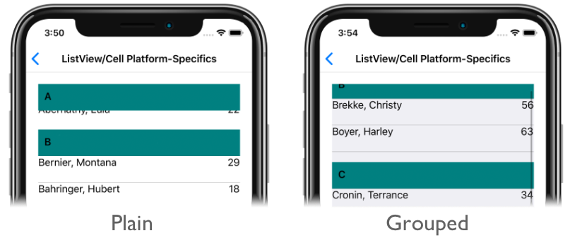

# ListView Group Header Style on iOS

[ Download the sample](https://developer.xamarin.com/samples/xamarin-forms/userinterface/platformspecifics/)

This iOS platform-specific controls whether [`ListView`](xref:Xamarin.Forms.ListView) header cells float during scrolling. It's consumed in XAML by setting the `ListView.GroupHeaderStyle` bindable property to a value of the `GroupHeaderStyle` enumeration:

```xaml
<ContentPage ...
             xmlns:ios="clr-namespace:Xamarin.Forms.PlatformConfiguration.iOSSpecific;assembly=Xamarin.Forms.Core">
    <StackLayout Margin="20">
        <ListView ... ios:ListView.GroupHeaderStyle="Grouped">
            ...
        </ListView>
    </StackLayout>
</ContentPage>
```

Alternatively, it can be consumed from C# using the fluent API:

```csharp
using Xamarin.Forms.PlatformConfiguration;
using Xamarin.Forms.PlatformConfiguration.iOSSpecific;
...

listView.On<iOS>().SetGroupHeaderStyle(GroupHeaderStyle.Grouped);
```

The `ListView.On<iOS>` method specifies that this platform-specific will only run on iOS. The `ListView.SetGroupHeaderStyle` method, in the [`Xamarin.Forms.PlatformConfiguration.iOSSpecific`](xref:Xamarin.Forms.PlatformConfiguration.iOSSpecific) namespace, is used to control whether [`ListView`](xref:Xamarin.Forms.ListView) header cells float during scrolling. The `GroupHeaderStyle` enumeration provides two possible values:

- `Plain` – indicates that header cells float when the [`ListView`](xref:Xamarin.Forms.ListView) is scrolled (default).
- `Grouped` – indicates that header cells do not float when the [`ListView`](xref:Xamarin.Forms.ListView) is scrolled.

In addition, the `ListView.GetGroupHeaderStyle` method can be used to return the `GroupHeaderStyle` that's applied to the [`ListView`](xref:Xamarin.Forms.ListView).

The result is that a specified `GroupHeaderStyle` value is applied to the [`ListView`](xref:Xamarin.Forms.ListView), which controls whether header cells float during scrolling:

[](listview-group-header-style-images/group-header-styles-large.png#lightbox "ListView with floating and non-floating header cells")

## Related links

- [PlatformSpecifics (sample)](https://developer.xamarin.com/samples/xamarin-forms/userinterface/platformspecifics/)
- [Creating Platform-Specifics](~/xamarin-forms/platform/platform-specifics/index.md#creating-platform-specifics)
- [iOSSpecific API](xref:Xamarin.Forms.PlatformConfiguration.iOSSpecific)
