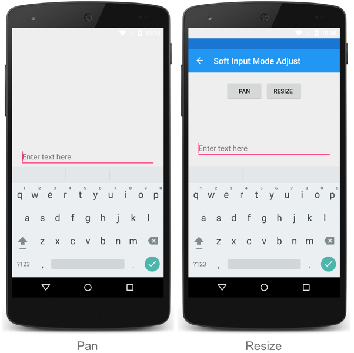
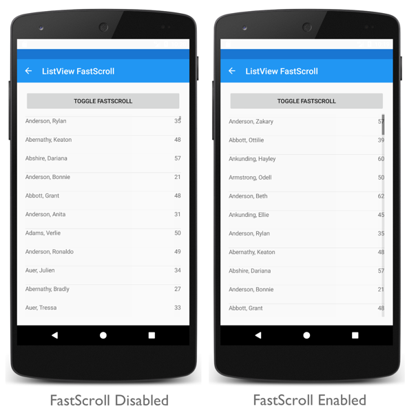
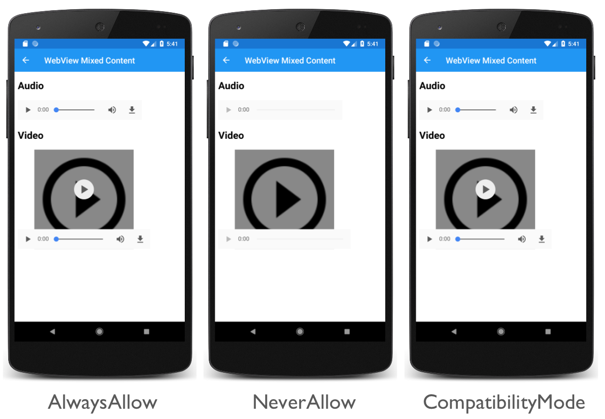
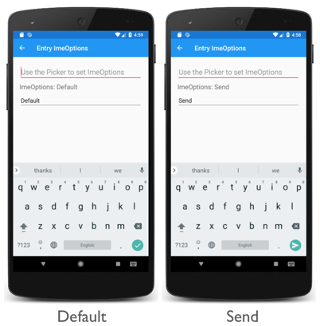
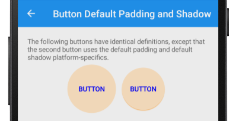

# Android Platform-Specifics

_Platform-specifics allow you to consume functionality that's only available on a specific platform, without implementing custom renderers or effects. This article demonstrates how to consume the Android platform-specifics that are built into Xamarin.Forms._

On Android, Xamarin.Forms contains the following platform-specifics:

- Setting the operating mode of a soft keyboard. For more information, see [Setting the Soft Keyboard Input Mode](#soft_input_mode).
- Enabling fast scrolling in a [`ListView`](https://developer.xamarin.com/api/type/Xamarin.Forms.ListView/) For more information, see [Enabling Fast Scrolling in a ListView](#fastscroll).
- Enabling swiping between pages in a [`TabbedPage`](https://developer.xamarin.com/api/type/Xamarin.Forms.TabbedPage/). For more information, see [Enabling Swiping Between Pages in a TabbedPage](#enable_swipe_paging).
- Controlling the Z-order of visual elements to determine drawing order. For more information, see [Controlling the Elevation of Visual Elements](#elevation).
- Disabling the [`Disappearing`](https://developer.xamarin.com/api/event/Xamarin.Forms.Page.Appearing/) and [`Appearing`](https://developer.xamarin.com/api/event/Xamarin.Forms.Page.Appearing/) page lifecycle events on pause and resume respectively, for applications that use AppCompat. For more information, see [Disabling the Disappearing and Appearing Page Lifecycle Events](#disable_lifecycle_events).
- Controlling whether a [`WebView`](xref:Xamarin.Forms.WebView) can display mixed content. For more information, see [Enabling Mixed Content in a WebView](#webview-mixed-content).
- Setting the input method editor options for the soft keyboard for an [`Entry`](xref:Xamarin.Forms.Entry). For more information, see [Setting Entry Input Method Editor Options](#entry-imeoptions).
- Disabling legacy color mode on a supported [`VisualElement`](xref:Xamarin.Forms.VisualElement). For more information, see [Disabling Legacy Color Mode](#legacy-color-mode).
- Using the default padding and shadow values of Android buttons. For more information, see [Using Android Buttons](#button-padding-shadow).

<a name="soft_input_mode" />

## Setting the Soft Keyboard Input Mode

This platform-specific is used to set the operating mode for a soft keyboard input area, and is consumed in XAML by setting the [`Application.WindowSoftInputModeAdjust`](https://developer.xamarin.com/api/field/Xamarin.Forms.PlatformConfiguration.AndroidSpecific.Application.WindowSoftInputModeAdjustProperty/) attached property to a value of the [`WindowSoftInputModeAdjust`](https://developer.xamarin.com/api/type/Xamarin.Forms.PlatformConfiguration.AndroidSpecific.WindowSoftInputModeAdjust/) enumeration:

```xaml
<Application ...
             xmlns:android="clr-namespace:Xamarin.Forms.PlatformConfiguration.AndroidSpecific;assembly=Xamarin.Forms.Core"
             android:Application.WindowSoftInputModeAdjust="Resize">
  ...
</Application>
```

Alternatively, it can be consumed from C# using the fluent API:

```csharp
using Xamarin.Forms.PlatformConfiguration;
using Xamarin.Forms.PlatformConfiguration.AndroidSpecific;
...

App.Current.On<Android>().UseWindowSoftInputModeAdjust(WindowSoftInputModeAdjust.Resize);
```

The `Application.On<Android>` method specifies that this platform-specific will only run on Android. The [`Application.UseWindowSoftInputModeAdjust`](https://developer.xamarin.com/api/member/Xamarin.Forms.PlatformConfiguration.AndroidSpecific.Application.UseWindowSoftInputModeAdjust/p/Xamarin.Forms.IPlatformElementConfiguration{Xamarin.Forms.PlatformConfiguration.Android,Xamarin.Forms.Application}/Xamarin.Forms.PlatformConfiguration.AndroidSpecific.WindowSoftInputModeAdjust/) method, in the [`Xamarin.Forms.PlatformConfiguration.AndroidSpecific`](https://developer.xamarin.com/api/namespace/Xamarin.Forms.PlatformConfiguration.AndroidSpecific/) namespace, is used to set the soft keyboard input area operating mode, with the [`WindowSoftInputModeAdjust`](https://developer.xamarin.com/api/type/Xamarin.Forms.PlatformConfiguration.AndroidSpecific.WindowSoftInputModeAdjust/) enumeration providing two values: [`Pan`](https://developer.xamarin.com/api/field/Xamarin.Forms.PlatformConfiguration.AndroidSpecific.WindowSoftInputModeAdjust.Pan/) and [`Resize`](https://developer.xamarin.com/api/field/Xamarin.Forms.PlatformConfiguration.AndroidSpecific.WindowSoftInputModeAdjust.Resize/). The `Pan` value uses the [`AdjustPan`](https://developer.xamarin.com/api/field/Android.Views.SoftInput.AdjustPan/) adjustment option, which doesn't resize the window when an input control has focus. Instead, the contents of the window are panned so that the current focus isn't obscured by the soft keyboard. The `Resize` value uses the [`AdjustResize`](https://developer.xamarin.com/api/field/Android.Views.SoftInput.AdjustResize/) adjustment option, which resizes the window when an input control has focus, to make room for the soft keyboard.

The result is that the soft keyboard input area operating mode can be set when an input control has focus:

[](android-images/pan-resize-large.png#lightbox "Soft Keyboard Operating Mode Plaform-Specific")

<a name="fastscroll" />

## Enabling Fast Scrolling in a ListView

This platform-specific is used to enable fast scrolling through data in a [`ListView`](https://developer.xamarin.com/api/type/Xamarin.Forms.ListView/). It's consumed in XAML by setting the `ListView.IsFastScrollEnabled` attached property to a `boolean` value:

```xaml
<ContentPage ...
             xmlns:android="clr-namespace:Xamarin.Forms.PlatformConfiguration.AndroidSpecific;assembly=Xamarin.Forms.Core">
    <StackLayout Margin="20">
        ...
        <ListView ItemsSource="{Binding GroupedEmployees}"
                  GroupDisplayBinding="{Binding Key}"
                  IsGroupingEnabled="true"
                  android:ListView.IsFastScrollEnabled="true">
            ...
        </ListView>
    </StackLayout>
</ContentPage>
```

Alternatively, it can be consumed from C# using the fluent API:

```csharp
using Xamarin.Forms.PlatformConfiguration;
using Xamarin.Forms.PlatformConfiguration.AndroidSpecific;
...

var listView = new Xamarin.Forms.ListView { IsGroupingEnabled = true, ... };
listView.SetBinding(ItemsView<Cell>.ItemsSourceProperty, "GroupedEmployees");
listView.GroupDisplayBinding = new Binding("Key");
listView.On<Android>().SetIsFastScrollEnabled(true);
```

The `ListView.On<Android>` method specifies that this platform-specific will only run on Android. The `ListView.SetIsFastScrollEnabled` method, in the [`Xamarin.Forms.PlatformConfiguration.AndroidSpecific`](https://developer.xamarin.com/api/namespace/Xamarin.Forms.PlatformConfiguration.AndroidSpecific/) namespace, is used to enable fast scrolling through data in a [`ListView`](https://developer.xamarin.com/api/type/Xamarin.Forms.ListView/). In addition, the `SetIsFastScrollEnabled` method can be used to toggle fast scrolling by calling the `IsFastScrollEnabled` method to return whether fast scrolling is enabled:

```csharp
listView.On<Android>().SetIsFastScrollEnabled(!listView.On<Android>().IsFastScrollEnabled());
```

The result is that fast scrolling through data in a [`ListView`](https://developer.xamarin.com/api/type/Xamarin.Forms.ListView/) can be enabled, which changes the size of the scroll thumb:

[](android-images/fastscroll-large.png#lightbox "ListView FastScroll Plaform-Specific")

<a name="enable_swipe_paging" />

## Enabling Swiping Between Pages in a TabbedPage

This platform-specific is used to enable swiping with a horizontal finger gesture between pages in a [`TabbedPage`](https://developer.xamarin.com/api/type/Xamarin.Forms.TabbedPage/). It's consumed in XAML by setting the [`TabbedPage.IsSwipePagingEnabled`](https://developer.xamarin.com/api/field/Xamarin.Forms.PlatformConfiguration.AndroidSpecific.TabbedPage.IsSwipePagingEnabledProperty/) attached property to a `boolean` value:

```xaml
<TabbedPage ...
            xmlns:android="clr-namespace:Xamarin.Forms.PlatformConfiguration.AndroidSpecific;assembly=Xamarin.Forms.Core"
            android:TabbedPage.OffscreenPageLimit="2"
            android:TabbedPage.IsSwipePagingEnabled="true">
    ...
</TabbedPage>
```

Alternatively, it can be consumed from C# using the fluent API:

```csharp
using Xamarin.Forms.PlatformConfiguration;
using Xamarin.Forms.PlatformConfiguration.AndroidSpecific;
...

On<Android>().SetOffscreenPageLimit(2)
             .SetIsSwipePagingEnabled(true);
```

The `TabbedPage.On<Android>` method specifies that this platform-specific will only run on Android. The [`TabbedPage.SetIsSwipePagingEnabled`](https://developer.xamarin.com/api/member/Xamarin.Forms.PlatformConfiguration.AndroidSpecific.TabbedPage.SetIsSwipePagingEnabled/p/Xamarin.Forms.BindableObject/System.Boolean/) method, in the [`Xamarin.Forms.PlatformConfiguration.AndroidSpecific`](https://developer.xamarin.com/api/namespace/Xamarin.Forms.PlatformConfiguration.AndroidSpecific/) namespace, is used to enable swiping between pages in a [`TabbedPage`](https://developer.xamarin.com/api/type/Xamarin.Forms.TabbedPage/). In addition, the `TabbedPage` class in the `Xamarin.Forms.PlatformConfiguration.AndroidSpecific` namespace also has a [`EnableSwipePaging`](https://developer.xamarin.com/api/member/Xamarin.Forms.PlatformConfiguration.AndroidSpecific.TabbedPage.EnableSwipePaging/p/Xamarin.Forms.IPlatformElementConfiguration%7BXamarin.Forms.PlatformConfiguration.Android,Xamarin.Forms.TabbedPage%7D/) method that enables this platform-specific, and a [`DisableSwipePaging`](https://developer.xamarin.com/api/member/Xamarin.Forms.PlatformConfiguration.AndroidSpecific.TabbedPage.DisableSwipePaging/p/Xamarin.Forms.IPlatformElementConfiguration%7BXamarin.Forms.PlatformConfiguration.Android,Xamarin.Forms.TabbedPage%7D/) method that disables this platform-specific. The [`TabbedPage.OffscreenPageLimit`](https://developer.xamarin.com/api/field/Xamarin.Forms.PlatformConfiguration.AndroidSpecific.TabbedPage.OffscreenPageLimitProperty/) attached property, and [`SetOffscreenPageLimit`](https://developer.xamarin.com/api/member/Xamarin.Forms.PlatformConfiguration.AndroidSpecific.TabbedPage.SetOffscreenPageLimit/p/Xamarin.Forms.BindableObject/System.Int32/) method, are used to set the number of pages that should be retained in an idle state on either side of the current page.

The result is that swipe paging through the pages displayed by a [`TabbedPage`](https://developer.xamarin.com/api/type/Xamarin.Forms.TabbedPage/) is enabled:


<a name="elevation" />

## Controlling the Elevation of Visual Elements

This platform-specific is used to control the elevation, or Z-order, of visual elements on applications that target API 21 or greater. The elevation of a visual element determines its drawing order, with visual elements with higher Z values occluding visual elements with lower Z values. It's consumed in XAML by setting the `VisualElement.Elevation` attached property to a `boolean` value:

```xaml
<ContentPage ...
             xmlns:android="clr-namespace:Xamarin.Forms.PlatformConfiguration.AndroidSpecific;assembly=Xamarin.Forms.Core"
             Title="Elevation">
    <StackLayout>
        <Grid>
            <Button Text="Button Beneath BoxView" />
            <BoxView Color="Red" Opacity="0.2" HeightRequest="50" />
        </Grid>        
        <Grid Margin="0,20,0,0">
            <Button Text="Button Above BoxView - Click Me" android:VisualElement.Elevation="10"/>
            <BoxView Color="Red" Opacity="0.2" HeightRequest="50" />
        </Grid>
    </StackLayout>
</ContentPage>
```

Alternatively, it can be consumed from C# using the fluent API:

```csharp
using Xamarin.Forms.PlatformConfiguration;
using Xamarin.Forms.PlatformConfiguration.AndroidSpecific;
...

public class AndroidElevationPageCS : ContentPage
{
    public AndroidElevationPageCS()
    {
        ...
        var aboveButton = new Button { Text = "Button Above BoxView - Click Me" };
        aboveButton.On<Android>().SetElevation(10);

        Content = new StackLayout
        {
            Children =
            {
                new Grid
                {
                    Children =
                    {
                        new Button { Text = "Button Beneath BoxView" },
                        new BoxView { Color = Color.Red, Opacity = 0.2, HeightRequest = 50 }
                    }
                },
                new Grid
                {
                    Margin = new Thickness(0,20,0,0),
                    Children =
                    {
                        aboveButton,
                        new BoxView { Color = Color.Red, Opacity = 0.2, HeightRequest = 50 }
                    }
                }
            }
        };
    }
}
```

The `Button.On<Android>` method specifies that this platform-specific will only run on Android. The `VisualElement.SetElevation` method, in the [`Xamarin.Forms.PlatformConfiguration.AndroidSpecific`](https://developer.xamarin.com/api/namespace/Xamarin.Forms.PlatformConfiguration.AndroidSpecific/) namespace, is used to set the elevation of the visual element to a nullable `float`. In addition, the `VisualElement.GetElevation` method can be used to retrieve the elevation value of a visual element.

The result is that the elevation of visual elements can be controlled so that visual elements with higher Z values occlude visual elements with lower Z values. Therefore, in this example the second [`Button`](https://developer.xamarin.com/api/type/Xamarin.Forms.Button/) is rendered above the [`BoxView`](https://developer.xamarin.com/api/type/Xamarin.Forms.BoxView/) because it has a higher elevation value:


<a name="disable_lifecycle_events" />

## Disabling the Disappearing and Appearing Page Lifecycle Events

This platform-specific is used to disable the [`Disappearing`](https://developer.xamarin.com/api/event/Xamarin.Forms.Page.Appearing/) and [`Appearing`](https://developer.xamarin.com/api/event/Xamarin.Forms.Page.Appearing/) page events on application pause and resume respectively, for applications that use AppCompat. In addition, it includes the ability to control whether the soft keyboard is displayed on resume, if it was displayed on pause, provided that the operating mode of the soft keyboard is set to [`WindowSoftInputModeAdjust.Resize`](https://developer.xamarin.com/api/field/Xamarin.Forms.PlatformConfiguration.AndroidSpecific.WindowSoftInputModeAdjust.Resize/).

> [!NOTE]
> Note that these events are enabled by default to preserve existing behavior for applications that rely on the events. Disabling these events makes the AppCompat event cycle match the pre-AppCompat event cycle.

This platform-specific can be consumed in XAML by setting the [`Application.SendDisappearingEventOnPause`](https://developer.xamarin.com/api/field/Xamarin.Forms.PlatformConfiguration.AndroidSpecific.AppCompat.Application.SendDisappearingEventOnPauseProperty/), [`Application.SendAppearingEventOnResume`](https://developer.xamarin.com/api/field/Xamarin.Forms.PlatformConfiguration.AndroidSpecific.AppCompat.Application.SendAppearingEventOnResumeProperty/), and [`Application.ShouldPreserveKeyboardOnResume`](https://developer.xamarin.com/api/field/Xamarin.Forms.PlatformConfiguration.AndroidSpecific.AppCompat.Application.ShouldPreserveKeyboardOnResumeProperty/) attached properties to `boolean` values:

```xaml
<Application ...
             xmlns:android="clr-namespace:Xamarin.Forms.PlatformConfiguration.AndroidSpecific;assembly=Xamarin.Forms.Core"             xmlns:androidAppCompat="clr-namespace:Xamarin.Forms.PlatformConfiguration.AndroidSpecific.AppCompat;assembly=Xamarin.Forms.Core"
             android:Application.WindowSoftInputModeAdjust="Resize"
             androidAppCompat:Application.SendDisappearingEventOnPause="false"
             androidAppCompat:Application.SendAppearingEventOnResume="false"
             androidAppCompat:Application.ShouldPreserveKeyboardOnResume="true">
  ...
</Application>
```

Alternatively, it can be consumed from C# using the fluent API:

```csharp
using Xamarin.Forms.PlatformConfiguration;
using Xamarin.Forms.PlatformConfiguration.AndroidSpecific;
using Xamarin.Forms.PlatformConfiguration.AndroidSpecific.AppCompat;
...

Xamarin.Forms.Application.Current.On<Android>()
     .UseWindowSoftInputModeAdjust(WindowSoftInputModeAdjust.Resize)
     .SendDisappearingEventOnPause(false)
     .SendAppearingEventOnResume(false)
     .ShouldPreserveKeyboardOnResume(true);
```

The `Application.Current.On<Android>` method specifies that this platform-specific will only run on Android. The [`Application.SendDisappearingEventOnPause`](https://developer.xamarin.com/api/member/Xamarin.Forms.PlatformConfiguration.AndroidSpecific.AppCompat.Application.SendDisappearingEventOnPause/p/Xamarin.Forms.IPlatformElementConfiguration{Xamarin.Forms.PlatformConfiguration.Android,Xamarin.Forms.Application}/System.Boolean/) method, in the [`Xamarin.Forms.PlatformConfiguration.AndroidSpecific.AppCompat`](https://developer.xamarin.com/api/namespace/Xamarin.Forms.PlatformConfiguration.AndroidSpecific.AppCompat/) namespace, is used to enable or disable firing the [`Disappearing`](https://developer.xamarin.com/api/event/Xamarin.Forms.Page.Appearing/) page event, when the application enters the background. The [`Application.SendAppearingEventOnResume`](https://developer.xamarin.com/api/member/Xamarin.Forms.PlatformConfiguration.AndroidSpecific.AppCompat.Application.SendAppearingEventOnResume/p/Xamarin.Forms.IPlatformElementConfiguration{Xamarin.Forms.PlatformConfiguration.Android,Xamarin.Forms.Application}/System.Boolean/) method is used to enable or disable firing the [`Appearing`](https://developer.xamarin.com/api/event/Xamarin.Forms.Page.Appearing/) page event, when the application resumes from the background. The [`Application.ShouldPreserveKeyboardOnResume`](https://developer.xamarin.com/api/member/Xamarin.Forms.PlatformConfiguration.AndroidSpecific.AppCompat.Application.ShouldPreserveKeyboardOnResume/p/Xamarin.Forms.IPlatformElementConfiguration{Xamarin.Forms.PlatformConfiguration.Android,Xamarin.Forms.Application}/System.Boolean/) method is used control whether the soft keyboard is displayed on resume, if it was displayed on pause, provided that the operating mode of the soft keyboard is set to [`WindowSoftInputModeAdjust.Resize`](https://developer.xamarin.com/api/field/Xamarin.Forms.PlatformConfiguration.AndroidSpecific.WindowSoftInputModeAdjust.Resize/).

The result is that the [`Disappearing`](https://developer.xamarin.com/api/event/Xamarin.Forms.Page.Appearing/) and [`Appearing`](https://developer.xamarin.com/api/event/Xamarin.Forms.Page.Appearing/) page events won't be fired on application pause and resume respectively, and that if the soft keyboard was displayed when the application was paused, it will also be displayed when the application resumes:

[](android-images/keyboard-on-resume-large.png#lightbox "Lifecycle Events Platform-Specific")

<a name="webview-mixed-content" />

## Enabling Mixed Content in a WebView

This platform-specific controls whether a [`WebView`](xref:Xamarin.Forms.WebView) can display mixed content in applications that target API 21 or greater. Mixed content is content that's initially loaded over an HTTPS connection, but which loads resources (such as images, audio, video, stylesheets, scripts) over an HTTP connection. It's consumed in XAML by setting the [`WebView.MixedContentMode`](x:ref:Xamarin.Forms.PlatformConfiguration.AndroidSpecific.WebView.MixedContentModeProperty) attached property to a value of the [`MixedContentHandling`](xref:Xamarin.Forms.PlatformConfiguration.AndroidSpecific.MixedContentHandling) enumeration:

```xaml
<ContentPage ...
             xmlns:android="clr-namespace:Xamarin.Forms.PlatformConfiguration.AndroidSpecific;assembly=Xamarin.Forms.Core">
    <WebView ... android:WebView.MixedContentMode="AlwaysAllow" />
</ContentPage>
```

Alternatively, it can be consumed from C# using the fluent API:

```csharp
using Xamarin.Forms.PlatformConfiguration;
using Xamarin.Forms.PlatformConfiguration.AndroidSpecific;
...

webView.On<Android>().SetMixedContentMode(MixedContentHandling.AlwaysAllow);
```

The `WebView.On<Android>` method specifies that this platform-specific will only run on Android. The [`WebView.SetMixedContentMode`](xref:Xamarin.Forms.PlatformConfiguration.AndroidSpecific.WebView.SetMixedContentMode(Xamarin.Forms.IPlatformElementConfiguration{Xamarin.Forms.PlatformConfiguration.Android,Xamarin.Forms.WebView},Xamarin.Forms.PlatformConfiguration.AndroidSpecific.MixedContentHandling)) method, in the [`Xamarin.Forms.PlatformConfiguration.AndroidSpecific`](xref:Xamarin.Forms.PlatformConfiguration.AndroidSpecific) namespace, is used to control whether mixed content can be displayed, with the [`MixedContentHandling`](xref:Xamarin.Forms.PlatformConfiguration.AndroidSpecific.MixedContentHandling) enumeration providing three possible values:

- [`AlwaysAllow`](xref:Xamarin.Forms.PlatformConfiguration.AndroidSpecific.MixedContentHandling.AlwaysAllow) – indicates that the [`WebView`](xref:Xamarin.Forms.WebView) will allow an HTTPS origin to load content from an HTTP origin.
- [`NeverAllow`](xref:Xamarin.Forms.PlatformConfiguration.AndroidSpecific.MixedContentHandling.NeverAllow) – indicates that the [`WebView`](xref:Xamarin.Forms.WebView) will not allow an HTTPS origin to load content from an HTTP origin.
- [`CompatibilityMode`](xref:Xamarin.Forms.PlatformConfiguration.AndroidSpecific.MixedContentHandling.CompatibilityMode) – indicates that the [`WebView`](xref:Xamarin.Forms.WebView) will attempt to be compatible with the approach of the latest device web browser. Some HTTP content may be allowed to be loaded by an HTTPS origin and other types of content will be blocked. The types of content that are blocked or allowed may change with each operating system release.

The result is that a specified [`MixedContentHandling`](xref:Xamarin.Forms.PlatformConfiguration.AndroidSpecific.MixedContentHandling) value is applied to the [`WebView`](xref:Xamarin.Forms.WebView), which controls whether mixed content can be displayed:

[](android-images/webview-mixedcontent-large.png#lightbox "WebView mixed content handling platform-specific")

<a name="entry-imeoptions" />

## Setting Entry Input Method Editor Options

This platform-specific sets the input method editor (IME) options for the soft keyboard for an [`Entry`](xref:Xamarin.Forms.Entry). This includes setting the user action button in the bottom corner of the soft keyboard, and the interactions with the `Entry`. It's consumed in XAML by setting the [`Entry.ImeOptions`](xref:Xamarin.Forms.PlatformConfiguration.AndroidSpecific.Entry.ImeOptionsProperty) attached property to a value of the [`ImeFlags`](xref:Xamarin.Forms.PlatformConfiguration.AndroidSpecific.ImeFlags) enumeration:

```xaml
<ContentPage ...
             xmlns:android="clr-namespace:Xamarin.Forms.PlatformConfiguration.AndroidSpecific;assembly=Xamarin.Forms.Core">
    <StackLayout ...>
        <Entry ... android:Entry.ImeOptions="Send" />
        ...
    </StackLayout>
</ContentPage>
```

Alternatively, it can be consumed from C# using the fluent API:

```csharp
using Xamarin.Forms.PlatformConfiguration;
using Xamarin.Forms.PlatformConfiguration.AndroidSpecific;
...

entry.On<Android>().SetImeOptions(ImeFlags.Send);
```

The `Entry.On<Android>` method specifies that this platform-specific will only run on Android. The [`Entry.SetImeOptions`](xref:Xamarin.Forms.PlatformConfiguration.AndroidSpecific.Entry.SetImeOptions(Xamarin.Forms.IPlatformElementConfiguration{Xamarin.Forms.PlatformConfiguration.Android,Xamarin.Forms.Entry},Xamarin.Forms.PlatformConfiguration.AndroidSpecific.ImeFlags)) method, in the [`Xamarin.Forms.PlatformConfiguration.AndroidSpecific`](xref:Xamarin.Forms.PlatformConfiguration.AndroidSpecific) namespace, is used to set the input method action option for the soft keyboard for the [`Entry`](xref:Xamarin.Forms.Entry), with the [`ImeFlags`](xref:Xamarin.Forms.PlatformConfiguration.AndroidSpecific.ImeFlags) enumeration providing the following values:

- [`Default`](xref:Xamarin.Forms.PlatformConfiguration.AndroidSpecific.ImeFlags.Default) – indicates that no specific action key is required, and that the underlying control will produce its own if it can. This will either be `Next` or `Done`.
- [`None`](xref:Xamarin.Forms.PlatformConfiguration.AndroidSpecific.ImeFlags.None) – indicates that no action key will be made available.
- [`Go`](xref:Xamarin.Forms.PlatformConfiguration.AndroidSpecific.ImeFlags.Go) – indicates that the action key will perform a "go" operation, taking the user to the target of the text they typed.
- [`Search`](xref:Xamarin.Forms.PlatformConfiguration.AndroidSpecific.ImeFlags.Search) – indicates that the action key performs a "search" operation, taking the user to the results of searching for the text they have typed.
- [`Send`](xref:Xamarin.Forms.PlatformConfiguration.AndroidSpecific.ImeFlags.Send) – indicates that the action key will perform a "send" operation, delivering the text to its target.
- [`Next`](xref:Xamarin.Forms.PlatformConfiguration.AndroidSpecific.ImeFlags.Next) – indicates that the action key will perform a "next" operation, taking the user to the next field that will accept text.
- [`Done`](xref:Xamarin.Forms.PlatformConfiguration.AndroidSpecific.ImeFlags.Done) – indicates that the action key will perform a "done" operation, closing the soft keyboard.
- [`Previous`](xref:Xamarin.Forms.PlatformConfiguration.AndroidSpecific.ImeFlags.Previous) – indicates that the action key will perform a "previous" operation, taking the user to the previous field that will accept text.
- [`ImeMaskAction`](xref:Xamarin.Forms.PlatformConfiguration.AndroidSpecific.ImeFlags.ImeMaskAction) – the mask to select action options.
- [`NoPersonalizedLearning`](xref:Xamarin.Forms.PlatformConfiguration.AndroidSpecific.ImeFlags.NoPersonalizedLearning) – indicates that the spellchecker will neither learn from the user, nor suggest corrections based on what the user has previously typed.
- [`NoFullscreen`](xref:Xamarin.Forms.PlatformConfiguration.AndroidSpecific.ImeFlags.NoFullscreen) – indicates that the UI should not go fullscreen.
- [`NoExtractUi`](xref:Xamarin.Forms.PlatformConfiguration.AndroidSpecific.ImeFlags.NoExtractUi) – indicates that no UI will be shown for extracted text.
- [`NoAccessoryAction`](xref:Xamarin.Forms.PlatformConfiguration.AndroidSpecific.ImeFlags.NoAccessoryAction) – indicates that no UI will be displayed for custom actions.

The result is that a specified [`ImeFlags`](xref:Xamarin.Forms.PlatformConfiguration.AndroidSpecific.ImeFlags) value is applied to the soft keyboard for the [`Entry`](xref:Xamarin.Forms.Entry), which sets the input method editor options:

[](android-images/entry-imeoptions-large.png#lightbox "Entry input method editor platform-specific")

<a name="legacy-color-mode" />

## Disabling Legacy Color Mode

Some of the Xamarin.Forms views feature a legacy color mode. In this mode, when the [`IsEnabled`](xref:Xamarin.Forms.VisualElement.IsEnabled) property of the view is set to `false`, the view will override the colors set by the user with the default native colors for the disabled state. For backwards compatibility, this legacy color mode remains the default behavior for supported views.

This platform-specific disables this legacy color mode, so that colors set on a view by the user remain even when the view is disabled. It's consumed in XAML by setting the [`VisualElement.IsLegacyColorModeEnabled`](xref:Xamarin.Forms.PlatformConfiguration.AndroidSpecific.VisualElement.IsLegacyColorModeEnabledProperty) attached property to `false`:

```xaml
<ContentPage ...
             xmlns:android="clr-namespace:Xamarin.Forms.PlatformConfiguration.AndroidSpecific;assembly=Xamarin.Forms.Core">
    <StackLayout>
        ...
        <Button Text="Button"
                TextColor="Blue"
                BackgroundColor="Bisque"
                android:VisualElement.IsLegacyColorModeEnabled="False" />
        ...
    </StackLayout>
</ContentPage>
```

Alternatively, it can be consumed from C# using the fluent API:

```csharp
using Xamarin.Forms.PlatformConfiguration;
using Xamarin.Forms.PlatformConfiguration.AndroidSpecific;
...

_legacyColorModeDisabledButton.On<Android>().SetIsLegacyColorModeEnabled(false);
```

The `VisualElement.On<Android>` method specifies that this platform-specific will only run on Android. The [`VisualElement.SetIsLegacyColorModeEnabled`](xref:Xamarin.Forms.PlatformConfiguration.AndroidSpecific.VisualElement.SetIsLegacyColorModeEnabled(Xamarin.Forms.IPlatformElementConfiguration{Xamarin.Forms.PlatformConfiguration.Android,Xamarin.Forms.VisualElement},System.Boolean)) method, in the [`Xamarin.Forms.PlatformConfiguration.AndroidSpecific`](xref:Xamarin.Forms.PlatformConfiguration.AndroidSpecific) namespace, is used to control whether the legacy color mode is disabled. In addition, the [`VisualElement.GetIsLegacyColorModeEnabled`](xref:Xamarin.Forms.PlatformConfiguration.AndroidSpecific.VisualElement.GetIsLegacyColorModeEnabled(Xamarin.Forms.IPlatformElementConfiguration{Xamarin.Forms.PlatformConfiguration.Android,Xamarin.Forms.VisualElement})) method can be used to return whether the legacy color mode is disabled.

The result is that the legacy color mode can be disabled, so that colors set on a view by the user remain even when the view is disabled:


> [!NOTE]
> When setting a [`VisualStateGroup`](xref:Xamarin.Forms.VisualStateGroup) on a view, the legacy color mode is completely ignored. For more information about visual states, see [The Xamarin.Forms Visual State Manager](~/xamarin-forms/user-interface/visual-state-manager.md).

<a name="button-padding-shadow" />

## Using Android Buttons

This platform-specific controls whether Xamarin.Forms buttons use the default padding and shadow values of Android buttons. It's consumed in XAML by setting the [`Button.UseDefaultPadding`](xref:Xamarin.Forms.PlatformConfiguration.AndroidSpecific.Button.UseDefaultPaddingProperty) and [`Button.UseDefaultShadow`](xref:Xamarin.Forms.PlatformConfiguration.AndroidSpecific.Button.UseDefaultShadowProperty) attached properties to `boolean` values:

```xaml
<ContentPage ...
            xmlns:android="clr-namespace:Xamarin.Forms.PlatformConfiguration.AndroidSpecific;assembly=Xamarin.Forms.Core">
    <StackLayout>
        ...
        <Button ...
                android:Button.UseDefaultPadding="true"
                android:Button.UseDefaultShadow="true" />         
    </StackLayout>
</ContentPage>
```

Alternatively, it can be consumed from C# using the fluent API:

```csharp
using Xamarin.Forms.PlatformConfiguration;
using Xamarin.Forms.PlatformConfiguration.AndroidSpecific;
...

button.On<Android>().SetUseDefaultPadding(true).SetUseDefaultShadow(true);
```

The `Button.On<Android>` method specifies that this platform-specific will only run on Android. The [`Button.SetUseDefaultPadding`](xref:Xamarin.Forms.PlatformConfiguration.AndroidSpecific.Button.SetUseDefaultPadding(Xamarin.Forms.IPlatformElementConfiguration{Xamarin.Forms.PlatformConfiguration.Android,Xamarin.Forms.Button},System.Boolean)) and[`Button.SetUseDefaultShadow`](xref:Xamarin.Forms.PlatformConfiguration.AndroidSpecific.Button.SetUseDefaultShadow(Xamarin.Forms.IPlatformElementConfiguration{Xamarin.Forms.PlatformConfiguration.Android,Xamarin.Forms.Button},System.Boolean)) methods, in the [`Xamarin.Forms.PlatformConfiguration.AndroidSpecific`](xref:Xamarin.Forms.PlatformConfiguration.AndroidSpecific) namespace, are used to control whether Xamarin.Forms buttons use the default padding and shadow values of Android buttons. In addition, the [`Button.UseDefaultPadding`](xref:Xamarin.Forms.PlatformConfiguration.AndroidSpecific.Button.UseDefaultPadding(Xamarin.Forms.IPlatformElementConfiguration{Xamarin.Forms.PlatformConfiguration.Android,Xamarin.Forms.Button})) and [`Button.UseDefaultShadow`](xref:Xamarin.Forms.PlatformConfiguration.AndroidSpecific.Button.UseDefaultShadow(Xamarin.Forms.IPlatformElementConfiguration{Xamarin.Forms.PlatformConfiguration.Android,Xamarin.Forms.Button})) methods can be used to return whether a button uses the default padding value and default shadow value, respectively.

The result is that Xamarin.Forms buttons can use the default padding and shadow values of Android buttons:



Note that in the screenshot above each [`Button`](xref:Xamarin.Forms.Button) has identical definitions, except that the right-hand `Button` uses the default padding and shadow values of Android buttons.

## Summary

This article demonstrated how to consume the Android platform-specifics that are built into Xamarin.Forms. Platform-specifics allow you to consume functionality that's only available on a specific platform, without implementing custom renderers or effects.

## Related Links

- [Creating Platform-Specifics](~/xamarin-forms/platform/platform-specifics/creating.md)
- [PlatformSpecifics (sample)](https://developer.xamarin.com/samples/xamarin-forms/userinterface/platformspecifics/)
- [AndroidSpecific](https://developer.xamarin.com/api/namespace/Xamarin.Forms.PlatformConfiguration.AndroidSpecific/)
- [AndroidSpecific.AppCompat](https://developer.xamarin.com/api/namespace/Xamarin.Forms.PlatformConfiguration.AndroidSpecific.AppCompat/)
