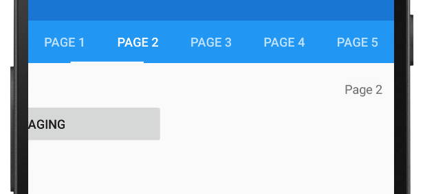
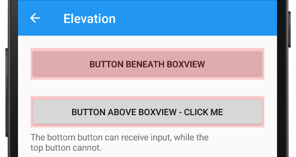
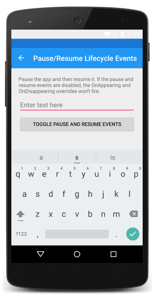

# Android Platform-Specifics

_Platform-specifics allow you to consume functionality that's only available on a specific platform, without implementing custom renderers or effects. This article demonstrates how to consume the Android platform-specifics that are built into Xamarin.Forms._

On Android, Xamarin.Forms contains the following platform-specifics:

- Setting the operating mode of a soft keyboard. For more information, see [Setting the Soft Keyboard Input Mode](#soft_input_mode).
- Enabling fast scrolling in a [`ListView`](https://developer.xamarin.com/api/type/Xamarin.Forms.ListView/) For more information, see [Enabling Fast Scrolling in a ListView](#fastscroll).
- Enabling swiping between pages in a [`TabbedPage`](https://developer.xamarin.com/api/type/Xamarin.Forms.TabbedPage/). For more information, see [Enabling Swiping Between Pages in a TabbedPage](#enable_swipe_paging).
- Controlling the Z-order of visual elements to determine drawing order. For more information, see [Controlling the Elevation of Visual Elements](#elevation).
- Disabling the [`Disappearing`](https://developer.xamarin.com/api/event/Xamarin.Forms.Page.Appearing/) and [`Appearing`](https://developer.xamarin.com/api/event/Xamarin.Forms.Page.Appearing/) page lifecycle events on pause and resume respectively, for applications that use AppCompat. For more information, see [Disabling the Disappearing and Appearing Page Lifecycle Events](#disable_lifecycle_events).

<a name="soft_input_mode" />

## Setting the Soft Keyboard Input Mode

This platform-specific is used to set the operating mode for a soft keyboard input area, and is consumed in XAML by setting the [`Application.WindowSoftInputModeAdjust`](https://developer.xamarin.com/api/field/Xamarin.Forms.PlatformConfiguration.AndroidSpecific.Application.WindowSoftInputModeAdjustProperty/) attached property to a value of the [`WindowSoftInputModeAdjust`](https://developer.xamarin.com/api/type/Xamarin.Forms.PlatformConfiguration.AndroidSpecific.WindowSoftInputModeAdjust/) enumeration:

```xaml
<Application ...
             xmlns:android="clr-namespace:Xamarin.Forms.PlatformConfiguration.AndroidSpecific;assembly=Xamarin.Forms.Core"
             android:Application.WindowSoftInputModeAdjust="Resize">
  ...
</Application>
```

Alternatively, it can be consumed from C# using the fluent API:

```csharp
using Xamarin.Forms.PlatformConfiguration;
using Xamarin.Forms.PlatformConfiguration.AndroidSpecific;
...

App.Current.On<Android>().UseWindowSoftInputModeAdjust(WindowSoftInputModeAdjust.Resize);
```

The `Application.On<Android>` method specifies that this platform-specific will only run on Android. The [`Application.UseWindowSoftInputModeAdjust`](https://developer.xamarin.com/api/member/Xamarin.Forms.PlatformConfiguration.AndroidSpecific.Application.UseWindowSoftInputModeAdjust/p/Xamarin.Forms.IPlatformElementConfiguration{Xamarin.Forms.PlatformConfiguration.Android,Xamarin.Forms.Application}/Xamarin.Forms.PlatformConfiguration.AndroidSpecific.WindowSoftInputModeAdjust/) method, in the [`Xamarin.Forms.PlatformConfiguration.AndroidSpecific`](https://developer.xamarin.com/api/namespace/Xamarin.Forms.PlatformConfiguration.AndroidSpecific/) namespace, is used to set the soft keyboard input area operating mode, with the [`WindowSoftInputModeAdjust`](https://developer.xamarin.com/api/type/Xamarin.Forms.PlatformConfiguration.AndroidSpecific.WindowSoftInputModeAdjust/) enumeration providing two values: [`Pan`](https://developer.xamarin.com/api/field/Xamarin.Forms.PlatformConfiguration.AndroidSpecific.WindowSoftInputModeAdjust.Pan/) and [`Resize`](https://developer.xamarin.com/api/field/Xamarin.Forms.PlatformConfiguration.AndroidSpecific.WindowSoftInputModeAdjust.Resize/). The `Pan` value uses the [`AdjustPan`](https://developer.xamarin.com/api/field/Android.Views.SoftInput.AdjustPan/) adjustment option, which doesn't resize the window when an input control has focus. Instead, the contents of the window are panned so that the current focus isn't obscured by the soft keyboard. The `Resize` value uses the [`AdjustResize`](https://developer.xamarin.com/api/field/Android.Views.SoftInput.AdjustResize/) adjustment option, which resizes the window when an input control has focus, to make room for the soft keyboard.

The result is that the soft keyboard input area operating mode can be set when an input control has focus:

[](android-images/pan-resize-large.png "Soft Keyboard Operating Mode Plaform-Specific")

<a name="fastscroll" />

## Enabling Fast Scrolling in a ListView

This platform-specific is used to enable fast scrolling through data in a [`ListView`](https://developer.xamarin.com/api/type/Xamarin.Forms.ListView/). It's consumed in XAML by setting the `ListView.IsFastScrollEnabled` attached property to a `boolean` value:

```xaml
<ContentPage ...
             xmlns:android="clr-namespace:Xamarin.Forms.PlatformConfiguration.AndroidSpecific;assembly=Xamarin.Forms.Core">
	<StackLayout Margin="20">
        ...
        <ListView ItemsSource="{Binding GroupedEmployees}"
                  GroupDisplayBinding="{Binding Key}"
                  IsGroupingEnabled="true"
                  android:ListView.IsFastScrollEnabled="true">
            ...
		</ListView>
	</StackLayout>
</ContentPage>
```

Alternatively, it can be consumed from C# using the fluent API:

```csharp
using Xamarin.Forms.PlatformConfiguration;
using Xamarin.Forms.PlatformConfiguration.AndroidSpecific;
...

var listView = new Xamarin.Forms.ListView { IsGroupingEnabled = true, ... };
listView.SetBinding(ItemsView<Cell>.ItemsSourceProperty, "GroupedEmployees");
listView.GroupDisplayBinding = new Binding("Key");
listView.On<Android>().SetIsFastScrollEnabled(true);
```

The `ListView.On<Android>` method specifies that this platform-specific will only run on Android. The `ListView.SetIsFastScrollEnabled` method, in the [`Xamarin.Forms.PlatformConfiguration.AndroidSpecific`](https://developer.xamarin.com/api/namespace/Xamarin.Forms.PlatformConfiguration.AndroidSpecific/) namespace, is used to enable fast scrolling through data in a [`ListView`](https://developer.xamarin.com/api/type/Xamarin.Forms.ListView/). In addition, the `SetIsFastScrollEnabled` method can be used to toggle fast scrolling by calling the `IsFastScrollEnabled` method to return whether fast scrolling is enabled:

```csharp
listView.On<Android>().SetIsFastScrollEnabled(!listView.On<Android>().IsFastScrollEnabled());
```

The result is that fast scrolling through data in a [`ListView`](https://developer.xamarin.com/api/type/Xamarin.Forms.ListView/) can be enabled, which changes the size of the scroll thumb:

[](android-images/fastscroll-large.png "ListView FastScroll Plaform-Specific")

<a name="enable_swipe_paging" />

## Enabling Swiping Between Pages in a TabbedPage

This platform-specific is used to enable swiping with a horizontal finger gesture between pages in a [`TabbedPage`](https://developer.xamarin.com/api/type/Xamarin.Forms.TabbedPage/). It's consumed in XAML by setting the [`TabbedPage.IsSwipePagingEnabled`](https://developer.xamarin.com/api/field/Xamarin.Forms.PlatformConfiguration.AndroidSpecific.TabbedPage.IsSwipePagingEnabledProperty/) attached property to a `boolean` value:

```xaml
<TabbedPage ...
            xmlns:android="clr-namespace:Xamarin.Forms.PlatformConfiguration.AndroidSpecific;assembly=Xamarin.Forms.Core"
            android:TabbedPage.OffscreenPageLimit="2"
            android:TabbedPage.IsSwipePagingEnabled="true">
    ...
</TabbedPage>
```

Alternatively, it can be consumed from C# using the fluent API:

```csharp
using Xamarin.Forms.PlatformConfiguration;
using Xamarin.Forms.PlatformConfiguration.AndroidSpecific;
...

On<Android>().SetOffscreenPageLimit(2)
             .SetIsSwipePagingEnabled(true);
```

The `TabbedPage.On<Android>` method specifies that this platform-specific will only run on Android. The [`TabbedPage.SetIsSwipePagingEnabled`](https://developer.xamarin.com/api/member/Xamarin.Forms.PlatformConfiguration.AndroidSpecific.TabbedPage.SetIsSwipePagingEnabled/p/Xamarin.Forms.BindableObject/System.Boolean/) method, in the [`Xamarin.Forms.PlatformConfiguration.AndroidSpecific`](https://developer.xamarin.com/api/namespace/Xamarin.Forms.PlatformConfiguration.AndroidSpecific/) namespace, is used to enable swiping between pages in a [`TabbedPage`](https://developer.xamarin.com/api/type/Xamarin.Forms.TabbedPage/). In addition, the `TabbedPage` class in the `Xamarin.Forms.PlatformConfiguration.AndroidSpecific` namespace also has a [`EnableSwipePaging`](https://developer.xamarin.com/api/member/Xamarin.Forms.PlatformConfiguration.AndroidSpecific.TabbedPage.EnableSwipePaging/p/Xamarin.Forms.IPlatformElementConfiguration%7BXamarin.Forms.PlatformConfiguration.Android,Xamarin.Forms.TabbedPage%7D/) method that enables this platform-specific, and a [`DisableSwipePaging`](https://developer.xamarin.com/api/member/Xamarin.Forms.PlatformConfiguration.AndroidSpecific.TabbedPage.DisableSwipePaging/p/Xamarin.Forms.IPlatformElementConfiguration%7BXamarin.Forms.PlatformConfiguration.Android,Xamarin.Forms.TabbedPage%7D/) method that disables this platform-specific. The [`TabbedPage.OffscreenPageLimit`](https://developer.xamarin.com/api/field/Xamarin.Forms.PlatformConfiguration.AndroidSpecific.TabbedPage.OffscreenPageLimitProperty/) attached property, and [`SetOffscreenPageLimit`](https://developer.xamarin.com/api/member/Xamarin.Forms.PlatformConfiguration.AndroidSpecific.TabbedPage.SetOffscreenPageLimit/p/Xamarin.Forms.BindableObject/System.Int32/) method, are used to set the number of pages that should be retained in an idle state on either side of the current page.

The result is that swipe paging through the pages displayed by a [`TabbedPage`](https://developer.xamarin.com/api/type/Xamarin.Forms.TabbedPage/) is enabled:



<a name="elevation" />

## Controlling the Elevation of Visual Elements

This platform-specific is used to control the elevation, or Z-order, of visual elements on applications that target API 21 or greater. The elevation of a visual element determines its drawing order, with visual elements with higher Z values occluding visual elements with lower Z values. It's consumed in XAML by setting the `Elevation.Elevation` attached property to a `boolean` value:

```xaml
<ContentPage ...
             xmlns:android="clr-namespace:Xamarin.Forms.PlatformConfiguration.AndroidSpecific;assembly=Xamarin.Forms.Core"
             Title="Elevation">
    <StackLayout>
        <Grid>
            <Button Text="Button Beneath BoxView" />
            <BoxView Color="Red" Opacity="0.2" HeightRequest="50" />
        </Grid>        
        <Grid Margin="0,20,0,0">
            <Button Text="Button Above BoxView - Click Me" android:Elevation.Elevation="10"/>
            <BoxView Color="Red" Opacity="0.2" HeightRequest="50" />
        </Grid>
    </StackLayout>
</ContentPage>
```

Alternatively, it can be consumed from C# using the fluent API:

```csharp
using Xamarin.Forms.PlatformConfiguration;
using Xamarin.Forms.PlatformConfiguration.AndroidSpecific;
...

public class AndroidElevationPageCS : ContentPage
{
    public AndroidElevationPageCS()
    {
        ...
        var aboveButton = new Button { Text = "Button Above BoxView - Click Me" };
        aboveButton.On<Android>().SetElevation(10);

        Content = new StackLayout
        {
            Children =
            {
                new Grid
                {
                    Children =
                    {
                        new Button { Text = "Button Beneath BoxView" },
                        new BoxView { Color = Color.Red, Opacity = 0.2, HeightRequest = 50 }
                    }
                },
                new Grid
                {
                    Margin = new Thickness(0,20,0,0),
                    Children =
                    {
                        aboveButton,
                        new BoxView { Color = Color.Red, Opacity = 0.2, HeightRequest = 50 }
                    }
                }
            }
        };
    }
}
```

The `Button.On<Android>` method specifies that this platform-specific will only run on Android. The `Elevation.SetElevation` method, in the [`Xamarin.Forms.PlatformConfiguration.AndroidSpecific`](https://developer.xamarin.com/api/namespace/Xamarin.Forms.PlatformConfiguration.AndroidSpecific/) namespace, is used to set the elevation of the visual element to a nullable `float`. In addition, the `Elevation.GetElevation` method can be used to retrieve the elevation value of a visual element.

The result is that the elevation of visual elements can be controlled so that visual elements with higher Z values occlude visual elements with lower Z values. Therefore, in this example the second [`Button`](https://developer.xamarin.com/api/type/Xamarin.Forms.Button/) is rendered above the [`BoxView`](https://developer.xamarin.com/api/type/Xamarin.Forms.BoxView/) because it has a higher elevation value:



<a name="disable_lifecycle_events" />

## Disabling the Disappearing and Appearing Page Lifecycle Events

This platform-specific is used to disable the [`Disappearing`](https://developer.xamarin.com/api/event/Xamarin.Forms.Page.Appearing/) and [`Appearing`](https://developer.xamarin.com/api/event/Xamarin.Forms.Page.Appearing/) page events on application pause and resume respectively, for applications that use AppCompat. In addition, it includes the ability to control whether the soft keyboard is displayed on resume, if it was displayed on pause, provided that the operating mode of the soft keyboard is set to [`WindowSoftInputModeAdjust.Resize`](https://developer.xamarin.com/api/field/Xamarin.Forms.PlatformConfiguration.AndroidSpecific.WindowSoftInputModeAdjust.Resize/).

> [!NOTE]
> Note that these events are enabled by default to preserve existing behavior for applications that rely on the events. Disabling these events makes the AppCompat event cycle match the pre-AppCompat event cycle.

This platform-specific can be consumed in XAML by setting the [`Application.SendDisappearingEventOnPause`](https://developer.xamarin.com/api/field/Xamarin.Forms.PlatformConfiguration.AndroidSpecific.AppCompat.Application.SendDisappearingEventOnPauseProperty/), [`Application.SendAppearingEventOnResume`](https://developer.xamarin.com/api/field/Xamarin.Forms.PlatformConfiguration.AndroidSpecific.AppCompat.Application.SendAppearingEventOnResumeProperty/), and [`Application.ShouldPreserveKeyboardOnResume`](https://developer.xamarin.com/api/field/Xamarin.Forms.PlatformConfiguration.AndroidSpecific.AppCompat.Application.ShouldPreserveKeyboardOnResumeProperty/) attached properties to `boolean` values:

```xaml
<Application ...
             xmlns:android="clr-namespace:Xamarin.Forms.PlatformConfiguration.AndroidSpecific;assembly=Xamarin.Forms.Core"             xmlns:androidAppCompat="clr-namespace:Xamarin.Forms.PlatformConfiguration.AndroidSpecific.AppCompat;assembly=Xamarin.Forms.Core"
             android:Application.WindowSoftInputModeAdjust="Resize"
             androidAppCompat:Application.SendDisappearingEventOnPause="false"
             androidAppCompat:Application.SendAppearingEventOnResume="false"
             androidAppCompat:Application.ShouldPreserveKeyboardOnResume="true">
  ...
</Application>
```

Alternatively, it can be consumed from C# using the fluent API:

```csharp
using Xamarin.Forms.PlatformConfiguration;
using Xamarin.Forms.PlatformConfiguration.AndroidSpecific;
using Xamarin.Forms.PlatformConfiguration.AndroidSpecific.AppCompat;
...

Xamarin.Forms.Application.Current.On<Android>()
     .UseWindowSoftInputModeAdjust(WindowSoftInputModeAdjust.Resize)
     .SendDisappearingEventOnPause(false)
     .SendAppearingEventOnResume(false)
     .ShouldPreserveKeyboardOnResume(true);
```

The `Application.Current.On<Android>` method specifies that this platform-specific will only run on Android. The [`Application.SendDisappearingEventOnPause`](https://developer.xamarin.com/api/member/Xamarin.Forms.PlatformConfiguration.AndroidSpecific.AppCompat.Application.SendDisappearingEventOnPause/p/Xamarin.Forms.IPlatformElementConfiguration{Xamarin.Forms.PlatformConfiguration.Android,Xamarin.Forms.Application}/System.Boolean/) method, in the [`Xamarin.Forms.PlatformConfiguration.AndroidSpecific.AppCompat`](https://developer.xamarin.com/api/namespace/Xamarin.Forms.PlatformConfiguration.AndroidSpecific.AppCompat/) namespace, is used to enable or disable firing the [`Disappearing`](https://developer.xamarin.com/api/event/Xamarin.Forms.Page.Appearing/) page event, when the application enters the background. The [`Application.SendAppearingEventOnResume`](https://developer.xamarin.com/api/member/Xamarin.Forms.PlatformConfiguration.AndroidSpecific.AppCompat.Application.SendAppearingEventOnResume/p/Xamarin.Forms.IPlatformElementConfiguration{Xamarin.Forms.PlatformConfiguration.Android,Xamarin.Forms.Application}/System.Boolean/) method is used to enable or disable firing the [`Appearing`](https://developer.xamarin.com/api/event/Xamarin.Forms.Page.Appearing/) page event, when the application resumes from the background. The [`Application.ShouldPreserveKeyboardOnResume`](https://developer.xamarin.com/api/member/Xamarin.Forms.PlatformConfiguration.AndroidSpecific.AppCompat.Application.ShouldPreserveKeyboardOnResume/p/Xamarin.Forms.IPlatformElementConfiguration{Xamarin.Forms.PlatformConfiguration.Android,Xamarin.Forms.Application}/System.Boolean/) method is used control whether the soft keyboard is displayed on resume, if it was displayed on pause, provided that the operating mode of the soft keyboard is set to [`WindowSoftInputModeAdjust.Resize`](https://developer.xamarin.com/api/field/Xamarin.Forms.PlatformConfiguration.AndroidSpecific.WindowSoftInputModeAdjust.Resize/).

The result is that the [`Disappearing`](https://developer.xamarin.com/api/event/Xamarin.Forms.Page.Appearing/) and [`Appearing`](https://developer.xamarin.com/api/event/Xamarin.Forms.Page.Appearing/) page events won't be fired on application pause and resume respectively, and that if the soft keyboard was displayed when the application was paused, it will also be displayed when the application resumes:

[](android-images/keyboard-on-resume-large.png "Lifecycle Events Platform-Specific")

## Summary

This article demonstrated how to consume the Android platform-specifics that are built into Xamarin.Forms. Platform-specifics allow you to consume functionality that's only available on a specific platform, without implementing custom renderers or effects.


## Related Links

- [Creating Platform-Specifics](~/xamarin-forms/platform/platform-specifics/creating.md)
- [PlatformSpecifics (sample)](https://developer.xamarin.com/samples/xamarin-forms/userinterface/platformspecifics/)
- [AndroidSpecific](https://developer.xamarin.com/api/namespace/Xamarin.Forms.PlatformConfiguration.AndroidSpecific/)
- [AndroidSpecific.AppCompat](https://developer.xamarin.com/api/namespace/Xamarin.Forms.PlatformConfiguration.AndroidSpecific.AppCompat/)
