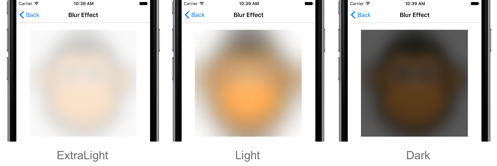
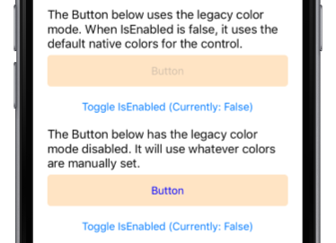
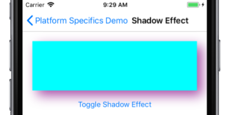
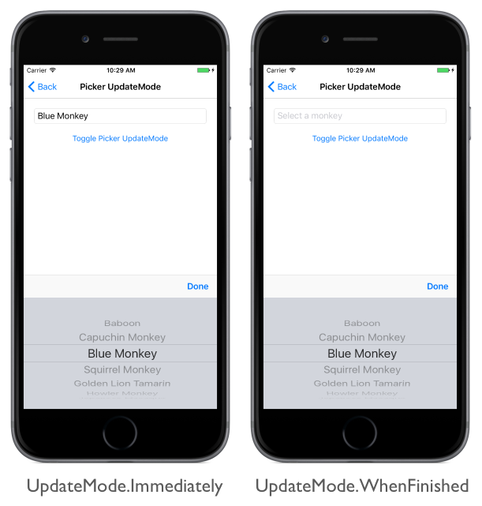
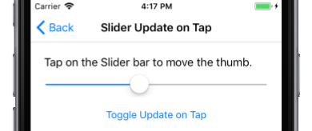
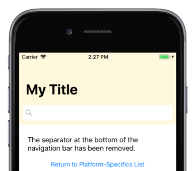
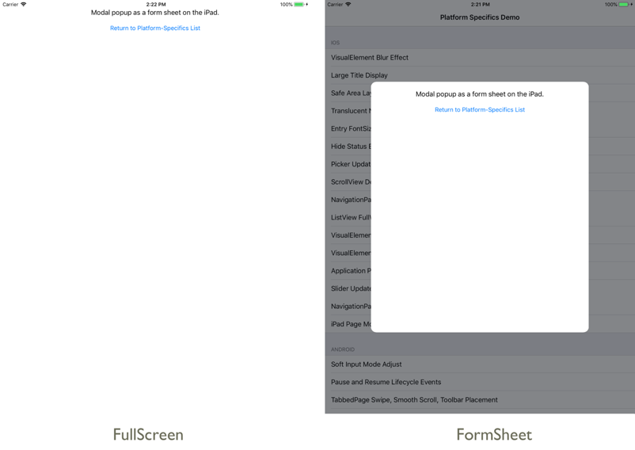

# iOS Platform-Specifics

[ Download the sample](https://developer.xamarin.com/samples/xamarin-forms/userinterface/platformspecifics/)

_Platform-specifics allow you to consume functionality that's only available on a specific platform, without implementing custom renderers or effects. This article demonstrates how to consume the iOS platform-specifics that are built into Xamarin.Forms._

## VisualElements

On iOS, the following platform-specific functionality is provided for Xamarin.Forms views, pages, and layouts:

- Blur support for any [`VisualElement`](xref:Xamarin.Forms.VisualElement). For more information, see [Applying Blur](#blur).
- Disabling legacy color mode on a supported [`VisualElement`](xref:Xamarin.Forms.VisualElement). For more information, see [Disabling Legacy Color Mode](#legacy-color-mode).
- Enabling a drop shadow on a [`VisualElement`](xref:Xamarin.Forms.VisualElement). For more information, see [Enabling a Drop Shadow](#drop-shadow).

<a name="blur" />

### Applying Blur

This platform-specific is used to blur the content layered beneath it, and is consumed in XAML by setting the [`VisualElement.BlurEffect`](xref:Xamarin.Forms.PlatformConfiguration.iOSSpecific.VisualElement.BlurEffectProperty) attached property to a value of the [`BlurEffectStyle`](xref:Xamarin.Forms.PlatformConfiguration.iOSSpecific.BlurEffectStyle) enumeration:

```xaml
<ContentPage ...
             xmlns:ios="clr-namespace:Xamarin.Forms.PlatformConfiguration.iOSSpecific;assembly=Xamarin.Forms.Core">
  ...
  <AbsoluteLayout HorizontalOptions="Center">
      <Image Source="monkeyface.png" />
      <BoxView x:Name="boxView" ios:VisualElement.BlurEffect="ExtraLight" HeightRequest="300" WidthRequest="300" />
  </AbsoluteLayout>
  ...
</ContentPage>
```

Alternatively, it can be consumed from C# using the fluent API:

```csharp
using Xamarin.Forms.PlatformConfiguration;
using Xamarin.Forms.PlatformConfiguration.iOSSpecific;
...

boxView.On<iOS>().UseBlurEffect(BlurEffectStyle.ExtraLight);
```

The `BoxView.On<iOS>` method specifies that this platform-specific will only run on iOS. The [`VisualElement.UseBlurEffect`](xref:Xamarin.Forms.PlatformConfiguration.iOSSpecific.VisualElement.UseBlurEffect(Xamarin.Forms.IPlatformElementConfiguration{Xamarin.Forms.PlatformConfiguration.iOS,Xamarin.Forms.VisualElement},Xamarin.Forms.PlatformConfiguration.iOSSpecific.BlurEffectStyle)) method, in the [`Xamarin.Forms.PlatformConfiguration.iOSSpecific`](xref:Xamarin.Forms.PlatformConfiguration.iOSSpecific) namespace, is used to apply the blur effect, with the [`BlurEffectStyle`](xref:Xamarin.Forms.PlatformConfiguration.iOSSpecific.BlurEffectStyle) enumeration providing four values: [`None`](xref:Xamarin.Forms.PlatformConfiguration.iOSSpecific.BlurEffectStyle.None), [`ExtraLight`](xref:Xamarin.Forms.PlatformConfiguration.iOSSpecific.BlurEffectStyle.ExtraLight), [`Light`](xref:Xamarin.Forms.PlatformConfiguration.iOSSpecific.BlurEffectStyle.Light), and [`Dark`](xref:Xamarin.Forms.PlatformConfiguration.iOSSpecific.BlurEffectStyle.Dark).

The result is that a specified [`BlurEffectStyle`](xref:Xamarin.Forms.PlatformConfiguration.iOSSpecific.BlurEffectStyle) is applied to the [`BoxView`](xref:Xamarin.Forms.BoxView) instance, which blurs the [`Image`](xref:Xamarin.Forms.Image) layered beneath it:



> [!NOTE]
> When adding a blur effect to a [`VisualElement`](xref:Xamarin.Forms.VisualElement), touch events will still be received by the `VisualElement`.

<a name="legacy-color-mode" />

### Disabling Legacy Color Mode

Some of the Xamarin.Forms views feature a legacy color mode. In this mode, when the [`IsEnabled`](xref:Xamarin.Forms.VisualElement.IsEnabled) property of the view is set to `false`, the view will override the colors set by the user with the default native colors for the disabled state. For backwards compatibility, this legacy color mode remains the default behavior for supported views.

This platform-specific disables this legacy color mode, so that colors set on a view by the user remain even when the view is disabled. It's consumed in XAML by setting the [`VisualElement.IsLegacyColorModeEnabled`](xref:Xamarin.Forms.PlatformConfiguration.iOSSpecific.VisualElement.IsLegacyColorModeEnabledProperty) attached property to `false`:

```xaml
<ContentPage ...
             xmlns:ios="clr-namespace:Xamarin.Forms.PlatformConfiguration.iOSSpecific;assembly=Xamarin.Forms.Core">
    <StackLayout>
        ...
        <Button Text="Button"
                TextColor="Blue"
                BackgroundColor="Bisque"
                ios:VisualElement.IsLegacyColorModeEnabled="False" />
        ...
    </StackLayout>
</ContentPage>
```

Alternatively, it can be consumed from C# using the fluent API:

```csharp
using Xamarin.Forms.PlatformConfiguration;
using Xamarin.Forms.PlatformConfiguration.iOSSpecific;
...

_legacyColorModeDisabledButton.On<iOS>().SetIsLegacyColorModeEnabled(false);
```

The `VisualElement.On<iOS>` method specifies that this platform-specific will only run on iOS. The [`VisualElement.SetIsLegacyColorModeEnabled`](xref:Xamarin.Forms.PlatformConfiguration.iOSSpecific.VisualElement.SetIsLegacyColorModeEnabled(Xamarin.Forms.IPlatformElementConfiguration{Xamarin.Forms.PlatformConfiguration.iOS,Xamarin.Forms.VisualElement},System.Boolean)) method, in the [`Xamarin.Forms.PlatformConfiguration.iOSSpecific`](xref:Xamarin.Forms.PlatformConfiguration.iOSSpecific) namespace, is used to control whether the legacy color mode is disabled. In addition, the [`VisualElement.GetIsLegacyColorModeEnabled`](xref:Xamarin.Forms.PlatformConfiguration.iOSSpecific.VisualElement.GetIsLegacyColorModeEnabled(Xamarin.Forms.IPlatformElementConfiguration{Xamarin.Forms.PlatformConfiguration.iOS,Xamarin.Forms.VisualElement})) method can be used to return whether the legacy color mode is disabled.

The result is that the legacy color mode can be disabled, so that colors set on a view by the user remain even when the view is disabled:



> [!NOTE]
> When setting a [`VisualStateGroup`](xref:Xamarin.Forms.VisualStateGroup) on a view, the legacy color mode is completely ignored. For more information about visual states, see [The Xamarin.Forms Visual State Manager](~/xamarin-forms/user-interface/visual-state-manager.md).

<a name="drop-shadow" />

### Enabling a Drop Shadow

This platform-specific is used to enable a drop shadow on a [`VisualElement`](xref:Xamarin.Forms.VisualElement). It's consumed in XAML by setting the [`VisualElement.IsShadowEnabled`](xref:Xamarin.Forms.PlatformConfiguration.iOSSpecific.VisualElement.IsShadowEnabledProperty) attached property to `true`, along with a number of additional optional attached properties that control the drop shadow:

```xaml
<ContentPage ...
             xmlns:ios="clr-namespace:Xamarin.Forms.PlatformConfiguration.iOSSpecific;assembly=Xamarin.Forms.Core">
    <StackLayout Margin="20">
        <BoxView ...
                 ios:VisualElement.IsShadowEnabled="true"
                 ios:VisualElement.ShadowColor="Purple"
                 ios:VisualElement.ShadowOpacity="0.7"
                 ios:VisualElement.ShadowRadius="12">
            <ios:VisualElement.ShadowOffset>
                <Size>
                    <x:Arguments>
                        <x:Double>10</x:Double>
                        <x:Double>10</x:Double>
                    </x:Arguments>
                </Size>
            </ios:VisualElement.ShadowOffset>
         </BoxView>
        ...
    </StackLayout>
</ContentPage>
```

Alternatively, it can be consumed from C# using the fluent API:

```csharp
using Xamarin.Forms.PlatformConfiguration;
using Xamarin.Forms.PlatformConfiguration.iOSSpecific;
...

var boxView = new BoxView { Color = Color.Aqua, WidthRequest = 100, HeightRequest = 100 };
boxView.On<iOS>()
       .SetIsShadowEnabled(true)
       .SetShadowColor(Color.Purple)
       .SetShadowOffset(new Size(10,10))
       .SetShadowOpacity(0.7)
       .SetShadowRadius(12);
```

The `VisualElement.On<iOS>` method specifies that this platform-specific will only run on iOS. The [`VisualElement.SetIsShadowEnabled`](xref:Xamarin.Forms.PlatformConfiguration.iOSSpecific.VisualElement.SetIsShadowEnabled(Xamarin.Forms.IPlatformElementConfiguration{Xamarin.Forms.PlatformConfiguration.iOS,Xamarin.Forms.VisualElement},System.Boolean)) method, in the [`Xamarin.Forms.PlatformConfiguration.iOSSpecific`](xref:Xamarin.Forms.PlatformConfiguration.iOSSpecific) namespace, is used to control whether a drop shadow is enabled on the `VisualElement`. In addition, the following methods can be invoked to control the drop shadow:

- [`SetShadowColor`](xref:Xamarin.Forms.PlatformConfiguration.iOSSpecific.VisualElement.SetShadowColor(Xamarin.Forms.IPlatformElementConfiguration{Xamarin.Forms.PlatformConfiguration.iOS,Xamarin.Forms.VisualElement},Xamarin.Forms.Color)) – sets the color of the drop shadow. The default color is [`Color.Default`](xref:Xamarin.Forms.Color.Default*).
- [`SetShadowOffset`](xref:Xamarin.Forms.PlatformConfiguration.iOSSpecific.VisualElement.SetShadowOffset(Xamarin.Forms.IPlatformElementConfiguration{Xamarin.Forms.PlatformConfiguration.iOS,Xamarin.Forms.VisualElement},Xamarin.Forms.Size)) – sets the offset of the drop shadow. The offset changes the direction the shadow is cast, and is specified as a [`Size`](xref:Xamarin.Forms.Size) value. The `Size` structure values are expressed in device-independent units, with the first value being the distance to the left (negative value) or right (positive value), and the second value being the distance above (negative value) or below (positive value). The default value of this property is (0.0, 0.0), which results in the shadow being cast around every side of the `VisualElement`.
- [`SetShadowOpacity`](xref:Xamarin.Forms.PlatformConfiguration.iOSSpecific.VisualElement.SetShadowOpacity(Xamarin.Forms.IPlatformElementConfiguration{Xamarin.Forms.PlatformConfiguration.iOS,Xamarin.Forms.VisualElement},System.Double)) – sets the opacity of the drop shadow, with the value being in the range 0.0 (transparent) to 1.0 (opaque). The default opacity value is 0.5.
- [`SetShadowRadius`](xref:Xamarin.Forms.PlatformConfiguration.iOSSpecific.VisualElement.SetShadowRadius(Xamarin.Forms.IPlatformElementConfiguration{Xamarin.Forms.PlatformConfiguration.iOS,Xamarin.Forms.VisualElement},System.Double)) – sets the blur radius used to render the drop shadow. The default radius value is 10.0.

> [!NOTE]
> The state of a drop shadow can be queried by calling the [`GetIsShadowEnabled`](xref:Xamarin.Forms.PlatformConfiguration.iOSSpecific.VisualElement.GetIsShadowEnabled(Xamarin.Forms.IPlatformElementConfiguration{Xamarin.Forms.PlatformConfiguration.iOS,Xamarin.Forms.VisualElement})), [`GetShadowColor`](xref:Xamarin.Forms.PlatformConfiguration.iOSSpecific.VisualElement.GetShadowColor(Xamarin.Forms.IPlatformElementConfiguration{Xamarin.Forms.PlatformConfiguration.iOS,Xamarin.Forms.VisualElement})), [`GetShadowOffset`](xref:Xamarin.Forms.PlatformConfiguration.iOSSpecific.VisualElement.GetShadowOffset(Xamarin.Forms.IPlatformElementConfiguration{Xamarin.Forms.PlatformConfiguration.iOS,Xamarin.Forms.VisualElement})), [`GetShadowOpacity`](xref:Xamarin.Forms.PlatformConfiguration.iOSSpecific.VisualElement.GetShadowOpacity(Xamarin.Forms.IPlatformElementConfiguration{Xamarin.Forms.PlatformConfiguration.iOS,Xamarin.Forms.VisualElement})), and [`GetShadowRadius`](xref:Xamarin.Forms.PlatformConfiguration.iOSSpecific.VisualElement.GetShadowRadius(Xamarin.Forms.IPlatformElementConfiguration{Xamarin.Forms.PlatformConfiguration.iOS,Xamarin.Forms.VisualElement})) methods.

The result is that a drop shadow can be enabled on a [`VisualElement`](xref:Xamarin.Forms.VisualElement):



## Views

On iOS, the following platform-specific functionality is provided for Xamarin.Forms views:

- Ensuring that inputted text fits into an [`Entry`](xref:Xamarin.Forms.Entry) by adjusting the font size. For more information, see [Adjusting the Font Size of an Entry](#adjust_font_size).
- Setting the cursor color in a [`Entry`](xref:Xamarin.Forms.Entry). For more information, see [Setting the Entry Cursor Color](#entry-cursorcolor).
- Setting the separator style on a [`ListView`](xref:Xamarin.Forms.ListView). For more information, see [Setting the Separator Style on a ListView](#listview-separatorstyle).
- Controlling when item selection occurs in a [`Picker`](xref:Xamarin.Forms.Picker). For more information, see [Controlling Picker Item Selection](#picker_update_mode).
- Enabling the [`Slider.Value`](xref:Xamarin.Forms.Slider.Value) property to be set by tapping on a position on the [`Slider`](xref:Xamarin.Forms.Slider) bar, rather than by having to drag the `Slider` thumb. For more information, see [Enabling a Slider Thumb to Move on Tap](#slider-updateontap).

<a name="adjust_font_size" />

### Adjusting the Font Size of an Entry

This platform-specific is used to scale the font size of an [`Entry`](xref:Xamarin.Forms.Entry) to ensure that the inputted text fits in the control. It's consumed in XAML by setting the [`Entry.AdjustsFontSizeToFitWidth`](xref:Xamarin.Forms.PlatformConfiguration.iOSSpecific.Entry.AdjustsFontSizeToFitWidthProperty) attached property to a `boolean` value:

```xaml
<ContentPage ...
             xmlns:ios="clr-namespace:Xamarin.Forms.PlatformConfiguration.iOSSpecific;assembly=Xamarin.Forms.Core"
    <StackLayout Margin="20">
        <Entry x:Name="entry"
               Placeholder="Enter text here to see the font size change"
               FontSize="22"
               ios:Entry.AdjustsFontSizeToFitWidth="true" />
        ...
    </StackLayout>
</ContentPage>
```

Alternatively, it can be consumed from C# using the fluent API:

```csharp
using Xamarin.Forms.PlatformConfiguration;
using Xamarin.Forms.PlatformConfiguration.iOSSpecific;
...

entry.On<iOS>().EnableAdjustsFontSizeToFitWidth();
```

The `Entry.On<iOS>` method specifies that this platform-specific will only run on iOS. The [`Entry.EnableAdjustsFontSizeToFitWidth`](xref:Xamarin.Forms.PlatformConfiguration.iOSSpecific.Entry.EnableAdjustsFontSizeToFitWidth(Xamarin.Forms.IPlatformElementConfiguration{Xamarin.Forms.PlatformConfiguration.iOS,Xamarin.Forms.Entry})) method, in the [`Xamarin.Forms.PlatformConfiguration.iOSSpecific`](xref:Xamarin.Forms.PlatformConfiguration.iOSSpecific) namespace, is used to scale the font size of the inputted text to ensure that it fits in the [`Entry`](xref:Xamarin.Forms.Entry). In addition, the [`Entry`](xref:Xamarin.Forms.PlatformConfiguration.iOSSpecific.Entry) class in the `Xamarin.Forms.PlatformConfiguration.iOSSpecific` namespace also has a [`DisableAdjustsFontSizeToFitWidth`](xref:Xamarin.Forms.PlatformConfiguration.iOSSpecific.Entry.DisableAdjustsFontSizeToFitWidth(Xamarin.Forms.IPlatformElementConfiguration{Xamarin.Forms.PlatformConfiguration.iOS,Xamarin.Forms.Entry})) method that disables this platform-specific, and a [`SetAdjustsFontSizeToFitWidth`](xref:Xamarin.Forms.PlatformConfiguration.iOSSpecific.Entry.SetAdjustsFontSizeToFitWidth(Xamarin.Forms.IPlatformElementConfiguration{Xamarin.Forms.PlatformConfiguration.iOS,Xamarin.Forms.Entry},System.Boolean)) method which can be used to toggle font size scaling by calling the [`AdjustsFontSizeToFitWidth`](xref:Xamarin.Forms.PlatformConfiguration.iOSSpecific.Entry.AdjustsFontSizeToFitWidth(Xamarin.Forms.IPlatformElementConfiguration{Xamarin.Forms.PlatformConfiguration.iOS,Xamarin.Forms.Entry})) method:

```csharp
entry.On<iOS>().SetAdjustsFontSizeToFitWidth(!entry.On<iOS>().AdjustsFontSizeToFitWidth());
```

The result is that the font size of the [`Entry`](xref:Xamarin.Forms.Entry) is scaled to ensure that the inputted text fits in the control:


<a name="entry-cursorcolor" />

### Setting the Entry Cursor Color

This platform-specific sets the cursor color in an [`Entry`](xref:Xamarin.Forms.Entry) to a specified color. It's consumed in XAML by setting the [`Entry.CursorColor`](xref:Xamarin.Forms.PlatformConfiguration.iOSSpecific.Entry.CursorColorProperty) bindable property to a [`Color`](xref:Xamarin.Forms.Color):

```xaml
<ContentPage ...
             xmlns:ios="clr-namespace:Xamarin.Forms.PlatformConfiguration.iOSSpecific;assembly=Xamarin.Forms.Core">
	<StackLayout>
		<Entry ... ios:Entry.CursorColor="LimeGreen" />
	</StackLayout>
</ContentPage>
```

Alternatively, it can be consumed from C# using the fluent API:

```csharp
using Xamarin.Forms.PlatformConfiguration;
using Xamarin.Forms.PlatformConfiguration.iOSSpecific;
...

var entry = new Xamarin.Forms.Entry();
entry.On<iOS>().SetCursorColor(Color.LimeGreen);
```

The `Entry.On<iOS>` method specifies that this platform-specific will only run on iOS. The [`Entry.SetCursorColor`](xref:Xamarin.Forms.PlatformConfiguration.iOSSpecific.Entry.SetCursorColor(Xamarin.Forms.IPlatformElementConfiguration{Xamarin.Forms.PlatformConfiguration.iOS,Xamarin.Forms.Entry},Xamarin.Forms.Color)) method, in the [`Xamarin.Forms.PlatformConfiguration.iOSSpecific`](xref:Xamarin.Forms.PlatformConfiguration.iOSSpecific) namespace, sets the cursor color to a specified [`Color`](xref:Xamarin.Forms.Color). In addition, the [`Entry.GetCursorColor`](xref:Xamarin.Forms.PlatformConfiguration.iOSSpecific.Entry.GetCursorColor(Xamarin.Forms.IPlatformElementConfiguration{Xamarin.Forms.PlatformConfiguration.iOS,Xamarin.Forms.Entry})) method can be used to retrieve the current cursor color.

The result is that the cursor color in a [`Entry`](xref:Xamarin.Forms.Entry) can be set to a specific [`Color`](xref:Xamarin.Forms.Color):


<a name="listview-separatorstyle" />

### Setting the Separator Style on a ListView

This platform-specific controls whether the separator between cells in a [`ListView`](xref:Xamarin.Forms.ListView) uses the full width of the `ListView`. It's consumed in XAML by setting the [`ListView.SeparatorStyle`](xref:Xamarin.Forms.PlatformConfiguration.iOSSpecific.ListView.SeparatorStyleProperty) attached property to a value of the [`SeparatorStyle`](xref:Xamarin.Forms.PlatformConfiguration.iOSSpecific.SeparatorStyle) enumeration:

```xaml
<ContentPage ...
             xmlns:ios="clr-namespace:Xamarin.Forms.PlatformConfiguration.iOSSpecific;assembly=Xamarin.Forms.Core">
    <StackLayout Margin="20">
        <ListView ... ios:ListView.SeparatorStyle="FullWidth">
            ...
        </ListView>
    </StackLayout>
</ContentPage>
```

Alternatively, it can be consumed from C# using the fluent API:

```csharp
using Xamarin.Forms.PlatformConfiguration;
using Xamarin.Forms.PlatformConfiguration.iOSSpecific;
...

listView.On<iOS>().SetSeparatorStyle(SeparatorStyle.FullWidth);
```

The `ListView.On<iOS>` method specifies that this platform-specific will only run on iOS. The [`ListView.SetSeparatorStyle`](xref:Xamarin.Forms.PlatformConfiguration.iOSSpecific.ListView.SetSeparatorStyle(Xamarin.Forms.IPlatformElementConfiguration{Xamarin.Forms.PlatformConfiguration.iOS,Xamarin.Forms.ListView},Xamarin.Forms.PlatformConfiguration.iOSSpecific.SeparatorStyle)) method, in the [`Xamarin.Forms.PlatformConfiguration.iOSSpecific`](xref:Xamarin.Forms.PlatformConfiguration.iOSSpecific) namespace, is used to control whether the separator between cells in the [`ListView`](xref:Xamarin.Forms.ListView) uses the full width of the `ListView`, with the [`SeparatorStyle`](xref:Xamarin.Forms.PlatformConfiguration.iOSSpecific.SeparatorStyle) enumeration providing two possible values:

- [`Default`](xref:Xamarin.Forms.PlatformConfiguration.iOSSpecific.SeparatorStyle.Default) – indicates the default iOS separator behavior. This is the default behavior in Xamarin.Forms.
- [`FullWidth`](xref:Xamarin.Forms.PlatformConfiguration.iOSSpecific.SeparatorStyle.FullWidth) – indicates that separators will be drawn from one edge of the `ListView` to the other.

The result is that a specified [`SeparatorStyle`](xref:Xamarin.Forms.PlatformConfiguration.iOSSpecific.SeparatorStyle) value is applied to the [`ListView`](xref:Xamarin.Forms.ListView), which controls the width of the separator between cells:


> [!NOTE]
> Once the separator style has been set to `FullWidth`, it cannot be changed back to `Default` at runtime.

<a name="picker_update_mode" />

### Controlling Picker Item Selection

This platform-specific controls when item selection occurs in a [`Picker`](xref:Xamarin.Forms.Picker), allowing the user to specify that item selection occurs when browsing items in the control, or only once the **Done** button is pressed. It's consumed in XAML by setting the `Picker.UpdateMode` attached property to a value of the `UpdateMode` enumeration:

```xaml
<ContentPage ...
             xmlns:ios="clr-namespace:Xamarin.Forms.PlatformConfiguration.iOSSpecific;assembly=Xamarin.Forms.Core">
    <StackLayout Margin="20">
        <Picker ... Title="Select a monkey" ios:Picker.UpdateMode="WhenFinished">
          ...
        </Picker>
        ...
    </StackLayout>
</ContentPage>
```

Alternatively, it can be consumed from C# using the fluent API:

```csharp
using Xamarin.Forms.PlatformConfiguration;
using Xamarin.Forms.PlatformConfiguration.iOSSpecific;
...

picker.On<iOS>().SetUpdateMode(UpdateMode.WhenFinished);
```

The `Picker.On<iOS>` method specifies that this platform-specific will only run on iOS. The `Picker.SetUpdateMode` method, in the [`Xamarin.Forms.PlatformConfiguration.iOSSpecific`](xref:Xamarin.Forms.PlatformConfiguration.iOSSpecific) namespace, is used to control when item selection occurs, with the `UpdateMode` enumeration providing two possible values:

- `Immediately` – item selection occurs as the user browses items in the [`Picker`](xref:Xamarin.Forms.Picker). This is the default behavior in Xamarin.Forms.
- `WhenFinished` – item selection only occurs once the user has pressed the **Done** button in the [`Picker`](xref:Xamarin.Forms.Picker).

In addition, the `SetUpdateMode` method can be used to toggle the enumeration values by calling the `UpdateMode` method, which returns the current `UpdateMode`:

```csharp
switch (picker.On<iOS>().UpdateMode())
{
    case UpdateMode.Immediately:
        picker.On<iOS>().SetUpdateMode(UpdateMode.WhenFinished);
        break;
    case UpdateMode.WhenFinished:
        picker.On<iOS>().SetUpdateMode(UpdateMode.Immediately);
        break;
}
```

The result is that a specified `UpdateMode` is applied to the [`Picker`](xref:Xamarin.Forms.Picker), which controls when item selection occurs:

[](ios-images/picker-updatemode-large.png#lightbox "Picker UpdateMode Platform-Specific")

<a name="slider-updateontap" />

### Enabling a Slider Thumb to Move on Tap

This platform-specific enables the [`Slider.Value`](xref:Xamarin.Forms.Slider.Value) property to be set by tapping on a position on the [`Slider`](xref:Xamarin.Forms.Slider) bar, rather than by having to drag the `Slider` thumb. It's consumed in XAML by setting the [`Slider.UpdateOnTap`](xref:Xamarin.Forms.PlatformConfiguration.iOSSpecific.Slider.UpdateOnTapProperty) bindable property to `true`:

```xaml
<ContentPage ...
             xmlns:ios="clr-namespace:Xamarin.Forms.PlatformConfiguration.iOSSpecific;assembly=Xamarin.Forms.Core">
    <StackLayout ...>
        <Slider ... ios:Slider.UpdateOnTap="true" />
        ...
    </StackLayout>
</ContentPage>
```

Alternatively, it can be consumed from C# using the fluent API:

```csharp
using Xamarin.Forms.PlatformConfiguration;
using Xamarin.Forms.PlatformConfiguration.iOSSpecific;
...

var slider = new Xamarin.Forms.Slider();
slider.On<iOS>().SetUpdateOnTap(true);
```

The `Slider.On<iOS>` method specifies that this platform-specific will only run on iOS. The [`Slider.SetUpdateOnTap`](xref:Xamarin.Forms.PlatformConfiguration.iOSSpecific.Slider.SetUpdateOnTap(Xamarin.Forms.IPlatformElementConfiguration{Xamarin.Forms.PlatformConfiguration.iOS,Xamarin.Forms.Slider},System.Boolean)) method, in the [`Xamarin.Forms.PlatformConfiguration.iOSSpecific`](xref:Xamarin.Forms.PlatformConfiguration.iOSSpecific) namespace, is used to control whether a tap on the `Slider` bar will set the [`Slider.Value`](xref:Xamarin.Forms.Slider.Value) property. In addition, the [`Slider.GetUpdateOnTap`](xref:Xamarin.Forms.PlatformConfiguration.iOSSpecific.Slider.GetUpdateOnTap(Xamarin.Forms.IPlatformElementConfiguration{Xamarin.Forms.PlatformConfiguration.iOS,Xamarin.Forms.Slider})) method can be used to return whether a tap on the `Slider` bar will set the `Slider.Value` property.

The result is that a tap on the [`Slider`](xref:Xamarin.Forms.Slider) bar can move the `Slider` thumb and set the [`Slider.Value`](xref:Xamarin.Forms.Slider.Value) property:



## Pages

On iOS, the following platform-specific functionality is provided for Xamarin.Forms pages:

- Hiding the navigation bar separator on a [`NavigationPage`](xref:Xamarin.Forms.NavigationPage). For more information, see [Hiding the Navigation Bar Separator on a NavigationPage](#navigationpage-hideseparatorbar).
- Controlling whether the navigation bar is translucent. For more information, see [Making the Navigation Bar Translucent](#translucent_navigation_bar).
- Controlling whether the status bar text color on a [`NavigationPage`](xref:Xamarin.Forms.NavigationPage) is adjusted to match the luminosity of the navigation bar. For more information, see [Adjusting the Status Bar Text Color Mode](#status_bar_color_mode).
- Controlling whether the page title is displayed as a large title in the page navigation bar. For more information, see [Displaying Large Titles](#large_title).
- Setting the status bar visibility on a [`Page`](xref:Xamarin.Forms.Page). For more information, see [Setting the Status Bar Visibility on a Page](#set_status_bar_visibility).
- Ensuring that page content is positioned on an area of the screen that is safe for all iOS devices. For more information, see [Enabling the Safe Area Layout Guide](#safe_area_layout).
- Setting the presentation style of modal pages on an iPad. For more information, see [Setting the Modal Page Presentation Style on an iPad](#modal-page-presentation-style).

<a name="navigationpage-hideseparatorbar" />

### Hiding the Navigation Bar Separator on a NavigationPage

This platform-specific hides the separator line and shadow that is at the bottom of the navigation bar on a [`NavigationPage`](xref:Xamarin.Forms.NavigationPage). It's consumed in XAML by setting the [`NavigationPage.HideNavigationBarSeparator`](xref:Xamarin.Forms.PlatformConfiguration.iOSSpecific.NavigationPage.HideNavigationBarSeparatorProperty) bindable property to `false`:

```xaml
<NavigationPage ...
                xmlns:ios="clr-namespace:Xamarin.Forms.PlatformConfiguration.iOSSpecific;assembly=Xamarin.Forms.Core"
                ios:NavigationPage.HideNavigationBarSeparator="true">

</NavigationPage>
```

Alternatively, it can be consumed from C# using the fluent API:

```csharp
using Xamarin.Forms.PlatformConfiguration;
using Xamarin.Forms.PlatformConfiguration.iOSSpecific;

public class iOSTitleViewNavigationPageCS : Xamarin.Forms.NavigationPage
{
    public iOSTitleViewNavigationPageCS()
    {
        On<iOS>().SetHideNavigationBarSeparator(true);
    }
}
```

The `NavigationPage.On<iOS>` method specifies that this platform-specific will only run on iOS. The [`NavigationPage.SetHideNavigationBarSeparator`](xref:Xamarin.Forms.PlatformConfiguration.iOSSpecific.NavigationPage.SetHideNavigationBarSeparator(Xamarin.Forms.IPlatformElementConfiguration{Xamarin.Forms.PlatformConfiguration.iOS,Xamarin.Forms.NavigationPage},System.Boolean)) method, in the [`Xamarin.Forms.PlatformConfiguration.iOSSpecific`](xref:Xamarin.Forms.PlatformConfiguration.iOSSpecific) namespace, is used to control whether the navigation bar separator is hidden. In addition, the [`NavigationPage.HideNavigationBarSeparator`](xref:Xamarin.Forms.PlatformConfiguration.iOSSpecific.NavigationPage.HideNavigationBarSeparator(Xamarin.Forms.IPlatformElementConfiguration{Xamarin.Forms.PlatformConfiguration.iOS,Xamarin.Forms.NavigationPage})) method can be used to return whether the navigation bar separator is hidden.

The result is that the navigation bar separator on a [`NavigationPage`](xref:Xamarin.Forms.NavigationPage) can be hidden:



<a name="translucent_navigation_bar" />

### Making the Navigation Bar Translucent

This platform-specific is used to change the transparency of the navigation bar, and is consumed in XAML by setting the [`NavigationPage.IsNavigationBarTranslucent`](xref:Xamarin.Forms.PlatformConfiguration.iOSSpecific.NavigationPage.IsNavigationBarTranslucentProperty) attached property to a `boolean` value:

```xaml
<NavigationPage ...
                xmlns:ios="clr-namespace:Xamarin.Forms.PlatformConfiguration.iOSSpecific;assembly=Xamarin.Forms.Core"
                BackgroundColor="Blue"
                ios:NavigationPage.IsNavigationBarTranslucent="true">
  ...
</NavigationPage>
```

Alternatively, it can be consumed from C# using the fluent API:

```csharp
using Xamarin.Forms.PlatformConfiguration;
using Xamarin.Forms.PlatformConfiguration.iOSSpecific;
...

(App.Current.MainPage as Xamarin.Forms.NavigationPage).BackgroundColor = Color.Blue;
(App.Current.MainPage as Xamarin.Forms.NavigationPage).On<iOS>().EnableTranslucentNavigationBar();
```

The `NavigationPage.On<iOS>` method specifies that this platform-specific will only run on iOS. The [`NavigationPage.EnableTranslucentNavigationBar`](xref:Xamarin.Forms.PlatformConfiguration.iOSSpecific.NavigationPage.EnableTranslucentNavigationBar(Xamarin.Forms.IPlatformElementConfiguration{Xamarin.Forms.PlatformConfiguration.iOS,Xamarin.Forms.NavigationPage})) method, in the [`Xamarin.Forms.PlatformConfiguration.iOSSpecific`](xref:Xamarin.Forms.PlatformConfiguration.iOSSpecific) namespace, is used to make the navigation bar translucent. In addition, the [`NavigationPage`](xref:Xamarin.Forms.PlatformConfiguration.iOSSpecific.NavigationPage) class in the `Xamarin.Forms.PlatformConfiguration.iOSSpecific` namespace also has a [`DisableTranslucentNavigationBar`](xref:Xamarin.Forms.PlatformConfiguration.iOSSpecific.NavigationPage.DisableTranslucentNavigationBar(Xamarin.Forms.IPlatformElementConfiguration{Xamarin.Forms.PlatformConfiguration.iOS,Xamarin.Forms.NavigationPage})) method that restores the navigation bar to its default state, and a [`SetIsNavigationBarTranslucent`](xref:Xamarin.Forms.PlatformConfiguration.iOSSpecific.NavigationPage.SetIsNavigationBarTranslucent(Xamarin.Forms.IPlatformElementConfiguration{Xamarin.Forms.PlatformConfiguration.iOS,Xamarin.Forms.NavigationPage},System.Boolean)) method which can be used to toggle the navigation bar transparency by calling the [`IsNavigationBarTranslucent`](xref:Xamarin.Forms.PlatformConfiguration.iOSSpecific.NavigationPage.IsNavigationBarTranslucent(Xamarin.Forms.IPlatformElementConfiguration{Xamarin.Forms.PlatformConfiguration.iOS,Xamarin.Forms.NavigationPage})) method:

```csharp
(App.Current.MainPage as Xamarin.Forms.NavigationPage)
  .On<iOS>()
  .SetIsNavigationBarTranslucent(!(App.Current.MainPage as Xamarin.Forms.NavigationPage).On<iOS>().IsNavigationBarTranslucent());
```

The result is that the transparency of the navigation bar can be changed:


<a name="status_bar_color_mode" />

### Adjusting the Status Bar Text Color Mode

This platform-specific controls whether the status bar text color on a [`NavigationPage`](xref:Xamarin.Forms.NavigationPage) is adjusted to match the luminosity of the navigation bar. It's consumed in XAML by setting the [`NavigationPage.StatusBarTextColorMode`](xref:Xamarin.Forms.PlatformConfiguration.iOSSpecific.NavigationPage.StatusBarTextColorModeProperty) attached property to a value of the [`StatusBarTextColorMode`](xref:Xamarin.Forms.PlatformConfiguration.iOSSpecific.StatusBarTextColorMode) enumeration:

```xaml
<MasterDetailPage xmlns="http://xamarin.com/schemas/2014/forms"
    xmlns:x="http://schemas.microsoft.com/winfx/2009/xaml"
    xmlns:ios="clr-namespace:Xamarin.Forms.PlatformConfiguration.iOSSpecific;assembly=Xamarin.Forms.Core"
    x:Class="PlatformSpecifics.iOSStatusBarTextColorModePage">
    <MasterDetailPage.Master>
        <ContentPage Title="Master Page Title" />
    </MasterDetailPage.Master>
    <MasterDetailPage.Detail>
        <NavigationPage BarBackgroundColor="Blue" BarTextColor="White"
                        ios:NavigationPage.StatusBarTextColorMode="MatchNavigationBarTextLuminosity">
            <x:Arguments>
                <ContentPage>
                    <Label Text="Slide the master page to see the status bar text color mode change." />
                </ContentPage>
            </x:Arguments>
        </NavigationPage>
    </MasterDetailPage.Detail>
</MasterDetailPage>

```

Alternatively, it can be consumed from C# using the fluent API:

```csharp
using Xamarin.Forms.PlatformConfiguration;
using Xamarin.Forms.PlatformConfiguration.iOSSpecific;
...

IsPresentedChanged += (sender, e) =>
{
    var mdp = sender as MasterDetailPage;
    if (mdp.IsPresented)
        ((Xamarin.Forms.NavigationPage)mdp.Detail)
          .On<iOS>()
          .SetStatusBarTextColorMode(StatusBarTextColorMode.DoNotAdjust);
    else
        ((Xamarin.Forms.NavigationPage)mdp.Detail)
          .On<iOS>()
          .SetStatusBarTextColorMode(StatusBarTextColorMode.MatchNavigationBarTextLuminosity);
};
```

The `NavigationPage.On<iOS>` method specifies that this platform-specific will only run on iOS. The [`NavigationPage.SetStatusBarTextColorMode`](xref:Xamarin.Forms.PlatformConfiguration.iOSSpecific.NavigationPage.SetStatusBarTextColorMode(Xamarin.Forms.IPlatformElementConfiguration{Xamarin.Forms.PlatformConfiguration.iOS,Xamarin.Forms.NavigationPage},Xamarin.Forms.PlatformConfiguration.iOSSpecific.StatusBarTextColorMode)) method, in the [`Xamarin.Forms.PlatformConfiguration.iOSSpecific`](xref:Xamarin.Forms.PlatformConfiguration.iOSSpecific) namespace, controls whether the status bar text color on the [`NavigationPage`](xref:Xamarin.Forms.NavigationPage) is adjusted to match the luminosity of the navigation bar, with the [`StatusBarTextColorMode`](xref:Xamarin.Forms.PlatformConfiguration.iOSSpecific.StatusBarTextColorMode) enumeration providing two possible values:

- [`DoNotAdjust`](xref:Xamarin.Forms.PlatformConfiguration.iOSSpecific.StatusBarTextColorMode.DoNotAdjust) – indicates that the status bar text color should not be adjusted.
- [`MatchNavigationBarTextLuminosity`](xref:Xamarin.Forms.PlatformConfiguration.iOSSpecific.StatusBarTextColorMode.MatchNavigationBarTextLuminosity) – indicates that the status bar text color should match the luminosity of the navigation bar.

In addition, the [`GetStatusBarTextColorMode`](xref:Xamarin.Forms.PlatformConfiguration.iOSSpecific.NavigationPage.GetStatusBarTextColorMode(Xamarin.Forms.IPlatformElementConfiguration{Xamarin.Forms.PlatformConfiguration.iOS,Xamarin.Forms.NavigationPage})) method can be used to retrieve the current value of the [`StatusBarTextColorMode`](xref:Xamarin.Forms.PlatformConfiguration.iOSSpecific.StatusBarTextColorMode) enumeration that's applied to the [`NavigationPage`](xref:Xamarin.Forms.NavigationPage).

The result is that the status bar text color on a [`NavigationPage`](xref:Xamarin.Forms.NavigationPage) can be adjusted to match the luminosity of the navigation bar. In this example, the status bar text color changes as the user switches between the [`Master`](xref:Xamarin.Forms.MasterDetailPage.Master) and [`Detail`](xref:Xamarin.Forms.MasterDetailPage.Detail) pages of a [`MasterDetailPage`](xref:Xamarin.Forms.MasterDetailPage):


<a name="large_title" />

### Displaying Large Titles

This platform-specific is used to display the page title as a large title on the navigation bar, for devices that use iOS 11 or greater. A large title is left aligned and uses a larger font, and transitions to a standard title as the user begins scrolling content, so that the screen real estate is used efficiently. However, in landscape orientation, the title will return to the center of the navigation bar to optimize content layout. It's consumed in XAML by setting the `NavigationPage.PrefersLargeTitles` attached property to a `boolean` value:

```xaml
<NavigationPage xmlns="http://xamarin.com/schemas/2014/forms"
                xmlns:x="http://schemas.microsoft.com/winfx/2009/xaml"
                xmlns:ios="clr-namespace:Xamarin.Forms.PlatformConfiguration.iOSSpecific;assembly=Xamarin.Forms.Core"
                ...
                ios:NavigationPage.PrefersLargeTitles="true">
  ...
</NavigationPage>
```

Alternatively it can be consumed from C# using the fluent API:

```csharp
using Xamarin.Forms.PlatformConfiguration;
using Xamarin.Forms.PlatformConfiguration.iOSSpecific;
...

var navigationPage = new Xamarin.Forms.NavigationPage(new iOSLargeTitlePageCS());
navigationPage.On<iOS>().SetPrefersLargeTitles(true);
```

The `NavigationPage.On<iOS>` method specifies that this platform-specific will only run on iOS. The `NavigationPage.SetPrefersLargeTitle` method, in the [`Xamarin.Forms.PlatformConfiguration.iOSSpecific`](xref:Xamarin.Forms.PlatformConfiguration.iOSSpecific) namespace, controls whether large titles are enabled.

Provided that large titles are enabled on the [`NavigationPage`](xref:Xamarin.Forms.NavigationPage), all pages in the navigation stack will display large titles. This behavior can be overridden on pages by setting the `Page.LargeTitleDisplay` attached property to a value of the `LargeTitleDisplayMode` enumeration:

```xaml
<ContentPage ...
             xmlns:ios="clr-namespace:Xamarin.Forms.PlatformConfiguration.iOSSpecific;assembly=Xamarin.Forms.Core"
             Title="Large Title"
             ios:Page.LargeTitleDisplay="Never">
  ...
</ContentPage>
```

Alternatively, the page behavior can be overridden from C# using the fluent API:

```csharp
using Xamarin.Forms.PlatformConfiguration;
using Xamarin.Forms.PlatformConfiguration.iOSSpecific;
...

public class iOSLargeTitlePageCS : ContentPage
{
    public iOSLargeTitlePageCS(ICommand restore)
    {
        On<iOS>().SetLargeTitleDisplay(LargeTitleDisplayMode.Never);
        ...
    }
    ...
}
```

The `Page.On<iOS>` method specifies that this platform-specific will only run on iOS. The `Page.SetLargeTitleDisplay` method, in the [`Xamarin.Forms.PlatformConfiguration.iOSSpecific`](xref:Xamarin.Forms.PlatformConfiguration.iOSSpecific) namespace, controls the large title behavior on the [`Page`](xref:Xamarin.Forms.Page), with the `LargeTitleDisplayMode` enumeration providing three possible values:

- `Always` – force the navigation bar and font size to use the large format.
- `Automatic` – use the same style (large or small) as the previous item in the navigation stack.
- `Never` – force the use of the regular, small format navigation bar.

In addition, the `SetLargeTitleDisplay` method can be used to toggle the enumeration values by calling the `LargeTitleDisplay` method, which returns the current `LargeTitleDisplayMode`:

```csharp
switch (On<iOS>().LargeTitleDisplay())
{
    case LargeTitleDisplayMode.Always:
        On<iOS>().SetLargeTitleDisplay(LargeTitleDisplayMode.Automatic);
        break;
    case LargeTitleDisplayMode.Automatic:
        On<iOS>().SetLargeTitleDisplay(LargeTitleDisplayMode.Never);
        break;
    case LargeTitleDisplayMode.Never:
        On<iOS>().SetLargeTitleDisplay(LargeTitleDisplayMode.Always);
        break;
}
```

The result is that a specified `LargeTitleDisplayMode` is applied to the [`Page`](xref:Xamarin.Forms.Page), which controls the large title behavior:


<a name="set_status_bar_visibility" />

### Setting the Status Bar Visibility on a Page

This platform-specific is used to set the visibility of the status bar on a [`Page`](xref:Xamarin.Forms.Page), and it includes the ability to control how the status bar enters or leaves the `Page`. It's consumed in XAML by setting the `Page.PrefersStatusBarHidden` attached property to a value of the `StatusBarHiddenMode` enumeration, and optionally the `Page.PreferredStatusBarUpdateAnimation` attached property to a value of the `UIStatusBarAnimation` enumeration:

```xaml
<ContentPage ...
             xmlns:ios="clr-namespace:Xamarin.Forms.PlatformConfiguration.iOSSpecific;assembly=Xamarin.Forms.Core"
             ios:Page.PrefersStatusBarHidden="True"
             ios:Page.PreferredStatusBarUpdateAnimation="Fade">
  ...
</ContentPage>
```

Alternatively, it can be consumed from C# using the fluent API:

```csharp
using Xamarin.Forms.PlatformConfiguration;
using Xamarin.Forms.PlatformConfiguration.iOSSpecific;
...

On<iOS>().SetPrefersStatusBarHidden(StatusBarHiddenMode.True)
         .SetPreferredStatusBarUpdateAnimation(UIStatusBarAnimation.Fade);
```

The `Page.On<iOS>` method specifies that this platform-specific will only run on iOS. The `Page.SetPrefersStatusBarHidden` method, in the `Xamarin.Forms.PlatformConfiguration.iOSSpecific` namespace, is used to set the visibility of the status bar on a [`Page`](xref:Xamarin.Forms.Page) by specifying one of the `StatusBarHiddenMode` enumeration values: `Default`, `True`, or `False`. The `StatusBarHiddenMode.True` and `StatusBarHiddenMode.False` values set the status bar visibility regardless of device orientation, and the `StatusBarHiddenMode.Default` value hides the status bar in a vertically compact environment.

The result is that the visibility of the status bar on a [`Page`](xref:Xamarin.Forms.Page) can be set:


> [!NOTE]
> On a [`TabbedPage`](xref:Xamarin.Forms.TabbedPage), the specified `StatusBarHiddenMode` enumeration value will also update the status bar on all child pages. On all other [`Page`](xref:Xamarin.Forms.Page)-derived types, the specified `StatusBarHiddenMode` enumeration value will only update the status bar on the current page.

The `Page.SetPreferredStatusBarUpdateAnimation` method is used to set how the status bar enters or leaves the [`Page`](xref:Xamarin.Forms.Page) by specifying one of the `UIStatusBarAnimation` enumeration values: `None`, `Fade`, or `Slide`. If the `Fade` or `Slide` enumeration value is specified, a 0.25 second animation executes as the status bar enters or leaves the `Page`.

<a name="safe_area_layout" />

### Enabling the Safe Area Layout Guide

This platform-specific is used to ensure that page content is positioned on an area of the screen that is safe for all devices that use iOS 11 and greater. Specifically, it will help to make sure that content isn't clipped by rounded device corners, the home indicator, or the sensor housing on an iPhone X. It's consumed in XAML by setting the `Page.UseSafeArea` attached property to a `boolean` value:

```xaml
<ContentPage ...
             xmlns:ios="clr-namespace:Xamarin.Forms.PlatformConfiguration.iOSSpecific;assembly=Xamarin.Forms.Core"
             Title="Safe Area"
             ios:Page.UseSafeArea="true">
    <StackLayout>
        ...
    </StackLayout>
</ContentPage>
```

Alternatively, it can be consumed from C# using the fluent API:

```csharp
using Xamarin.Forms.PlatformConfiguration;
using Xamarin.Forms.PlatformConfiguration.iOSSpecific;
...

On<iOS>().SetUseSafeArea(true);
```

The `Page.On<iOS>` method specifies that this platform-specific will only run on iOS. The `Page.SetUseSafeArea` method, in the [`Xamarin.Forms.PlatformConfiguration.iOSSpecific`](xref:Xamarin.Forms.PlatformConfiguration.iOSSpecific) namespace, controls whether the safe area layout guide is enabled.

The result is that page content can be positioned on an area of the screen that is safe for all iPhones:

[](ios-images/safe-area-layout-large.png#lightbox "Safe Area Layout Guide")

> [!NOTE]
> The safe area defined by Apple is used in Xamarin.Forms to set the [`Page.Padding`](xref:Xamarin.Forms.Page.Padding) property, and will override any previous values of this property that have been set.

The safe area can be customized by retrieving its [`Thickness`](xref:Xamarin.Forms.Thickness) value with the `Page.SafeAreaInsets` method from the [`Xamarin.Forms.PlatformConfiguration.iOSSpecific`](xref:Xamarin.Forms.PlatformConfiguration.iOSSpecific) namespace. It can then be modified as required and re-assigned to the `Padding` property in the page constructor or [`OnAppearing`](xref:Xamarin.Forms.Page.OnAppearing) override:

```csharp
protected override void OnAppearing()
{
    base.OnAppearing();

    var safeInsets = On<iOS>().SafeAreaInsets();
    safeInsets.Left = 20;
    Padding = safeInsets;
}
```

<a name="modal-page-presentation-style" />

### Setting the Modal Page Presentation Style on an iPad

This platform-specific is used to set the presentation style of a modal page on an iPad. It's consumed in XAML by setting the `Page.ModalPresentationStyle` bindable property to a `UIModalPresentationStyle` enumeration value:

```xaml
<ContentPage ...
             xmlns:ios="clr-namespace:Xamarin.Forms.PlatformConfiguration.iOSSpecific;assembly=Xamarin.Forms.Core"
             ios:Page.ModalPresentationStyle="FormSheet">
    ...
</ContentPage>
```

Alternatively, it can be consumed from C# using the fluent API:

```csharp
using Xamarin.Forms.PlatformConfiguration;
using Xamarin.Forms.PlatformConfiguration.iOSSpecific;
...

public class iOSModalFormSheetPageCS : ContentPage
{
    public iOSModalFormSheetPageCS()
    {
        On<iOS>().SetModalPresentationStyle(UIModalPresentationStyle.FormSheet);
        ...
    }
}
```

The `Page.On<iOS>` method specifies that this platform-specific will only run on iOS. The `Page.SetModalPresentationStyle` method, in the [`Xamarin.Forms.PlatformConfiguration.iOSSpecific`](xref:Xamarin.Forms.PlatformConfiguration.iOSSpecific) namespace, is used to set the modal presentation style on a [`Page`](xref:Xamarin.Forms.Page) by specifying one of the following `UIModalPresentationStyle` enumeration values:

- `FullScreen`, which sets the modal presentation style to encompass the whole screen. By default, modal pages are displayed using this presentation style.
- `FormSheet`, which sets the modal presentation style to be centered on and smaller than the screen.

In addition, the `GetModalPresentationStyle` method can be used to retrieve the current value of the `UIModalPresentationStyle` enumeration that's applied to the [`Page`](xref:Xamarin.Forms.Page).

The result is that the modal presentation style on a [`Page`](xref:Xamarin.Forms.Page) can be set:

[](ios-images/modal-presentation-style-large.png#lightbox "Modal Presentation Styles on an iPad")

> [!NOTE]
> Pages that use this platform-specific to set the modal presentation style must use modal navigation. For more information, see [Xamarin.Forms Modal Pages](~/xamarin-forms/app-fundamentals/navigation/modal.md).

## Layouts

On iOS, the following platform-specific functionality is provided for Xamarin.Forms layouts:

- Controlling whether a [`ScrollView`](xref:Xamarin.Forms.ScrollView) handles a touch gesture or passes it to its content. For more information, see [Delaying Content Touches in a ScrollView](#delay_content_touches).

<a name="delay_content_touches" />

### Delaying Content Touches in a ScrollView

An implicit timer is triggered when a touch gesture begins in a [`ScrollView`](xref:Xamarin.Forms.ScrollView) on iOS and the `ScrollView` decides, based on the user action within the timer span, whether it should handle the gesture or pass it to its content. By default, the iOS `ScrollView` delays content touches, but this can cause problems in some circumstances with the `ScrollView` content not winning the gesture when it should. Therefore, this platform-specific controls whether a `ScrollView` handles a touch gesture or passes it to its content. It's consumed in XAML by setting the `ScrollView.ShouldDelayContentTouches` attached property to a `boolean` value:

```xaml
<MasterDetailPage ...
                  xmlns:ios="clr-namespace:Xamarin.Forms.PlatformConfiguration.iOSSpecific;assembly=Xamarin.Forms.Core">
    <MasterDetailPage.Master>
        <ContentPage Title="Menu" BackgroundColor="Blue" />
    </MasterDetailPage.Master>
    <MasterDetailPage.Detail>
        <ContentPage>
            <ScrollView x:Name="scrollView" ios:ScrollView.ShouldDelayContentTouches="false">
                <StackLayout Margin="0,20">
                    <Slider />
                    <Button Text="Toggle ScrollView DelayContentTouches" Clicked="OnButtonClicked" />
                </StackLayout>
            </ScrollView>
        </ContentPage>
    </MasterDetailPage.Detail>
</MasterDetailPage>
```

Alternatively, it can be consumed from C# using the fluent API:

```csharp
using Xamarin.Forms.PlatformConfiguration;
using Xamarin.Forms.PlatformConfiguration.iOSSpecific;
...

scrollView.On<iOS>().SetShouldDelayContentTouches(false);
```

The `ScrollView.On<iOS>` method specifies that this platform-specific will only run on iOS. The `ScrollView.SetShouldDelayContentTouches` method, in the [`Xamarin.Forms.PlatformConfiguration.iOSSpecific`](xref:Xamarin.Forms.PlatformConfiguration.iOSSpecific) namespace, is used to control whether a [`ScrollView`](xref:Xamarin.Forms.ScrollView) handles a touch gesture or passes it to its content. In addition, the `SetShouldDelayContentTouches` method can be used to toggle delaying content touches by calling the `ShouldDelayContentTouches` method to return whether content touches are delayed:

```csharp
scrollView.On<iOS>().SetShouldDelayContentTouches(!scrollView.On<iOS>().ShouldDelayContentTouches());
```

The result is that a [`ScrollView`](xref:Xamarin.Forms.ScrollView) can disable delaying receiving content touches, so that in this scenario the [`Slider`](xref:Xamarin.Forms.Slider) receives the gesture rather than the [`Detail`](xref:Xamarin.Forms.MasterDetailPage.Detail) page of the [`MasterDetailPage`](xref:Xamarin.Forms.MasterDetailPage):

[](ios-images/scrollview-delay-content-touches-large.png#lightbox "ScrollView Delay Content Touches Platform-Specific")

## Application

On iOS, the following platform-specific functionality is provided for the Xamarin.Forms [`Application`](xref:Xamarin.Forms.Application) class:

- Enabling control layout and rendering updates to be performed on the main thread. For more information, see [Handling Control Updates on the Main Thread](#update-on-main-thread).
- Enabling a [`PanGestureRecognizer`](xref:Xamarin.Forms.PanGestureRecognizer) in a scrolling view to capture and share the pan gesture with the scrolling view. For more information, see [Enabling Simultaneous Pan Gesture Recognition](#simultaneous-pan-gesture).

<a name="update-on-main-thread" />

### Handling Control Updates on the Main Thread

This platform-specific enables control layout and rendering updates to be performed on the main thread, instead of being performed on a background thread. It should be rarely needed, but in some cases may prevent crashes. Its consumed in XAML by setting the `Application.HandleControlUpdatesOnMainThread` bindable property to `true`:

```xaml
<Application ...
             xmlns:ios="clr-namespace:Xamarin.Forms.PlatformConfiguration.iOSSpecific;assembly=Xamarin.Forms.Core"
             ios:Application.HandleControlUpdatesOnMainThread="true">
	...
</Application>
```

Alternatively, it can be consumed from C# using the fluent API:

```csharp
using Xamarin.Forms.PlatformConfiguration;
using Xamarin.Forms.PlatformConfiguration.iOSSpecific;
...

Xamarin.Forms.Application.Current.On<iOS>().SetHandleControlUpdatesOnMainThread(true);
```

The `Application.On<iOS>` method specifies that this platform-specific will only run on iOS. The `Application.SetHandleControlUpdatesOnMainThread` method, in the [`Xamarin.Forms.PlatformConfiguration.iOSSpecific`](xref:Xamarin.Forms.PlatformConfiguration.iOSSpecific) namespace, is used to control whether control layout and rendering updates are performed on the main thread, instead of being performed on a background thread. In addition, the `Application.GetHandleControlUpdatesOnMainThread` method can be used to return whether control layout and rendering updates are being performed on the main thread.

<a name="simultaneous-pan-gesture" />

### Enabling Simultaneous Pan Gesture Recognition

When a [`PanGestureRecognizer`](xref:Xamarin.Forms.PanGestureRecognizer) is attached to a view inside a scrolling view, all of the pan gestures are captured by the `PanGestureRecognizer` and aren't passed to the scrolling view. Therefore, the scrolling view will no longer scroll.

This platform-specific enables a `PanGestureRecognizer` in a scrolling view to capture and share the pan gesture with the scrolling view. It's consumed in XAML by setting the [`Application.PanGestureRecognizerShouldRecognizeSimultaneously`](xref:Xamarin.Forms.PlatformConfiguration.iOSSpecific.Application.PanGestureRecognizerShouldRecognizeSimultaneouslyProperty) attached property to `true`:

```xaml
<Application ...
             xmlns:ios="clr-namespace:Xamarin.Forms.PlatformConfiguration.iOSSpecific;assembly=Xamarin.Forms.Core"
             ios:Application.PanGestureRecognizerShouldRecognizeSimultaneously="true">
	...
</Application>
```

Alternatively, it can be consumed from C# using the fluent API:

```csharp
using Xamarin.Forms.PlatformConfiguration;
using Xamarin.Forms.PlatformConfiguration.iOSSpecific;
...

Xamarin.Forms.Application.Current.On<iOS>().SetPanGestureRecognizerShouldRecognizeSimultaneously(true);
```

The `Application.On<iOS>` method specifies that this platform-specific will only run on iOS. The [`Application.SetPanGestureRecognizerShouldRecognizeSimultaneously`](xref:Xamarin.Forms.PlatformConfiguration.iOSSpecific.Application.SetPanGestureRecognizerShouldRecognizeSimultaneously(Xamarin.Forms.IPlatformElementConfiguration{Xamarin.Forms.PlatformConfiguration.iOS,Xamarin.Forms.Application},System.Boolean)) method, in the [`Xamarin.Forms.PlatformConfiguration.iOSSpecific`](xref:Xamarin.Forms.PlatformConfiguration.iOSSpecific) namespace, is used to control whether a pan gesture recognizer in a scrolling view will capture the pan gesture, or capture and share the pan gesture with the scrolling view. In addition, the [`Application.GetPanGestureRecognizerShouldRecognizeSimultaneously`](xref:Xamarin.Forms.PlatformConfiguration.iOSSpecific.Application.GetPanGestureRecognizerShouldRecognizeSimultaneously(Xamarin.Forms.IPlatformElementConfiguration{Xamarin.Forms.PlatformConfiguration.iOS,Xamarin.Forms.Application})) method can be used to return whether the pan gesture is shared with the scrolling view that contains the [`PanGestureRecognizer`](xref:Xamarin.Forms.PanGestureRecognizer).

Therefore, with this platform-specific enabled, when a [`ListView`](xref:Xamarin.Forms.ListView) contains a [`PanGestureRecognizer`](xref:Xamarin.Forms.PanGestureRecognizer), both the `ListView` and the `PanGestureRecognizer` will receive the pan gesture and process it. However, with this platform-specific disabled, when a `ListView` contains a `PanGestureRecognizer`, the `PanGestureRecognizer` will capture the pan gesture and process it, and the `ListView` won't receive the pan gesture.

## Summary

This article demonstrated how to consume the iOS platform-specifics that are built into Xamarin.Forms. Platform-specifics allow you to consume functionality that's only available on a specific platform, without implementing custom renderers or effects.

## Related Links

- [Creating Platform-Specifics](~/xamarin-forms/platform/platform-specifics/creating.md)
- [PlatformSpecifics (sample)](https://developer.xamarin.com/samples/xamarin-forms/userinterface/platformspecifics/)
- [iOSSpecific](xref:Xamarin.Forms.PlatformConfiguration.iOSSpecific)
