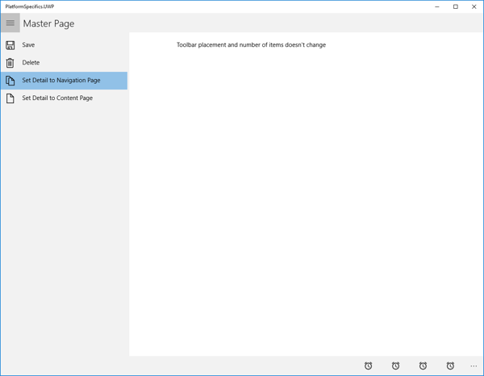

# Windows Platform-Specifics

_Platform-specifics allow you to consume functionality that's only available on a specific platform, without implementing custom renderers or effects. This article demonstrates how to consume the Windows platform-specifics that are built into Xamarin.Forms._

On the Universal Windows Platform (UWP), Xamarin.Forms contains the following platform-specifics:

- Toolbar placement options. For more information, see [Changing the Toolbar Placement](#toolbar_placement).
- A partially collapsable [`MasterDetailPage`](https://developer.xamarin.com/api/type/Xamarin.Forms.MasterDetailPage/) navigation bar. For more information, see [Collapsing a MasterDetailPage Navigation Bar](#collapsable_navigation_bar).

<a name="toolbar_placement" />

## Changing the Toolbar Placement

This platform-specific is used to change the placement of a toolbar on a [`Page`](https://developer.xamarin.com/api/type/Xamarin.Forms.Page/), and is consumed in XAML by setting the [`Page.ToolbarPlacement`](https://developer.xamarin.com/api/field/Xamarin.Forms.PlatformConfiguration.WindowsSpecific.Page.ToolbarPlacementProperty/) attached property to a value of the [`ToolbarPlacement`](https://developer.xamarin.com/api/type/Xamarin.Forms.PlatformConfiguration.WindowsSpecific.ToolbarPlacement/) enumeration:

```xaml
<TabbedPage ...
            xmlns:windows="clr-namespace:Xamarin.Forms.PlatformConfiguration.WindowsSpecific;assembly=Xamarin.Forms.Core"
            windows:Page.ToolbarPlacement="Bottom">
  ...
</TabbedPage>

```

Alternatively, it can be consumed from C# using the fluent API:

```csharp
using Xamarin.Forms.PlatformConfiguration;
using Xamarin.Forms.PlatformConfiguration.WindowsSpecific;
...

page.On<Windows>().SetToolbarPlacement(ToolbarPlacement.Bottom);
```

The `Page.On<Windows>` method specifies that this platform-specific will only run on Windows. The [`Page.SetToolbarPlacement`](https://developer.xamarin.com/api/member/Xamarin.Forms.PlatformConfiguration.WindowsSpecific.Page.SetToolbarPlacement/p/Xamarin.Forms.IPlatformElementConfiguration{Xamarin.Forms.PlatformConfiguration.Windows,Xamarin.Forms.Page}/Xamarin.Forms.PlatformConfiguration.WindowsSpecific.ToolbarPlacement/) method, in the [`Xamarin.Forms.PlatformConfiguration.WindowsSpecific`](https://developer.xamarin.com/api/namespace/Xamarin.Forms.PlatformConfiguration.WindowsSpecific/) namespace, is used to set the toolbar placement, with the [`ToolbarPlacement`](https://developer.xamarin.com/api/type/Xamarin.Forms.PlatformConfiguration.WindowsSpecific.ToolbarPlacement/) enumeration providing three values: [`Default`](https://developer.xamarin.com/api/field/Xamarin.Forms.PlatformConfiguration.WindowsSpecific.ToolbarPlacement.Default/), [`Top`](https://developer.xamarin.com/api/field/Xamarin.Forms.PlatformConfiguration.WindowsSpecific.ToolbarPlacement.Top/), and [`Bottom`](https://developer.xamarin.com/api/field/Xamarin.Forms.PlatformConfiguration.WindowsSpecific.ToolbarPlacement.Bottom/).

The result is that the specified toolbar placement is applied to the [`Page`](https://developer.xamarin.com/api/type/Xamarin.Forms.Page/) instance:

[](windows-images/toolbar-placement-large.png#lightbox "Toolbar Placement Platform-Specific")

<a name="collapsable_navigation_bar" />

## Collapsing a MasterDetailPage Navigation Bar

This platform-specific is used to collapse the navigation bar on a [`MasterDetailPage`](https://developer.xamarin.com/api/type/Xamarin.Forms.MasterDetailPage/), and is consumed in XAML by setting the [`MasterDetailPage.CollapseStyle`](https://developer.xamarin.com/api/field/Xamarin.Forms.PlatformConfiguration.WindowsSpecific.MasterDetailPage.CollapseStyleProperty/) and [`MasterDetailPage.CollapsedPaneWidth`](https://developer.xamarin.com/api/field/Xamarin.Forms.PlatformConfiguration.WindowsSpecific.MasterDetailPage.CollapsedPaneWidthProperty/) attached properties:

```xaml
<MasterDetailPage ...
                  xmlns:windows="clr-namespace:Xamarin.Forms.PlatformConfiguration.WindowsSpecific;assembly=Xamarin.Forms.Core"
                  windows:MasterDetailPage.CollapseStyle="Partial"
                  windows:MasterDetailPage.CollapsedPaneWidth="48">
  ...
</MasterDetailPage>

```

Alternatively, it can be consumed from C# using the fluent API:

```csharp
using Xamarin.Forms.PlatformConfiguration;
using Xamarin.Forms.PlatformConfiguration.WindowsSpecific;
...

page.On<Windows>().SetCollapseStyle(CollapseStyle.Partial).CollapsedPaneWidth(148);
```

The `MasterDetailPage.On<Windows>` method specifies that this platform-specific will only run on Windows. The [`Page.SetCollapseStyle`](https://developer.xamarin.com/api/member/Xamarin.Forms.PlatformConfiguration.WindowsSpecific.MasterDetailPage.SetCollapseStyle/p/Xamarin.Forms.IPlatformElementConfiguration{Xamarin.Forms.PlatformConfiguration.Windows,Xamarin.Forms.MasterDetailPage}/Xamarin.Forms.PlatformConfiguration.WindowsSpecific.CollapseStyle/) method, in the [`Xamarin.Forms.PlatformConfiguration.WindowsSpecific`](https://developer.xamarin.com/api/namespace/Xamarin.Forms.PlatformConfiguration.WindowsSpecific/) namespace, is used to specify the collapse style, with the [`CollapseStyle`](https://developer.xamarin.com/api/type/Xamarin.Forms.PlatformConfiguration.WindowsSpecific.CollapseStyle/) enumeration providing two values: [`Full`](https://developer.xamarin.com/api/field/Xamarin.Forms.PlatformConfiguration.WindowsSpecific.CollapseStyle.Full/) and [`Partial`](https://developer.xamarin.com/api/field/Xamarin.Forms.PlatformConfiguration.WindowsSpecific.CollapseStyle.Partial/). The [`MasterDetailPage.CollapsedPaneWidth`](https://developer.xamarin.com/api/member/Xamarin.Forms.PlatformConfiguration.WindowsSpecific.MasterDetailPage.CollapsedPaneWidth/p/Xamarin.Forms.IPlatformElementConfiguration{Xamarin.Forms.PlatformConfiguration.Windows,Xamarin.Forms.MasterDetailPage}/System.Double/) method is used to specify the width of a partially collapsed navigation bar.

The result is that a specified [`CollapseStyle`](https://developer.xamarin.com/api/type/Xamarin.Forms.PlatformConfiguration.WindowsSpecific.CollapseStyle/) is applied to the [`MasterDetailPage`](https://developer.xamarin.com/api/type/Xamarin.Forms.MasterDetailPage/) instance, with the width also being specified:

[](windows-images/collapsed-navigation-bar-large.png#lightbox "Collapsed Navigation Bar Platform-Specific")

## Summary

This article demonstrated how to consume the Windows platform-specifics that are built into Xamarin.Forms. Platform-specifics allow you to consume functionality that's only available on a specific platform, without implementing custom renderers or effects.


## Related Links

- [Creating Platform-Specifics](~/xamarin-forms/platform/platform-specifics/creating.md)
- [PlatformSpecifics (sample)](https://developer.xamarin.com/samples/xamarin-forms/userinterface/platformspecifics/)
- [WindowsSpecific](https://developer.xamarin.com/api/namespace/Xamarin.Forms.PlatformConfiguration.WindowsSpecific/)
