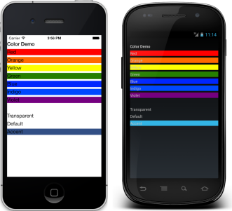

# Colors

_Xamarin.Forms provides a flexible cross-platform Color class._

This article introduces the various ways the `Color` class can be used in Xamarin.Forms.

The `Color` class provides a number of methods to build a color instance

-  **Named Colors** - a collection of common named-colors, including `Red`, `Green`, and `Blue`.
-  **FromHex** - string value similar to the syntax used in HTML, eg "00FF00". Alpha is can optionally be specified as the first pair of characters ("CC00FF00").
-  **FromHsla** - Hue, saturation and luminosity  `double` values, with optional alpha value (0.0-1.0).
-  **FromRgb** - Red, green, and blue `int` values (0-255).
-  **FromRgba** - Red, green, blue, and alpha  `int` values (0-255).
-  **FromUint** - set a single `double` value representing **argb**.

Here's some example colors, assigned to the `BackgroundColor` of some labels using different variations of the allowed syntax:

```csharp
var red    = new Label { Text = "Red",   BackgroundColor = Color.Red };
var orange = new Label { Text = "Orange",BackgroundColor = Color.FromHex("FF6A00") };
var yellow = new Label { Text = "Yellow",BackgroundColor = Color.FromHsla(0.167, 1.0, 0.5, 1.0) };
var green  = new Label { Text = "Green", BackgroundColor = Color.FromRgb (38, 127, 0) };
var blue   = new Label { Text = "Blue",  BackgroundColor = Color.FromRgba(0, 38, 255, 255) };
var indigo = new Label { Text = "Indigo",BackgroundColor = Color.FromRgb (0, 72, 255) };
var violet = new Label { Text = "Violet",BackgroundColor = Color.FromHsla(0.82, 1, 0.25, 1) };

var transparent = new Label { Text = "Transparent",BackgroundColor = Color.Transparent };
var @default = new Label    { Text = "Default",    BackgroundColor = Color.Default };
var accent = new Label      { Text = "Accent",     BackgroundColor = Color.Accent };
```

These colors are shown on each platform below. Notice the final color - `Accent` - is a blue-ish color for iOS and Android; this value is defined by Xamarin.Forms. On Windows Phone the `Accent` shows as red *because that is the user-selected accent color for that device*; this value changes depending on the user's preferences.

 [](colors-images/colors.png#lightbox "Color Demo")

## Color.Default

Use the `Default` to set (or re-set) a color value back to the platform default (understanding that this represents a different underlying color on each platform for each property).

Developers can use this value to set a `Color` property but should **not** query this instance for it's component RGB values (they're all set to -1).

## Color.Transparent

Set the color to clear.

## Color.Accent

On Windows Phone, this is the complementary color chosen by the user. Good Windows Phone applications use this as part of their styling to provide a native look and feel.

On iOS and Android this instance is set to a contrasting color that is visible on the default background but is not the same as the default text color.

## Additional Methods

`Color` instances include additional methods that can be used to create new colors:

-  **AddLuminosity** - returns a new color by modifying the luminosity by the supplied delta.
-  **WithHue** - returns a new color, replacing the hue with the value supplied.
-  **WithLuminosity** - returns a new color, replacing the luminosity with the value supplied.
-  **WithSaturation** - returns a new color, replacing the saturation with the value supplied.
-  **MultiplyAlpha** - returns a new color by modifying the alpha, multiplying it by the supplied alpha value.

## Device.RuntimePlatform

This code snippet uses the `Device.RuntimePlatform` property to selectively set the color of an `ActivityIndicator`:

```csharp
ActivityIndicator activityIndicator = new ActivityIndicator
{
    Color = Device.RuntimePlatform == Device.iOS ? Color.Black : Color.Default,
    IsRunning = true
};
```

## Using from XAML

Colors can also be easily referenced in XAML using the defined color names or the Hex representations shown here:

```xaml
<Label Text="Sea color" BackgroundColor="Aqua" />
<Label Text="RGB" BackgroundColor="#00FF00" />
<Label Text="Alpha plus RGB" BackgroundColor="#CC00FF00" />
<Label Text="Tiny RGB" BackgroundColor="#0F0" />
<Label Text="Tiny Alpha plus RGB" BackgroundColor="#C0F0" />
```

## Summary

The Xamarin.Forms `Color` class is used to create platform-aware color references. It can be used in shared code and XAML.


## Related Links

- [ColorsSample](https://developer.xamarin.com/samples/WorkingWithColors)
- [Bindable Picker (sample)](https://developer.xamarin.com/samples/xamarin-forms/UserInterface/BindablePicker/)
