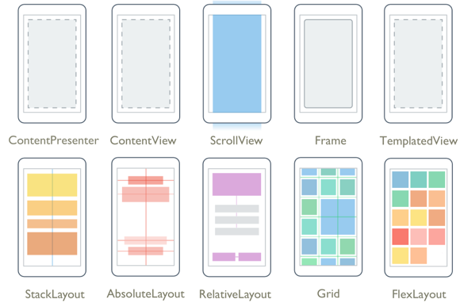

# Xamarin.Forms Layouts

_Xamarin.Forms Layouts are used to compose user interface controls into logical structures._

## Layouts

The [`Layout`](https://developer.xamarin.com/api/type/Xamarin.Forms.Layout) class in Xamarin.Forms is a specialized subtype of View, which acts as a container for other Layouts or Views. It typically contains logic to set the position and size of child elements in Xamarin.Forms applications.

 

 

Xamarin.Forms supports:

<table align="center" border="1" cellpadding="1" cellspacing="1">
<thead>
    <th>
      <strong>Type</strong>
    </th>
    <th>
      <strong>Description</strong>
    </th>
    <th style="min-width:400px">
      <strong>Screenshot</strong>
    </th>
  </thead>
  <tbody>
  <tr>
    <td valign="top">
      <a href="https://developer.xamarin.com/api/type/Xamarin.Forms.ContentPresenter/">ContentPresenter</a>
    </td>
    <td valign="top">
    A layout manager for templated views. Used within a <a href="https://developer.xamarin.com/api/type/Xamarin.Forms.ControlTemplate/">ControlTemplate</a> to mark where the content to be presented appears.
    </td>
    <td>
    </td>
  </tr>
  <tr>
    <td valign="top">
      <a href="https://developer.xamarin.com/api/type/Xamarin.Forms.ContentView/">ContentView</a>
    </td>
    <td valign="top">
    An element with a single content. ContentView has very little use of its own. Its purpose is to serve as a base class for user-defined compound views.
    </td>
    <td>
    </td>
  </tr>
  <tr>
    <td valign="top">
      <a href="https://developer.xamarin.com/api/type/Xamarin.Forms.Frame/">Frame</a>
    </td>
    <td valign="top">
    An element containing a single child, with some framing options. Frame have a default <a href="https://developer.xamarin.com/api/property/Xamarin.Forms.Layout.Padding/">Xamarin.Forms.Layout.Padding</a> of 20.
    </td>
    <td>
    </td>
  </tr>
  <tr>
    <td valign="top">
      <a href="https://developer.xamarin.com/api/type/Xamarin.Forms.ScrollView/">ScrollView</a>
    </td>
    <td valign="top">
    An element capable of scrolling if it's Content requires.
    </td>
    <td>
    </td>
  </tr>
  <tr>
    <td valign="top">
      <a href="https://developer.xamarin.com/api/type/Xamarin.Forms.TemplatedView/">TemplatedView</a>
    </td>
    <td valign="top">
    An element that displays content with a control template, and the base class for <a href=""/api/type/Xamarin.Forms.ContentView/">ContentView</a>.
    </td>
    <td>
    </td>
  </tr>
  <tr>
    <td valign="top">
      <a href="https://developer.xamarin.com/api/type/Xamarin.Forms.AbsoluteLayout/">AbsoluteLayout</a>
    </td>
    <td valign="top">
    Positions child elements at absolute requested positions. User assigned anchors and bounds defines the position and size of the control.
    </td>
    <td valign="top">
      </td>
  </tr>
  <tr>
    <td valign="top">
      <a href="https://developer.xamarin.com/api/type/Xamarin.Forms.Grid/">Grid</a>
    </td>
    <td valign="top">
    A layout containing views arranged in rows and columns.
    </td>
    <td>
    </td>
  </tr>
  <tr>
    <td>
      <a href="https://developer.xamarin.com/api/type/Xamarin.Forms.RelativeLayout/">RelativeLayout</a>
    </td>
    <td valign="top">
    A <a href="https://developer.xamarin.com/api/type/Xamarin.Forms.Layout/%601">Layout</a> that uses <a href="https://developer.xamarin.com/api/type/Xamarin.Forms.Constraint/">Constraint</a>s to layout its children.
    </td>
    <td>
    </td>
  </tr>
  <tr>
    <td valign="top">
      <a href="https://developer.xamarin.com/api/type/Xamarin.Forms.StackLayout/">StackLayout</a>
    </td>
    <td valign="top">
    A <a href="https://developer.xamarin.com/api/type/Xamarin.Forms.Layout/">Layout</a> that positions child elements in a single line which can be oriented vertically or horizontally. This layout will set the child bounds automatically during a layout cycle. User assigned bounds will be overwritten and thus should not be set on a child element by the user.
    </td>
    <td>
    </td>
  </tr>
  </tbody>
</table>

## Related Links

- [Introduction To Xamarin.Forms](~/xamarin-forms/get-started/introduction-to-xamarin-forms.md)
- [Xamarin.Forms Gallery (sample)](https://developer.xamarin.com/samples/FormsGallery/)
- [Xamarin.Forms Samples](https://developer.xamarin.com/samples/tag/Xamarin.Forms/)
- [Xamarin.Forms API Documentation](https://developer.xamarin.com/api/namespace/Xamarin.Forms)
