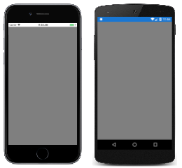
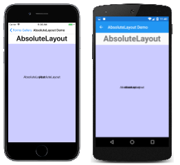
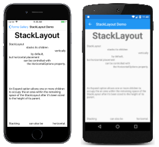

# Xamarin.Forms Layouts

_Xamarin.Forms Layouts are used to compose user interface controls into logical structures._

## Layouts

The [`Layout`](https://developer.xamarin.com/api/type/Xamarin.Forms.Layout) class in Xamarin.Forms is a specialized subtype of View, which acts as a container for other Layouts or Views. It typically contains logic to set the position and size of child elements in Xamarin.Forms applications.

 

Xamarin.Forms supports:

| Type | Description | Screenshot |
| ---- | ----------- | ---------- |
| [`ContentPresenter`](https://developer.xamarin.com/api/type/Xamarin.Forms.ContentPresenter/) |A layout manager for templated views. Used within a [`ControlTemplate`](https://developer.xamarin.com/api/type/Xamarin.Forms.ControlTemplate/) to mark where the content to be presented appears. |  |
| [`ContentView`](https://developer.xamarin.com/api/type/Xamarin.Forms.ContentView/) | An element with a single content. ContentView has very little use of its own. Its purpose is to serve as a base class for user-defined compound views. |  |
| [`Frame`](https://developer.xamarin.com/api/type/Xamarin.Forms.Frame/) | An element containing a single child, with some framing options. Frame have a default [`Padding`](https://developer.xamarin.com/api/property/Xamarin.Forms.Layout.Padding/) value of 20. |  |
| [`ScrollView`](https://developer.xamarin.com/api/type/Xamarin.Forms.ScrollView/) | An element capable of scrolling if its Content requires. |  |
| [`TemplatedView`](https://developer.xamarin.com/api/type/Xamarin.Forms.TemplatedView/) | An element that displays content with a control template, and the base class for [`ContentView`](https://developer.xamarin.com/api/type/Xamarin.Forms.ContentView/). |  |
| [`AbsoluteLayout`](https://developer.xamarin.com/api/type/Xamarin.Forms.AbsoluteLayout/) | Positions child elements at absolute requested positions. User assigned anchors and bounds defines the position and size of the control. |  |
| [`Grid`](https://developer.xamarin.com/api/type/Xamarin.Forms.Grid/) | A layout containing views arranged in rows and columns. |  |
| [`RelativeLayout`](https://developer.xamarin.com/api/type/Xamarin.Forms.RelativeLayout/) | A [`Layout`](https://developer.xamarin.com/api/type/Xamarin.Forms.Layout/%601) that uses a [`Constraint`](https://developer.xamarin.com/api/type/Xamarin.Forms.Constraint/). |  |
| [`StackLayout`](https://developer.xamarin.com/api/type/Xamarin.Forms.StackLayout/) | A [`Layout`](https://developer.xamarin.com/api/type/Xamarin.Forms.Layout/%601) that positions child elements in a single line which can be oriented vertically or horizontally. This layout will set the child bounds automatically during a layout cycle. User assigned bounds will be overwritten and thus should not be set on a child element by the user. |  |

## Related Links

- [Introduction To Xamarin.Forms](~/xamarin-forms/get-started/introduction-to-xamarin-forms.md)
- [Xamarin.Forms FormsGallery sample](https://developer.xamarin.com/samples/FormsGallery/)
- [Xamarin.Forms Samples](https://developer.xamarin.com/samples/xamarin-forms/all/)
- [Xamarin.Forms API Documentation](https://developer.xamarin.com/api/root/Xamarin.Forms/)
