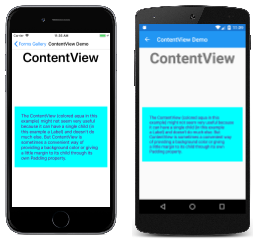
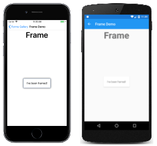
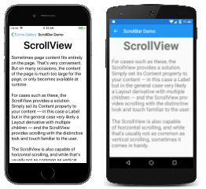
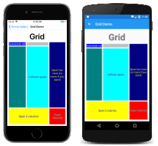
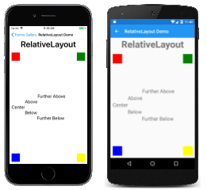

# Xamarin.Forms Layouts

_Xamarin.Forms Layouts are used to compose user-interface controls into visual structures._

The [`Layout`](https://developer.xamarin.com/api/type/Xamarin.Forms.Layout) and [`Layout<T>`](https://developer.xamarin.com/api/type/Xamarin.Forms.Layout%3CT%3E/) classes in Xamarin.Forms are specialized subtypes of views that act as containers for views and other layouts. The `Layout` class itself derives from [`View`](views.md). A `Layout` derivative typically contains logic to set the position and size of child elements in Xamarin.Forms applications.

 

The classes that derive from `Layout` can be divided into two categories:

## Layouts with Single Content

These classes derive from [`Layout`](https://developer.xamarin.com/api/type/Xamarin.Forms.Layout/), which defines [`Padding`](https://developer.xamarin.com/api/property/Xamarin.Forms.Layout.Padding/) and [`IsClippedToBounds`](https://developer.xamarin.com/api/property/Xamarin.Forms.Layout.IsClippedToBounds/) properties.

<a name="contentView" />

### ContentView

|     |     |
| --- | --- |
| [`ContentView`](https://developer.xamarin.com/api/type/Xamarin.Forms.ContentView/) contains a single child that is set with the [`Content`](https://developer.xamarin.com/api/property/Xamarin.Forms.ContentView.Content/) property. The `Content` property can be set to any `View` derivative, including other `Layout` derivatives. `ContentView` is mostly used as a structural element and serves as a base class to [`Frame`](#frame).  [API Documentation](https://developer.xamarin.com/api/type/Xamarin.Forms.ContentView/) |  [C# code for this page](https://github.com/xamarin/xamarin-forms-samples/blob/master/FormsGallery/FormsGallery/FormsGallery/CodeExamples/ContentViewDemoPage.cs) / [XAML page](https://github.com/xamarin/xamarin-forms-samples/blob/master/FormsGallery/FormsGallery/FormsGallery/XamlExamples/ContentViewDemoPage.xaml) |
|     |     |

<a named="frame" />

### Frame

|     |     |
| --- | --- |
| The [`Frame`](https://developer.xamarin.com/api/type/Xamarin.Forms.Frame/) class derives from [`ContentView`](#contentView) and displays a rectangular frame around its child. `Frame` has a default [`Padding`](https://developer.xamarin.com/api/property/Xamarin.Forms.Layout.Padding/) value of 20, and also defines [`OutlineColor`](https://developer.xamarin.com/api/property/Xamarin.Forms.Frame.OutlineColor/), [`CornerRadius`](https://developer.xamarin.com/api/property/Xamarin.Forms.Frame.CornerRadius/), and [`HasShadow`](https://developer.xamarin.com/api/property/Xamarin.Forms.Frame.HasShadow/) properties.  [API Documentation](https://developer.xamarin.com/api/type/Xamarin.Forms.Frame/) |  [C# code for this page](https://github.com/xamarin/xamarin-forms-samples/blob/master/FormsGallery/FormsGallery/FormsGallery/CodeExamples/FrameDemoPage.cs) / [XAML page](https://github.com/xamarin/xamarin-forms-samples/blob/master/FormsGallery/FormsGallery/FormsGallery/XamlExamples/FrameDemoPage.xaml) |
|     |     |

<a name="scrollView" />

### ScrollView

|     |     |
| --- | --- |
| [`ScrollView`](https://developer.xamarin.com/api/type/Xamarin.Forms.ScrollView/) is capable of scrolling its contents. Set the [`Content`](https://developer.xamarin.com/api/property/Xamarin.Forms.ScrollView.Content/) property to a view or layout too large to fit on the screen. (The content of a `ScrollView` is very often a [`StackLayout`](#stackLayout).) Set the [`Orientation`](https://developer.xamarin.com/api/property/Xamarin.Forms.ScrollView.Orientation/) property to indicate if scrolling should be vertical, horizontal, or both.  [API Documentation](https://developer.xamarin.com/api/type/Xamarin.Forms.ScrollView/) / [Guide](~/xamarin-forms/user-interface/layouts/scroll-view.md) / [Sample](https://developer.xamarin.com/samples/xamarin-forms/UserInterface/Layout/) |  [C# code for this page](https://github.com/xamarin/xamarin-forms-samples/blob/master/FormsGallery/FormsGallery/FormsGallery/CodeExamples/ScrollViewDemoPage.cs) / [XAML page](https://github.com/xamarin/xamarin-forms-samples/blob/master/FormsGallery/FormsGallery/FormsGallery/XamlExamples/ScrollViewDemoPage.xaml) |
|     |     |

### TemplatedView

|     |     |
| --- | --- |
| [`TemplatedView`](https://developer.xamarin.com/api/type/Xamarin.Forms.TemplatedView/) displays content with a control template, and is the base class for [`ContentView`](#contentView).  [API Documentation](https://developer.xamarin.com/api/type/Xamarin.Forms.TemplatedView/) / [Guide](~/xamarin-forms/app-fundamentals/templates/control-templates/index.md) |  |
|     |     |

### ContentPresenter

|     |     |
| --- | --- |
| [`ContentPresenter`](https://developer.xamarin.com/api/type/Xamarin.Forms.ContentPresenter/) is a layout manager for templated views, used within a [`ControlTemplate`](https://developer.xamarin.com/api/type/Xamarin.Forms.ControlTemplate/) to mark where the content that is to be presented appears.  [API Documentation](https://developer.xamarin.com/api/type/Xamarin.Forms.ContentPresenter/) / [Guide](~/xamarin-forms/app-fundamentals/templates/control-templates/index.md) |  |
|     |     |

## Layouts with Multiple Children

These classes derive from [`Layout<View>`](https://developer.xamarin.com/api/type/Xamarin.Forms.Layout%3CT%3E/).

<a name="stackLayout" />

### StackLayout

|     |     |
| --- | --- |
| [`StackLayout`](https://developer.xamarin.com/api/type/Xamarin.Forms.StackLayout/) positions child elements in a stack either horizontally or vertically based on the [`Orientation`](https://developer.xamarin.com/api/property/Xamarin.Forms.StackLayout.Orientation/) property. The [`Spacing`](https://developer.xamarin.com/api/property/Xamarin.Forms.StackLayout.Spacing/) property governs the spacing between the children, and has a default value of 6.  [API Documentation](https://developer.xamarin.com/api/type/Xamarin.Forms.StackLayout/) / [Guide](~/xamarin-forms/user-interface/layouts/stack-layout.md) / [Sample](https://developer.xamarin.com/samples/xamarin-forms/UserInterface/Layout/)|  [C# code for this page](https://github.com/xamarin/xamarin-forms-samples/blob/master/FormsGallery/FormsGallery/FormsGallery/CodeExamples/StackLayoutDemoPage.cs) / [XAML page]((https://github.com/xamarin/xamarin-forms-samples/blob/master/FormsGallery/FormsGallery/FormsGallery/XamlExamples/StackLayoutDemoPage.xaml)) |
|     |     |

<a name="grid" />

### Grid

|     |     |
| --- | --- |
| [`Grid`](https://developer.xamarin.com/api/type/Xamarin.Forms.Grid/) positions its child elements in a grid of rows and columns. A child's position is indicated using the [attached properties](~/xamarin-forms/xaml/attached-properties.md) [`Row`](https://developer.xamarin.com/api/field/Xamarin.Forms.Grid.RowProperty/), [`Column`](https://developer.xamarin.com/api/field/Xamarin.Forms.Grid.ColumnProperty/), [`RowSpan`](https://developer.xamarin.com/api/field/Xamarin.Forms.Grid.RowSpanProperty/), and [`ColumnSpan`](https://developer.xamarin.com/api/field/Xamarin.Forms.Grid.ColumnSpanProperty/).  [API Documentation](https://developer.xamarin.com/api/type/Xamarin.Forms.Grid/) / [Guide](~/xamarin-forms/user-interface/layouts/grid.md) / [Sample](https://developer.xamarin.com/samples/xamarin-forms/UserInterface/Layout/) |  [C# code for this page](https://github.com/xamarin/xamarin-forms-samples/blob/master/FormsGallery/FormsGallery/FormsGallery/CodeExamples/GridDemoPage.cs) / [XAML page]((https://github.com/xamarin/xamarin-forms-samples/blob/master/FormsGallery/FormsGallery/FormsGallery/XamlExamples/GridDemoPage.xaml)) |
|     |     |

### AbsoluteLayout

|     |     |
| --- | --- |
| [`AbsoluteLayout`](https://developer.xamarin.com/api/type/Xamarin.Forms.AbsoluteLayout/) positions child elements at specific locations relative to its parent. A child's position is indicated using the [attached properties](~/xamarin-forms/xaml/attached-properties.md) [`LayoutBounds`](https://developer.xamarin.com/api/field/Xamarin.Forms.AbsoluteLayout.LayoutBoundsProperty/) and [`LayoutFlags`](https://developer.xamarin.com/api/field/Xamarin.Forms.AbsoluteLayout.LayoutFlagsProperty/). An `AbsoluteLayout` is useful for animating the positions of views.  [API Documentation](https://developer.xamarin.com/api/type/Xamarin.Forms.AbsoluteLayout/) / [Guide](~/xamarin-forms/user-interface/layouts/absolute-layout.md) / [Sample](https://developer.xamarin.com/samples/xamarin-forms/UserInterface/Layout/) |  [C# code for this page](https://github.com/xamarin/xamarin-forms-samples/blob/master/FormsGallery/FormsGallery/FormsGallery/CodeExamples/AbsoluteLayoutdDemoPage.cs) / [XAML page](https://github.com/xamarin/xamarin-forms-samples/blob/master/FormsGallery/FormsGallery/FormsGallery/XamlExamples/AbsoluteLayout.xaml) with [code-behind](https://github.com/xamarin/xamarin-forms-samples/blob/master/FormsGallery/FormsGallery/FormsGallery/XamlExamples/AbsoluteLayout.xaml.cs) |
|     |     |

### RelativeLayout

|     |     |
| --- | --- |
| [`RelativeLayout`](https://developer.xamarin.com/api/type/Xamarin.Forms.RelativeLayout/) positions child elements relative to the `RelativeLayout` itself or to their siblings. A child's position is indicated using the [attached properties](~/xamarin-forms/xaml/attached-properties.md) that are set to objects of type [`Constraint`](https://developer.xamarin.com/api/type/Xamarin.Forms.Constraint/) and [`BoundsConstraint`](https://developer.xamarin.com/api/type/Xamarin.Forms.Constraint/).  [API Documentation](https://developer.xamarin.com/api/type/Xamarin.Forms.RelativeLayout/)/ [Guide](~/xamarin-forms/user-interface/layouts/relative-layout.md) / [Sample](https://developer.xamarin.com/samples/xamarin-forms/UserInterface/Layout/) |  [C# code for this page](https://github.com/xamarin/xamarin-forms-samples/blob/master/FormsGallery/FormsGallery/FormsGallery/CodeExamples/RelativeLayoutDemoPage.cs) / [XAML page]((https://github.com/xamarin/xamarin-forms-samples/blob/master/FormsGallery/FormsGallery/FormsGallery/XamlExamples/RelativeLayoutDemoPage.xaml)) |
|     |     |

## Related Links

- [Introduction To Xamarin.Forms](~/xamarin-forms/get-started/introduction-to-xamarin-forms.md)
- [Xamarin.Forms FormsGallery sample](https://developer.xamarin.com/samples/FormsGallery/)
- [Xamarin.Forms Samples](https://developer.xamarin.com/samples/xamarin-forms/all/)
- [Xamarin.Forms API Documentation](https://developer.xamarin.com/api/root/Xamarin.Forms/)
