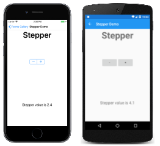
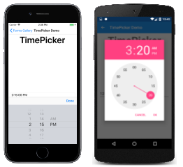
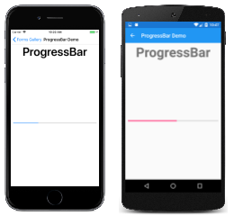

# Xamarin.Forms Views

_Xamarin.Forms views are the building blocks of cross-platform mobile user interfaces._

Views are user-interface objects such as labels, buttons, and sliders that are commonly known as *controls* or *widgets* in other graphical programming environments. The views supported by Xamarin.Forms all derive from the [`View`](https://developer.xamarin.com/api/type/Xamarin.Forms.View/) class. They can be divided into several categories:

## Views for presentation

### Label

|     |     |
| --- | --- |
| [`Label`](https://developer.xamarin.com/api/type/Xamarin.Forms.Label/) displays single-line text strings or multi-line blocks of text, either with constant or variable formatting. Set the [`Text`](https://developer.xamarin.com/api/property/Xamarin.Forms.Label.Text/) property to a string for constant formatting, or set the [`FormattedText`](https://developer.xamarin.com/api/property/Xamarin.Forms.Label.FormattedText/) property to a [`FormattedString`](https://developer.xamarin.com/api/type/Xamarin.Forms.FormattedString/) object for variable formatting.  [API Documentation](https://developer.xamarin.com/api/type/Xamarin.Forms.Label/) / [Guide](~/xamarin-forms/user-interface/text/label.md) / [Sample](https://developer.xamarin.com/samples/xamarin-forms/UserInterface/Text/) |   [C# code for this page](https://github.com/xamarin/xamarin-forms-samples/blob/master/FormsGallery/FormsGallery/FormsGallery/CodeExamples/LabelDemoPage.cs) / [XAML page](https://github.com/xamarin/xamarin-forms-samples/blob/master/FormsGallery/FormsGallery/FormsGallery/XamlExamples/LabelDemoPage.xaml) |
|     |     |

### Image

|     |     |
| --- | --- |
| [`Image`](https://developer.xamarin.com/api/type/Xamarin.Forms.Image/) displays a bitmap. Bitmaps can be downloaded over the Web, embedded as resources in the common project or platform projects, or created using a .NET `Stream` object.  [API Documentation](https://developer.xamarin.com/api/type/Xamarin.Forms.Image/) / [Guide](~/xamarin-forms/user-interface/images.md) / [Sample](https://developer.xamarin.com/samples/xamarin-forms/WorkingWithImages/) |  [C# code for this page](https://github.com/xamarin/xamarin-forms-samples/blob/master/FormsGallery/FormsGallery/FormsGallery/CodeExamples/ImageDemoPage.cs) / [XAML page](https://github.com/xamarin/xamarin-forms-samples/blob/master/FormsGallery/FormsGallery/FormsGallery/XamlExamples/ImageDemoPage.xaml) |
|     |     |

### BoxView

|     |    |
| --- | ---|
| [`BoxView`](https://developer.xamarin.com/api/type/Xamarin.Forms.BoxView/) displays a solid rectangle colored by the [`Color`](https://developer.xamarin.com/api/property/Xamarin.Forms.BoxView.Color/) property. `BoxView` has a default size request of 40x40. For other sizes, assign the [`WidthRequest`](https://developer.xamarin.com/api/property/Xamarin.Forms.VisualElement.WidthRequest/) and [`HeightRequest`](https://developer.xamarin.com/api/property/Xamarin.Forms.VisualElement.HeightRequest/) properties.  [API Documentation](https://developer.xamarin.com/api/type/Xamarin.Forms.BoxView/) / [Guide](~/xamarin-forms/user-interface/boxview.md) / [Sample 1](https://developer.xamarin.com/samples/xamarin-forms/BoxView/BasicBoxView), [2](https://developer.xamarin.com/samples/xamarin-forms/BoxView/TextDecoration), [3](https://developer.xamarin.com/samples/xamarin-forms/BoxView/ColorListBox), [4](https://developer.xamarin.com/samples/xamarin-forms/BoxView/GameOfLife), [5](https://developer.xamarin.com/samples/xamarin-forms/BoxView/DotMatrixClock), and [6](https://developer.xamarin.com/samples/xamarin-forms/BoxView/BoxViewClock) |  [C# code for this page](https://github.com/xamarin/xamarin-forms-samples/blob/master/FormsGallery/FormsGallery/FormsGallery/CodeExamples/BoxViewDemoPage.cs) / [XAML page](https://github.com/xamarin/xamarin-forms-samples/blob/master/FormsGallery/FormsGallery/FormsGallery/XamlExamples/BoxViewDemoPage.xaml) |
|     |     |

### WebView

|     |     |
| --- | --- |
| [`WebView`](https://developer.xamarin.com/api/type/Xamarin.Forms.WebView/) displays Web pages or HTML content, based on whether the [`Source`](https://developer.xamarin.com/api/property/Xamarin.Forms.WebView.Source/) property is set to a [`UriWebViewSource`](https://developer.xamarin.com/api/type/Xamarin.Forms.UrlWebViewSource/) or an [`HtmlWebViewSource`](https://developer.xamarin.com/api/type/Xamarin.Forms.HtmlWebViewSource/) object.  [API Documentation](https://developer.xamarin.com/api/type/Xamarin.Forms.WebView/) / [Guide](~/xamarin-forms/user-interface/webview.md) / [Sample 1](https://developer.xamarin.com/samples/xamarin-forms/WorkingWithWebview/) and [2](https://developer.xamarin.com/samples/xamarin-forms/UserInterface/WebView) |  [C# code for this page](https://github.com/xamarin/xamarin-forms-samples/blob/master/FormsGallery/FormsGallery/FormsGallery/CodeExamples/WebViewDemoPage.cs) / [XAML page](https://github.com/xamarin/xamarin-forms-samples/blob/master/FormsGallery/FormsGallery/FormsGallery/XamlExamples/WebViewDemoPage.xaml) |
|     |     |

### OpenGLView

|     |     |
| --- | --- |
| [`OpenGLView`](https://developer.xamarin.com/api/type/Xamarin.Forms.OpenGLView/) displays OpenGL graphics in iOS and Android projects. There is no support for the Universal Windows Platform. The iOS and Android projects require a reference to the **OpenTK-1.0** assembly or the **OpenTK** version 1.0.0.0 assembly. `OpenGLView` is easier to use in a Shared Project; if used in a .NET Standard library, then a Dependency Service will also be required (as shown in the sample code).  This is the only graphics facility that is built into Xamarin.Forms, but a Xamarin.Forms application can also render graphics using [`CocosSharp`](~/xamarin-forms/user-interface/graphics/cocossharp.md), [`SkiaSharp`](~/xamarin-forms/user-interface/graphics/skiasharp/index.md), or [`UrhoSharp`](~/xamarin-forms/user-interface/graphics/urhosharp.md).  [API Documentation](https://developer.xamarin.com/api/type/Xamarin.Forms.OpenGLView/)   |  [C# code for this page](https://github.com/xamarin/xamarin-forms-samples/blob/master/FormsGallery/FormsGallery/FormsGallery/CodeExamples/OpenGLViewDemoPage.cs) / [XAML page](https://github.com/xamarin/xamarin-forms-samples/blob/master/FormsGallery/FormsGallery/FormsGallery/XamlExamples/OpenGLViewDemoPage.xaml) with [code-behind](https://github.com/xamarin/xamarin-forms-samples/blob/master/FormsGallery/FormsGallery/FormsGallery/XamlExamples/OpenGLViewDemoPage.xaml.cs) |
|     |     |

### Map

|     |     |
| --- | --- |
| [`Map`](https://developer.xamarin.com/api/type/Xamarin.Forms.Maps.Map/) displays a map. The **Xamarin.Forms.Maps** Nuget package must be installed. Android and Universal Windows Platform require a map authorization key.  [API Documentation](https://developer.xamarin.com/api/type/Xamarin.Forms.Maps.Map/) / [Guide](~/xamarin-forms/user-interface/map.md) / [Sample](https://developer.xamarin.com/samples/WorkingWithMaps/) |  [C# code for this page](https://github.com/xamarin/xamarin-forms-samples/blob/master/FormsGallery/FormsGallery/FormsGallery/CodeExamples/MapDemoPage.cs) / [XAML page](https://github.com/xamarin/xamarin-forms-samples/blob/master/FormsGallery/FormsGallery/FormsGallery/XamlExamples/MapDemoPage.xaml) |
|     |     |

## Views that initiate commands

### Button

|     |     |
| --- | --- |
| [`Button`](https://developer.xamarin.com/api/type/Xamarin.Forms.Button/) is a rectangular object that displays text, and which fires a [`Clicked`](https://developer.xamarin.com/api/event/Xamarin.Forms.Button.Clicked/) event when it's been pressed.  [API Documentation](https://developer.xamarin.com/api/type/Xamarin.Forms.Button/) / [Guide](~/xamarin-forms/user-interface/button.md) / [Sample](https://developer.xamarin.com/samples/UserInterface/ButtonDemos/) |   [C# code for this page](https://github.com/xamarin/xamarin-forms-samples/blob/master/FormsGallery/FormsGallery/FormsGallery/CodeExamples/ButtonDemoPage.cs) / [XAML page](https://github.com/xamarin/xamarin-forms-samples/blob/master/FormsGallery/FormsGallery/FormsGallery/XamlExamples/ButtonDemoPage.xaml) with [code-behind](https://github.com/xamarin/xamarin-forms-samples/blob/master/FormsGallery/FormsGallery/FormsGallery/XamlExamples/ButtonDemoPage.xaml.cs) |
|     |     |

### SearchBar

|     |     |
| --- | --- |
| [`SearchBar`](https://developer.xamarin.com/api/type/Xamarin.Forms.SearchBar/) displays an area for the user to type a text string, and a button (or a keyboard key) that signals the application to perform a search. The [`Text`](https://developer.xamarin.com/api/property/Xamarin.Forms.SearchBar.Text/) property provides access to the text, and the [`SearchButtonPressed`](https://developer.xamarin.com/api/event/Xamarin.Forms.SearchBar.SearchButtonPressed/) event indicates that the button has been pressed.  [API Documentation](https://developer.xamarin.com/api/type/Xamarin.Forms.SearchBar/) |   [C# code for this page](https://github.com/xamarin/xamarin-forms-samples/blob/master/FormsGallery/FormsGallery/FormsGallery/CodeExamples/SearchBarDemoPage.cs) / [XAML page](https://github.com/xamarin/xamarin-forms-samples/blob/master/FormsGallery/FormsGallery/FormsGallery/XamlExamples/SearchBarDemoPage.xaml) with [code-behind](https://github.com/xamarin/xamarin-forms-samples/blob/master/FormsGallery/FormsGallery/FormsGallery/XamlExamples/SearchBarDemoPage.xaml.cs) |
|     |     |

## Views for setting values

### Slider

|     |     |
| --- | --- |
| [`Slider`](https://developer.xamarin.com/api/type/Xamarin.Forms.Slider/) allows the user to select a `double` value from a continuous range specified with the [`Minimum`](https://developer.xamarin.com/api/property/Xamarin.Forms.Slider.Minimum/) and [`Maximum`](https://developer.xamarin.com/api/property/Xamarin.Forms.Slider.Maximum/) properties.  [API Documentation](https://developer.xamarin.com/api/type/Xamarin.Forms.Slider/) / [Guide](~/xamarin-forms/user-interface/slider.md) / [Sample](https://developer.xamarin.com/samples/xamarin-forms/UserInterface/SliderDemos) |  [C# code for this page](https://github.com/xamarin/xamarin-forms-samples/blob/master/FormsGallery/FormsGallery/FormsGallery/CodeExamples/SliderDemoPage.cs) / [XAML page](https://github.com/xamarin/xamarin-forms-samples/blob/master/FormsGallery/FormsGallery/FormsGallery/XamlExamples/SliderDemoPage.xaml) |
|     |     |

### Stepper

|     |     |
| --- | --- |
| [`Stepper`](https://developer.xamarin.com/api/type/Xamarin.Forms.Stepper/) allows the user to select a `double` value from a range of incremental values specified with the [`Minimum`](https://developer.xamarin.com/api/property/Xamarin.Forms.Stepper.Minimum/), [`Maximum`](https://developer.xamarin.com/api/property/Xamarin.Forms.Stepper.Maximum/), and [`Increment`](https://developer.xamarin.com/api/property/Xamarin.Forms.Stepper.Increment/) properties.  [API Documentation](https://developer.xamarin.com/api/type/Xamarin.Forms.Stepper/) |  [C# code for this page](https://github.com/xamarin/xamarin-forms-samples/blob/master/FormsGallery/FormsGallery/FormsGallery/CodeExamples/StepperDemoPage.cs) / [XAML page](https://github.com/xamarin/xamarin-forms-samples/blob/master/FormsGallery/FormsGallery/FormsGallery/XamlExamples/StepperDemoPage.xaml) |
|     |     |

### Switch

|     |     |
| --- | --- |
| [`Switch`](https://developer.xamarin.com/api/type/Xamarin.Forms.Switch/) takes the form of an on/off switch to allow the user to select a Boolean value. The [`IsToggled`](https://developer.xamarin.com/api/property/Xamarin.Forms.Switch.IsToggled/) property is the state of the switch, and the [`Toggled`](https://developer.xamarin.com/api/event/Xamarin.Forms.Switch.Toggled/) event is fired when the state changes.  [API Documentation](https://developer.xamarin.com/api/type/Xamarin.Forms.Switch/) |  [C# code for this page](https://github.com/xamarin/xamarin-forms-samples/blob/master/FormsGallery/FormsGallery/FormsGallery/CodeExamples/SwitchDemoPage.cs) / [XAML page](https://github.com/xamarin/xamarin-forms-samples/blob/master/FormsGallery/FormsGallery/FormsGallery/XamlExamples/SwitchDemoPage.xaml) |
|     |     |

### DatePicker

|     |     |
| --- | --- |
| [`DatePicker`](https://developer.xamarin.com/api/type/Xamarin.Forms.DatePicker/) allows the user to select a date with the platform date picker. Set a range of allowable dates with the [`MinimumDate`](https://developer.xamarin.com/api/property/Xamarin.Forms.DatePicker.MinimumDate/) and [`MaximumDate`](https://developer.xamarin.com/api/property/Xamarin.Forms.DatePicker.MaximumDate/) properties. The [`Date`](https://developer.xamarin.com/api/property/Xamarin.Forms.DatePicker.Date/) property is the selected date, and the [`DateSelected`](https://developer.xamarin.com/api/event/Xamarin.Forms.DatePicker.DateSelected/) event is fired when that property changes.  [API Documentation](https://developer.xamarin.com/api/type/Xamarin.Forms.DatePicker/) / [Guide](~/xamarin-forms/user-interface/datepicker.md) / [Sample](https://developer.xamarin.com/samples/xamarin-forms/UserInterface/DatePicker) |  [C# code for this page](https://github.com/xamarin/xamarin-forms-samples/blob/master/FormsGallery/FormsGallery/FormsGallery/CodeExamples/DatePickerDemoPage.cs) / [XAML page](https://github.com/xamarin/xamarin-forms-samples/blob/master/FormsGallery/FormsGallery/FormsGallery/XamlExamples/DatePickerDemoPage.xaml) |
|     |     |

### TimePicker

|     |     |
| --- | --- |
| [`TimePicker`](https://developer.xamarin.com/api/type/Xamarin.Forms.TimePicker/) allows the user to select a time with the platform time picker. The [`Time`](https://developer.xamarin.com/api/property/Xamarin.Forms.TimePicker.Time/) property is the selected time. An application can monitor changes in the `Time` property by installing a handler for the [`PropertyChanged`](https://developer.xamarin.com/api/event/Xamarin.Forms.BindableObject.PropertyChanged/) event.  [API Documentation](https://developer.xamarin.com/api/type/Xamarin.Forms.TimePicker/) |  [C# code for this page](https://github.com/xamarin/xamarin-forms-samples/blob/master/FormsGallery/FormsGallery/FormsGallery/CodeExamples/TimePickerDemoPage.cs) / [XAML page](https://github.com/xamarin/xamarin-forms-samples/blob/master/FormsGallery/FormsGallery/FormsGallery/XamlExamples/TimePickerDemoPage.xaml) |
|     |     |

## Views for editing text

These two classes derive from the [`InputView`](https://developer.xamarin.com/api/type/Xamarin.Forms.InputView/) class, which defines the [`Keyboard`](https://developer.xamarin.com/api/property/Xamarin.Forms.InputView.Keyboard/) property.

<a name="entry" />

### Entry

|     |     |
| --- | --- |
| [`Entry`](https://developer.xamarin.com/api/type/Xamarin.Forms.Entry/) allows the user to enter and edit a single line of text. The text is available as the [`Text`](https://developer.xamarin.com/api/property/Xamarin.Forms.Entry.Text/) property, and the [`TextChanged`](https://developer.xamarin.com/api/event/Xamarin.Forms.Entry.TextChanged/) and [`Completed`](https://developer.xamarin.com/api/event/Xamarin.Forms.Entry.Completed/) events are fired when the text changes or the user signals completion by tapping the enter key.  Use an [`Editor`](#editor) for entering and editing multiple lines of text.  [API Documentation](https://developer.xamarin.com/api/type/Xamarin.Forms.Entry/) / [Guide](~/xamarin-forms/user-interface/text/entry.md) / [Sample](https://developer.xamarin.com/samples/xamarin-forms/UserInterface/Text) |  [C# code for this page](https://github.com/xamarin/xamarin-forms-samples/blob/master/FormsGallery/FormsGallery/FormsGallery/CodeExamples/EntryDemoPage.cs) / [XAML page](https://github.com/xamarin/xamarin-forms-samples/blob/master/FormsGallery/FormsGallery/FormsGallery/XamlExamples/EntryDemoPage.xaml) |
|     |     |

<a name="editor" />

### Editor

|     |     |
| --- | --- |
| [`Editor`](https://developer.xamarin.com/api/type/Xamarin.Forms.Editor/) allows the user to enter and edit multiple lines of text. The text is available as the [`Text`](https://developer.xamarin.com/api/property/Xamarin.Forms.Editor.Text/) property, and the [`TextChanged`](https://developer.xamarin.com/api/event/Xamarin.Forms.Editor.TextChanged/) and [`Completed`](https://developer.xamarin.com/api/event/Xamarin.Forms.Editor.Completed/) events are fired when the text changes or the user signals completion.  Use an [`Entry`](#entry) view for entering and editing a single line of text.  [API Documentation](https://developer.xamarin.com/api/type/Xamarin.Forms.Editor/) / [Guide](~/xamarin-forms/user-interface/text/editor.md) / [Sample](https://developer.xamarin.com/samples/xamarin-forms/UserInterface/Text) |  [C# code for this page](https://github.com/xamarin/xamarin-forms-samples/blob/master/FormsGallery/FormsGallery/FormsGallery/CodeExamples/EditorDemoPage.cs) / [XAML page](https://github.com/xamarin/xamarin-forms-samples/blob/master/FormsGallery/FormsGallery/FormsGallery/XamlExamples/EditorDemoPage.xaml) |
|     |     |

## Views to indicate activity

<a name="activityindicator" />

### ActivityIndicator

|     |     |
| --- | --- |
| [`ActivityIndicator`](https://developer.xamarin.com/api/type/Xamarin.Forms.ActivityIndicator/) uses an animation to show that the application is engaged in a lengthy activity without giving any indication of progress. The [`IsRunning`](https://developer.xamarin.com/api/property/Xamarin.Forms.ActivityIndicator.IsRunning/) property controls the animation.  If the activity's progress is known, use a [`ProgressBar`](#progressbar) instead.  [API Documentation](https://developer.xamarin.com/api/type/Xamarin.Forms.ActivityIndicator/) |  [C# code for this page](https://github.com/xamarin/xamarin-forms-samples/blob/master/FormsGallery/FormsGallery/FormsGallery/CodeExamples/ActivityIndicatorDemoPage.cs) / [XAML page](https://github.com/xamarin/xamarin-forms-samples/blob/master/FormsGallery/FormsGallery/FormsGallery/XamlExamples/ActivityIndicatorDemoPage.xaml) |
|     |     |

<a name="progressbar" />

### ProgressBar

|     |     |
| --- | --- |
| [`ProgressBar`](https://developer.xamarin.com/api/type/Xamarin.Forms.ProgressBar/) uses an animation to show that the application is progressing through a lengthy activity. Set the [`Progress`](https://developer.xamarin.com/api/property/Xamarin.Forms.ProgressBar.Progress/) property to values between 0 and 1 to indicate the progress.  If the activity's progress is not known, use an [`ActivityIndicator`](#activityindicator) instead.  [API Documentation](https://developer.xamarin.com/api/type/Xamarin.Forms.ProgressBar/) |  [C# code for this page](https://github.com/xamarin/xamarin-forms-samples/blob/master/FormsGallery/FormsGallery/FormsGallery/CodeExamples/ProgressBarDemoPage.cs) / [XAML page](https://github.com/xamarin/xamarin-forms-samples/blob/master/FormsGallery/FormsGallery/FormsGallery/XamlExamples/ProgressBarDemoPage.xaml) with [code-behind](https://github.com/xamarin/xamarin-forms-samples/blob/master/FormsGallery/FormsGallery/FormsGallery/XamlExamples/ProgressBarDemoPage.xaml.cs) |
|     |     |

## Views that display collections

### Picker

|     |     |
| --- | --- |
| [`Picker`](https://developer.xamarin.com/api/type/Xamarin.Forms.Picker/) displays a selected item from a list of text strings, and allows selecting that item when the view is tapped. Set the [`Items`](https://developer.xamarin.com/api/property/Xamarin.Forms.Picker.Items/) property to a list of strings, or the [`ItemsSource`](https://developer.xamarin.com/api/property/Xamarin.Forms.Picker.ItemsSource/) property to a collection of objects. The [`SelectedIndexChanged`](https://developer.xamarin.com/api/event/Xamarin.Forms.Picker.SelectedIndexChanged/) event is fired when an item is selected.  The `Picker` displays the list of items only when it's selected. Use a [`ListView`](#listView) or [`TableView`](#tableView) for a scrollable list that remains on the page.  [API Documentation](https://developer.xamarin.com/api/type/Xamarin.Forms.Picker/) / [Guide](~/xamarin-forms/user-interface/picker/index.md) / [Sample](https://developer.xamarin.com/samples/xamarin-forms/UserInterface/PickerDemo/) |  [C# code for this page](https://github.com/xamarin/xamarin-forms-samples/blob/master/FormsGallery/FormsGallery/FormsGallery/CodeExamples/PickerDemoPage.cs) / [XAML page](https://github.com/xamarin/xamarin-forms-samples/blob/master/FormsGallery/FormsGallery/FormsGallery/XamlExamples/PickerDemoPage.xaml) with [code-behind](https://github.com/xamarin/xamarin-forms-samples/blob/master/FormsGallery/FormsGallery/FormsGallery/XamlExamples/PickerDemoPage.xaml.cs) |
|     |     |

<a name="listView" />

### ListView

|     |     |
| --- | --- |
| [`ListView`](https://developer.xamarin.com/api/type/Xamarin.Forms.ListView/) derives from [`ItemsView[Cell]`](https://developer.xamarin.com/api/type/Xamarin.Forms.ItemsView%3CTVisual%3E/) and displays a scrollable list of selectable data items. Set the [`ItemsSource`](https://developer.xamarin.com/api/property/Xamarin.Forms.ItemsView%3CTVisual%3E.ItemsSource/) property to a collection of objects, and set the [`ItemTemplate`](https://developer.xamarin.com/api/property/Xamarin.Forms.ItemsView%3CTVisual%3E.ItemTemplate/) property to a [`DataTemplate`](https://developer.xamarin.com/api/type/Xamarin.Forms.DataTemplate/) object describing how the items are to be formatted. The [`ItemSelected`](https://developer.xamarin.com/api/event/Xamarin.Forms.ListView.ItemSelected/) event signals that a selection has been made, which is available as the [`SelectedItem`](https://developer.xamarin.com/api/property/Xamarin.Forms.ListView.SelectedItem/) property.  [API Documentation](https://developer.xamarin.com/api/type/Xamarin.Forms.ListView/) / [Guide](~/xamarin-forms/user-interface/listview/index.md) / [Sample](https://developer.xamarin.com/samples/WorkingWithListview) |  [C# code for this page](https://github.com/xamarin/xamarin-forms-samples/blob/master/FormsGallery/FormsGallery/FormsGallery/CodeExamples/ListViewDemoPage.cs) / [XAML page](https://github.com/xamarin/xamarin-forms-samples/blob/master/FormsGallery/FormsGallery/FormsGallery/XamlExamples/ListViewDemoPage.xaml) |
|     |     |

<a name="tableView" />

### TableView

|     |     |
| --- | --- |
| [`TableView`](https://developer.xamarin.com/api/type/Xamarin.Forms.TableView/) displays a list of rows of type [`Cell`](https://developer.xamarin.com/api/type/Xamarin.Forms.Cell/) with optional headers and subheaders. Set the [`Root`](https://developer.xamarin.com/api/property/Xamarin.Forms.TableView.Root/) property to an object of type [`TableRoot`](https://developer.xamarin.com/api/type/Xamarin.Forms.TableRoot/), and add [`TableSection`](https://developer.xamarin.com/api/type/Xamarin.Forms.TableSection/) objects to that `TableRoot`. Each `TableSection` is a collection of `Cell` objects.  [API Documentation](https://developer.xamarin.com/api/type/Xamarin.Forms.TableView/) / [Guide](~/xamarin-forms/user-interface/tableview.md) / [Sample](https://developer.xamarin.com/samples/xamarin-forms/UserInterface/TableView) |  [C# code for this page](https://github.com/xamarin/xamarin-forms-samples/blob/master/FormsGallery/FormsGallery/FormsGallery/CodeExamples/TableViewDemoPage.cs) / [XAML page](https://github.com/xamarin/xamarin-forms-samples/blob/master/FormsGallery/FormsGallery/FormsGallery/XamlExamples/TableViewDemoPage.xaml) |
|     |     |

## Related Links

- [Introduction To Xamarin.Forms](~/xamarin-forms/get-started/introduction-to-xamarin-forms.md)
- [Xamarin.Forms FormsGallery sample](https://developer.xamarin.com/samples/FormsGallery/)
- [Xamarin.Forms Samples](https://developer.xamarin.com/samples/xamarin-forms/all/)
- [Xamarin.Forms API Documentation](https://developer.xamarin.com/api/root/Xamarin.Forms/)
