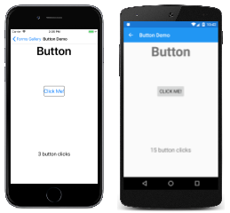
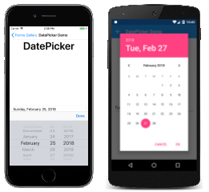
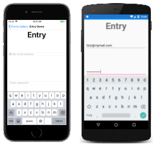
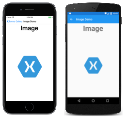
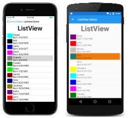
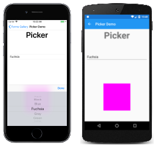
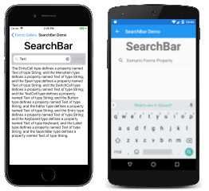
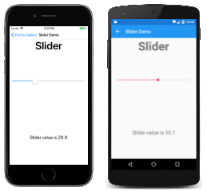
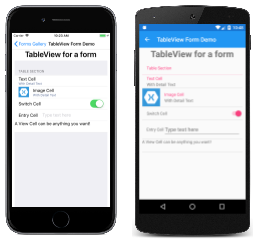
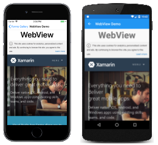

# Xamarin.Forms Views

_Xamarin.Forms views are the building blocks of cross-platform mobile user interfaces._

## Views

Xamarin.Forms uses the word *View* to refer to visual objects such as buttons, labels or text entry boxes - which may be more commonly known as controls of widgets.

These UI elements are typically are subclasses of [`View`](https://developer.xamarin.com/api/type/Xamarin.Forms.View/).

Xamarin.Forms supports:

| Type | Description | Screenshot |
| ---- | ----------- | ---------- |
| [`ActivityIndicator`](https://developer.xamarin.com/api/type/Xamarin.Forms.ActivityIndicator/) | A visual control used to indicate that something is ongoing. This control gives a visual clue to the user that something is happening, without information about its progress. |  |
| [`BoxView`](https://developer.xamarin.com/api/type/Xamarin.Forms.BoxView/) | A [`View`](https://developer.xamarin.com/api/type/Xamarin.Forms.View/) used to draw a solid colored rectangle. BoxView is a useful stand-in for images or custom elements when doing initial prototyping. BoxView has a default size request of 40x40. If you need a different size, assign the [`WidthRequest`](https://developer.xamarin.com/api/property/Xamarin.Forms.VisualElement.WidthRequest/) and [`HeightRequest`](https://developer.xamarin.com/api/property/Xamarin.Forms.VisualElement.HeightRequest/). |  |
| [`Button`](https://developer.xamarin.com/api/type/Xamarin.Forms.Button/) | A button is a [`View`](https://developer.xamarin.com/api/type/Xamarin.Forms.View/) that reacts to touch events. |  |
| [`DatePicker`](https://developer.xamarin.com/api/type/Xamarin.Forms.DatePicker/) | A [`View`](https://developer.xamarin.com/api/type/Xamarin.Forms.View/) that allows date picking. The visual representation of a DatePicker is very similar to the one of [`Entry`](https://developer.xamarin.com/api/type/Xamarin.Forms.Entry/), except that a special control for picking a date appears in place of a keyboard. |  |
| [`Editor`](https://developer.xamarin.com/api/type/Xamarin.Forms.Editor/) | A control that can edit multiple lines of text. For single line entries, see [`Entry`](https://developer.xamarin.com/api/type/Xamarin.Forms.Entry/). |  |
| [`Entry`](https://developer.xamarin.com/api/type/Xamarin.Forms.Entry/) | A control that can edit a single line of text. Entry is a single line text entry. It is best used for collecting small discrete pieces of information, like usernames and passwords. |  |
| [`Image`](https://developer.xamarin.com/api/type/Xamarin.Forms.Image/) |  A [`View`](https://developer.xamarin.com/api/type/Xamarin.Forms.View/) that holds an image. [Image API](https://developer.xamarin.com/api/type/Xamarin.Forms.Image) [Working with Images](~/xamarin-forms/user-interface/images.md) |  |
| [`Label`](https://developer.xamarin.com/api/type/Xamarin.Forms.Label/) | A [`View`](https://developer.xamarin.com/api/type/Xamarin.Forms.View/) A Label is used to display single-line text elements as well as multi-lines blocks of text. |  |
| [`ListView`](https://developer.xamarin.com/api/type/Xamarin.Forms.ListView/) | An [`ItemsView`](https://developer.xamarin.com/api/type/Xamarin.Forms.ItemsView%3CTVisual%3E/) that displays a collection of data as a vertical list. [ListView API](https://developer.xamarin.com/api/type/Xamarin.Forms.ListView/) [ListView documenation](~/xamarin-forms/user-interface/listview/index.md) |  |
| [`Map`](https://developer.xamarin.com/api/type/Xamarin.Forms.Maps.Map/) | A [`View`](https://developer.xamarin.com/api/type/Xamarin.Forms.View/) that displays a map.<ul><li>Requires the *Xamarin.Forms.Maps* Nuget package.<li>Requires an authorization key for Android and the Universal Windows Platform.</li></ul> |  |
| [`OpenGLView`](https://developer.xamarin.com/api/type/Xamarin.Forms.OpenGLView/) | A [`View`](https://developer.xamarin.com/api/type/Xamarin.Forms.View/) that displays OpenGL content.<ul><li>Only works for iOS and Android projects (no Universal Windows Platform support).<li>Requires a reference to the *OpenTK-1.0* assembly in the iOS and Android projects.</li><li>Best suited to use in Shared Projects; if used in a PCL then a DependencyService will also be required.</li></ul> |  |
| [`Picker`](https://developer.xamarin.com/api/type/Xamarin.Forms.Picker/) | A [`View`](https://developer.xamarin.com/api/type/Xamarin.Forms.View/) control for picking an element in a list. The visual representation of a Picker is similar to an [`Entry`](https://developer.xamarin.com/api/type/Xamarin.Forms.Entry/), but a picker control appears in place of a keyboard. |  |
| [`ProgressBar`](https://developer.xamarin.com/api/type/Xamarin.Forms.ProgressBar/) | [`View`](https://developer.xamarin.com/api/type/Xamarin.Forms.View/) control indicating a progress. |  |
| [`SearchBar`](https://developer.xamarin.com/api/type/Xamarin.Forms.SearchBar/) | A [`View`](https://developer.xamarin.com/api/type/Xamarin.Forms.View/) control that provides a search box. |  |
| [`Slider`](https://developer.xamarin.com/api/type/Xamarin.Forms.Slider/) | A [`View`](https://developer.xamarin.com/api/type/Xamarin.Forms.View/) control that inputs a linear value. |  |
| [`Stepper`](https://developer.xamarin.com/api/type/Xamarin.Forms.Stepper/) | A [`View`](https://developer.xamarin.com/api/type/Xamarin.Forms.View/) control that inputs a discrete value, constrained to a range. |  |
| [`Switch`](https://developer.xamarin.com/api/type/Xamarin.Forms.Switch/) | A [`View`](https://developer.xamarin.com/api/type/Xamarin.Forms.View/) control that provides a toggled value. |  |
| [`TableView`](https://developer.xamarin.com/api/type/Xamarin.Forms.TableView/) | A [`View`](https://developer.xamarin.com/api/type/Xamarin.Forms.View/) that holds rows of [`Cell`](https://developer.xamarin.com/api/type/Xamarin.Forms.Cell/) elements. [TableView API](https://developer.xamarin.com/api/type/Xamarin.Forms.TableView/) [TableView documentation](~/xamarin-forms/user-interface/tableview.md) |  |
| [`TimePicker`](https://developer.xamarin.com/api/type/Xamarin.Forms.TimePicker/) | A [`View`](https://developer.xamarin.com/api/type/Xamarin.Forms.View/) control that provides time picking. The visual representation of a TimePicker is very similar to the one of [`Entry`](https://developer.xamarin.com/api/type/Xamarin.Forms.Entry/), except that a special control for picking a time appears in place of a keyboard. |  |
| [`WebView`](https://developer.xamarin.com/api/type/Xamarin.Forms.WebView/) | A [`View`](https://developer.xamarin.com/api/type/Xamarin.Forms.View/) that presents HTML content. [WebView API](https://developer.xamarin.com/api/type/Xamarin.Forms.WebView/) [WebView documentation](~/xamarin-forms/user-interface/webview.md) |  |

## Related Links

- [Introduction To Xamarin.Forms](~/xamarin-forms/get-started/introduction-to-xamarin-forms.md)
- [Xamarin.Forms FormsGallery sample](https://developer.xamarin.com/samples/FormsGallery/)
- [Xamarin.Forms Samples](https://developer.xamarin.com/samples/xamarin-forms/all/)
- [Xamarin.Forms API Documentation](https://developer.xamarin.com/api/root/Xamarin.Forms/)
