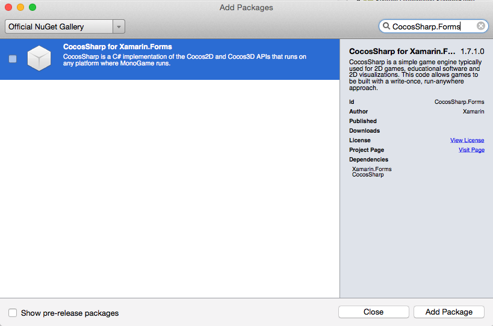
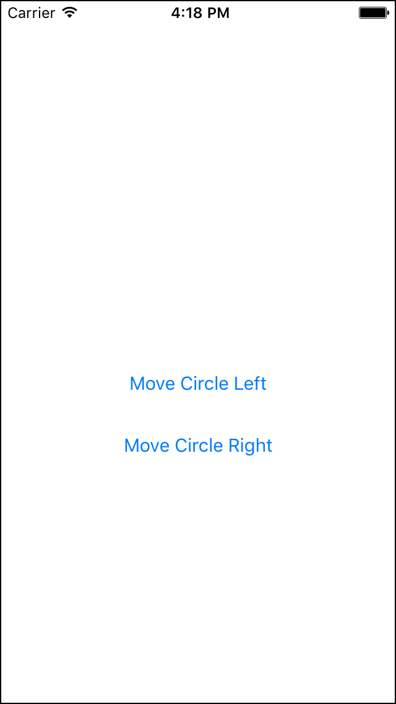
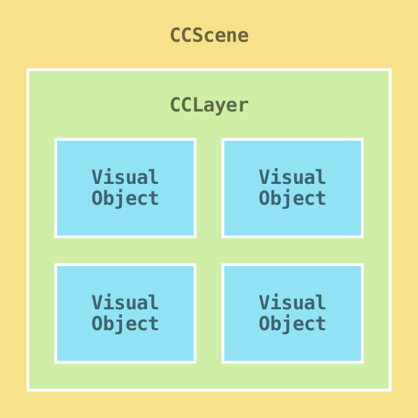
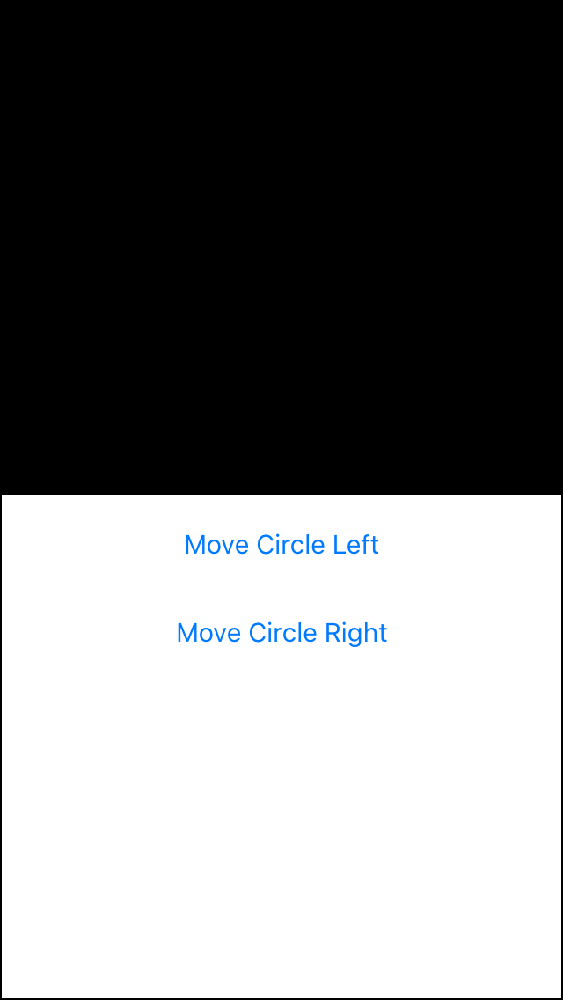
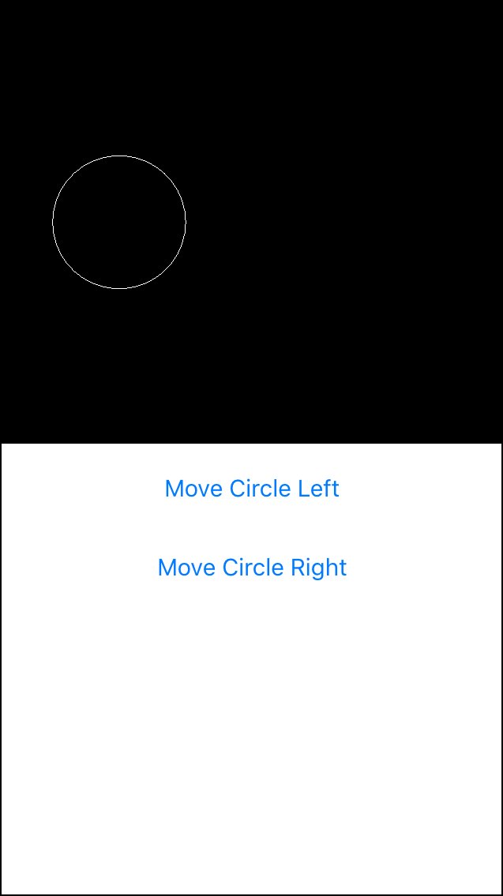
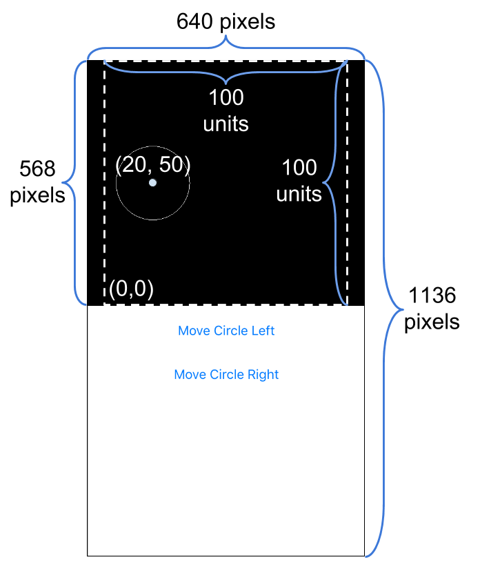
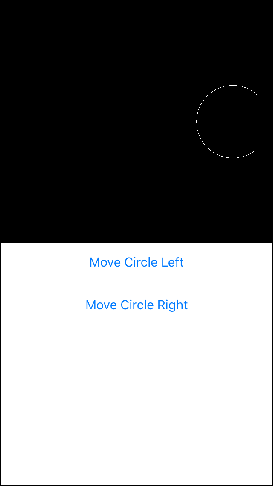

# Using CocosSharp in Xamarin.Forms

_CocosSharp can be used to add precise shape, image, and text rendering to an application for advanced visualization_

> [!VIDEO https://youtube.com/embed/eYCx63FeqVU]

**Evolve 2016: Cocos# in Xamarin.Forms**

## Overview

CocosSharp is a flexible, powerful technology for displaying graphics, reading
touch input, playing audio, and managing content. This guide explains how to add
CocosSharp to a Xamarin.Forms application. It covers the following:

* [What is CocosSharp?](#what)
* [Adding the CocosSharp Nuget packages](#nuget)
* [Walkthrough: Adding CocosSharp to a Xamarin.Forms app](#add)

<a name="what" />

## What is CocosSharp?

[CocosSharp](~/graphics-games/cocossharp/index.md) is an open source game engine
that is available on the Xamarin platform.
CocosSharp is a runtime-efficient library which includes the following features:

* Image rendering using the [CCSprite class](https://developer.xamarin.com/api/type/CocosSharp.CCSprite/)
* Shape rendering using the [CCDrawNode class](https://developer.xamarin.com/api/type/CocosSharp.CCDrawNode/)
* Every-frame logic using the [CCNode.Schedule method](https://developer.xamarin.com/api/member/CocosSharp.CCNode.Schedule/p/System.Action%7BSystem.Single%7D/)
* Content management (loading and unloading of resources such as .png files) using the [CCTextureCache class](https://developer.xamarin.com/api/type/CocosSharp.CCTextureCache/)
* Animations using the [CCAction class](https://developer.xamarin.com/api/type/CocosSharp.CCAction/)

CocosSharp’s primary focus is to simplify the creation of cross-platform 2D games; however, it can also be a great addition to Xamarin Form applications. Since games typically require efficient rendering and precise control over visuals, CocosSharp can be used to add powerful visualization and effects to non-game applications.

Xamarin.Forms is built upon native, platform-specific UI systems. For example, [`Button`s](xref:Xamarin.Forms.Button) appear differently on iOS and Android, and may even differ by operating system version. By contrast, CocosSharp does not use any platform-specific visual objects, so all visual objects appear identical on all platforms. Of course, resolution and aspect ratio differ between devices, and this can impact how CocosSharp renders its visuals. These details will be discussed later in this guide.

More detailed information can be found in the [CocosSharp section](~/graphics-games/cocossharp/index.md).

<a name="nuget" />

## Adding the CocosSharp Nuget packages

Before using CocosSharp, developers need to make a few additions to their Xamarin.Forms project.
This guide assumes a Xamarin.Forms project with an iOS, Android, and .NET Standard library project.
All of the code will be written in the .NET Standard library project; however, libraries must be added to the iOS and Android projects.

The CocosSharp Nuget package contains all of the objects needed to create CocosSharp objects.
The CocosSharp.Forms nuget package includes the `CocosSharpView` class, which is used to host CocosSharp in Xamarin.Forms.
Add the **CocosSharp.Forms** NuGet and **CocosSharp** will be automatically added as well.
To do this, right-click on the <span class="UIItem">Packages</span> folder in the .NET Standard library project
and select <span class="UIItem">Add Packages...</span>. Enter the search term
<span class="UIItem">CocosSharp.Forms</span>, select <span class="UIItem">CocosSharp for Xamarin.Forms</span>,
then click <span class="UIItem">Add Package</span>.



Both **CocosSharp** and **CocosSharp.Forms** NuGet packages will be added to the project:


Repeat the above steps for platform-specific projects (such as iOS and Android).

<a name="add" />

## Walkthrough: Adding CocosSharp to a Xamarin.Forms app

Follow these steps to add a simple CocosSharp view to a Xamarin.Forms app:

1. [Creating a Xamarin Forms Page](#1)
1. [Adding a CocosSharpView](#2)
1. [Creating the GameScene](#3)
1. [Adding a Circle](#4)
1. [Interacting with CocosSharp](#5)

Once you've successfully added a CocosSharp view to a Xamarin.Forms app, visit the
[CocosSharp documentation](~/graphics-games/cocossharp/index.md)
to learn more about creating content with CocosSharp.

<a name="1" />

### 1. Creating a Xamarin Forms Page

CocosSharp can be hosted in any Xamarin.Forms container. This sample for this page
uses a page called `HomePage`. `HomePage` is split in half by a `Grid` to
show how Xamarin.Forms and CocosSharp can be rendered simultaneously on the same page.

First, set up the Page so it contains a `Grid` and two `Button` instances:


```csharp
public class HomePage : ContentPage
{
public HomePage ()
    {
        // This is the top-level grid, which will split our page in half
        var grid = new Grid ();
        this.Content = grid;
        grid.RowDefinitions = new RowDefinitionCollection {
            // Each half will be the same size:
            new RowDefinition{ Height = new GridLength(1, GridUnitType.Star)},
            new RowDefinition{ Height = new GridLength(1, GridUnitType.Star)},
        };
        CreateTopHalf (grid);
        CreateBottomHalf (grid);
    }
    void CreateTopHalf(Grid grid)
    {
        // We'll be adding our CocosSharpView here:
    }
    void CreateBottomHalf(Grid grid)
    {
        // We'll use a StackLayout to organize our buttons
        var stackLayout = new StackLayout();
        // The first button will move the circle to the left when it is clicked:
        var moveLeftButton = new Button {
            Text = "Move Circle Left"
        };
        stackLayout.Children.Add (moveLeftButton);

        // The second button will move the circle to the right when clicked:
        var moveCircleRight = new Button {
            Text = "Move Circle Right"
        };
        stackLayout.Children.Add (moveCircleRight);
        // The stack layout will be in the bottom half (row 1):

        grid.Children.Add (stackLayout, 0, 1);
    }
}
```

On iOS, the `HomePage` appears as shown in the following image:



<a name="2" />

### 2. Adding a CocosSharpView

The `CocosSharpView` class is used to embed CocosSharp into a Xamarin.Forms app. Since `CocosSharpView` inherits from the [Xamarin.Forms.View](xref:Xamarin.Forms.View) class, it provides a familiar interface for layout, and it can be used within layout containers such as [Xamarin.Forms.Grid](xref:Xamarin.Forms.Grid). Add a new `CocosSharpView` to the project by completing the `CreateTopHalf` method:


```csharp
void CreateTopHalf(Grid grid)
{
    // This hosts our game view.
    var gameView = new CocosSharpView () {
        // Notice it has the same properties as other XamarinForms Views
        HorizontalOptions = LayoutOptions.FillAndExpand,
        VerticalOptions = LayoutOptions.FillAndExpand,
        // This gets called after CocosSharp starts up:
        ViewCreated = HandleViewCreated
    };
    // We'll add it to the top half (row 0)
    grid.Children.Add (gameView, 0, 0);
}
```

CocosSharp initialization is not immediate, so register an event for when the `CocosSharpView` has finished its creation. Do this in the `HandleViewCreated` method:


```csharp
void HandleViewCreated (object sender, EventArgs e)
{
    var gameView = sender as CCGameView;
    if (gameView != null)
    {
        // This sets the game "world" resolution to 100x100:
        gameView.DesignResolution = new CCSizeI (100, 100);
        // GameScene is the root of the CocosSharp rendering hierarchy:
        gameScene = new GameScene (gameView);
        // Starts CocosSharp:
        gameView.RunWithScene (gameScene);
    }
}
```

The `HandleViewCreated` method has two important details that we’ll be looking at. The first is the `GameScene` class, which will be created in the next section. It’s important to note that the app will not compile until the `GameScene` is created and the `gameScene` instance reference is resolved.

The second important detail is the `DesignResolution` property, which defines the game’s visible area for CocosSharp objects. The `DesignResolution` property will be looked at after creating `GameScene`.

<a name="3" />

### 3. Creating the GameScene

The `GameScene` class inherits from CocosSharp’s `CCScene`. `GameScene` is the first point where we deal purely with CocosSharp. Code contained in `GameScene` will function in any CocosSharp app, whether it is housed within a Xamarin.Forms project or not.

The `CCScene` class is the visual root of all CocosSharp rendering. Any visible CocosSharp object must be contained within a `CCScene`. More specifically, visual objects must be added to `CCLayer` instances, and those `CCLayer` instances must be added to a `CCScene`.

The following graph can help visualize a typical CocosSharp hierarchy:



Only one `CCScene` can be active at one time. Most games use multiple `CCLayer` instances to sort content, but our application uses only one. Similarly, most games use multiple visual objects, but we’ll only have one in our app. A more detailed discussion about the CocosSharp visual hierarchy can be found in the [BouncingGame walkthrough](~/graphics-games/cocossharp/bouncing-game.md).

Initially the `GameScene` class will be nearly empty – we’ll just create it to satisfy the reference in `HomePage`. Add a new class to your .NET Standard library project named `GameScene`. It should inherit from the `CCScene` class as follows:


```csharp
public class GameScene : CCScene
{
    public GameScene (CCGameView gameView) : base(gameView)
    {

    }
}
```

Now that `GameScene` is defined, we can return to `HomePage` and add a field:


```csharp
// Keep the GameScene at class scope
// so the button click events can access it:
GameScene gameScene;
```

We can now compile our project and run it to see CocosSharp running. We haven’t added anything to our `GameScene,` so the top half of our page is black – the default color of a CocosSharp scene:



<a name="4" />

### 4. Adding a Circle

The app currently has a running instance of the CocosSharp engine, displaying an empty `CCScene`. Next, we’ll add a visual object: a circle. The `CCDrawNode` class can be used to draw a variety of geometric shapes, as outlined in the [Drawing Geometry with CCDrawNode guide](~/graphics-games/cocossharp/ccdrawnode.md).

Add a circle to our `GameScene` class and instantiate it in the constructor as shown in the following code:


```csharp
public class GameScene : CCScene
{
    CCDrawNode circle;
    public GameScene (CCGameView gameView) : base(gameView)
    {
        var layer = new CCLayer ();
        this.AddLayer (layer);
        circle = new CCDrawNode ();
        layer.AddChild (circle);
        circle.DrawCircle (
            // The center to use when drawing the circle,
            // relative to the CCDrawNode:
            new CCPoint (0, 0),
            radius:15,
            color:CCColor4B.White);
        circle.PositionX = 20;
        circle.PositionY = 50;
    }
}
```

Running the app now shows a circle on the left side of the CocosSharp display area:




#### Understanding DesignResolution

Now that a visual CocosSharp object is displayed, we can investigate the `DesignResolution` property.

The `DesignResolution` represents the width and height of the CocosSharp area for placing and sizing objects. The actual resolution of the area is measured in *pixels* while the `DesignResolution` is measured in world *units*. The following diagram shows the resolution of various parts of the view as displayed on an iPhone 5 with a screen resolution of 640x1136 pixels:



The diagram above displays pixel dimensions on the outside of the screen in black text. Units are displayed on the inside of the diagram in white text. Here are some important details displayed above:

* The origin of the CocosSharp display is at the bottom left. Moving to the right increases the X value, and moving up increases the Y value. Notice that the Y value is inverted compared to some other 2D layout engines, where (0,0) is the top-left of the canvas.
* The default behavior of CocosSharp is to maintain the aspect ratio of its view. Since the first row in the grid is wider than it is tall, CocosSharp does not fill the entire width of its cell, as shown by the dotted white rectangle. This behavior can be changed, as described in the [Handling Multiple Resolutions in CocosSharp guide](~/graphics-games/cocossharp/resolutions.md).
* In this example, CocosSharp will maintain a display area of 100 units wide and tall regardless of the size or aspect ratio of its device. This means that code can assume that X=100 represents the far-right bound of the CocosSharp display, keeping layout consistent on all devices.


#### CCDrawNode Details

Our simple app uses the `CCDrawNode` class to draw a circle. This class can be very useful for business apps since it provides vector-based geometry rendering – a feature missing from Xamarin.Forms. In addition to circles, the `CCDrawNode` class can be used to draw rectangles, splines, lines, and custom polygons. `CCDrawNode` is also easy to use since it does not require the use of image files (such as .png). A more detailed discussion of CCDrawNode can be found in the [Drawing Geometry with CCDrawNode guide](~/graphics-games/cocossharp/ccdrawnode.md).

<a name="5" />

### 5. Interacting with CocosSharp

CocosSharp visual elements (such as `CCDrawNode`) inherit from the `CCNode` class. `CCNode` provides two properties which can be used to position an object relative to its parent: `PositionX` and `PositionY`. Our code currently uses these two properties to position the center of the circle, as shown in this code snippet:


```csharp
circle.PositionX = 20;
circle.PositionY = 50;
```

It’s important to note that CocosSharp objects are positioned by explicit position values, as opposed to most Xamarin.Forms views, which are automatically positioned according to the behavior of their parent layout controls.

We’ll add code to allow the user to click one of the two buttons to move the circle to the left or to the right by 10 units (not pixels, since the circle draws in the CocosSharp world unit space). First we’ll create two public methods in the `GameScene` class:


```csharp
public void MoveCircleLeft()
{
    circle.PositionX -= 10;
}

public void MoveCircleRight()
{
    circle.PositionX += 10;
}
```

Next, we’ll add handlers to the two buttons in `HomePage` to respond to clicks. When finished, our `CreateBottomHalf` method contains the following code:


```csharp
void CreateBottomHalf(Grid grid)
{
    // We'll use a StackLayout to organize our buttons
    var stackLayout = new StackLayout();

    // The first button will move the circle to the left when it is clicked:
    var moveLeftButton = new Button {
        Text = "Move Circle Left"
    };
    moveLeftButton.Clicked += (sender, e) => gameScene.MoveCircleLeft ();
    stackLayout.Children.Add (moveLeftButton);

    // The second button will move the circle to the right when clicked:
    var moveCircleRight = new Button {
        Text = "Move Circle Right"
    };
    moveCircleRight.Clicked += (sender, e) => gameScene.MoveCircleRight ();
    stackLayout.Children.Add (moveCircleRight);

    // The stack layout will be in the bottom half (row 1):
    grid.Children.Add (stackLayout, 0, 1);
}
```

The CocosSharp circle now moves in response to clicks. We can also clearly see the boundaries of the CocosSharp canvas by moving the circle far enough to the left or right:



## Summary

This guide shows how to add CocosSharp to an existing Xamarin.Forms project, how to create interaction between Xamarin.Forms and CocosSharp, and discusses various considerations when creating layouts in CocosSharp.

The CocosSharp game engine offers a lot of functionality and depth, so this guide only scratches the surface of what CocosSharp can do. Developers interested in reading more about CocosSharp can find many articles in the [CocosSharp section](~/graphics-games/cocossharp/index.md).


## Related Links

- [CocosSharp APIs](https://developer.xamarin.com/api/root/CocosSharp/)
- [CocosSharpForms (sample)](https://developer.xamarin.com/samples/xamarin-forms/CocosSharpForms/)
