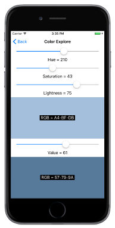
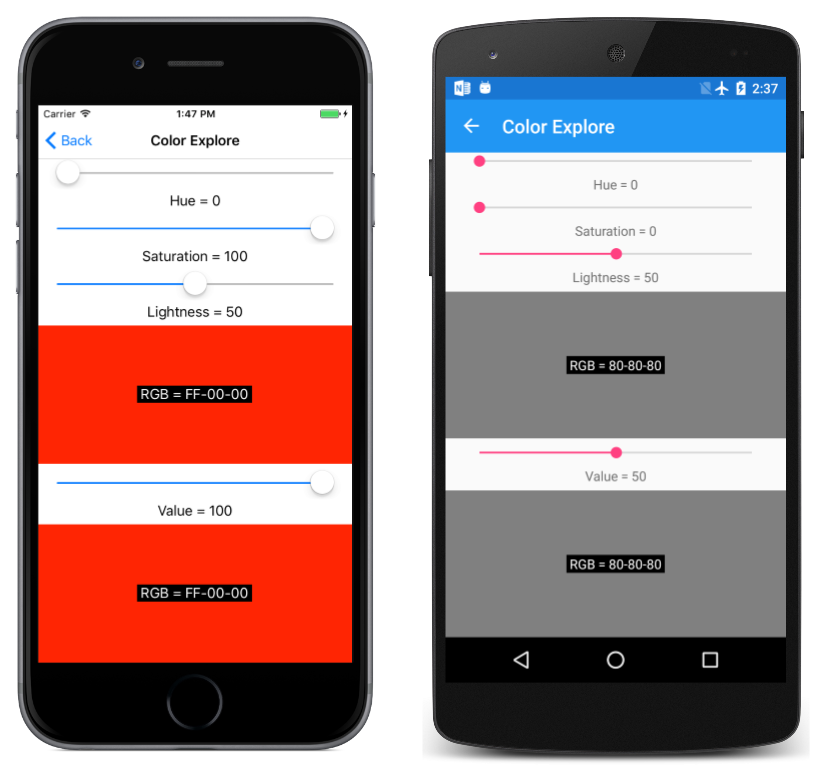

# Integrating with Xamarin.Forms

_Create SkiaSharp graphics that respond to touch and Xamarin.Forms elements_

SkiaSharp graphics can integrate with the rest of Xamarin.Forms in several ways. You can combine a SkiaSharp canvas and Xamarin.Forms elements on the same page, and even position Xamarin.Forms elements on top of a SkiaSharp canvas:



Another approach to creating interactive SkiaSharp graphics in Xamarin.Forms is through touch.
The second page in the [**SkiaSharpFormsDemos**](https://developer.xamarin.com/samples/xamarin-forms/SkiaSharpForms/SkiaSharpFormsDemos/) program is entitled **Tap Toggle Fill**. It draws a simple circle two ways &#x2014; without a fill and with a fill &#x2014; toggled by a tap. The [`TapToggleFillPage`](https://github.com/xamarin/xamarin-forms-samples/blob/master/SkiaSharpForms/SkiaSharpFormsDemos/SkiaSharpFormsDemos/SkiaSharpFormsDemos/Basics/TapToggleFillPage.xaml.cs) class shows how you can alter SkiaSharp graphics in response to user input.

For this page, the `SKCanvasView` class is instantiated in the [TapToggleFill.xaml](https://github.com/xamarin/xamarin-forms-samples/blob/master/SkiaSharpForms/SkiaSharpFormsDemos/SkiaSharpFormsDemos/SkiaSharpFormsDemos/Basics/TapToggleFillPage.xaml) file, which also sets a Xamarin.Forms [`TapGestureRecognizer`](https://developer.xamarin.com/api/type/Xamarin.Forms.TapGestureRecognizer/) on the view:

```xaml
<ContentPage xmlns="http://xamarin.com/schemas/2014/forms"
             xmlns:x="http://schemas.microsoft.com/winfx/2009/xaml"
             xmlns:skia="clr-namespace:SkiaSharp.Views.Forms;assembly=SkiaSharp.Views.Forms"
             x:Class="SkiaSharpFormsDemos.TapToggleFillPage"
             Title="Tap Toggle Fill">

    <skia:SKCanvasView PaintSurface="OnCanvasViewPaintSurface">
        <skia:SKCanvasView.GestureRecognizers>
            <TapGestureRecognizer Tapped="OnCanvasViewTapped" />
        </skia:SKCanvasView.GestureRecognizers>
    </skia:SKCanvasView>
</ContentPage>
```

Notice the `skia` XML namespace declaration.

The `Tapped` handler for the `TapGestureRecognizer` object simply toggles the value of a Boolean field and calls the [`InvalidateSurface`](https://developer.xamarin.com/api/member/SkiaSharp.Views.Forms.SKCanvasView.InvalidateSurface()/) method of `SKCanvasView`:

```csharp
bool showFill = true;
...
void OnCanvasViewTapped(object sender, EventArgs args)
{
    showFill ^= true;
    (sender as SKCanvasView).InvalidateSurface();
}
```

The call to `InvalidateSurface` effectively generates a call to the `PaintSurface` handler, which uses the `showFill` field to fill or not fill the circle:

```csharp
void OnCanvasViewPaintSurface(object sender, SKPaintSurfaceEventArgs args)
{
    SKImageInfo info = args.Info;
    SKSurface surface = args.Surface;
    SKCanvas canvas = surface.Canvas;

    canvas.Clear();

    SKPaint paint = new SKPaint
    {
        Style = SKPaintStyle.Stroke,
        Color = Color.Red.ToSKColor(),
        StrokeWidth = 50
    };
    canvas.DrawCircle(info.Width / 2, info.Height / 2, 100, paint);

    if (showFill)
    {
        paint.Style = SKPaintStyle.Fill;
        paint.Color = SKColors.Blue;
        canvas.DrawCircle(info.Width / 2, info.Height / 2, 100, paint);
    }
}
```

The `StrokeWidth` property has been set to 50 to accentuate the difference. You can also see the whole line width by drawing the interior first and then the outline. By default, graphics figures drawn later in the `PaintSurface` event handler obscure those drawn earlier in the handler.

The **Color Explore** page demonstrates how you can also integrate SkiaSharp graphics with other Xamarin.Forms elements, and also demonstrates the difference between two alternative methods for defining colors in SkiaSharp. The static [`SKColor.FromHsl`](https://developer.xamarin.com/api/member/SkiaSharp.SKColor.FromHsl/p/System.Single/System.Single/System.Single/System.Byte/) method creates an `SKColor` value based on the Hue-Saturation-Lightness model:

```csharp
public static SKColor FromHsl (Single h, Single s, Single l, Byte a)
```

The static [`SKColor.FromHsv`](https://developer.xamarin.com/api/member/SkiaSharp.SKColor.FromHsv/p/System.Single/System.Single/System.Single/System.Byte/) method creates an `SKColor` value based on the similar Hue-Saturation-Value model:

```csharp
public static SKColor FromHsv (Single h, Single s, Single v, Byte a)
```

In both cases, the `h` argument ranges from 0 to 360. The `s`, `l`, and `v` arguments range from 0 to 100. The `a` (alpha or opacity) argument ranges from 0 to 255.

The [**ColorExplorePage.xaml**](https://github.com/xamarin/xamarin-forms-samples/blob/master/SkiaSharpForms/SkiaSharpFormsDemos/SkiaSharpFormsDemos/SkiaSharpFormsDemos/Basics/ColorExplorePage.xaml) file creates two `SKCanvasView` objects in a `StackLayout` side-by-side with `Slider` and `Label` views that allow the user to select HSL and HSV color values:

```xaml
<ContentPage xmlns="http://xamarin.com/schemas/2014/forms"
             xmlns:x="http://schemas.microsoft.com/winfx/2009/xaml"
             xmlns:skia="clr-namespace:SkiaSharp.Views.Forms;assembly=SkiaSharp.Views.Forms"
             x:Class="SkiaSharpFormsDemos.Basics.ColorExplorePage"
             Title="Color Explore">
    <StackLayout>
        <!-- Hue slider -->
        <Slider x:Name="hueSlider"
                Maximum="360"
                Margin="20, 0"
                ValueChanged="OnSliderValueChanged" />

        <Label HorizontalTextAlignment="Center"
               Text="{Binding Source={x:Reference hueSlider},
                              Path=Value,
                              StringFormat='Hue = {0:F0}'}" />

        <!-- Saturation slider -->
        <Slider x:Name="saturationSlider"
                Maximum="100"
                Margin="20, 0"
                ValueChanged="OnSliderValueChanged" />

        <Label HorizontalTextAlignment="Center"
               Text="{Binding Source={x:Reference saturationSlider},
                              Path=Value,
                              StringFormat='Saturation = {0:F0}'}" />

        <!-- Lightness slider -->
        <Slider x:Name="lightnessSlider"
                Maximum="100"
                Margin="20, 0"
                ValueChanged="OnSliderValueChanged" />

        <Label HorizontalTextAlignment="Center"
               Text="{Binding Source={x:Reference lightnessSlider},
                              Path=Value,
                              StringFormat='Lightness = {0:F0}'}" />

        <!-- HSL canvas view -->
        <Grid VerticalOptions="FillAndExpand">
            <skia:SKCanvasView x:Name="hslCanvasView"
                               PaintSurface="OnHslCanvasViewPaintSurface" />

            <Label x:Name="hslLabel"
                   HorizontalOptions="Center"
                   VerticalOptions="Center"
                   BackgroundColor="Black"
                   TextColor="White" />
        </Grid>

        <!-- Value slider -->
        <Slider x:Name="valueSlider"
                Maximum="100"
                Margin="20, 0"
                ValueChanged="OnSliderValueChanged" />

        <Label HorizontalTextAlignment="Center"
               Text="{Binding Source={x:Reference valueSlider},
                              Path=Value,
                              StringFormat='Value = {0:F0}'}" />

        <!-- HSV canvas view -->
        <Grid VerticalOptions="FillAndExpand">
            <skia:SKCanvasView x:Name="hsvCanvasView"
                               PaintSurface="OnHsvCanvasViewPaintSurface" />

            <Label x:Name="hsvLabel"
                   HorizontalOptions="Center"
                   VerticalOptions="Center"
                   BackgroundColor="Black"
                   TextColor="White" />
        </Grid>
    </StackLayout>
</ContentPage>
```

The two `SKCanvasView` elements are in a single-cell `Grid` with a `Label` sitting on top for displaying the resultant RGB color value.

The [**ColorExplorePage.xaml.cs**](https://github.com/xamarin/xamarin-forms-samples/blob/master/SkiaSharpForms/SkiaSharpFormsDemos/SkiaSharpFormsDemos/SkiaSharpFormsDemos/Basics/ColorExplorePage.xaml.cs) code-behind file is relatively simple. The shared `ValueChanged` handler for the three `Slider` elements simply invalidates both `SKCanvasView` elements. The `PaintSurface` handlers clear the canvas with the color indicated by the `Slider` elements, and also set the `Label` sitting on top of the `SKCanvasView` elements:

```csharp
public partial class ColorExplorePage : ContentPage
{
    public ColorExplorePage()
    {
        InitializeComponent();

        hueSlider.Value = 0;
        saturationSlider.Value = 100;
        lightnessSlider.Value = 50;
        valueSlider.Value = 100;
    }

    void OnSliderValueChanged(object sender, ValueChangedEventArgs args)
    {
        hslCanvasView.InvalidateSurface();
        hsvCanvasView.InvalidateSurface();
    }

    void OnHslCanvasViewPaintSurface(object sender, SKPaintSurfaceEventArgs args)
    {
        SKColor color = SKColor.FromHsl((float)hueSlider.Value,
                                        (float)saturationSlider.Value,
                                        (float)lightnessSlider.Value);
        args.Surface.Canvas.Clear(color);

        hslLabel.Text = String.Format(" RGB = {0:X2}-{1:X2}-{2:X2} ",
                                      color.Red, color.Green, color.Blue);
    }

    void OnHsvCanvasViewPaintSurface(object sender, SKPaintSurfaceEventArgs args)
    {
        SKColor color = SKColor.FromHsv((float)hueSlider.Value,
                                        (float)saturationSlider.Value,
                                        (float)valueSlider.Value);
        args.Surface.Canvas.Clear(color);

        hsvLabel.Text = String.Format(" RGB = {0:X2}-{1:X2}-{2:X2} ",
                                      color.Red, color.Green, color.Blue);
    }
}
```

In both the HSL and HSV color models, the Hue value ranges from 0 to 360 and indicates the dominant hue of the color. These are the traditional colors of the rainbow: red, orange, yellow, green, blue, indigo, violet, and back in a circle to red.

In the HSL model, a 0 value for Lightness is always black, and a 100 value is always white. When the Saturation value is 0, Lightness values between 0 and 100 are shades of gray. Increasing the Saturation adds more color. Pure colors (which are RGB values with one component equal to 255, another equal to 0, and the third ranging from 0 to 255) occur when the Saturation is 100 and the Lightness is 50.

In the HSV model, pure colors result when both the Saturation and Value are 100. When Value is 0, regardless of any other settings, the color is black. Gray shades occur when the Saturation is 0 and Value ranges from 0 to 100.

But the best way to get a feel for the two models is to experiment with them yourself:

[](integration-images/colorexplore-small.png#lightbox "Triple screenshot of the Color Explore page")


## Related Links

- [SkiaSharp APIs](https://developer.xamarin.com/api/root/SkiaSharp/)
- [SkiaSharpFormsDemos (sample)](https://developer.xamarin.com/samples/xamarin-forms/SkiaSharpForms/SkiaSharpFormsDemos/)
