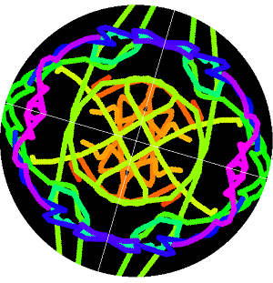
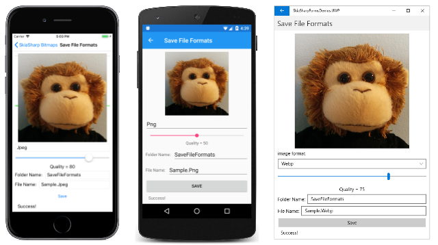
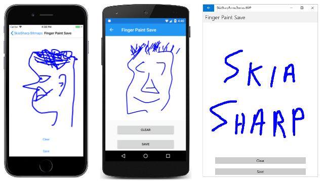
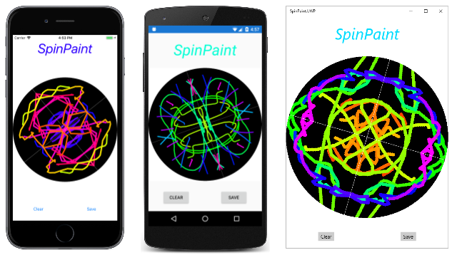

# Saving SkiaSharp bitmaps to files

After a SkiaSharp application has created or modified a bitmap, the application might want to save the bitmap to the user's photo library:



This task encompasses two steps:

- Converting the SkiaSharp bitmap to data in a particular file format, such as JPEG or PNG.
- Saving the result to the photo library using platform-specific code.

## File formats and codecs

Most of today's popular bitmap file formats use compression to reduce storage space. The two broad categories of compression techniques are called _lossy_ and _lossless_. These terms indicate whether or not the compression algorithm results in the loss of data.

The most popular lossy format was developed by the Joint Photographic Experts Group and is called JPEG. The JPEG compression algorithm analyzes the image using a mathematical tool called the _discrete cosine transform_, and attempts to remove data that is not crucial to preserving the image's visual fidelity. The degree of compression can be controlled with a setting generally referred to as _quality_. Higher quality settings result in larger files.

In contrast, a lossless compression algorithm analyzes the image for repetition and patterns of pixels that can be encoded in a way that reduces the data but does not result in the loss of any information. The original bitmap data can be restored entirely from the compressed file. The primary lossless compressed file format in use today is Portable Network Graphics (PNG).

Generally, JPEG is used for photographs, while PNG is used for images that have been manually or algorithmically generated. Any lossless compression algorithm that reduces the size of some files must necessarily increase the size of others. Fortunately, this increase in size generally only occurs for data that contains a lot of random (or seemingly random) information.

The compression algorithms are complex enough to warrant two terms that describe the compression and decompression processes:

- _decode_ &mdash; read a bitmap file format and decompress it
- _encode_ &mdash; compress the bitmap and write to a bitmap file format

The [`SKBitmap`](https://developer.xamarin.com/api/type/SkiaSharp.SKBitmap/) class contains several methods named `Decode` that create an `SKBitmap` from a compressed source. All that's required is to supply a filename, stream, or array of bytes. The decoder can determine the file format and hand it off to the proper internal decoding function.

In addition, the [`SKCodec`](https://developer.xamarin.com/api/type/SkiaSharp.SKCodec/) class has two methods named `Create` that can create an `SKCodec` object from a compressed source and allow an application to get more involved in the decoding process. (The `SKCodec` class is shown in the article [**Animating SkiaSharp Bitmaps**](animating.md#gif-animation) in connection with decoding an animated GIF file.)

When encoding a bitmap, more information is required: The encoder must know the particular file format the application wants to use (JPEG or PNG or something else). If a lossy format is desired, the encode must also know the desired level of quality. 

The `SKBitmap` class defines one [`Encode`](https://developer.xamarin.com/api/member/SkiaSharp.SKBitmap.Encode/p/SkiaSharp.SKWStream/SkiaSharp.SKEncodedImageFormat/System.Int32/) method with the following syntax:

```csharp
public Boolean Encode (SKWStream dst, SKEncodedImageFormat format, Int32 quality)
```

This method is described in more detail shortly. The encoded bitmap is written to a writable stream. (The 'W' in `SKWStream` stands for "writable".) The second and third arguments specify the file format and (for lossy formats) the desired quality ranging from 0 to 100.

In addition, the [`SKImage`](https://developer.xamarin.com/api/type/SkiaSharp.SKImage/) and [`SKPixmap`](https://developer.xamarin.com/api/type/SkiaSharp.SKPixmap/) classes also define `Encode` methods that are somewhat more versatile, and which you might prefer. You can easily create an `SKImage` object from an `SKBitmap` object using the static [`SKImage.FromBitmap`](https://developer.xamarin.com/api/member/SkiaSharp.SKImage.FromBitmap/p/SkiaSharp.SKBitmap/) method. You can obtain an `SKPixmap` object from an `SKBitmp` object using the [`PeekPixels`](https://developer.xamarin.com/api/member/SkiaSharp.SKBitmap.PeekPixels()/) method.

One of the [`Encode`](https://developer.xamarin.com/api/member/SkiaSharp.SKImage.Encode()/) methods defined by `SKImage` has no parameters and automatically saves to a PNG format. That parameterless method is very easy to use.

## Platform-specific code for saving bitmap files

When you encode an `SKBitmap` object into a particular file format, generally you'll be be left with a stream object of some sort, or an array of data. Some of the `Encode` methods (including the one with no parameters defined by `SKImage`) return an [`SKData`](https://developer.xamarin.com/api/type/SkiaSharp.SKData/) object, which can be converted to an array of bytes using the [`ToArray`](https://developer.xamarin.com/api/member/SkiaSharp.SKData.ToArray()/) method. This data must then be saved to a file. 

Saving to a file in application local storage is quite easy because you can use standard `System.IO` classes and methods for this task. This technique is demonstrated in the article [**Animating SkiaSharp Bitmaps**](animating.md#bitmap-animation) in connection with animating a series of bitmaps of the Mandelbrot set.

If you want the file to be shared by other applications, it must be saved to the user's photo library. This task requires platform-specific code and the use of the Xamarin.Forms [`DependencyService`](xref:Xamarin.Forms.DependencyService).

The **SkiaSharpFormsDemo** project in the [**SkiaSharpFormsDemos**](https://developer.xamarin.com/samples/xamarin-forms/SkiaSharpForms/Demos/) application defines an `IPhotoLibrary` interface used with the `DependencyService` class. This defines the syntax of a `SavePhotoAsync` method:

```csharp
public interface IPhotoLibrary
{
    Task<Stream> PickPhotoAsync();

    Task<bool> SavePhotoAsync(byte[] data, string folder, string filename);
}
```

This interface also defines the `PickPhotoAsync` method, which is used to open the platform-specific file-picker for the device's photo library.

For `SavePhotoAsync`, the first argument is an array of bytes that contains the bitmap already encoded into a particular file format, such as JPEG or PNG. It's possible that an application might want to isolate all the bitmaps it creates into a particular folder, which is specified in the next parameter, followed by the file name. The method returns a Boolean indicating success or not.

Here's how `SavePhotoAsync` is implemented on the three platforms:

### The iOS implementation

The iOS implementation of `SavePhotoAsync` uses the [`SaveToPhotosAlbum`](https://developer.xamarin.com/api/member/UIKit.UIImage.SaveToPhotosAlbum/) method of `UIImage`:

```csharp
public class PhotoLibrary : IPhotoLibrary
{
    ···
    public Task<bool> SavePhotoAsync(byte[] data, string folder, string filename)
    {
        NSData nsData = NSData.FromArray(data);
        UIImage image = new UIImage(nsData);
        TaskCompletionSource<bool> taskCompletionSource = new TaskCompletionSource<bool>();

        image.SaveToPhotosAlbum((UIImage img, NSError error) =>
        {
            taskCompletionSource.SetResult(error == null);
        });

        return taskCompletionSource.Task;
    }
}
```

Unfortunately, there is no way to specify a file name or folder for the image. 

The **Info.plist** file in the iOS project requires a key indicating that it adds images to the photo library:

```xml
<key>NSPhotoLibraryAddUsageDescription</key>
<string>SkiaSharp Forms Demos adds images to your photo library</string>
```

Watch out! The permission key for simply accessing the photo library is very similar but not the same:

```xml
<key>NSPhotoLibraryUsageDescription</key>
<string>SkiaSharp Forms Demos accesses your photo library</string>
```

### The Android implementation

The Android implementation of `SavePhotoAsync` first checks if the `folder` argument is `null` or an empty string. If so, then the bitmap is saved in the root directory of the photo library. Otherwise, the folder is obtained, and if it doesn't exist, it is created:

```csharp
public class PhotoLibrary : IPhotoLibrary
{
    ···
    public async Task<bool> SavePhotoAsync(byte[] data, string folder, string filename)
    {
        try
        {
            File picturesDirectory = Environment.GetExternalStoragePublicDirectory(Environment.DirectoryPictures);
            File folderDirectory = picturesDirectory;

            if (!string.IsNullOrEmpty(folder))
            {
                folderDirectory = new File(picturesDirectory, folder);
                folderDirectory.Mkdirs();
            }

            using (File bitmapFile = new File(folderDirectory, filename))
            {
                bitmapFile.CreateNewFile();

                using (FileOutputStream outputStream = new FileOutputStream(bitmapFile))
                {
                    await outputStream.WriteAsync(data);
                }

                // Make sure it shows up in the Photos gallery promptly.
                MediaScannerConnection.ScanFile(MainActivity.Instance,
                                                new string[] { bitmapFile.Path },
                                                new string[] { "image/png", "image/jpeg" }, null);
            }
        }
        catch
        {
            return false;
        }

        return true;
    }
}
```

The call to `MediaScannerConnection.ScanFile` isn't strictly required, but if you're testing your program by immediately checking the photo library, it helps a lot by updating the library gallery view.

The **AndroidManifest.xml** file requires the following permission tag:

```xml
<uses-permission android:name="android.permission.WRITE_EXTERNAL_STORAGE" />
```

### The UWP implementation

The UWP implementation of `SavePhotoAsync` is very similar in structure to the Android implementation:

```csharp
public class PhotoLibrary : IPhotoLibrary
{
    ···
    public async Task<bool> SavePhotoAsync(byte[] data, string folder, string filename)
    {
        StorageFolder picturesDirectory = KnownFolders.PicturesLibrary;
        StorageFolder folderDirectory = picturesDirectory;

        // Get the folder or create it if necessary
        if (!string.IsNullOrEmpty(folder))
        {
            try
            {
                folderDirectory = await picturesDirectory.GetFolderAsync(folder);
            }
            catch
            { }

            if (folderDirectory == null)
            {
                try
                {
                    folderDirectory = await picturesDirectory.CreateFolderAsync(folder);
                }
                catch
                {
                    return false;
                }
            }
        }

        try
        {
            // Create the file.
            StorageFile storageFile = await folderDirectory.CreateFileAsync(filename,
                                                CreationCollisionOption.GenerateUniqueName);

            // Convert byte[] to Windows buffer and write it out.
            IBuffer buffer = WindowsRuntimeBuffer.Create(data, 0, data.Length, data.Length);
            await FileIO.WriteBufferAsync(storageFile, buffer);
        }
        catch
        {
            return false;
        }

        return true;
    }
}
```

The **Capabilities** section of the **Package.appxmanifest** file requires **Pictures Library**.

## Exploring the image formats

Here's the [`Encode`](https://developer.xamarin.com/api/member/SkiaSharp.SKBitmap.Encode/p/SkiaSharp.SKWStream/SkiaSharp.SKEncodedImageFormat/System.Int32/) method of `SKImage` again:

```csharp
public Boolean Encode (SKWStream dst, SKEncodedImageFormat format, Int32 quality)
```

[`SKEncodedImageFormat`](https://developer.xamarin.com/api/type/SkiaSharp.SKEncodedImageFormat/) is an enumeration with members that refer to eleven bitmap file formats, some of which are rather obscure:

- `Astc` &mdash; Adaptive Scalable Texture Compression
- `Bmp` &mdash; Windows Bitmap
- `Dng` &mdash; Adobe Digital Negative
- `Gif` &mdash; Graphics Interchange Format
- `Ico` &mdash; Windows icon images
- `Jpeg` &mdash; Joint Photographic Experts Group
- `Ktx` &mdash; Khronos texture format for OpenGL
- `Pkm` &mdash; Pokémon save file
- `Png` &mdash; Portable Network Graphics
- `Wbmp` &mdash; Wireless Application Protocol Bitmap Format (1 bit per pixel)
- `Webp` &mdash; Google WebP format

As you'll see shortly, only three of these file formats (`Jpeg`, `Png`, and `Webp`) are actually supported by SkiaSharp.

To save an `SKBitmap` object named `bitmap` to the user's photo library, you also need a member of the `SKEncodedImageFormat` enumeration named `imageFormat` and (for lossy formats) an integer `quality` variable. You can use the following code to save that bitmap to a file with the name `filename` in the `folder` folder:

```csharp
using (MemoryStream memStream = new MemoryStream())
using (SKManagedWStream wstream = new SKManagedWStream(memStream))
{
    bitmap.Encode(wstream, imageFormat, quality);
    byte[] data = memStream.ToArray();

    // Check the data array for content!

    bool success = await DependencyService.Get<IPhotoLibrary>().SavePhotoAsync(data, folder, filename);

    // Check return value for success!
}
```

The `SKManagedWStream` class derives from `SKWStream` (which stands for "writable stream"). The `Encode` method writes the encoded bitmap file into that stream. The comments in that code refer to some error checking you might need to perform. 

The **Save File Formats** page in the [**SkiaSharpFormsDemos**](https://developer.xamarin.com/samples/xamarin-forms/SkiaSharpForms/Demos/) application uses similar code to allow you to experiment with saving a bitmap in the various formats.

The XAML file contains an `SKCanvasView` that displays a bitmap, while the rest of the page contains everything the application needs to call the `Encode` method of `SKBitmap`. It has a `Picker` for a member of the `SKEncodedImageFormat` enumeration, a `Slider` for the quality argument for lossy bitmap formats, two `Entry` views for a filename and folder name, and a `Button` for saving the file.

```xaml
<ContentPage xmlns="http://xamarin.com/schemas/2014/forms"
             xmlns:x="http://schemas.microsoft.com/winfx/2009/xaml"
             xmlns:skia="clr-namespace:SkiaSharp;assembly=SkiaSharp"
             xmlns:skiaforms="clr-namespace:SkiaSharp.Views.Forms;assembly=SkiaSharp.Views.Forms"
             x:Class="SkiaSharpFormsDemos.Bitmaps.SaveFileFormatsPage"
             Title="Save Bitmap Formats">

    <StackLayout Margin="10">
        <skiaforms:SKCanvasView PaintSurface="OnCanvasViewPaintSurface"
                                VerticalOptions="FillAndExpand" />

        <Picker x:Name="formatPicker"
                Title="image format"
                SelectedIndexChanged="OnFormatPickerChanged">
            <Picker.ItemsSource>
                <x:Array Type="{x:Type skia:SKEncodedImageFormat}">
                    <x:Static Member="skia:SKEncodedImageFormat.Astc" />
                    <x:Static Member="skia:SKEncodedImageFormat.Bmp" />
                    <x:Static Member="skia:SKEncodedImageFormat.Dng" />
                    <x:Static Member="skia:SKEncodedImageFormat.Gif" />
                    <x:Static Member="skia:SKEncodedImageFormat.Ico" />
                    <x:Static Member="skia:SKEncodedImageFormat.Jpeg" />
                    <x:Static Member="skia:SKEncodedImageFormat.Ktx" />
                    <x:Static Member="skia:SKEncodedImageFormat.Pkm" />
                    <x:Static Member="skia:SKEncodedImageFormat.Png" />
                    <x:Static Member="skia:SKEncodedImageFormat.Wbmp" />
                    <x:Static Member="skia:SKEncodedImageFormat.Webp" />
                </x:Array>
            </Picker.ItemsSource>
        </Picker>

        <Slider x:Name="qualitySlider"
                Maximum="100"
                Value="50" />

        <Label Text="{Binding Source={x:Reference qualitySlider},
                              Path=Value,
                              StringFormat='Quality = {0:F0}'}"
               HorizontalTextAlignment="Center" />

        <StackLayout Orientation="Horizontal">
            <Label Text="Folder Name: "
                   VerticalOptions="Center" />

            <Entry x:Name="folderNameEntry"
                   Text="SaveFileFormats"
                   HorizontalOptions="FillAndExpand" />
        </StackLayout>

        <StackLayout Orientation="Horizontal">
            <Label Text="File Name: "
                   VerticalOptions="Center" />

            <Entry x:Name="fileNameEntry"
                   Text="Sample.xxx"
                   HorizontalOptions="FillAndExpand" />
        </StackLayout>

        <Button Text="Save" 
                Clicked="OnButtonClicked">
            <Button.Triggers>
                <DataTrigger TargetType="Button"
                             Binding="{Binding Source={x:Reference formatPicker},
                                               Path=SelectedIndex}"
                             Value="-1">
                    <Setter Property="IsEnabled" Value="False" />
                </DataTrigger>

                <DataTrigger TargetType="Button"
                             Binding="{Binding Source={x:Reference fileNameEntry},
                                               Path=Text.Length}"
                             Value="0">
                    <Setter Property="IsEnabled" Value="False" />
                </DataTrigger>
            </Button.Triggers>
        </Button>

        <Label x:Name="statusLabel"
               Text="OK"
               Margin="10, 0" />
    </StackLayout>
</ContentPage>
```

The code-behind file loads a bitmap resource and uses the `SKCanvasView` to display it. That bitmap never changes. The `SelectedIndexChanged` handler for the `Picker` modifies the filename with an extension that is the same as the enumeration member:

```csharp
public partial class SaveFileFormatsPage : ContentPage
{
    SKBitmap bitmap = BitmapExtensions.LoadBitmapResource(typeof(SaveFileFormatsPage),
        "SkiaSharpFormsDemos.Media.MonkeyFace.png");

	public SaveFileFormatsPage ()
	{
		InitializeComponent ();
	}

    void OnCanvasViewPaintSurface(object sender, SKPaintSurfaceEventArgs args)
    {
        args.Surface.Canvas.DrawBitmap(bitmap, args.Info.Rect, BitmapStretch.Uniform);
    }

    void OnFormatPickerChanged(object sender, EventArgs args)
    {
        if (formatPicker.SelectedIndex != -1)
        {
            SKEncodedImageFormat imageFormat = (SKEncodedImageFormat)formatPicker.SelectedItem;
            fileNameEntry.Text = Path.ChangeExtension(fileNameEntry.Text, imageFormat.ToString());
            statusLabel.Text = "OK";
        }
    }

    async void OnButtonClicked(object sender, EventArgs args)
    {
        SKEncodedImageFormat imageFormat = (SKEncodedImageFormat)formatPicker.SelectedItem;
        int quality = (int)qualitySlider.Value;

        using (MemoryStream memStream = new MemoryStream())
        using (SKManagedWStream wstream = new SKManagedWStream(memStream))
        {
            bitmap.Encode(wstream, imageFormat, quality);
            byte[] data = memStream.ToArray();

            if (data == null)
            {
                statusLabel.Text = "Encode returned null";
            }
            else if (data.Length == 0)
            {
                statusLabel.Text = "Encode returned empty array";
            }
            else
            {
                bool success = await DependencyService.Get<IPhotoLibrary>().
                    SavePhotoAsync(data, folderNameEntry.Text, fileNameEntry.Text);

                if (!success)
                {
                    statusLabel.Text = "SavePhotoAsync return false";
                }
                else
                {
                    statusLabel.Text = "Success!";
                }
            }
        }
    }
}
```

The `Clicked` handler for the `Button` does all the real work. It obtains two arguments for `Encode` from the `Picker` and `Slider`, and then uses the code shown earlier to create an `SKManagedWStream` for the `Encode` method. The two `Entry` views furnish folder and file names for the `SavePhotoAsync` method.

Most of this method is devoted to handling problems or errors. If `Encode` creates an empty array, it means that the particular file format isn't supported. If `SavePhotoAsync` returns `false`, then the file wasn't successfully saved. 

Here is the program running on the three platforms:

[](saving-images/SaveFileFormats-Large.png#lightbox)

That screenshot shows the only three formats that are supported on these platforms:

- JPEG
- PNG
- WebP

For all the other formats, the `Encode` method writes nothing into the stream and the resultant byte array is empty.

The bitmap that the **Save File Formats** page saves is 600-pixels square. With 4 bytes per pixel, that's a total of 1,440,000 bytes in memory. The following table shows the file size for various combinations of file format and quality:

|Format|Quality|Size|
|------|------:|---:|
| PNG | N/A | 492K |
| JPEG | 0 | 2.95K |
|      | 50 | 22.1K |
|      | 100 | 206K |
| WebP | 0 | 2.71K |
|      | 50 | 11.9K |
|      | 100 | 101K |

You can experiment with various quality settings and examine the results.

## Saving finger-paint art

One common use of a bitmap is in drawing programs, where it functions as something called a _shadow bitmap_. All the drawing is retained on the bitmap, which is then displayed by the program. The bitmap also comes in handy for saving the drawing.

The [**Finger Painting in SkiaSharp**](../paths/finger-paint.md) article demonstrated how to use touch tracking to implement a primitive finger-painting program. The program supported only one color and only one stroke width, but it retained the entire drawing in a collection of `SKPath` objects.

The **Finger Paint with Save** page in the [**SkiaSharpFormsDemos**](https://developer.xamarin.com/samples/xamarin-forms/SkiaSharpForms/Demos/) sample also retains the entire drawing in a collection of `SKPath` objects, but it also renders the drawing on a bitmap, which it can save to your photo library.

Much of this program is similar to the original **Finger Paint** program. One enhancement is that the XAML file now instantiates buttons labeled **Clear** and **Save**:

```xaml
<?xml version="1.0" encoding="utf-8" ?>
<ContentPage xmlns="http://xamarin.com/schemas/2014/forms"
             xmlns:x="http://schemas.microsoft.com/winfx/2009/xaml"
             xmlns:skia="clr-namespace:SkiaSharp.Views.Forms;assembly=SkiaSharp.Views.Forms"
             xmlns:tt="clr-namespace:TouchTracking"
             x:Class="SkiaSharpFormsDemos.Bitmaps.FingerPaintSavePage"
             Title="Finger Paint Save">

    <StackLayout>
        <Grid BackgroundColor="White"
              VerticalOptions="FillAndExpand">
            <skia:SKCanvasView x:Name="canvasView"
                               PaintSurface="OnCanvasViewPaintSurface" />
            <Grid.Effects>
                <tt:TouchEffect Capture="True"
                                TouchAction="OnTouchEffectAction" />
            </Grid.Effects>
        </Grid>

        <Grid>
            <Grid.ColumnDefinitions>
                <ColumnDefinition Width="*" />
                <ColumnDefinition Width="*" />
            </Grid.ColumnDefinitions>
        </Grid>

        <Button Text="Clear"
                Grid.Row="0"
                Margin="50, 5"
                Clicked="OnClearButtonClicked" />

        <Button Text="Save"
                Grid.Row="1"
                Margin="50, 5"
                Clicked="OnSaveButtonClicked" />

    </StackLayout>
</ContentPage>
```

The code-behind file maintains a field of type `SKBitmap` named `saveBitmap`. This bitmap is created or recreated in the `PaintSurface` handler whenever the size of the display surface changes. If the bitmap needs to be recreated, the contents of the existing bitmap are copied to the new bitmap so that everything is retained no matter how the display surface changes in size:

```csharp
public partial class FingerPaintSavePage : ContentPage
{
    ···
    SKBitmap saveBitmap;

    public FingerPaintSavePage ()
    {
        InitializeComponent ();
    }

    void OnCanvasViewPaintSurface(object sender, SKPaintSurfaceEventArgs args)
    {
        SKImageInfo info = args.Info;
        SKSurface surface = args.Surface;
        SKCanvas canvas = surface.Canvas;

        // Create bitmap the size of the display surface
        if (saveBitmap == null)
        {
            saveBitmap = new SKBitmap(info.Width, info.Height);
        }
        // Or create new bitmap for a new size of display surface
        else if (saveBitmap.Width < info.Width || saveBitmap.Height < info.Height)
        {
            SKBitmap newBitmap = new SKBitmap(Math.Max(saveBitmap.Width, info.Width),
                                              Math.Max(saveBitmap.Height, info.Height));

            using (SKCanvas newCanvas = new SKCanvas(newBitmap))
            {
                newCanvas.Clear();
                newCanvas.DrawBitmap(saveBitmap, 0, 0);
            }

            saveBitmap = newBitmap;
        }

        // Render the bitmap
        canvas.Clear();
        canvas.DrawBitmap(saveBitmap, 0, 0);
    }
    ···
}
```

The drawing done by the `PaintSurface` handler occurs at the very end, and consists solely of rendering the bitmap.

The touch processing is similar to the earlier program. The program maintains two collections, `inProgressPaths` and `completedPaths`, that contain everything the user has drawn since the last time the display was cleared. For each touch event, the `OnTouchEffectAction` handler calls `UpdateBitmap`:

```csharp
public partial class FingerPaintSavePage : ContentPage
{
    Dictionary<long, SKPath> inProgressPaths = new Dictionary<long, SKPath>();
    List<SKPath> completedPaths = new List<SKPath>();

    SKPaint paint = new SKPaint
    {
        Style = SKPaintStyle.Stroke,
        Color = SKColors.Blue,
        StrokeWidth = 10,
        StrokeCap = SKStrokeCap.Round,
        StrokeJoin = SKStrokeJoin.Round
    };
    ···
    void OnTouchEffectAction(object sender, TouchActionEventArgs args)
    {
        switch (args.Type)
        {
            case TouchActionType.Pressed:
                if (!inProgressPaths.ContainsKey(args.Id))
                {
                    SKPath path = new SKPath();
                    path.MoveTo(ConvertToPixel(args.Location));
                    inProgressPaths.Add(args.Id, path);
                    UpdateBitmap();
                }
                break;

            case TouchActionType.Moved:
                if (inProgressPaths.ContainsKey(args.Id))
                {
                    SKPath path = inProgressPaths[args.Id];
                    path.LineTo(ConvertToPixel(args.Location));
                    UpdateBitmap();
                }
                break;

            case TouchActionType.Released:
                if (inProgressPaths.ContainsKey(args.Id))
                {
                    completedPaths.Add(inProgressPaths[args.Id]);
                    inProgressPaths.Remove(args.Id);
                    UpdateBitmap();
                }
                break;

            case TouchActionType.Cancelled:
                if (inProgressPaths.ContainsKey(args.Id))
                {
                    inProgressPaths.Remove(args.Id);
                    UpdateBitmap();
                }
                break;
        }
    }

    SKPoint ConvertToPixel(Point pt)
    {
        return new SKPoint((float)(canvasView.CanvasSize.Width * pt.X / canvasView.Width),
                            (float)(canvasView.CanvasSize.Height * pt.Y / canvasView.Height));
    }

    void UpdateBitmap()
    {
        using (SKCanvas saveBitmapCanvas = new SKCanvas(saveBitmap))
        {
            saveBitmapCanvas.Clear();

            foreach (SKPath path in completedPaths)
            {
                saveBitmapCanvas.DrawPath(path, paint);
            }

            foreach (SKPath path in inProgressPaths.Values)
            {
                saveBitmapCanvas.DrawPath(path, paint);
            }
        }

        canvasView.InvalidateSurface();
    }
    ···
}
```

The `UpdateBitmap` method redraws `saveBitmap` by creating a new `SKCanvas`, clearing it, and then rendering all the paths on the bitmap. It concludes by invalidating `canvasView` so that the bitmap can be drawn on the display.

Here are the handlers for the two buttons. The **Clear** button clears both path collections, updates `saveBitmap` (which results in clearing the bitmap), and invalidates the `SKCanvasView`:

```csharp
public partial class FingerPaintSavePage : ContentPage
{
    ···
    void OnClearButtonClicked(object sender, EventArgs args)
    {
        completedPaths.Clear();
        inProgressPaths.Clear();
        UpdateBitmap();
        canvasView.InvalidateSurface();
    }

    async void OnSaveButtonClicked(object sender, EventArgs args)
    {
        using (SKImage image = SKImage.FromBitmap(saveBitmap))
        {
            SKData data = image.Encode();
            DateTime dt = DateTime.Now;
            string filename = String.Format("FingerPaint-{0:D4}{1:D2}{2:D2}-{3:D2}{4:D2}{5:D2}{6:D3}.png",
                                            dt.Year, dt.Month, dt.Day, dt.Hour, dt.Minute, dt.Second, dt.Millisecond);

            IPhotoLibrary photoLibrary = DependencyService.Get<IPhotoLibrary>();
            bool result = await photoLibrary.SavePhotoAsync(data.ToArray(), "FingerPaint", filename);

            if (!result)
            {
                await DisplayAlert("FingerPaint", "Artwork could not be saved. Sorry!", "OK");
            }
        }
    }
}
```

The **Save** button handler uses the simplified [`Encode`](https://developer.xamarin.com/api/member/SkiaSharp.SKImage.Encode()/) method from `SKImage`. This method encodes using the PNG format. The `SKImage` object is created based on `saveBitmap`, and the `SKData` object contains the encoded PNG file. 

The `ToArray` method of `SKData` obtains an array of bytes. This is what is passed to the `SavePhotoAsync` method, along with a fixed folder name, and a unique filename constructed from the current date and time.

Here's the program in action:

[](saving-images/FingerPaintSave-Large.png#lightbox)

A very similar technique is used in the [**SpinPaint**](https://developer.xamarin.com/samples/xamarin-forms/SkiaSharpForms/SpinPaint/) sample. This is also a finger-painting program except that the user paints on a spinning disk that then reproduces the designs on its other four quadrants. The color of the finger paint changes as the disk is spinning:

[](saving-images/SpinPaint-Large.png#lightbox)

The **Save** button of `SpinPaint` class is similar to **Finger Paint** in that it saves the image to a fixed folder name (**SpainPaint**) and a filename constructed from the date and time.

## Related links

- [SkiaSharp APIs](https://developer.xamarin.com/api/root/SkiaSharp/)
- [SkiaSharpFormsDemos (sample)](https://developer.xamarin.com/samples/xamarin-forms/SkiaSharpForms/Demos/)
- [SpinPaint (sample)](https://developer.xamarin.com/samples/xamarin-forms/SkiaSharpForms/SpinPaint/)
