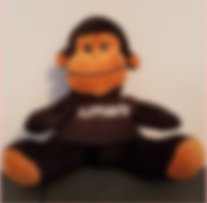
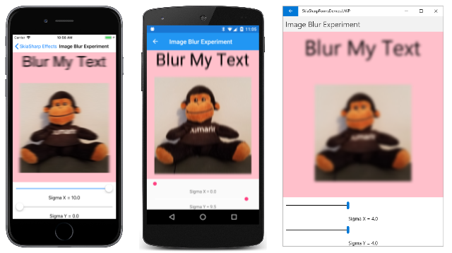
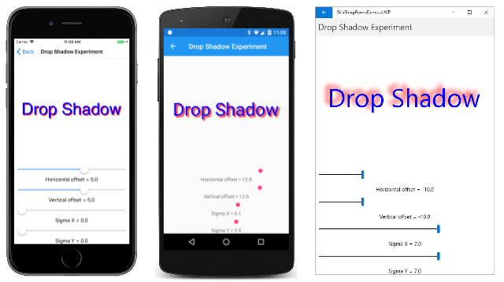
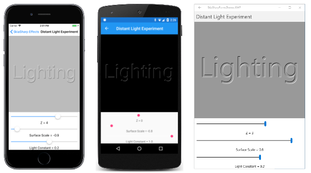

# SkiaSharp image filters

Image filters are effects that operate on all the color bits of pixels that make up an image. They are more versatile than mask filters, which only operate on the alpha channel as described in the article [**SkiaSharp mask filters**](mask-filters.md). To use an image filter, set the [`ImageFilter`](xref:SkiaSharp.SKPaint.ImageFilter) property of `SKPaint` to an object of type [`SKImageFilter`](xref:SkiaSharp.SKImageFilter) that you've created by calling one of the class's static methods.

The best way to become familiar with mask filters is by experimenting with these static methods. You can use a mask filter to blur an entire bitmap:



This article also demonstrates using an image filter to create a drop shadow, and for embossing and engraving effects.

## Blurring vector graphics and bitmaps

The blur effect created by the [`SKImageFilter.CreateBlur`](xref:SkiaSharp.SKImageFilter.CreateBlur*) static method has a significant advantage over the blur methods in the [`SKMaskFilter`](xref:SkiaSharp.SKMaskFilter) class: The image filter can blur an entire bitmap. The method has the following syntax:

```csharp
public static SkiaSharp.SKImageFilter CreateBlur (float sigmaX, float sigmaY, 
                                                  SKImageFilter input = null, 
                                                  SKImageFilter.CropRect cropRect = null);
```

The method has two sigma values &mdash; the first for the blur extent in the horizontal direction and the second for the vertical direction. You can cascade image filters by specifying another image filter as the optional third argument. A cropping rectangle can also be specified.

The **Image Blur Experiment** page in the [**SkiaSharpFormsDemos**](https://developer.xamarin.com/samples/xamarin-forms/SkiaSharpForms/Demos/) includes two `Slider` views that let you experiment with setting various levels of blur:

```xaml
<ContentPage xmlns="http://xamarin.com/schemas/2014/forms"
             xmlns:x="http://schemas.microsoft.com/winfx/2009/xaml"
             xmlns:skia="clr-namespace:SkiaSharp.Views.Forms;assembly=SkiaSharp.Views.Forms"
             x:Class="SkiaSharpFormsDemos.Effects.ImageBlurExperimentPage"
             Title="Image Blur Experiment">
    
    <StackLayout>
        <skia:SKCanvasView x:Name="canvasView"
                           VerticalOptions="FillAndExpand"
                           PaintSurface="OnCanvasViewPaintSurface" />

        <Slider x:Name="sigmaXSlider"
                Maximum="10"
                Margin="10, 0"
                ValueChanged="OnSliderValueChanged" />

        <Label Text="{Binding Source={x:Reference sigmaXSlider},
                              Path=Value,
                              StringFormat='Sigma X = {0:F1}'}"
               HorizontalTextAlignment="Center" />
        
        <Slider x:Name="sigmaYSlider"
                Maximum="10"
                Margin="10, 0"
                ValueChanged="OnSliderValueChanged" />

        <Label Text="{Binding Source={x:Reference sigmaYSlider},
                              Path=Value,
                              StringFormat='Sigma Y = {0:F1}'}"
               HorizontalTextAlignment="Center" />
    </StackLayout>
</ContentPage>
```

The code-behind file uses the two `Slider` values to call `SKImageFilter.CreateBlur` for the `SKPaint` object used to display both text and a bitmap:


```csharp
public partial class ImageBlurExperimentPage : ContentPage
{
    const string TEXT = "Blur My Text";

    SKBitmap bitmap = BitmapExtensions.LoadBitmapResource(
                            typeof(MaskBlurExperimentPage),
                            "SkiaSharpFormsDemos.Media.SeatedMonkey.jpg");

    public ImageBlurExperimentPage ()
	{
		InitializeComponent ();
    }

    void OnSliderValueChanged(object sender, ValueChangedEventArgs args)
    {
        canvasView.InvalidateSurface();
    }

    void OnCanvasViewPaintSurface(object sender, SKPaintSurfaceEventArgs args)
    {
        SKImageInfo info = args.Info;
        SKSurface surface = args.Surface;
        SKCanvas canvas = surface.Canvas;

        canvas.Clear(SKColors.Pink);

        // Get values from sliders
        float sigmaX = (float)sigmaXSlider.Value;
        float sigmaY = (float)sigmaYSlider.Value;

        using (SKPaint paint = new SKPaint())
        {
            // Set SKPaint properties
            paint.TextSize = (info.Width - 100) / (TEXT.Length / 2);
            paint.ImageFilter = SKImageFilter.CreateBlur(sigmaX, sigmaY);

            // Get text bounds and calculate display rectangle
            SKRect textBounds = new SKRect();
            paint.MeasureText(TEXT, ref textBounds);
            SKRect textRect = new SKRect(0, 0, info.Width, textBounds.Height + 50);

            // Center the text in the display rectangle
            float xText = textRect.Width / 2 - textBounds.MidX;
            float yText = textRect.Height / 2 - textBounds.MidY;

            canvas.DrawText(TEXT, xText, yText, paint);

            // Calculate rectangle for bitmap
            SKRect bitmapRect = new SKRect(0, textRect.Bottom, info.Width, info.Height);
            bitmapRect.Inflate(-50, -50);

            canvas.DrawBitmap(bitmap, bitmapRect, BitmapStretch.Uniform, paint: paint);
        }
    }
}
```

The three screenshots show various settings for the `sigmaX` and `sigmaY` settings:

[](image-filters-images/ImageBlurExperiment-Large.png#lightbox)

To keep the blur consistent among different display sizes and resolutions, set `sigmaX` and `sigmaY` to values that are proportional to the rendered pixel size of the image that the blur is applied to.

## Drop shadow

The [`SKImageFilter.CreateDropShadow`](xref:SkiaSharp.SKImageFilter.CreateDropShadow*) static method creates an `SKImageFilter` object for a drop shadow:

```csharp
public static SKImageFilter CreateDropShadow (float dx, float dy, 
                                              float sigmaX, float sigmaY, 
                                              SKColor color, 
                                              SKDropShadowImageFilterShadowMode shadowMode, 
                                              SKImageFilter input = null, 
                                              SKImageFilter.CropRect cropRect = null);
```

Set this object to the `ImageFilter` property of an `SKPaint` object, and anything you draw with that object will have a drop shadow behind it.

The `dx` and `dy` parameters indicate the horizontal and vertical offsets of the shadow in pixels from the graphical object. The convention in 2D graphics is to assume a light source coming from the upper left, which implies that both these arguments should be positive to position the shadow below and to the right of the graphical object.

The `sigmaX` and `sigmaY` parameters are blurring factors for the drop shadow.

The `color` parameter is the color of the drop shadow. This `SKColor` value can include transparency. One possibility is the color value `SKColors.Black.WithAlpha(0x80)` to darken any color background. 

The final two parameters are optional.

The **Drop Shadow Experiment** program lets you experiment with values of `dx`, `dy`, `sigmaX`, and `sigmaY` to display a text string with a drop shadow. The XAML file instantiates four `Slider` views to set these values:

```xaml
<ContentPage xmlns="http://xamarin.com/schemas/2014/forms"
             xmlns:x="http://schemas.microsoft.com/winfx/2009/xaml"
             xmlns:skia="clr-namespace:SkiaSharp.Views.Forms;assembly=SkiaSharp.Views.Forms"
             x:Class="SkiaSharpFormsDemos.Effects.DropShadowExperimentPage"
             Title="Drop Shadow Experiment">
    <ContentPage.Resources>
        <Style TargetType="Slider">
            <Setter Property="Margin" Value="10, 0" />
        </Style>

        <Style TargetType="Label">
            <Setter Property="HorizontalTextAlignment" Value="Center" />
        </Style>
    </ContentPage.Resources>

    <StackLayout>
        <skia:SKCanvasView x:Name="canvasView"
                           VerticalOptions="FillAndExpand"
                           PaintSurface="OnCanvasViewPaintSurface" />

        <Slider x:Name="dxSlider"
                Minimum="-20"
                Maximum="20"
                ValueChanged="OnSliderValueChanged" />

        <Label Text="{Binding Source={x:Reference dxSlider},
                              Path=Value,
                              StringFormat='Horizontal offset = {0:F1}'}" />

        <Slider x:Name="dySlider"
                Minimum="-20"
                Maximum="20"
                ValueChanged="OnSliderValueChanged" />

        <Label Text="{Binding Source={x:Reference dySlider},
                              Path=Value,
                              StringFormat='Vertical offset = {0:F1}'}" />

        <Slider x:Name="sigmaXSlider"
                Maximum="10"
                ValueChanged="OnSliderValueChanged" />

        <Label Text="{Binding Source={x:Reference sigmaXSlider},
                              Path=Value,
                              StringFormat='Sigma X = {0:F1}'}" />

        <Slider x:Name="sigmaYSlider"
                Maximum="10"
                ValueChanged="OnSliderValueChanged" />

        <Label Text="{Binding Source={x:Reference sigmaYSlider},
                              Path=Value,
                              StringFormat='Sigma Y = {0:F1}'}" />
    </StackLayout>
</ContentPage>
```

The code-behind file uses those values to create a red drop shadow on a blue text string:

```csharp
public partial class DropShadowExperimentPage : ContentPage
{
    const string TEXT = "Drop Shadow";

	public DropShadowExperimentPage ()
	{
		InitializeComponent ();
	}

    void OnSliderValueChanged(object sender, ValueChangedEventArgs args)
    {
        canvasView.InvalidateSurface();
    }

    void OnCanvasViewPaintSurface(object sender, SKPaintSurfaceEventArgs args)
    {
        SKImageInfo info = args.Info;
        SKSurface surface = args.Surface;
        SKCanvas canvas = surface.Canvas;

        canvas.Clear();

        // Get values from sliders
        float dx = (float)dxSlider.Value;
        float dy = (float)dySlider.Value;
        float sigmaX = (float)sigmaXSlider.Value;
        float sigmaY = (float)sigmaYSlider.Value;

        using (SKPaint paint = new SKPaint())
        {
            // Set SKPaint properties
            paint.TextSize = info.Width / 7;
            paint.Color = SKColors.Blue;
            paint.ImageFilter = SKImageFilter.CreateDropShadow(
                                    dx,
                                    dy,
                                    sigmaX,
                                    sigmaY,
                                    SKColors.Red,
                                    SKDropShadowImageFilterShadowMode.DrawShadowAndForeground); 

            SKRect textBounds = new SKRect();
            paint.MeasureText(TEXT, ref textBounds);

            // Center the text in the display rectangle
            float xText = info.Width / 2 - textBounds.MidX;
            float yText = info.Height / 2 - textBounds.MidY;

            canvas.DrawText(TEXT, xText, yText, paint);
        }
    }
}
```

Here's the program running on all three platforms:

[](image-filters-images/DropShadowExperiment-Large.png#lightbox)

The negative offset values in the Universal Windows Platform screenshot at the far right cause the shadow to appear above and to the left of the text. This suggests a light source in the lower right, which is not the convention for computer graphics. But it doesn't seem wrong in any way, perhaps because the shadow is also made very blurry and seems more ornamental than most drop shadows.

## Lighting Effects

The `SKImageFilter` class defines six methods that have similar names and parameters, listed here in order of increasing complexity:

- [`CreateDistantLitDiffuse`](xref:SkiaSharp.SKImageFilter.CreateDistantLitDiffuse*)
- [`CreateDistantLitSpecular`](xref:SkiaSharp.SKImageFilter.CreateDistantLitSpecular*)
- [`CreatePointLitDiffuse`](xref:SkiaSharp.SKImageFilter.CreatePointLitDiffuse*)
- [`CreatePointLitSpecular`](xref:SkiaSharp.SKImageFilter.CreatePointLitSpecular*)
- [`CreateSpotLitDiffuse`](xref:SkiaSharp.SKImageFilter.CreateSpotLitDiffuse*)
- [`CreateSpotLitSpecular`](xref:SkiaSharp.SKImageFilter.CreateSpotLitSpecular*)

These methods create image filters that mimic the effect of different kinds of light on three-dimensional surfaces. The resultant image filter illuminates two-dimensional objects as if they existed in 3D space, which can cause these objects to appear elevated or recessed, or with specular highlighting.

The `Distant` light methods assume that the light comes from a far distance. For the purpose of illuminating objects, the light is assumed to point in one consistent direction in 3D space, much like the Sun on a small area of the Earth. The `Point` light methods mimic a light bulb positioned in 3D space that emits light in all directions. The `Spot` light has both a position and a direction, much like a flashlight. 

Locations and directions in 3D space are both specified with values of the [`SKPoint3`](xref:SkiaSharp.SKPoint3) structure, which is similar to `SKPoint` but with three properties named `X`, `Y`, and `Z`. 

The number and complexity of the parameters to these methods make experimentation with them difficult. To get you started, the **Distant Light Experiment** page lets you experiment with parameters to the `CreateDistantLightDiffuse` method:

```csharp
public static SKImageFilter CreateDistantLitDiffuse (SKPoint3 direction, 
                                                     SKColor lightColor, 
                                                     float surfaceScale, 
                                                     float kd, 
                                                     SKImageFilter input = null, 
                                                     SKImageFilter.CropRect cropRect = null);
```

The page doesn't use the last two optional parameters. 

Three `Slider` views in the XAML file let you select the `Z` coordinate of the `SKPoint3` value, the `surfaceScale` parameter, and the `kd` parameter, which is defined in the API documentation as the "diffuse lighting constant":

```xaml
<ContentPage xmlns="http://xamarin.com/schemas/2014/forms"
             xmlns:x="http://schemas.microsoft.com/winfx/2009/xaml"
             xmlns:skia="clr-namespace:SkiaSharp.Views.Forms;assembly=SkiaSharp.Views.Forms"
             x:Class="SkiaLightExperiment.MainPage"
             Title="Distant Light Experiment">

    <StackLayout>

        <skia:SKCanvasView x:Name="canvasView"
                           PaintSurface="OnCanvasViewPaintSurface"
                           VerticalOptions="FillAndExpand" />

        <Slider x:Name="zSlider" 
                Minimum="-10"
                Maximum="10"
                Margin="10, 0"
                ValueChanged="OnSliderValueChanged" />

        <Label Text="{Binding Source={x:Reference zSlider},
                              Path=Value,
                              StringFormat='Z = {0:F0}'}"
               HorizontalTextAlignment="Center" />

        <Slider x:Name="surfaceScaleSlider" 
                Minimum="-1"
                Maximum="1"
                Margin="10, 0"
                ValueChanged="OnSliderValueChanged" />

        <Label Text="{Binding Source={x:Reference surfaceScaleSlider},
                              Path=Value,
                              StringFormat='Surface Scale = {0:F1}'}"
               HorizontalTextAlignment="Center" />

        <Slider x:Name="lightConstantSlider" 
                Minimum="-1"
                Maximum="1"
                Margin="10, 0"
                ValueChanged="OnSliderValueChanged" />

        <Label Text="{Binding Source={x:Reference lightConstantSlider},
                              Path=Value,
                              StringFormat='Light Constant = {0:F1}'}"
               HorizontalTextAlignment="Center" />
    </StackLayout>
</ContentPage>
```

The code-behind file obtains those three values and uses them to create an image filter to display a text string:

```csharp
public partial class DistantLightExperimentPage : ContentPage
{
    const string TEXT = "Lighting";

    public DistantLightExperimentPage()
    {
        InitializeComponent();
    }

    void OnSliderValueChanged(object sender, ValueChangedEventArgs args)
    {
        canvasView.InvalidateSurface();
    }

    void OnCanvasViewPaintSurface(object sender, SKPaintSurfaceEventArgs args)
    {
        SKImageInfo info = args.Info;
        SKSurface surface = args.Surface;
        SKCanvas canvas = surface.Canvas;

        canvas.Clear();

        float z = (float)zSlider.Value;
        float surfaceScale = (float)surfaceScaleSlider.Value;
        float lightConstant = (float)lightConstantSlider.Value;

        using (SKPaint paint = new SKPaint())
        {
            paint.IsAntialias = true;

            // Size text to 90% of canvas width
            paint.TextSize = 100;
            float textWidth = paint.MeasureText(TEXT);
            paint.TextSize *= 0.9f * info.Width / textWidth;

            // Find coordinates to center text
            SKRect textBounds = new SKRect();
            paint.MeasureText(TEXT, ref textBounds);

            float xText = info.Rect.MidX - textBounds.MidX;
            float yText = info.Rect.MidY - textBounds.MidY;

            // Create distant light image filter
            paint.ImageFilter = SKImageFilter.CreateDistantLitDiffuse(
                                    new SKPoint3(2, 3, z),
                                    SKColors.White,
                                    surfaceScale,
                                    lightConstant);

            canvas.DrawText(TEXT, xText, yText, paint);
        }
    }
}
```

The first argument of `SKImageFilter.CreateDistantLitDiffuse` is the direction of the light. The positive X and Y coordinates indicate that the light is pointed to the right and down. Positive Z coordinates point into the screen. The XAML file allows you to select negative Z values, but that's only so you can see what happens: Conceptually, negative Z coordinates cause the light to point out of the screen. For anything other then small negative values, the lighting effect stops working.

The `surfaceScale` argument can range from –1 to 1. (Higher or lower values have no further effect.) These are relative values in the Z axis that indicate the displacement of the graphical object (in this case, the text string) from the canvas surface. Use negative values to raise the text string above the surface of the canvas, and positive values to depress it into the canvas.

The `lightConstant` value should be positive. (The program allows negative values so you can see that they cause the effect to stop working.) Higher values cause more intense light.

These factors can be balanced to obtain an embossed effect when `surfaceScale` is negative (as with the iOS and Android screenshots) and an engraved effect when `surfaceScale` is positive, as with the UWP screenshot at the right:

[](image-filters-images/DistantLightExperiment-Large.png#lightbox)

The Android screenshot has a Z value of 0, which means that the light is only pointing down and to the right. The background isn't illuminated and the surface of the text string isn't illuminated either. The light only effects the edge of the text for a very subtle effect.

An alternative approach to embossed and engraved text was demonstrated in the article [The Translate Transform](../transforms/translate.md): The text string is displayed twice with different colors that are offset slightly from each other.

## Related links

- [SkiaSharp APIs](https://docs.microsoft.com/dotnet/api/skiasharp)
- [SkiaSharpFormsDemos (sample)](https://developer.xamarin.com/samples/xamarin-forms/SkiaSharpForms/Demos/)
