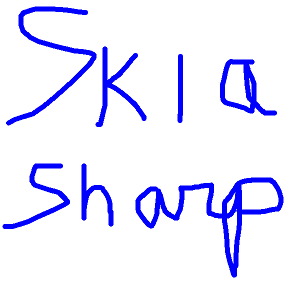
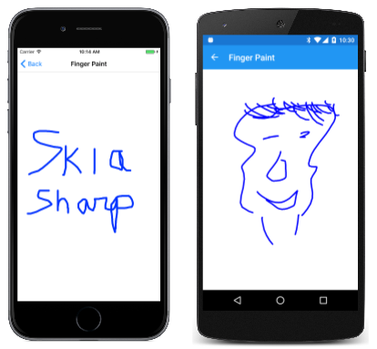

# Finger Painting in SkiaSharp

_Use your fingers to paint on the canvas._

An `SKPath` object can be continually updated and displayed. This feature allows a path to be used for interactive drawing, such as in a finger-painting program.



The touch support in Xamarin.Forms does not allow tracking individual fingers on the screen, so a Xamarin.Forms touch-tracking effect has been developed to provide additional touch support. This effect is described in the article [**Invoking Events from Effects**](~/xamarin-forms/app-fundamentals/effects/touch-tracking.md). The sample program [**Touch-Tracking Effect Demos**](https://developer.xamarin.com/samples/xamarin-forms/Effects/TouchTrackingEffectDemos/) includes two pages that use SkiaSharp, including a finger-painting program.

The [**SkiaSharpFormsDemos**](https://developer.xamarin.com/samples/xamarin-forms/SkiaSharpForms/Demos/) solution includes this touch-tracking event. The .NET Standard library project includes the `TouchEffect` class, the `TouchActionType` enumeration, the `TouchActionEventHandler` delegate, and the `TouchActionEventArgs` class. Each of the platform projects includes a `TouchEffect` class for that platform; the iOS project also contains a `TouchRecognizer` class.

The **Finger Paint** page in **SkiaSharpFormsDemos** is a simplified implementation of finger painting. It does not allow selecting color or stroke width, it has no way to clear the canvas, and of course you can't save your artwork.

The [**FingerPaintPage.xaml**](https://github.com/xamarin/xamarin-forms-samples/blob/master/SkiaSharpForms/Demos/Demos/SkiaSharpFormsDemos/LinesAndPaths/FingerPaintPage.xaml) file puts the `SKCanvasView` in a single-cell `Grid` and attaches the `TouchEffect` to that `Grid`:

```xaml
<ContentPage xmlns="http://xamarin.com/schemas/2014/forms"
             xmlns:x="http://schemas.microsoft.com/winfx/2009/xaml"
             xmlns:skia="clr-namespace:SkiaSharp.Views.Forms;assembly=SkiaSharp.Views.Forms"
             xmlns:tt="clr-namespace:TouchTracking"
             x:Class="SkiaSharpFormsDemos.Paths.FingerPaintPage"
             Title="Finger Paint">

    <Grid BackgroundColor="White">
        <skia:SKCanvasView x:Name="canvasView"
                           PaintSurface="OnCanvasViewPaintSurface" />
        <Grid.Effects>
            <tt:TouchEffect Capture="True"
                            TouchAction="OnTouchEffectAction" />
        </Grid.Effects>
    </Grid>
</ContentPage>
```

Attaching the `TouchEffect` directly to the `SKCanvasView` does not work under all platforms.

The  [**FingerPaintPage.xaml.cs**](https://github.com/xamarin/xamarin-forms-samples/blob/master/SkiaSharpForms/Demos/Demos/SkiaSharpFormsDemos/LinesAndPaths/FingerPaintPage.xaml.cs) code-behind file defines two collections for storing the `SKPath` objects, as well as an `SKPaint` object for rendering these paths:

```csharp
public partial class FingerPaintPage : ContentPage
{
    Dictionary<long, SKPath> inProgressPaths = new Dictionary<long, SKPath>();
    List<SKPath> completedPaths = new List<SKPath>();

    SKPaint paint = new SKPaint
    {
        Style = SKPaintStyle.Stroke,
        Color = SKColors.Blue,
        StrokeWidth = 10,
        StrokeCap = SKStrokeCap.Round,
        StrokeJoin = SKStrokeJoin.Round
    };

    public FingerPaintPage()
    {
        InitializeComponent();
    }
    ...
}
```

As the name suggests, the `inProgressPaths` dictionary stores the paths that are currently being drawn by one or more fingers. The dictionary key is the touch ID that accompanies the touch events. The `completedPaths` field is a collection of paths that were finished when a finger that was drawing the path lifted from the screen.

The `TouchAction` handler manages these two collections. When a finger first touches the screen, a new `SKPath` is added to `inProgressPaths`. As that finger moves, additional points are added to the path. When the finger is released, the path is transferred to the `completedPaths` collection. You can paint with multiple fingers simultaneously. After each change to one of the paths or collections, the `SKCanvasView` is invalidated:

```csharp
public partial class FingerPaintPage : ContentPage
{
    ...
    void OnTouchEffectAction(object sender, TouchActionEventArgs args)
    {
        switch (args.Type)
        {
            case TouchActionType.Pressed:
                if (!inProgressPaths.ContainsKey(args.Id))
                {
                    SKPath path = new SKPath();
                    path.MoveTo(ConvertToPixel(args.Location));
                    inProgressPaths.Add(args.Id, path);
                    canvasView.InvalidateSurface();
                }
                break;

            case TouchActionType.Moved:
                if (inProgressPaths.ContainsKey(args.Id))
                {
                    SKPath path = inProgressPaths[args.Id];
                    path.LineTo(ConvertToPixel(args.Location));
                    canvasView.InvalidateSurface();
                }
                break;

            case TouchActionType.Released:
                if (inProgressPaths.ContainsKey(args.Id))
                {
                    completedPaths.Add(inProgressPaths[args.Id]);
                    inProgressPaths.Remove(args.Id);
                    canvasView.InvalidateSurface();
                }
                break;

            case TouchActionType.Cancelled:
                if (inProgressPaths.ContainsKey(args.Id))
                {
                    inProgressPaths.Remove(args.Id);
                    canvasView.InvalidateSurface();
                }
                break;
        }
    }
    ...
    SKPoint ConvertToPixel(Point pt)
    {
        return new SKPoint((float)(canvasView.CanvasSize.Width * pt.X / canvasView.Width),
                           (float)(canvasView.CanvasSize.Height * pt.Y / canvasView.Height));
    }
}
```

The points accompanying the touch-tracking events are Xamarin.Forms coordinates; these must be converted to SkiaSharp coordinates, which are pixels. That's the purpose of the `ConvertToPixel` method.

The `PaintSurface` handler then simply renders both collections of paths. The earlier completed paths appear underneath the paths in progress:

```csharp
public partial class FingerPaintPage : ContentPage
{
    ,,,
    void OnCanvasViewPaintSurface(object sender, SKPaintSurfaceEventArgs args)
    {
        SKCanvas canvas = args.Surface.Canvas;
        canvas.Clear();

        foreach (SKPath path in completedPaths)
        {
            canvas.DrawPath(path, paint);
        }

        foreach (SKPath path in inProgressPaths.Values)
        {
            canvas.DrawPath(path, paint);
        }
    }
    ...
}
```

Your finger paintings are only limited by your talent:

[](finger-paint-images/fingerpaint-large.png#lightbox "Triple screenshot of the Finger Paint page")

You've now seen how to draw lines and to define curves using parametric equations. A later section on [**SkiaSharp Curves and Paths**](../curves/index.md) covers the various types of curves that `SKPath` supports. But a useful prerequisite is an exploration of [**SkiaSharp Transforms**](../transforms/index.md).

## Related Links

- [SkiaSharp APIs](https://docs.microsoft.com/dotnet/api/skiasharp)
- [SkiaSharpFormsDemos (sample)](https://developer.xamarin.com/samples/xamarin-forms/SkiaSharpForms/Demos/)
- [Touch-Tracking Effect Demos (sample)](https://developer.xamarin.com/samples/xamarin-forms/Effects/TouchTrackingEffectDemos/)
- [Invoking Events from Effects](~/xamarin-forms/app-fundamentals/effects/touch-tracking.md)
