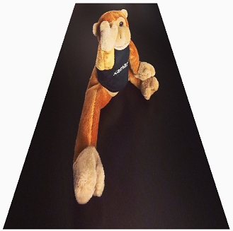
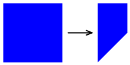
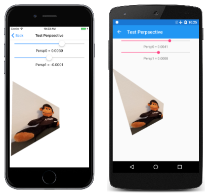

# Non-Affine Transforms

_Create perspective and taper effects with the third column of the transform matrix_

Translation, scaling, rotation, and skewing are all classified as *affine* transforms. Affine transforms preserve parallel lines. If two lines are parallel prior to the transform, they remain parallel after the transform. Rectangles are always transformed to parallelograms.

However, SkiaSharp is also capable of non-affine transforms, which have the capability to transform a rectangle into any convex quadrilateral:



A convex quadrilateral is a four-sided figure with interior angles always less than 180 degrees and sides that don't cross each other.

Non-affine transforms result when the third row of the transform matrix is set to values other than 0, 0, and 1. The full `SKMatrix` multiplication is:

<pre>
              │ ScaleX  SkewY   Persp0 │
| x  y  1 | × │ SkewX   ScaleY  Persp1 │ = | x'  y'  z' |
              │ TransX  TransY  Persp2 │
</pre>

The resultant transform formulas are:

x' = ScaleX·x + SkewX·y + TransX

y' = SkewY·x + ScaleY·y + TransY

z` = Persp0·x + Persp1·y + Persp2

The fundamental rule of using a 3-by-3 matrix for two-dimensional transforms is that everything remains on the plane where Z equals 1. Unless `Persp0` and `Persp1` are 0, and `Persp2` equals 1, the transform has moved the Z coordinates off that plane.

To restore this to a two-dimensional transform, the coordinates must be moved back to that plane. Another step is required. The x', y', and z` values must be divided by z':

x" = x' / z'

y" = y' / z'

z" = z' / z' = 1

These are known as *homogeneous coordinates* and they were developed by mathematician August Ferdinand Möbius, much better known for his topological oddity, the Möbius Strip.

If z' is 0, the division results in infinite coordinates. In fact, one of Möbius's motivations for developing homogeneous coordinates was the ability to represent infinite values with finite numbers.

When displaying graphics, however, you want to avoid rendering something with coordinates that transform to infinite values. Those coordinates won't be rendered. Everything in the vicinity of those coordinates will be very large and probably not visually coherent.

In this equation, you do not want the value of z' becoming zero:

z` = Persp0·x + Persp1·y + Persp2

Consequently, these values have some practical restrictions: 

The `Persp2` cell can either be zero or not zero. If `Persp2` is zero, then z' is zero for the point (0, 0), and that's usually not desirable because that point is very common in two-dimensional graphics. If `Persp2` is not equal to zero, then there is no loss of generality if `Persp2` is fixed at 1. For example, if you determine that `Persp2` should be 5, then you can simply divide all the cells in the matrix by 5, which makes `Persp2` equal to 1, and the result will be the same.

For these reasons, `Persp2` is often fixed at 1, which is the same value in the identity matrix.

Generally, `Persp0` and `Persp1` are small numbers. For example, suppose you begin with an identity matrix but set `Persp0` to 0.01:

<pre>
| 1  0   0.01 |
| 0  1    0   |
| 0  0    1   |
</pre>

The transform formulas are:

x` = x / (0.01·x + 1)

y' = y / (0.01·x + 1)

Now use this transform to render a 100-pixel square box positioned at the origin. Here's how the four corners are transformed:

(0, 0) → (0, 0)

(0, 100) → (0, 100)

(100, 0) → (50, 0)

(100, 100) → (50, 50)

When x is 100, then the z' denominator is 2, so the x and y coordinates are effectively halved. The right side of the box becomes shorter than the left side:



The `Persp` part of these cell names refers to "perspective" because the foreshortening suggests that the box is now tilted with the right side further from the viewer.

The **Test Perspective** page allows you to experiment with values of `Persp0` and `Pers1` to get a feel for how they work. Reasonable values of these matrix cells are so small that the `Slider` in the Universal Windows Platform can't properly handle them. To accommodate the UWP problem, the two `Slider` elements in the [**TestPerspective.xaml**](https://github.com/xamarin/xamarin-forms-samples/blob/master/SkiaSharpForms/Demos/Demos/SkiaSharpFormsDemos/Transforms/TestPerspectivePage.xaml) need to be initialized to range from –1 to 1:

```xaml
<ContentPage xmlns="http://xamarin.com/schemas/2014/forms"
             xmlns:x="http://schemas.microsoft.com/winfx/2009/xaml"
             xmlns:skia="clr-namespace:SkiaSharp.Views.Forms;assembly=SkiaSharp.Views.Forms"
             x:Class="SkiaSharpFormsDemos.Transforms.TestPerspectivePage"
             Title="Test Perpsective">
    <Grid>
        <Grid.RowDefinitions>
            <RowDefinition Height="Auto" />
            <RowDefinition Height="Auto" />
            <RowDefinition Height="Auto" />
            <RowDefinition Height="Auto" />
            <RowDefinition Height="*" />
        </Grid.RowDefinitions>

        <Grid.Resources>
            <ResourceDictionary>
                <Style TargetType="Label">
                    <Setter Property="HorizontalTextAlignment" Value="Center" />
                </Style>

                <Style TargetType="Slider">
                    <Setter Property="Minimum" Value="-1" />
                    <Setter Property="Maximum" Value="1" />
                    <Setter Property="Margin" Value="20, 0" />
                </Style>
            </ResourceDictionary>
        </Grid.Resources>

        <Slider x:Name="persp0Slider"
                Grid.Row="0"
                ValueChanged="OnPersp0SliderValueChanged" />

        <Label x:Name="persp0Label"
               Text="Persp0 = 0.0000"
               Grid.Row="1" />

        <Slider x:Name="persp1Slider"
                Grid.Row="2"
                ValueChanged="OnPersp1SliderValueChanged" />

        <Label x:Name="persp1Label"
               Text="Persp1 = 0.0000"
               Grid.Row="3" />

        <skia:SKCanvasView x:Name="canvasView"
                           Grid.Row="4"
                           PaintSurface="OnCanvasViewPaintSurface" />
    </Grid>
</ContentPage>
```

The event handlers for the sliders in the [`TestPerspectivePage`](https://github.com/xamarin/xamarin-forms-samples/blob/master/SkiaSharpForms/Demos/Demos/SkiaSharpFormsDemos/Transforms/TestPerspectivePage.xaml.cs) code-behind file divide the values by 100 so that they range between –0.01 and 0.01. In addition, the constructor loads in a bitmap:

```csharp
public partial class TestPerspectivePage : ContentPage
{
    SKBitmap bitmap;

    public TestPerspectivePage()
    {
        InitializeComponent();

        string resourceID = "SkiaSharpFormsDemos.Media.SeatedMonkey.jpg";
        Assembly assembly = GetType().GetTypeInfo().Assembly;

        using (Stream stream = assembly.GetManifestResourceStream(resourceID))
        {
            bitmap = SKBitmap.Decode(stream);
        }
    }

    void OnPersp0SliderValueChanged(object sender, ValueChangedEventArgs args)
    {
        Slider slider = (Slider)sender;
        persp0Label.Text = String.Format("Persp0 = {0:F4}", slider.Value / 100);
        canvasView.InvalidateSurface();
    }

    void OnPersp1SliderValueChanged(object sender, ValueChangedEventArgs args)
    {
        Slider slider = (Slider)sender;
        persp1Label.Text = String.Format("Persp1 = {0:F4}", slider.Value / 100);
        canvasView.InvalidateSurface();
    }
    ...
}
```

The `PaintSurface` handler calculates an `SKMatrix` value named `perspectiveMatrix` based on the values of these two sliders divided by 100. This is combined with two translate transforms that put the center of this transform in the center of the bitmap:

```csharp
public partial class TestPerspectivePage : ContentPage
{
    ...
    void OnCanvasViewPaintSurface(object sender, SKPaintSurfaceEventArgs args)
    {
        SKImageInfo info = args.Info;
        SKSurface surface = args.Surface;
        SKCanvas canvas = surface.Canvas;

        canvas.Clear();

        // Calculate perspective matrix
        SKMatrix perspectiveMatrix = SKMatrix.MakeIdentity();
        perspectiveMatrix.Persp0 = (float)persp0Slider.Value / 100;
        perspectiveMatrix.Persp1 = (float)persp1Slider.Value / 100;

        // Center of screen
        float xCenter = info.Width / 2;
        float yCenter = info.Height / 2;

        SKMatrix matrix = SKMatrix.MakeTranslation(-xCenter, -yCenter);
        SKMatrix.PostConcat(ref matrix, perspectiveMatrix);
        SKMatrix.PostConcat(ref matrix, SKMatrix.MakeTranslation(xCenter, yCenter));

        // Coordinates to center bitmap on canvas
        float x = xCenter - bitmap.Width / 2;
        float y = yCenter - bitmap.Height / 2;

        canvas.SetMatrix(matrix);
        canvas.DrawBitmap(bitmap, x, y);
    }
}
```

Here are some sample images:

[](non-affine-images/testperspective-large.png#lightbox "Triple screenshot of the Test Perspective page")

As you experiment with the sliders, you'll find that values beyond 0.0066 or below –0.0066 cause the image to suddenly become fractured and incoherent. The bitmap being transformed is 300-pixels square. It is transformed relative to its center, so the coordinates of the bitmap range from –150 to 150. Recall that the value of z' is:

z` = Persp0·x + Persp1·y + 1

If `Persp0` or `Persp1` is greater than 0.0066 or below –0.0066, then there is always some coordinate of the bitmap that results in a z' value of zero. That causes division by zero, and the rendering becomes a mess. When using non-affine transforms, you want to avoid rendering anything with coordinates that cause division by zero.

Generally, you won't be setting `Persp0` and `Persp1` in isolation. It's also often necessary to set other cells in the matrix to achieve certain types of non-affine transforms.

One such non-affine transform is a *taper transform*. This type of non-affine transform retains the overall dimensions of a rectangle but tapers one side:


The [`TaperTransform`](https://github.com/xamarin/xamarin-forms-samples/blob/master/SkiaSharpForms/Demos/Demos/SkiaSharpFormsDemos/Transforms/TaperTransform.cs) class performs a generalized calculation of a non-affine transform based on these parameters:

- the rectangular size of the image being transformed,
- an enumeration that indicates the side of the rectangle that tapers,
- another enumeration that indicates how it tapers, and
- the extent of the tapering.

Here's the code:

```csharp
enum TaperSide { Left, Top, Right, Bottom }

enum TaperCorner { LeftOrTop, RightOrBottom, Both }

static class TaperTransform
{
    public static SKMatrix Make(SKSize size, TaperSide taperSide, TaperCorner taperCorner, float taperFraction)
    {
        SKMatrix matrix = SKMatrix.MakeIdentity();

        switch (taperSide)
        {
            case TaperSide.Left:
                matrix.ScaleX = taperFraction;
                matrix.ScaleY = taperFraction;
                matrix.Persp0 = (taperFraction - 1) / size.Width;

                switch (taperCorner)
                {
                    case TaperCorner.RightOrBottom:
                        break;

                    case TaperCorner.LeftOrTop:
                        matrix.SkewY = size.Height * matrix.Persp0;
                        matrix.TransY = size.Height * (1 - taperFraction);
                        break;

                    case TaperCorner.Both:
                        matrix.SkewY = (size.Height / 2) * matrix.Persp0;
                        matrix.TransY = size.Height * (1 - taperFraction) / 2;
                        break;
                }
                break;

            case TaperSide.Top:
                matrix.ScaleX = taperFraction;
                matrix.ScaleY = taperFraction;
                matrix.Persp1 = (taperFraction - 1) / size.Height;

                switch (taperCorner)
                {
                    case TaperCorner.RightOrBottom:
                        break;

                    case TaperCorner.LeftOrTop:
                        matrix.SkewX = size.Width * matrix.Persp1;
                        matrix.TransX = size.Width * (1 - taperFraction);
                        break;

                    case TaperCorner.Both:
                        matrix.SkewX = (size.Width / 2) * matrix.Persp1;
                        matrix.TransX = size.Width * (1 - taperFraction) / 2;
                        break;
                }
                break;

            case TaperSide.Right:
                matrix.ScaleX = 1 / taperFraction;
                matrix.Persp0 = (1 - taperFraction) / (size.Width * taperFraction);

                switch (taperCorner)
                {
                    case TaperCorner.RightOrBottom:
                        break;

                    case TaperCorner.LeftOrTop:
                        matrix.SkewY = size.Height * matrix.Persp0;
                        break;

                    case TaperCorner.Both:
                        matrix.SkewY = (size.Height / 2) * matrix.Persp0;
                        break;
                }
                break;

            case TaperSide.Bottom:
                matrix.ScaleY = 1 / taperFraction;
                matrix.Persp1 = (1 - taperFraction) / (size.Height * taperFraction);

                switch (taperCorner)
                {
                    case TaperCorner.RightOrBottom:
                        break;

                    case TaperCorner.LeftOrTop:
                        matrix.SkewX = size.Width * matrix.Persp1;
                        break;

                    case TaperCorner.Both:
                        matrix.SkewX = (size.Width / 2) * matrix.Persp1;
                        break;
                }
                break;
        }
        return matrix;
    }
}
```

This class is used in the **Taper Transform** page. The XAML file instantiates two `Picker` elements to select the enumeration values, and a `Slider` for choosing the taper fraction. The [`PaintSurface`](https://github.com/xamarin/xamarin-forms-samples/blob/master/SkiaSharpForms/Demos/Demos/SkiaSharpFormsDemos/Transforms/TaperTransformPage.xaml.cs#L55) handler combines the taper transform with two translate transforms to make the transform relative to the upper-left corner of the bitmap:

```csharp
void OnCanvasViewPaintSurface(object sender, SKPaintSurfaceEventArgs args)
{
    SKImageInfo info = args.Info;
    SKSurface surface = args.Surface;
    SKCanvas canvas = surface.Canvas;

    canvas.Clear();

    TaperSide taperSide = (TaperSide)taperSidePicker.SelectedIndex;
    TaperCorner taperCorner = (TaperCorner)taperCornerPicker.SelectedIndex;
    float taperFraction = (float)taperFractionSlider.Value;

    SKMatrix taperMatrix =
        TaperTransform.Make(new SKSize(bitmap.Width, bitmap.Height),
                            taperSide, taperCorner, taperFraction);

    // Display the matrix in the lower-right corner
    SKSize matrixSize = matrixDisplay.Measure(taperMatrix);

    matrixDisplay.Paint(canvas, taperMatrix,
        new SKPoint(info.Width - matrixSize.Width,
                    info.Height - matrixSize.Height));

    // Center bitmap on canvas
    float x = (info.Width - bitmap.Width) / 2;
    float y = (info.Height - bitmap.Height) / 2;

    SKMatrix matrix = SKMatrix.MakeTranslation(-x, -y);
    SKMatrix.PostConcat(ref matrix, taperMatrix);
    SKMatrix.PostConcat(ref matrix, SKMatrix.MakeTranslation(x, y));

    canvas.SetMatrix(matrix);
    canvas.DrawBitmap(bitmap, x, y);
}
```

Here are some examples:

[](non-affine-images/tapertransform-large.png#lightbox "Triple screenshot of the Taper Transform page")

Another type of generalized non-affine transforms is 3D rotation, which is demonstrated in the next article, [**3D Rotations**](3d-rotation.md).

The non-affine transform can transform a rectangle into any convex quadrilateral. This is demonstrated by the **Show Non-Affine Matrix** page. It is very similar to the **Show Affine Matrix** page from the [**Matrix Transforms**](matrix.md) article except that it has a fourth `TouchPoint` object to manipulate the fourth corner of the bitmap:

[](non-affine-images/shownonaffinematrix-large.png#lightbox "Triple screenshot of the Show Non-Affine Matrix page")

As long as you don't attempt to make an interior angle of one of the corners of the bitmap greater than 180 degrees, or make two sides cross each other, the program successfully calculates the transform using this method from the [`ShowNonAffineMatrixPage`](https://github.com/xamarin/xamarin-forms-samples/blob/master/SkiaSharpForms/Demos/Demos/SkiaSharpFormsDemos/Transforms/ShowNonAffineMatrixPage.xaml.cs) class:

```csharp
static SKMatrix ComputeMatrix(SKSize size, SKPoint ptUL, SKPoint ptUR, SKPoint ptLL, SKPoint ptLR)
{
    // Scale transform
    SKMatrix S = SKMatrix.MakeScale(1 / size.Width, 1 / size.Height);

    // Affine transform
    SKMatrix A = new SKMatrix
    {
        ScaleX = ptUR.X - ptUL.X,
        SkewY = ptUR.Y - ptUL.Y,
        SkewX = ptLL.X - ptUL.X,
        ScaleY = ptLL.Y - ptUL.Y,
        TransX = ptUL.X,
        TransY = ptUL.Y,
        Persp2 = 1
    };

    // Non-Affine transform
    SKMatrix inverseA;
    A.TryInvert(out inverseA);
    SKPoint abPoint = inverseA.MapPoint(ptLR);
    float a = abPoint.X;
    float b = abPoint.Y;

    float scaleX = a / (a + b - 1);
    float scaleY = b / (a + b - 1);

    SKMatrix N = new SKMatrix
    {
        ScaleX = scaleX,
        ScaleY = scaleY,
        Persp0 = scaleX - 1,
        Persp1 = scaleY - 1,
        Persp2 = 1
    };

    // Multiply S * N * A
    SKMatrix result = SKMatrix.MakeIdentity();
    SKMatrix.PostConcat(ref result, S);
    SKMatrix.PostConcat(ref result, N);
    SKMatrix.PostConcat(ref result, A);

    return result;
}
```

For ease of calculation, this method obtains the total transform as a product of three separate transforms, which are symbolized here with arrows showing how these transforms modify the four corners of the bitmap:

(0, 0) → (0, 0) → (0, 0) → (x0, y0) (upper-left)

(0, H) → (0, 1) → (0, 1) → (x1, y1) (lower-left)

(W, 0) → (1, 0) → (1, 0) → (x2, y2) (upper-right)

(W, H) → (1, 1) → (a, b) → (x3, y3) (lower-right)

The final coordinates at the right are the four points associated with the four touch points. These are the final coordinates of the corners of the bitmap.

W and H represent the width and height of the bitmap. The first transform `S` simply scales the bitmap to a 1-pixel square. The second transform is the non-affine transform `N`, and the third is the affine transform `A`. That affine transform is based on three points, so it's just like the earlier affine [`ComputeMatrix`](https://github.com/xamarin/xamarin-forms-samples/blob/master/SkiaSharpForms/Demos/Demos/SkiaSharpFormsDemos/Transforms/ShowAffineMatrixPage.xaml.cs#L68) method and doesn't involve the fourth row with the (a, b) point.

The `a` and `b` values are calculated so that the third transform is affine. The code obtains the inverse of the affine transform and then uses that to map the lower-right corner. That's the point (a, b).

Another use of non-affine transforms is to mimic three-dimensional graphics. In the next article, [**3D Rotations**](3d-rotation.md) you see how to rotate a two-dimensional graphic in 3D space.


## Related Links

- [SkiaSharp APIs](https://docs.microsoft.com/dotnet/api/skiasharp)
- [SkiaSharpFormsDemos (sample)](https://developer.xamarin.com/samples/xamarin-forms/SkiaSharpForms/Demos/)
