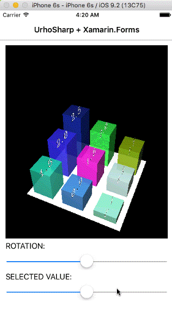
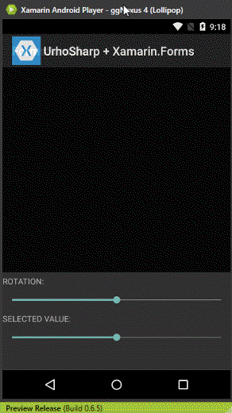
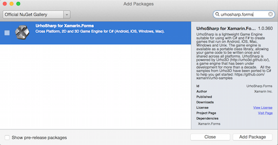
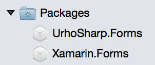

# Using UrhoSharp in Xamarin.Forms

## What is UrhoSharp?

[UrhoSharp](~/graphics-games/urhosharp/index.md) is a powerful 3D engine
for Xamarin and .NET developers. The [introduction](~/graphics-games/urhosharp/introduction.md)
explains more about the UrhoSharp library, and [these notes](~/graphics-games/urhosharp/using.md)
describe how to program scenes and actions.

UrhoSharp can be used to render graphics in Xamarin.Forms applications.
This [sample](https://github.com/xamarin/urho-samples/tree/master/FormsSample)
demonstrates how UrhoSharp could be used to construct an interactive 3D chart:




## Adding the UrhoSharp Nuget packages

Before using UrhoSharp, developers need to add the UrhoSharp Nuget package
to their solution. This guide assumes a Xamarin.Forms project with an
iOS, Android, and PCL project. All of the code will be written in the PCL
project; but the UrhoSharp Nuget must be added to the iOS and Android projects too.

The UrhoSharp.Forms Nuget package contains all of the objects needed to create
UrhoSharp objects. The UrhoSharp.Forms nuget package includes the
`UrhoSurface` class, which is used to host UrhoSharp in Xamarin.Forms.
To begin, right-click on the PCL’s **Packages** folder and select **Add Packages...**.
Enter the search term **UrhoSharp.Forms**, select **UrhoSharp for Xamarin.Forms**,
then click **Add Package**.

[ ](urhosharp-images/add-package.png "Add Packages Dialog")

The UrhoSharp.Forms NuGet package will be added to the project:



Repeat the above steps for platform-specific projects (such as iOS and Android).

## Walkthrough: Adding UrhoSharp to a Xamarin.Forms app

These steps describe the code in the Xamarin.Forms UrhoSharp sample:

1. [Creat a Xamarin Forms Page](#1)
2. [Add the UrhoSurface](#2)
3. [Build an Urho Application](#3)
4. [Add the Charts class to the UrhoSurface](#4)
5. [Interacting with UrhoSharp](#5)

Note that the sample uses C# 6 features, and may not compile on older
versions of Visual Studio.

<a name="1"/>

### 1. Create a Xamarin Forms Page

The code below shows a Xamarin.Forms page `UrhoPage` before any
Urho-related code has been added:

```csharp
public class UrhoPage : ContentPage
{
  Slider selectedBarSlider, rotationSlider;

  public UrhoPage()
  {
    // we'll add Urho later

    rotationSlider = new Slider(0, 500, 250);

    selectedBarSlider = new Slider(0, 5, 2.5);

    Title = " UrhoSharp + Xamarin.Forms";
    Content = new StackLayout {
      Padding = new Thickness (12, 12, 12, 40),
      VerticalOptions = LayoutOptions.FillAndExpand,
      Children = {
        rotationSlider,
        new Label { Text = "SELECTED VALUE:" },
        selectedBarSlider,
      }
    };
  }
```

<a name="2"/>

### 2. Add the UrhoSurface

UrhoSharp can be hosted in a `ContentPage` like other Xamarin.Forms controls.
The code snippet below shows a `UrhoSurface` added to the Xamarin.Forms page:

```csharp
using Urho;
using Urho.Forms;
...
public class UrhoPage : ContentPage
{
  UrhoSurface urhoSurface;

  public UrhoPage()
  {
    urhoSurface = new UrhoSurface();
    urhoSurface.VerticalOptions = LayoutOptions.FillAndExpand;
...
    Content = new StackLayout {
    Padding = new Thickness (12, 12, 12, 40),
    VerticalOptions = LayoutOptions.FillAndExpand,
    Children = {
      urhoSurface,  // added
      new Label { Text = "ROTATION:" },
      rotationSlider,
      new Label { Text = "SELECTED VALUE:" },
      selectedBarSlider,
    }
  };
```

<a name="3"/>

### 3. Build a Urho Application

Refer to the `Charts` class for the implementation of the Urho 3D
graphics used in this sample. The basic code outline is shown below -
note that the class implements `Urho.Application` which is different
to the `Xamarin.Forms.Application` class that is implemented in **App.cs**.

```csharp
using Urho;
using Urho.Actions;
using Urho.Gui;
using Urho.Shapes;

namespace FormsSample
{
	public class Charts : Urho.Application
	{
    public Charts (ApplicationOptions options = null) : base(options) { }
    protected override void Start ()
    {
      ...
    }
    protected override void OnUpdate(float timeStep)
    {
      ...
    }
```

The [UrhoSharp documentation](~/graphics-games/urhosharp/index.md) contains
more information on how to build 3D scenes and actions.

<a name="4"/>

### 4. Add the Charts class to the UrhoSurface

Use the `UrhoSurface.Show<T>` generic method to add the Urho application
to the Xamarin.Forms page. The code snippet below shows the additional
code required to create the `Charts` class:

```csharp
public class UrhoPage : ContentPage
{
  Charts urhoApp;
  ...
  protected override async void OnAppearing ()
  {
    urhoApp = await urhoSurface.Show<Charts> (new ApplicationOptions(assetsFolder: null)
      { Orientation = ApplicationOptions.OrientationType.Portrait });
  }
```

Note: the `Show<T>` method is asynchronous and should be called with the
`await` keyword.

<a name="5"/>

### 5. Interacting with UrhoSharp

The example allows the chart bars to be selected and modified. The `Charts`
class exposes the `Bars` and `SelectedBar` to enable this interaction.

Each "bar" has a selection event handler added after the `Charts` class
has been rendered, by iterating over the exposed `Bars` collection:

```csharp
protected override async void OnAppearing ()
{
  urhoApp = await urhoSurface.Show<Charts>(new ApplicationOptions(assetsFolder: null) { Orientation = ApplicationOptions.OrientationType.Portrait });
  foreach (var bar in urhoApp.Bars)
  {
    bar.Selected += OnBarSelection;
  }
}
```

The event handler uses the value of the Xamarin.Forms `Slider` control
to adjust the height of the given bar:

```csharp
private void OnBarSelection(Bar bar)
{
  //reset value
  selectedBarSlider.ValueChanged -= OnValuesSliderValueChanged;
  selectedBarSlider.Value = bar.Value;
  selectedBarSlider.ValueChanged += OnValuesSliderValueChanged;
}

void OnValuesSliderValueChanged(object sender, ValueChangedEventArgs e)
{  // C# 6
  if (urhoApp?.SelectedBar != null)
  {
    urhoApp.SelectedBar.Value = (float)e.NewValue;
  }
}
```

Finally, wire up the two `Slider` controls so that when their value changes
the UrhoSharp canvas is affected. The first slider rotates the 3D chart image
and the second slider adjusts the height of the selected bar.

```csharp
rotationSlider = new Slider(0, 500, 250);
rotationSlider.ValueChanged += (s, e) => urhoApp?.Rotate((float)(e.NewValue - e.OldValue));

selectedBarSlider = new Slider(0, 5, 2.5);
selectedBarSlider.ValueChanged += OnValuesSliderValueChanged;
```

The animations at the [top of the page](#) show the sample running.

## Summary

This page shows how UrhoSharp can be used to add 3D data visualization
to Xamarin.Forms. Read the [UrhoSharp documentation](~/graphics-games/urhosharp/index.md)
for more information on how to build Urho scenes that can be included
in Xamarin.Forms apps using the method shown above.


## Related Links

- [Charts Sample (C# 6)](https://github.com/xamarin/urho-samples/tree/master/FormsSample)
- [UrhoSharp](~/graphics-games/urhosharp/index.md)
