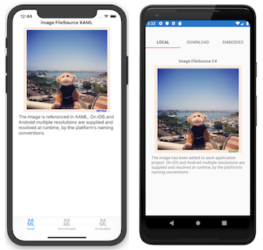
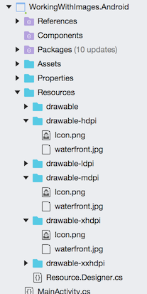
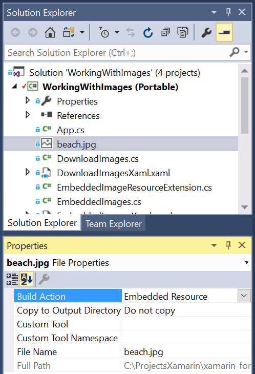
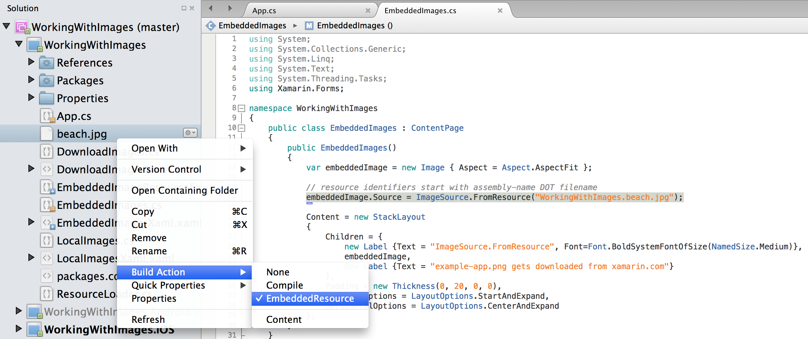
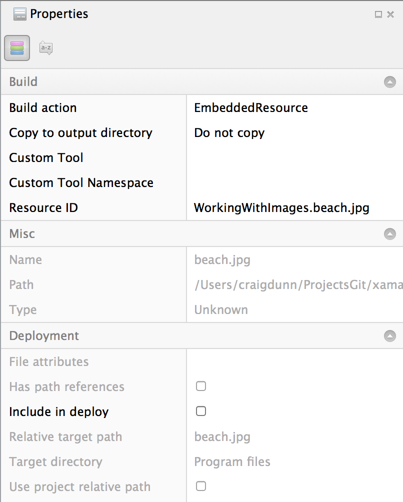
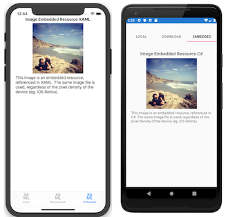
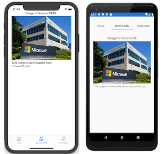

# Images

_Images can be shared across platforms with Xamarin.Forms, they can be loaded specifically for each platform, or they can be downloaded for display._

Images are a crucial part of application navigation, usability, and branding. Xamarin.Forms applications need to be able to share images across all platforms, but also potentially display different images on each platform.

Platform-specific images are also required for icons and splash screens; these need to be configured on a per-platform basis.

This document discusses the following topics:

- [ **Local images**](#Local_Images) - displaying images shipped with the application, including resolving native resolutions like iOS Retina or Android high-DPI versions of an image.
- [ **Embedded images**](#Embedded_Images) - displaying images embedded as an assembly resource.
- [ **Downloaded images**](#Downloading_Images) - downloading and displaying images.
- [ **Icons and splashscreens**](#Icons_and_splashscreens) - platform-specific icons and start-up images.

## Displaying Images

Xamarin.Forms uses the [`Image`](https://developer.xamarin.com/api/type/Xamarin.Forms.Image/) view to display images on a page. It has two important properties:

- [`Source`](https://developer.xamarin.com/api/property/Xamarin.Forms.Image.Source/) - An [`ImageSource`](https://developer.xamarin.com/api/type/Xamarin.Forms.ImageSource/) instance, either File, Uri or Resource, which sets the image to display.
- [`Aspect`](https://developer.xamarin.com/api/property/Xamarin.Forms.Image.Aspect/) - How to size the image within the bounds it is being displayed within (whether to stretch, crop or letterbox).

[`ImageSource`](https://developer.xamarin.com/api/type/Xamarin.Forms.ImageSource/) instances can be obtained using static methods for each type of image source:

- [`FromFile`](https://developer.xamarin.com/api/member/Xamarin.Forms.ImageSource.FromFile/p/System.String/) - Requires a filename or filepath that can be resolved on each platform.
- [`FromUri`](https://developer.xamarin.com/api/member/Xamarin.Forms.ImageSource.FromUri/p/System.Uri/) - Requires a Uri object, eg.  `new Uri("http://server.com/image.jpg")` .
- [`FromResource`](https://developer.xamarin.com/api/member/Xamarin.Forms.ImageSource.FromResource/p/System.String/) - Requires a resource identifier to an image file embedded in the application or PCL, with a **Build Action:EmbeddedResource**.
- [`FromStream`](https://developer.xamarin.com/api/member/Xamarin.Forms.ImageSource.FromStream/p/System.Func%7BSystem.IO.Stream%7D/) - Requires a stream that supplies image data.

The [`Aspect`](https://developer.xamarin.com/api/property/Xamarin.Forms.Image.Aspect/) property determines how the image will be scaled to fit the display area:

- [`Fill`](https://developer.xamarin.com/api/field/Xamarin.Forms.Aspect.Fill/) - Stretches the image to completely and exactly fill the display area. This may result in the image being distorted.
- [`AspectFill`](https://developer.xamarin.com/api/field/Xamarin.Forms.Aspect.AspectFill/) - Clips the image so that it fills the display area while preserving the aspect (ie. no distortion).
- [`AspectFit`](https://developer.xamarin.com/api/field/Xamarin.Forms.Aspect.AspectFit/) - Letterboxes the image (if required) so that the entire image fits into the display area, with blank space added to the top/bottom or sides depending on the whether the image is wide or tall.

Images can be loaded from a [local file](#Local_Images_in_Xaml), an [embedded resource](#embedded_images), or [downloaded](#Downloading_Images).

<a name="Local_Images" />

## Local Images

Image files can be added to each application project and referenced from Xamarin.Forms shared code. To use a single image across all apps, *the same filename must be used on every platform*, and it should be a valid Android resource name (ie. only lowercase letters, numerals, the underscore, and the period are allowed).

- **iOS** - The preferred way to manage and support images since iOS 9 is to use **Asset Catalog Image Sets**, which should contain all of the versions of an image that are necessary to support various devices and scale factors for an application. For more information, see [Adding Images to an Asset Catalog Image Set](~/ios/app-fundamentals/images-icons/displaying-an-image.md).
- **Android** - Place images in the  **Resources/drawable** directory with **Build Action: AndroidResource**. High- and low-DPI versions of an image can also be supplied (in appropriately named **Resources** subdirectories such as **drawable-ldpi**, **drawable-hdpi**, and **drawable-xhdpi**).
- **Windows Phone** - Place images in the application's root directory with **Build Action: Content**.
- **Universal Windows Platform (UWP)** - Place images in the application's root directory with **Build Action: Content**.

> [!IMPORTANT]
> Prior to iOS 9, images were typically placed in the **Resources** folder with **Build Action: BundleResource**. However, this method of working with images in an iOS app has been deprecated by Apple. For more information, see [Image Sizes and Filenames](~/ios/app-fundamentals/images-icons/displaying-an-image.md).

Adhering to these rules for file naming and placement allows the following XAML to load and display the image on all platforms:

```xaml
<Image Source="waterfront.jpg" />
```

The equivalent C# code is as follows:

```csharp
var image = new Image { Source = "waterfront.jpg" };
```

The following screenshots show the result of displaying a local image on each platform:

[](images-images/local.png#lightbox "Sample Application Displaying a Local Image")

For more flexibility the `Device.RuntimePlatform` property can be used to select a different image file or path for some or all platforms, as shown in this code example:

```csharp
image.Source = Device.RuntimePlatform == Device.Android ? ImageSource.FromFile("waterfront.jpg") : ImageSource.FromFile("Images/waterfront.jpg");
```

> [!IMPORTANT]
> To use the same image filename across all platforms the name must be valid on all platforms. Android drawables have naming restrictions – only lowercase letters, numbers, underscore, and period are allowed – and for cross-platform compatibility this must be followed on all the other platforms too. The example filename **waterfront.png**
follows the rules, but examples of invalid filenames include "water front.png", "WaterFront.png", "water-front.png", and "wåterfront.png".

<a name="Native_Resolutions" />

### Native Resolutions (Retina and High-DPI)

Both iOS and Android platforms include support for different image resolutions, where the operating system chooses the appropriate image at runtime based on the device's capabilities. Xamarin.Forms uses the native platforms' APIs for loading local images, so it automatically supports alternate resolutions if the files are correctly named and located in the project.

The preferred way to manage images since iOS 9 is to drag images for each resolution required to the appropriate asset catalog image set. For more information, see [Adding Images to an Asset Catalog Image Set](~/ios/app-fundamentals/images-icons/displaying-an-image.md).

Prior to iOS 9, retina versions of the image could be placed in the **Resources** folder - two and three times the resolution with a **@2x** or **@3x** suffixes on the filename before the file extension (eg. **myimage@2x.png**). However, this method of working with images in an iOS app has been deprecated by Apple. For more information, see [Image Sizes and Filenames](~/ios/app-fundamentals/images-icons/displaying-an-image.md).

Android alternate resolution images should be placed in [specially-named directories](http://developer.android.com/guide/practices/screens_support.html) in the Android project, as shown in the following screenshot:

[](images-images/xs-highdpisolution.png#lightbox "Android Multiple-Resolution Image Location")

### Additional Controls that Display Images

Some controls have properties that display an image, such as:

- [`Page`](https://developer.xamarin.com/api/type/Xamarin.Forms.Page/) - Any page type that derives from `Page` has [`Icon`](https://developer.xamarin.com/api/property/Xamarin.Forms.Page.Icon/) and [`BackgroundImage`](https://developer.xamarin.com/api/property/Xamarin.Forms.Page.BackgroundImage/) properties, which can be assigned a local file reference. Under certain circumstances, such as when a [`NavigationPage`](https://developer.xamarin.com/api/type/Xamarin.Forms.NavigationPage/) is displaying a [`ContentPage`](https://developer.xamarin.com/api/type/Xamarin.Forms.ContentPage/), the icon will be displayed if supported by the platform.

  > [!IMPORTANT]
  > On iOS, the [`Page.Icon`](https://developer.xamarin.com/api/property/Xamarin.Forms.Page.Icon/) property can't be populated from an image in an asset catalog image set. Instead, load icon images for the `Page.Icon` property from the **Resources** folder in the iOS project.

- [`ToolbarItem`](https://developer.xamarin.com/api/type/Xamarin.Forms.ToolbarItem/) - Has an [`Icon`](https://developer.xamarin.com/api/property/Xamarin.Forms.ToolbarItem.Icon/) property that can be set to a local file reference.
- [`ImageCell`](https://developer.xamarin.com/api/type/Xamarin.Forms.ImageCell/) - Has an [`ImageSource`](https://developer.xamarin.com/api/property/Xamarin.Forms.ImageCell.ImageSource/) property that can be set to an image retrieved from a local file, an embedded resource, or a URI.

<a name="embedded_images" />

## Embedded Images

Embedded images are also shipped with an application (like local images) but instead of having a copy of the image in each application's file structure the image file is embedded in the assembly as a resource. This method of distributing images is particularly suited to creating components, as the image is bundled with the code.

To embed an image in a project, right-click to add new items and select the image/s you wish to add. By default the image will have **Build Action: None**; this needs to be set to **Build Action: EmbeddedResource**.

# [Visual Studio](#tab/vswin)



The **Build Action** can be viewed and changed in the
**Properties** window for a file.

In this example the resource ID is **WorkingWithImages.beach.jpg**.
The IDE has generated this default by concatenating the **Default Namespace**
for this project with the filename, using a period (.) between each value.
<!-- https://msdn.microsoft.com/library/ms950960.aspx -->

# [Visual Studio for Mac](#tab/vsmac)



**Build Action** can also be viewed and changed in the
**Properties** pad for a file.
This pad shows the **Resource ID** that is used to
reference the resource in code. In the screenshot below, the **Resource ID**
is **WorkingWithImages.beach.jpg**.
The IDE has generated this default by concatenating the **Default Namespace**
for this project with the filename, using a period (.) between each value.
This ID can be edited in the **Properties** pad,
but for these examples the value **WorkingWithImages.beach.jpg** will be used.



-----

If you place embedded images into folders within your project, the folder names are also separated by periods (.) in the resource ID. Moving the **beach.jpg** image into a folder called **MyImages** would result in a resource ID of **WorkingWithImages.MyImages.beach.jpg**

The code to load an embedded image simply passes the **Resource ID** to the [`ImageSource.FromResource`](https://developer.xamarin.com/api/member/Xamarin.Forms.ImageSource.FromResource/p/System.String/) method as shown below:

```csharp
var embeddedImage = new Image { Source = ImageSource.FromResource("WorkingWithImages.beach.jpg") };
```

Currently there is no implicit conversion for resource identifiers. Instead, you must use [`ImageSource.FromResource`](https://developer.xamarin.com/api/member/Xamarin.Forms.ImageSource.FromResource/p/System.String/) or `new ResourceImageSource()` to load embedded images.

The following screenshots show the result of displaying an embedded image on each platform:

[](images-images/resource.png#lightbox "Sample Application Displaying an Embedded Image")

<a name="Embedded_Images_in_Xaml" />

### Using XAML

Because there is no built-in type converter from `string` to `ResourceImageSource`, these types of images cannot be natively loaded by XAML. Instead, a simple custom XAML markup extension can be written to load images using a **Resource ID** specified in XAML:

```csharp
[ContentProperty (nameof(Source))]
public class ImageResourceExtension : IMarkupExtension
{
 public string Source { get; set; }

 public object ProvideValue (IServiceProvider serviceProvider)
 {
   if (Source == null)
   {
     return null;
   }
   
   // Do your translation lookup here, using whatever method you require
   var imageSource = ImageSource.FromResource(Source);

   return imageSource;
 }
}
```

To use this extension add a custom `xmlns` to the XAML, using the correct namespace and assembly values for the project. The image source can then be set using this syntax: `{local:ImageResource WorkingWithImages.beach.jpg}`. A complete XAML example is shown below:

```xaml
<?xml version="1.0" encoding="UTF-8" ?>
<ContentPage
   xmlns="http://xamarin.com/schemas/2014/forms"
   xmlns:x="http://schemas.microsoft.com/winfx/2009/xaml"
   xmlns:local="clr-namespace:WorkingWithImages;assembly=WorkingWithImages"
   x:Class="WorkingWithImages.EmbeddedImagesXaml">
 <StackLayout VerticalOptions="Center" HorizontalOptions="Center">
   <!-- use a custom Markup Extension -->
   <Image Source="{local:ImageResource WorkingWithImages.beach.jpg}" />
 </StackLayout>
</ContentPage>
```

### Troubleshooting Embedded Images

<a name="Debugging_Embedded_Images" />

#### Debugging Code

Because it is sometimes difficult to understand why a particular image resource isn't being loaded, the following debug code can be added temporarily to an application to help confirm the resources are correctly configured. It will output all known resources embedded in the given assembly to the <span class="UIItem">Console</span> to help debug resource loading issues.

```csharp
using System.Reflection;
// ...
// NOTE: use for debugging, not in released app code!
var assembly = typeof(EmbeddedImages).GetTypeInfo().Assembly;
foreach (var res in assembly.GetManifestResourceNames())
{
    System.Diagnostics.Debug.WriteLine("found resource: " + res);
}
```

#### Images Embedded in Other Projects Don't Appear

`Image.FromResource` only looks for images in the same assembly as the code calling `FromResource`. Using the debug code above you can determine which assemblies contain a specific resource
by changing the `typeof()` statement to a `Type` known to be in each assembly.

<a name="Downloading_Images" />

## Downloading Images

Images can be automatically downloaded for display, as shown in the following XAML:

```xaml
<?xml version="1.0" encoding="utf-8" ?>
<ContentPage xmlns="http://xamarin.com/schemas/2014/forms"
       xmlns:x="http://schemas.microsoft.com/winfx/2006/xaml"
       x:Class="WorkingWithImages.DownloadImagesXaml">
  <StackLayout VerticalOptions="Center" HorizontalOptions="Center">
    <Label Text="Image UriSource Xaml" />
    <Image Source="https://xamarin.com/content/images/pages/forms/example-app.png" />
    <Label Text="example-app.png gets downloaded from xamarin.com" />
  </StackLayout>
</ContentPage>
```

The equivalent C# code is as follows:

```csharp
var webImage = new Image { Source = ImageSource.FromUri(new Uri("https://xamarin.com/content/images/pages/forms/example-app.png")) };
```

The [`ImageSource.FromUri`](https://developer.xamarin.com/api/member/Xamarin.Forms.ImageSource.FromUri/p/System.Uri/) method requires a `Uri` object, and returns a new [`UriImageSource`](https://developer.xamarin.com/api/type/Xamarin.Forms.UriImageSource/) that reads from the `Uri`.

There is also an implicit conversion for URI strings, so the following example will also work:

```csharp
webImage.Source = "https://xamarin.com/content/images/pages/forms/example-app.png";
```

The following screenshots show the result of displaying a remote image on each platform:

[](images-images/download.png#lightbox "Sample Application Displaying a Downloaded Image")

<a name="Image_Caching" />

### Downloaded Image Caching

A [`UriImageSource`](https://developer.xamarin.com/api/type/Xamarin.Forms.UriImageSource/) also supports caching of downloaded images, configured through the following properties:

- [`CachingEnabled`](https://developer.xamarin.com/api/property/Xamarin.Forms.UriImageSource.CachingEnabled/) - Whether caching is enabled (`true` by default).
- [`CacheValidity`](https://developer.xamarin.com/api/property/Xamarin.Forms.UriImageSource.CacheValidity/) - A `TimeSpan` that defines how long the image will be stored locally.

Caching is enabled by default and will store the image locally for 24 hours. To disable caching for a particular image, instantiate the image source as follows:

```csharp
image.Source = new UriImageSource { CachingEnabled = false, Uri="http://server.com/image" };
```

To set a specific cache period (for example, 5 days) instantiate the image source as follows:

```csharp
webImage.Source = new UriImageSource
{
    Uri = new Uri("https://xamarin.com/content/images/pages/forms/example-app.png"),
    CachingEnabled = true,
    CacheValidity = new TimeSpan(5,0,0,0)
};
```

Built-in caching makes it very easy to support scenarios like scrolling lists of images, where you can set (or bind) an image in each cell and let the built-in cache take care of re-loading the image when the cell is scrolled back into view.

<a name="Icons_and_splashscreens" />

## Icons and splashscreens

While not related to the [`Image`](https://developer.xamarin.com/api/type/Xamarin.Forms.Image/) view, application icons and splashscreens are also an important use of images in Xamarin.Forms projects.

Setting icons and splashscreens for Xamarin.Forms apps is done in each of the application projects. This means generating correctly sized images for iOS, Android, and UWP. These images should be named and located according to each platforms' requirements.

## Icons

See the [iOS Working with Images](~/ios/app-fundamentals/images-icons/index.md), [Google Iconography](http://developer.android.com/design/style/iconography.html), and [Guidelines for tile and icon assets](/windows/uwp/controls-and-patterns/tiles-and-notifications-app-assets/) for more information on creating these application resources.

## Splashscreens

Only iOS and UWP applications require a splashscreen (also called a startup screen or default image).

Refer to the documentation for [iOS Working with Images](~/ios/app-fundamentals/images-icons/index.md) and [Splash screens](/windows/uwp/launch-resume/splash-screens/) on the Windows Dev Center.

## Summary

Xamarin.Forms offers a number of different ways to include images in a cross-platform application, allowing for the same image to be used across platforms or for platform-specific images to be specified. Downloaded images are also automatically cached, automating a common coding scenario.

Application icon and splashscreen images are set-up and configured as for non-Xamarin.Forms applications - follow the same guidance used for platform-specific apps.


## Related Links

- [WorkingWithImages (sample)](https://developer.xamarin.com/samples/xamarin-forms/WorkingWithImages/)
- [iOS Working with Images](~/ios/app-fundamentals/images-icons/index.md)
- [Android Iconography](http://developer.android.com/design/style/iconography.html)
- [Guidelines for tile and icon assets](/windows/uwp/controls-and-patterns/tiles-and-notifications-app-assets/)
