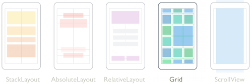
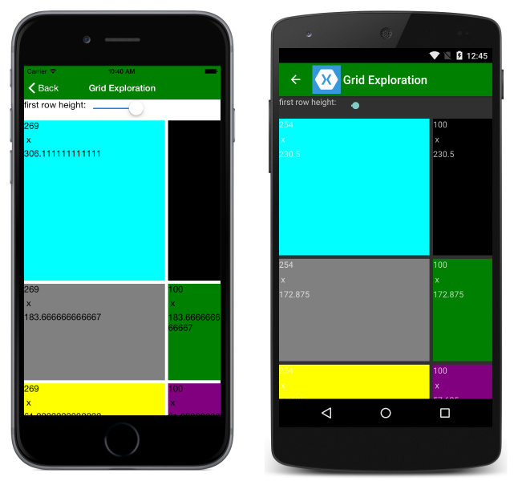
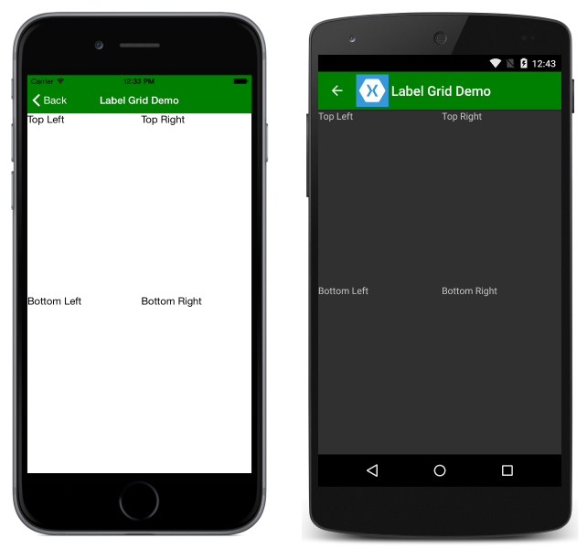
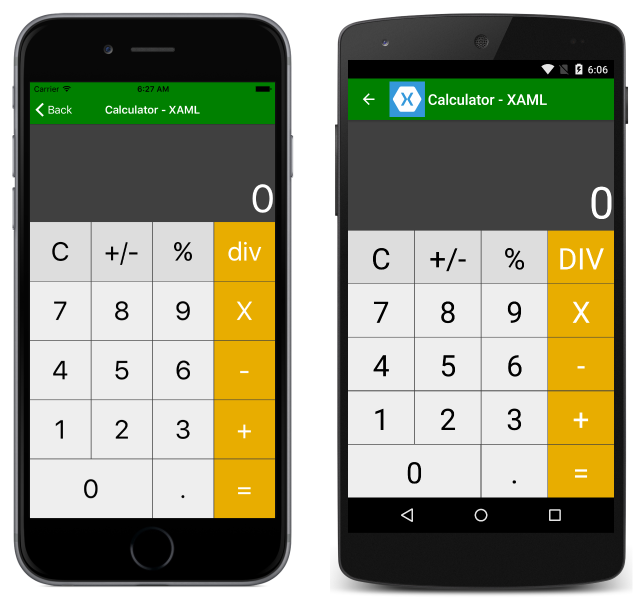

# Xamarin.Forms Grid

[ Download the sample](https://developer.xamarin.com/samples/xamarin-forms/UserInterface/Layout/)

[`Grid`](xref:Xamarin.Forms.Grid) supports arranging views into rows and columns. Rows and columns can be set to have proportional sizes or absolute sizes. The `Grid` layout should not be confused with traditional tables and is not intended to present tabular data. `Grid` does not have the concept of row, column or cell formatting. Unlike HTML tables, `Grid` is purely intended for laying out content.

[](grid-images/layouts.png#lightbox "Xamarin.Forms Layouts")

This article will cover:

- **[Purpose](#purpose)** &ndash; common uses for `Grid`.
- **[Usage](#usage)** &ndash; how to use `Grid` to achieve your desired design.
  - **[Rows and Columns](#rows-and-columns)** &ndash; specify rows and columns for the `Grid`.
  - **[Placing Views](#placing-views-in-a-grid)** &ndash; add views to the grid at specific rows and columns.
  - **[Spacing](#spacing)** &ndash; configure the spaces between rows and columns.
  - **[Spans](#spans)** &ndash; configure elements to span across multiple rows or columns.



## Purpose

`Grid` can be used to arrange views into a grid. This is useful in a number of cases:

- Arranging buttons in a calculator app
- Arranging buttons/choices in a grid, like the iOS or Android home screens
- Arranging views so that they are of equal size in one dimension ( like in some toolbars)

## Usage

Unlike traditional tables, `Grid` does not infer the number and sizes of rows and columns from the content. Instead, `Grid` has `RowDefinitions` and `ColumnDefinitions` collections. These hold definitions of how many rows and columns will be laid out. Views are added to `Grid` with specified row and column indices, which identify which row and column a view should be placed in.

### Rows and Columns

Row and column information is stored in `Grid`'s `RowDefinitions` & `ColumnDefinitions` properties, which are each collections of [`RowDefinition`](xref:Xamarin.Forms.RowDefinition) and [`ColumnDefinition`](xref:Xamarin.Forms.ColumnDefinition) objects, respectively. `RowDefinition` has a single property, `Height`, and `ColumnDefinition` has a single property, `Width`. The options for height and width are as follows:

- **Auto** &ndash; automatically sizes to fit content in the row or column. Specified as [`GridUnitType.Auto`](xref:Xamarin.Forms.GridUnitType) in C# or as `Auto` in XAML.
- **Proportional(*)** &ndash; sizes columns and rows as a proportion of the remaining space. Specified as a value and `GridUnitType.Star` in C# and as `#*` in XAML, with `#` being your desired value. Specifying one row/column with `*` will cause it to fill the available space.
- **Absolute** &ndash; sizes columns and rows with specific, fixed height and width values. Specified as a value and `GridUnitType.Absolute` in C# and as `#` in XAML, with `#` being your desired value.

> [!NOTE]
> The width values for columns are set as `*` by default in Xamarin.Forms, which ensures that the column will fill the available space. The height values for rows are also set as `*` by default.

Consider an app that needs three rows and two columns. The bottom row needs to be exactly 200px tall and the top row needs to be twice as tall as the middle row. The left column needs to be wide enough to fit the content and the right column needs to fill the remaining space.

In XAML:

```xaml
<Grid>
  <Grid.RowDefinitions>
    <RowDefinition Height="2*" />
    <RowDefinition Height="*" />
    <RowDefinition Height="200" />
  </Grid.RowDefinitions>
  <Grid.ColumnDefinitions>
    <ColumnDefinition Width="Auto" />
    <ColumnDefinition Width="*" />
  </Grid.ColumnDefinitions>
</Grid>
```

In C#:

```csharp
Grid grid = new Grid();
grid.RowDefinitions.Add (new RowDefinition { Height = new GridLength(2, GridUnitType.Star) });
grid.RowDefinitions.Add (new RowDefinition { Height = new GridLength (1, GridUnitType.Star) });
grid.RowDefinitions.Add (new RowDefinition { Height = new GridLength(200)});
grid.ColumnDefinitions.Add (new ColumnDefinition{ Width = new GridLength (200) });
grid.ColumnDefinitions.Add(new ColumnDefinition { Width = new GridLength(1, GridUnitType.Auto) });
```

### Placing Views in a Grid

To place views in a `Grid` you'll need to add them as children to the grid, then specify which row and column they belong in.

In XAML, use `Grid.Row` and `Grid.Column` on each individual view to specify placement. Note that `Grid.Row` and `Grid.Column` specify location based on the zero-based lists of rows and columns. This means that in a 4x4 grid, the top left cell is (0,0) and the bottom right cell is (3,3).

The `Grid` shown below contains four cells:



In XAML:

```xaml
<Grid>
  <Grid.RowDefinitions>
    <RowDefinition Height="*" />
    <RowDefinition Height="*" />
  </Grid.RowDefinitions>
  <Grid.ColumnDefinitions>
    <ColumnDefinition Width="*" />
    <ColumnDefinition Width="*" />
  </Grid.ColumnDefinitions>
  <Label Text="Top Left" Grid.Row="0" Grid.Column="0" />
  <Label Text="Top Right" Grid.Row="0" Grid.Column="1" />
  <Label Text="Bottom Left" Grid.Row="1" Grid.Column="0" />
  <Label Text="Bottom Right" Grid.Row="1" Grid.Column="1" />
</Grid>
```

In C#:

```csharp
var grid = new Grid();

grid.RowDefinitions.Add(new RowDefinition { Height = new GridLength(1, GridUnitType.Star)});
grid.RowDefinitions.Add(new RowDefinition { Height = new GridLength(1, GridUnitType.Star)});
grid.ColumnDefinitions.Add(new ColumnDefinition { Width = new GridLength(1, GridUnitType.Star)});
grid.ColumnDefinitions.Add(new ColumnDefinition { Width = new GridLength(1, GridUnitType.Star)});

var topLeft = new Label { Text = "Top Left" };
var topRight = new Label { Text = "Top Right" };
var bottomLeft = new Label { Text = "Bottom Left" };
var bottomRight = new Label { Text = "Bottom Right" };

grid.Children.Add(topLeft, 0, 0);
grid.Children.Add(topRight, 1, 0);
grid.Children.Add(bottomLeft, 0, 1);
grid.Children.Add(bottomRight, 1, 1);
```

The above code creates grid with four labels, two columns, and two rows. Note that each label will have the same size and that the rows will expand to use all available space.

In the example above, views are added to the [`Grid.Children`](xref:Xamarin.Forms.Grid.Children) collection using the [`Add`](xref:Xamarin.Forms.Grid.IGridList`1.Add*) overload that specifies left and top arguments. When using the [`Add`](xref:Xamarin.Forms.Grid.IGridList`1.Add*) overload that specifies left, right, top, and bottom arguments, while the left and top arguments will always refer to cells within the [`Grid`](xref:Xamarin.Forms.Grid), the right and bottom arguments may appear to refer to cells that are outside the `Grid`. This is because the right argument must always be greater than the left argument, and the bottom argument must always be greater than the top argument. The following example shows equivalent code using both `Add` overloads:

```csharp
// left, top
grid.Children.Add(topLeft, 0, 0);
grid.Children.Add(topRight, 1, 0);
grid.Children.Add(bottomLeft, 0, 1);
grid.Children.Add(bottomRight, 1, 1);

// left, right, top, bottom
grid.Children.Add(topLeft, 0, 1, 0, 1);
grid.Children.Add(topRight, 1, 2, 0, 1);
grid.Children.Add(bottomLeft, 0, 1, 1, 2);
grid.Children.Add(bottomRight, 1, 2, 1, 2);
```

### Spacing

`Grid` has properties to control spacing between rows and columns. The following properties are available for customizing the `Grid`:

- **ColumnSpacing** &ndash; the amount of space between columns. The default value of this property is 6.
- **RowSpacing** &ndash; the amount of space between rows. The default value of this property is 6.

The following XAML specifies a `Grid` with two columns, one row, and 5 px of spacing between columns:

```xaml
<Grid ColumnSpacing="5">
  <Grid.ColumnDefinitions>
    <ColumnDefinition Width="*" />
    <ColumnDefinition Width="*" />
  </Grid.ColumnDefinitions>
</Grid>
```

In C#:

```csharp
var grid = new Grid { ColumnSpacing = 5 };
grid.ColumnDefinitions.Add(new ColumnDefinition { Width = new GridLength (1, GridUnitType.Star)});
grid.ColumnDefinitions.Add(new ColumnDefinition { Width = new GridLength (1, GridUnitType.Star)});
```

### Spans

Often when working with a grid, there is an element that should occupy more than one row or column. Consider a simple calculator application:



Notice that the 0 button spans two columns, just like on the built-in calculators for each platform. This is accomplished using the `ColumnSpan` property, which specifies how many columns an element should occupy. The XAML for that button:

```xaml
<Button Text = "0" Grid.Row="4" Grid.Column="0" Grid.ColumnSpan="2" />
```

And in C#:

```csharp
Button zeroButton = new Button { Text = "0" };
controlGrid.Children.Add (zeroButton, 0, 4);
Grid.SetColumnSpan (zeroButton, 2);
```

Note that in code, static methods of the `Grid` class are used to perform positioning changes including changes to `ColumnSpan` and `RowSpan`. Also note that, unlike other properties that can be set at any time, properties set using the static methods must already be in the grid before they are changed.

The complete XAML for the above calculator app is as follows:

```xaml
<?xml version="1.0" encoding="UTF-8"?>
<ContentPage xmlns="http://xamarin.com/schemas/2014/forms"
xmlns:x="http://schemas.microsoft.com/winfx/2009/xaml"
x:Class="LayoutSamples.CalculatorGridXAML"
Title = "Calculator - XAML"
BackgroundColor="#404040">
    <ContentPage.Resources>
        <ResourceDictionary>
            <Style x:Key="plainButton" TargetType="Button">
                <Setter Property="BackgroundColor" Value="#eee"/>
                <Setter Property="TextColor" Value="Black" />
                <Setter Property="BorderRadius" Value="0"/>
                <Setter Property="FontSize" Value="40" />
            </Style>
            <Style x:Key="darkerButton" TargetType="Button">
                <Setter Property="BackgroundColor" Value="#ddd"/>
                <Setter Property="TextColor" Value="Black" />
                <Setter Property="BorderRadius" Value="0"/>
                <Setter Property="FontSize" Value="40" />
            </Style>
            <Style x:Key="orangeButton" TargetType="Button">
                <Setter Property="BackgroundColor" Value="#E8AD00"/>
                <Setter Property="TextColor" Value="White" />
                <Setter Property="BorderRadius" Value="0"/>
                <Setter Property="FontSize" Value="40" />
            </Style>
        </ResourceDictionary>
    </ContentPage.Resources>
    <ContentPage.Content>
        <Grid x:Name="controlGrid" RowSpacing="1" ColumnSpacing="1">
            <Grid.RowDefinitions>
                <RowDefinition Height="150" />
                <RowDefinition Height="*" />
                <RowDefinition Height="*" />
                <RowDefinition Height="*" />
                <RowDefinition Height="*" />
                <RowDefinition Height="*" />
            </Grid.RowDefinitions>
            <Grid.ColumnDefinitions>
                <ColumnDefinition Width="*" />
                <ColumnDefinition Width="*" />
                <ColumnDefinition Width="*" />
                <ColumnDefinition Width="*" />
            </Grid.ColumnDefinitions>
            <Label Text="0" Grid.Row="0" HorizontalTextAlignment="End" VerticalTextAlignment="End" TextColor="White"
        FontSize="60" Grid.ColumnSpan="4" />
            <Button Text = "C" Grid.Row="1" Grid.Column="0"
        Style="{StaticResource darkerButton}" />
            <Button Text = "+/-" Grid.Row="1" Grid.Column="1"
        Style="{StaticResource darkerButton}" />
            <Button Text = "%" Grid.Row="1" Grid.Column="2"
        Style="{StaticResource darkerButton}" />
            <Button Text = "div" Grid.Row="1" Grid.Column="3"
        Style="{StaticResource orangeButton}" />
            <Button Text = "7" Grid.Row="2" Grid.Column="0"
        Style="{StaticResource plainButton}" />
            <Button Text = "8" Grid.Row="2" Grid.Column="1"
        Style="{StaticResource plainButton}" />
            <Button Text = "9" Grid.Row="2" Grid.Column="2"
        Style="{StaticResource plainButton}" />
            <Button Text = "X" Grid.Row="2" Grid.Column="3"
        Style="{StaticResource orangeButton}" />
            <Button Text = "4" Grid.Row="3" Grid.Column="0"
        Style="{StaticResource plainButton}" />
            <Button Text = "5" Grid.Row="3" Grid.Column="1"
        Style="{StaticResource plainButton}" />
            <Button Text = "6" Grid.Row="3" Grid.Column="2"
        Style="{StaticResource plainButton}" />
            <Button Text = "-" Grid.Row="3" Grid.Column="3"
        Style="{StaticResource orangeButton}" />
            <Button Text = "1" Grid.Row="4" Grid.Column="0"
        Style="{StaticResource plainButton}" />
            <Button Text = "2" Grid.Row="4" Grid.Column="1"
        Style="{StaticResource plainButton}" />
            <Button Text = "3" Grid.Row="4" Grid.Column="2"
        Style="{StaticResource plainButton}" />
            <Button Text = "+" Grid.Row="4" Grid.Column="3"
        Style="{StaticResource orangeButton}" />
            <Button Text = "0" Grid.ColumnSpan="2"
        Grid.Row="5" Grid.Column="0" Style="{StaticResource plainButton}" />
            <Button Text = "." Grid.Row="5" Grid.Column="2"
        Style="{StaticResource plainButton}" />
            <Button Text = "=" Grid.Row="5" Grid.Column="3"
        Style="{StaticResource orangeButton}" />
        </Grid>
    </ContentPage.Content>
</ContentPage>
```

Notice that both the label at the top of the grid and the zero button are occuping more than one column. Although a similar layout could be achieved using nested grids, the `ColumnSpan` & `RowSpan` approach is simpler.

The C# implementation:

```csharp
public CalculatorGridCode ()
{
  Title = "Calculator - C#";
  BackgroundColor = Color.FromHex ("#404040");

  var plainButton = new Style (typeof(Button)) {
    Setters = {
      new Setter { Property = Button.BackgroundColorProperty, Value = Color.FromHex ("#eee") },
      new Setter { Property = Button.TextColorProperty, Value = Color.Black },
      new Setter { Property = Button.BorderRadiusProperty, Value = 0 },
      new Setter { Property = Button.FontSizeProperty, Value = 40 }
    }
  };
  var darkerButton = new Style (typeof(Button)) {
    Setters = {
      new Setter { Property = Button.BackgroundColorProperty, Value = Color.FromHex ("#ddd") },
      new Setter { Property = Button.TextColorProperty, Value = Color.Black },
      new Setter { Property = Button.BorderRadiusProperty, Value = 0 },
      new Setter { Property = Button.FontSizeProperty, Value = 40 }
    }
  };
  var orangeButton = new Style (typeof(Button)) {
    Setters = {
      new Setter { Property = Button.BackgroundColorProperty, Value = Color.FromHex ("#E8AD00") },
      new Setter { Property = Button.TextColorProperty, Value = Color.White },
      new Setter { Property = Button.BorderRadiusProperty, Value = 0 },
      new Setter { Property = Button.FontSizeProperty, Value = 40 }
    }
  };

  var controlGrid = new Grid { RowSpacing = 1, ColumnSpacing = 1 };
  controlGrid.RowDefinitions.Add (new RowDefinition { Height = new GridLength (150) });
  controlGrid.RowDefinitions.Add (new RowDefinition { Height = new GridLength (1, GridUnitType.Star) });
  controlGrid.RowDefinitions.Add (new RowDefinition { Height = new GridLength (1, GridUnitType.Star) });
  controlGrid.RowDefinitions.Add (new RowDefinition { Height = new GridLength (1, GridUnitType.Star) });
  controlGrid.RowDefinitions.Add (new RowDefinition { Height = new GridLength (1, GridUnitType.Star) });
  controlGrid.RowDefinitions.Add (new RowDefinition { Height = new GridLength (1, GridUnitType.Star) });

  controlGrid.ColumnDefinitions.Add (new ColumnDefinition { Width = new GridLength (1, GridUnitType.Star) });
  controlGrid.ColumnDefinitions.Add (new ColumnDefinition { Width = new GridLength (1, GridUnitType.Star) });
  controlGrid.ColumnDefinitions.Add (new ColumnDefinition { Width = new GridLength (1, GridUnitType.Star) });
  controlGrid.ColumnDefinitions.Add (new ColumnDefinition { Width = new GridLength (1, GridUnitType.Star) });

  var label = new Label {
    Text = "0",
    HorizontalTextAlignment = TextAlignment.End,
    VerticalTextAlignment = TextAlignment.End,
    TextColor = Color.White,
    FontSize = 60
  };
  controlGrid.Children.Add (label, 0, 0);

  Grid.SetColumnSpan (label, 4);

  controlGrid.Children.Add (new Button { Text = "C", Style = darkerButton }, 0, 1);
  controlGrid.Children.Add (new Button { Text = "+/-", Style = darkerButton }, 1, 1);
  controlGrid.Children.Add (new Button { Text = "%", Style = darkerButton }, 2, 1);
  controlGrid.Children.Add (new Button { Text = "div", Style = orangeButton }, 3, 1);
  controlGrid.Children.Add (new Button { Text = "7", Style = plainButton }, 0, 2);
  controlGrid.Children.Add (new Button { Text = "8", Style = plainButton }, 1, 2);
  controlGrid.Children.Add (new Button { Text = "9", Style = plainButton }, 2, 2);
  controlGrid.Children.Add (new Button { Text = "X", Style = orangeButton }, 3, 2);
  controlGrid.Children.Add (new Button { Text = "4", Style = plainButton }, 0, 3);
  controlGrid.Children.Add (new Button { Text = "5", Style = plainButton }, 1, 3);
  controlGrid.Children.Add (new Button { Text = "6", Style = plainButton }, 2, 3);
  controlGrid.Children.Add (new Button { Text = "-", Style = orangeButton }, 3, 3);
  controlGrid.Children.Add (new Button { Text = "1", Style = plainButton }, 0, 4);
  controlGrid.Children.Add (new Button { Text = "2", Style = plainButton }, 1, 4);
  controlGrid.Children.Add (new Button { Text = "3", Style = plainButton }, 2, 4);
  controlGrid.Children.Add (new Button { Text = "+", Style = orangeButton }, 3, 4);
  controlGrid.Children.Add (new Button { Text = ".", Style = plainButton }, 2, 5);
  controlGrid.Children.Add (new Button { Text = "=", Style = orangeButton }, 3, 5);

  var zeroButton = new Button { Text = "0", Style = plainButton };
  controlGrid.Children.Add (zeroButton, 0, 5);
  Grid.SetColumnSpan (zeroButton, 2);

  Content = controlGrid;
}
```


## Related Links

- [Creating Mobile Apps with Xamarin.Forms, Chapter 17](https://developer.xamarin.com/r/xamarin-forms/book/chapter17.pdf)
- [Grid](xref:Xamarin.Forms.Grid)
- [Layout (sample)](https://developer.xamarin.com/samples/xamarin-forms/UserInterface/Layout/)
- [BusinessTumble Example (sample)](https://developer.xamarin.com/samples/xamarin-forms/UserInterface/BusinessTumble/)
