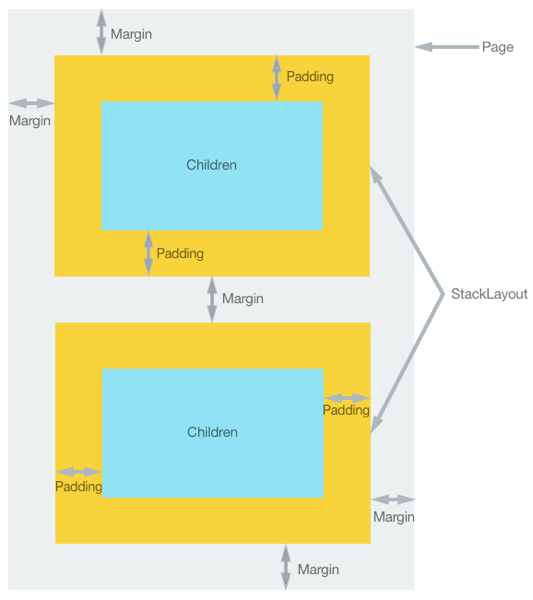

# Margin and Padding

_The Margin and Padding properties control layout behavior when an element is rendered in the user interface. This article demonstrates the difference between the two properties, and how to set them._

## Overview

Margin and padding are related layout concepts:

- The [`Margin`](xref:Xamarin.Forms.View.Margin) property represents the distance between an element and its adjacent elements, and is used to control the element's rendering position, and the rendering position of its neighbors. `Margin` values can be specified on [layout](~/xamarin-forms/user-interface/controls/layouts.md) and [view](~/xamarin-forms/user-interface/controls/views.md) classes.
- The [`Padding`](xref:Xamarin.Forms.Layout.Padding) property represents the distance between an element and its child elements, and is used to separate the control from its own content. `Padding` values can be specified on [layout](~/xamarin-forms/user-interface/controls/layouts.md) classes.

The following diagram illustrates the two concepts:

[](margin-and-padding-images/margins-and-padding.png#lightbox "Margins and Padding Concepts")

Note that [`Margin`](xref:Xamarin.Forms.View.Margin) values are additive. Therefore, if two adjacent elements specify a margin of 20 pixels, the distance between the elements will be 40 pixels. In addition, margin and padding are additive when both are applied, in that the distance between an element and any content will be the margin plus padding.

## Specifying a Thickness

The [`Margin`](xref:Xamarin.Forms.View.Margin) and [`Padding`](xref:Xamarin.Forms.Layout.Padding) properties are both of type [`Thickness`](xref:Xamarin.Forms.Thickness). There are three possibilities when creating a `Thickness` structure:

- Create a [`Thickness`](xref:Xamarin.Forms.Thickness) structure defined by a single uniform value. The single value is applied to the left, top, right, and bottom sides of the element.
- Create a [`Thickness`](xref:Xamarin.Forms.Thickness) structure defined by horizontal and vertical values. The horizontal value is symmetrically applied to the left and right sides of the element, with the vertical value being symmetrically applied to the top and bottom sides of the element.
- Create a [`Thickness`](xref:Xamarin.Forms.Thickness) structure defined by four distinct values that are applied to the left, top, right, and bottom sides of the element.

The following XAML code example shows all three possibilities:

```xaml
<StackLayout Padding="0,20,0,0">
  <Label Text="Xamarin.Forms" Margin="20" />
  <Label Text="Xamarin.iOS" Margin="10, 15" />
  <Label Text="Xamarin.Android" Margin="0, 20, 15, 5" />
</StackLayout>
```

The equivalent C# code is shown in the following code example:

```csharp
var stackLayout = new StackLayout {
  Padding = new Thickness(0,20,0,0),
  Children = {
    new Label { Text = "Xamarin.Forms", Margin = new Thickness (20) },
    new Label { Text = "Xamarin.iOS", Margin = new Thickness (10, 25) },
    new Label { Text = "Xamarin.Android", Margin = new Thickness (0, 20, 15, 5) }
  }
};
```

> [!NOTE]
> `Thickness` values can be negative, which typically clips or overdraws the content.

## Summary

This article demonstrated the difference between the [`Margin`](xref:Xamarin.Forms.View.Margin) and [`Padding`](xref:Xamarin.Forms.Layout.Padding) properties, and how to set them. The properties control layout behavior when an element is rendered in the user interface.


## Related Links

- [Margin](xref:Xamarin.Forms.View.Margin)
- [Padding](xref:Xamarin.Forms.Layout.Padding)
- [Thickness](xref:Xamarin.Forms.Thickness)
