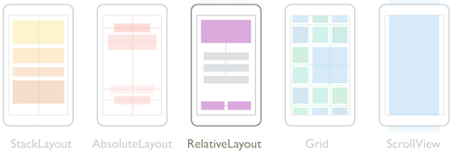
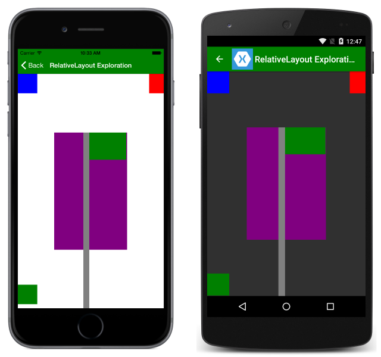
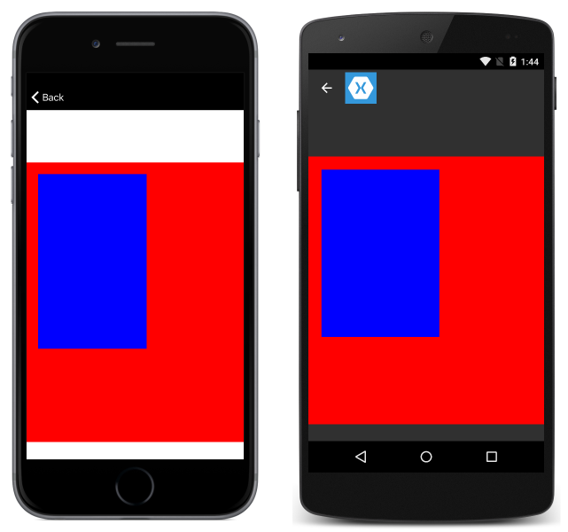
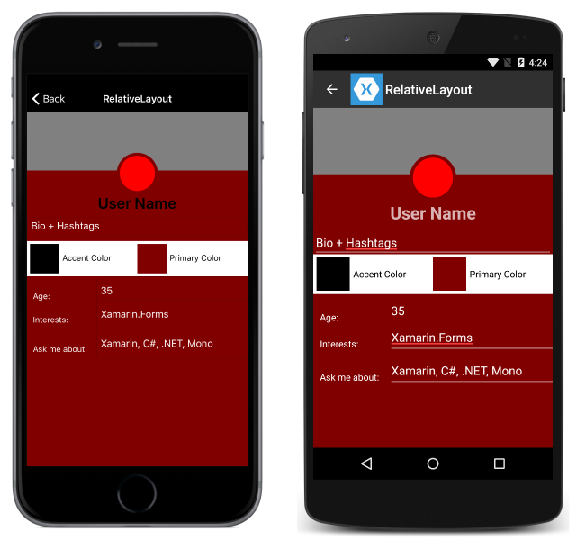

# RelativeLayout

`RelativeLayout` is used to position and size views relative to properties of the layout or sibling views. Unlike `AbsoluteLayout`, `RelativeLayout` does not have the concept of the moving anchor and does not have facilities for positioning elements relative to the bottom or right edges of the layout. `RelativeLayout` does support positioning elements outside of its own bounds.

[](relative-layout-images/layouts.png#lightbox "Xamarin.Forms Layouts")

## Purpose

`RelativeLayout` can be used to position views on screen relative to the overall layout or to other views.



## Usage

### Understanding Constraints

Positioning and sizing a view within a `RelativeLayout` is done with constraints. A constraint expression can include the following information:

- **Type** &ndash; whether the constraint is relative to the parent or to another view.
- **Property** &ndash; which property to use as the basis for the constraint.
- **Factor** &ndash; the factor to apply to the property value.
- **Constant** &ndash; the value to use as an offset of the value.
- **ElementName** &ndash; the name of the view that the constraint is relative to.

In XAML, constraints are expressed as `ConstraintExpression`s. Consider the following example:

```xaml
<BoxView Color="Green" WidthRequest="50" HeightRequest="50"
    RelativeLayout.XConstraint =
      "{ConstraintExpression Type=RelativeToParent,
                             Property=Width,
                             Factor=0.5,
                             Constant=-100}"
    RelativeLayout.YConstraint =
      "{ConstraintExpression Type=RelativeToParent,
                             Property=Height,
                             Factor=0.5,
                             Constant=-100}" />
```

In C#, constraints are expressed a little differently, using functions rather than expressions on the view. Constraints are specified as arguments to the layout's `Add` method:

```csharp
layout.Children.Add(box, Constraint.RelativeToParent((parent) =>
    {
      return (.5 * parent.Width) - 100;
    }),
    Constraint.RelativeToParent((parent) =>
    {
        return (.5 * parent.Height) - 100;
    }),
    Constraint.Constant(50), Constraint.Constant(50));
```

Note the following aspects of the above layout:

- The `x` and `y` constraints are specified with their own constraints.
- In C#, relative constraints are defined as functions. Concepts like `Factor` aren't there, but can be implemented manually.
- The box's `x` coordinate is defined as half the width of the parent, -100.
- The box's `y` coordinate is defined as half the height of the parent, -100.

> [!NOTE]
> Because of the way constraints are defined, it is possible to make more complex layouts in C# than can be specified with XAML.

Both of the examples above define constraints as `RelativeToParent` &ndash; that is, their values are relative to the parent element. It is also possible to define constraints as relative to another view. This allows for more intuitive (to the developer) layouts and can make the intent of your layout code more readily apparent.

Consider a layout where one element needs to be 20 pixels lower than another. If both elements are defined with constant values, the lower could have its `Y` constraint defined as a constant that is 20 pixels greater than the `Y` constraint of the higher element. That approach falls short if the higher element is positioned using a proportion, so that the pixel size isn't known. In that case, constraining the element based on another element's position is more robust:

```xaml
<RelativeLayout>
    <BoxView Color="Red" x:Name="redBox"
        RelativeLayout.YConstraint="{ConstraintExpression Type=RelativeToParent,
            Property=Height,Factor=.15,Constant=0}"
        RelativeLayout.WidthConstraint="{ConstraintExpression
            Type=RelativeToParent,Property=Width,Factor=1,Constant=0}"
        RelativeLayout.HeightConstraint="{ConstraintExpression
            Type=RelativeToParent,Property=Height,Factor=.8,Constant=0}" />
    <BoxView Color="Blue"
        RelativeLayout.YConstraint="{ConstraintExpression Type=RelativeToView,
            ElementName=redBox,Property=Y,Factor=1,Constant=20}"
        RelativeLayout.XConstraint="{ConstraintExpression Type=RelativeToView,
            ElementName=redBox,Property=X,Factor=1,Constant=20}"
        RelativeLayout.WidthConstraint="{ConstraintExpression
            Type=RelativeToParent,Property=Width,Factor=.5,Constant=0}"
        RelativeLayout.HeightConstraint="{ConstraintExpression
            Type=RelativeToParent,Property=Height,Factor=.5,Constant=0}" />
</RelativeLayout>
```

To accomplish the same layout in C#:

```csharp
layout.Children.Add (redBox, Constraint.RelativeToParent ((parent) => {
        return parent.X;
    }), Constraint.RelativeToParent ((parent) => {
        return parent.Y * .15;
    }), Constraint.RelativeToParent((parent) => {
        return parent.Width;
    }), Constraint.RelativeToParent((parent) => {
        return parent.Height * .8;
    }));
layout.Children.Add (blueBox, Constraint.RelativeToView (redBox, (Parent, sibling) => {
        return sibling.X + 20;
    }), Constraint.RelativeToView (blueBox, (parent, sibling) => {
        return sibling.Y + 20;
    }), Constraint.RelativeToParent((parent) => {
        return parent.Width * .5;
    }), Constraint.RelativeToParent((parent) => {
        return parent.Height * .5;
    }));
```

This produces the following output, with the blue box's position determined _relative_ to the position of the red box:



### Sizing

Views laid out by `RelativeLayout` have two options for specifying their size:

- `HeightRequest & WidthRequest`
- `RelativeLayout.WidthConstraint` & `RelativeLayout.HeightConstraint`

`HeightRequest` and `WidthRequest` specify the intended height and width of the view, but may be overridden by layouts as needed. `WidthConstraint` and `HeightConstraint` support setting the height and width as a value relative to the layout's or another view's properties, or as a constant value.

## Exploring a Complex Layout
Each of the layouts have strengths and weaknesses for creating particular layouts. Throughout this series of layout articles, a sample app has been created with the same page layout implemented using three different layouts.

Consider the following XAML:

```xaml
<?xml version="1.0" encoding="UTF-8"?>
<ContentPage xmlns="http://xamarin.com/schemas/2014/forms"
xmlns:x="http://schemas.microsoft.com/winfx/2009/xaml"
x:Class="TheBusinessTumble.RelativeLayoutPage"
BackgroundColor="Maroon"
Title="RelativeLayout">
    <ContentPage.Content>
    <ScrollView>
      <RelativeLayout>
        <BoxView Color="Gray" HeightRequest="100"
            RelativeLayout.WidthConstraint="{ConstraintExpression Type=RelativeToParent, Property=Width, Factor=1}" />
        <Button BorderRadius="35" x:Name="imageCircleBack"
            BackgroundColor="Maroon" HeightRequest="70" WidthRequest="70" RelativeLayout.XConstraint="{ConstraintExpression Type=RelativeToParent,Property=Width, Factor=.5, Constant = -35}" RelativeLayout.YConstraint="{ConstraintExpression Type=RelativeToParent, Factor=0, Property=Y, Constant=70}" />
        <Button BorderRadius="30" BackgroundColor="Red" HeightRequest="60"
            WidthRequest="60" RelativeLayout.XConstraint="{ConstraintExpression Type=RelativeToView, ElementName=imageCircleBack, Property=X, Factor=1,Constant=5}" RelativeLayout.YConstraint="{ConstraintExpression Type=RelativeToParent, Factor=0, Property=Y, Constant=75}" />
        <Label Text="User Name" FontAttributes="Bold" FontSize="26"
            HorizontalTextAlignment="Center" RelativeLayout.YConstraint="{ConstraintExpression Type=RelativeToParent, Property=Y, Factor=0, Constant=140}" RelativeLayout.WidthConstraint="{ConstraintExpression Type=RelativeToParent, Property=Width, Factor=1}" />
        <Entry Text="Bio + Hashtags" TextColor="White" BackgroundColor="Maroon"
            RelativeLayout.YConstraint="{ConstraintExpression Type=RelativeToParent, Property=Y, Factor=0, Constant=180}" RelativeLayout.WidthConstraint="{ConstraintExpression Type=RelativeToParent, Property=Width, Factor=1}" />
        <RelativeLayout BackgroundColor="White" RelativeLayout.YConstraint="
            {ConstraintExpression Type=RelativeToParent, Property=Y, Factor=0, Constant=220}" HeightRequest="60" RelativeLayout.WidthConstraint="{ConstraintExpression Type=RelativeToParent, Property=Width, Factor=1}" >
            <BoxView BackgroundColor="Black" WidthRequest="50"
                HeightRequest="50" RelativeLayout.YConstraint="{ConstraintExpression Type=RelativeToParent, Property=Y, Factor=0, Constant=5}" RelativeLayout.XConstraint="{ConstraintExpression Type=RelativeToParent, Property=X, Factor=0, Constant=5}" />
            <BoxView BackgroundColor="Maroon" WidthRequest="50"
                HeightRequest="50" RelativeLayout.YConstraint="{ConstraintExpression Type=RelativeToParent, Property=Y, Factor=0, Constant=5}" RelativeLayout.XConstraint="{ConstraintExpression Type=RelativeToParent, Property=Width, Factor=0.5, Constant=}" />
            <Label FontSize="14" TextColor="Black" Text="Accent Color"
                RelativeLayout.YConstraint="{ConstraintExpression Type=RelativeToParent, Property=Y, Factor=0, Constant=20}" RelativeLayout.XConstraint="{ConstraintExpression Type=RelativeToParent, Property=X, Factor=0, Constant=60}" />
            <Label FontSize="14" TextColor="Black" Text="Primary Color"
                RelativeLayout.YConstraint="{ConstraintExpression Type=RelativeToParent, Property=Y, Factor=0, Constant=20}" RelativeLayout.XConstraint="{ConstraintExpression Type=RelativeToParent, Property=Width, Factor=0.5, Constant=55}" />
        </RelativeLayout>
        <RelativeLayout Padding="5,0,0,0">
          <Label FontSize="14" Text="Age:" TextColor="White"
            RelativeLayout.YConstraint="{ConstraintExpression Type=RelativeToParent, Property=Height, Factor=0,Constant=305}"
            RelativeLayout.XConstraint="{ConstraintExpression Type=RelativeToParent, Property=Width, Factor=0, Constant=10}"
            RelativeLayout.WidthConstraint="{ConstraintExpression Type=RelativeToParent, Property=Width,Factor=.25,Constant=0}"
            RelativeLayout.HeightConstraint="{ConstraintExpression Type=RelativeToParent, Property=Height, Factor=0,Constant=50}" />
          <Entry Text="35" TextColor="White" BackgroundColor="Maroon"
            RelativeLayout.YConstraint="{ConstraintExpression Type=RelativeToParent, Property=Height, Factor=0,Constant=280}"
            RelativeLayout.XConstraint="{ConstraintExpression Type=RelativeToParent, Property=Width, Factor=0.3, Constant=0}"
            RelativeLayout.WidthConstraint="{ConstraintExpression Type=RelativeToParent, Property=Width,Factor=0.75,Constant=0}"
            RelativeLayout.HeightConstraint="{ConstraintExpression Type=RelativeToParent, Property=Height, Factor=0,Constant=50}" />
        </RelativeLayout>
        <RelativeLayout  Padding="5,0,0,0">
          <Label FontSize="14" Text="Interests:" TextColor="White"
            RelativeLayout.YConstraint="{ConstraintExpression Type=RelativeToParent, Property=Height, Factor=0,Constant=345}"
            RelativeLayout.XConstraint="{ConstraintExpression Type=RelativeToParent, Property=Width, Factor=0, Constant=10}"
            RelativeLayout.WidthConstraint="{ConstraintExpression Type=RelativeToParent, Property=Width,Factor=.25,Constant=0}"
            RelativeLayout.HeightConstraint="{ConstraintExpression Type=RelativeToParent, Property=Height, Factor=0,Constant=50}" />
          <Entry Text="Xamarin.Forms" TextColor="White" BackgroundColor="Maroon"
            RelativeLayout.YConstraint="{ConstraintExpression Type=RelativeToParent, Property=Height, Factor=0,Constant=320}"
            RelativeLayout.XConstraint="{ConstraintExpression Type=RelativeToParent, Property=Width, Factor=0.3, Constant=0}"
            RelativeLayout.WidthConstraint="{ConstraintExpression Type=RelativeToParent, Property=Width,Factor=0.75,Constant=0}"
            RelativeLayout.HeightConstraint="{ConstraintExpression Type=RelativeToParent, Property=Height, Factor=0,Constant=50}" />
        </RelativeLayout>
        <RelativeLayout  Padding="5,0,0,0">
          <Label FontSize="14" Text="Ask me about:" TextColor="White"
            LineBreakMode="WordWrap"
            RelativeLayout.YConstraint="{ConstraintExpression Type=RelativeToParent, Property=Height, Factor=0,Constant=395}"
            RelativeLayout.XConstraint="{ConstraintExpression Type=RelativeToParent, Property=Width, Factor=0, Constant=10}"
            RelativeLayout.WidthConstraint="{ConstraintExpression Type=RelativeToParent, Property=Width,Factor=.25,Constant=0}"
            RelativeLayout.HeightConstraint="{ConstraintExpression Type=RelativeToParent, Property=Height, Factor=0,Constant=50}" />
          <Entry Text="Xamarin, C#, .NET, Mono" TextColor="White"
            BackgroundColor="Maroon"
            RelativeLayout.YConstraint="{ConstraintExpression Type=RelativeToParent, Property=Height, Factor=0,Constant=370}"
            RelativeLayout.XConstraint="{ConstraintExpression Type=RelativeToParent, Property=Width, Factor=0.3, Constant=0}"
            RelativeLayout.WidthConstraint="{ConstraintExpression Type=RelativeToParent, Property=Width,Factor=0.75,Constant=0}"
            RelativeLayout.HeightConstraint="{ConstraintExpression Type=RelativeToParent, Property=Height, Factor=0,Constant=50}" />
        </RelativeLayout>
      </RelativeLayout>
    </ScrollView>
  </ContentPage.Content>
</ContentPage>
```

The above code results in the following layout:



Notice that `RelativeLayouts`s are nested, because in some cases nesting layouts can be easier than presenting all elements within the same layout. Also notice that some elements are `RelativeToView`, because that allows for easier and more intuitive layout when the relationships between views guide positioning.


## Related Links

- [Layout (sample)](https://developer.xamarin.com/samples/xamarin-forms/UserInterface/Layout/)
- [BusinessTumble Example (sample)](https://developer.xamarin.com/samples/xamarin-forms/UserInterface/BusinessTumble/)
