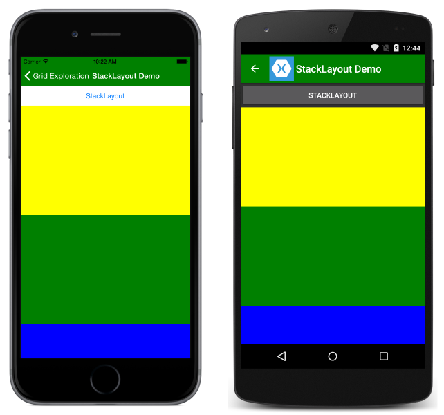
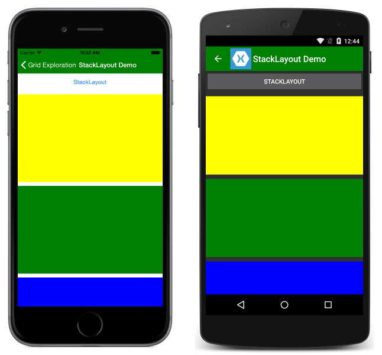
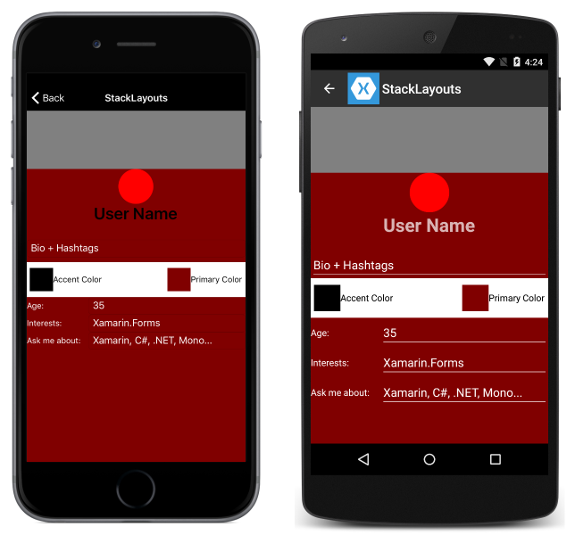

# StackLayout

`StackLayout` organizes views in a one-dimensional line ("stack"), either horizontally or vertically. Views in a `StackLayout` can be sized based on the space in the layout using layout options. Positioning is determined by the order views were added to the layout and the layout options of the views.

[](stack-layout-images/layouts.png#lightbox "Xamarin.Forms Layouts")

## Purpose

`StackLayout` is less complex than other views. Simple linear interfaces can be created by just adding views to a `StackLayout`, and more complex interfaces created by nesting them.

## Usage & Behavior

### Spacing

By default, `StackLayout` will add a 6px margin between views. This can be controlled or set to have no margin by setting the `Spacing` property on StackLayout. The following demonstrates how to set spacing and the effect of different spacing options:

In XAML:

```xaml
<?xml version="1.0" encoding="UTF-8"?>
<ContentPage xmlns="http://xamarin.com/schemas/2014/forms"
xmlns:x="http://schemas.microsoft.com/winfx/2009/xaml"
x:Class="LayoutSamples.StackLayoutDemo"
Title="StackLayout Demo">
  <ContentPage.Content>
    <StackLayout Spacing="10" x:Name="layout">
      <Button Text="StackLayout" VerticalOptions="Start"
        HorizontalOptions="FillAndExpand" />
      <BoxView Color="Yellow" VerticalOptions="FillAndExpand"
        HorizontalOptions="FillAndExpand" />
            <BoxView Color="Green" VerticalOptions="FillAndExpand"
        HorizontalOptions="FillAndExpand" />
            <BoxView HeightRequest="75" Color="Blue" VerticalOptions="End"
        HorizontalOptions="FillAndExpand" />
    </StackLayout>
    </ContentPage.Content>
</ContentPage>
```

In C#:

```csharp
public class StackLayoutCode : ContentPage
{
  public StackLayoutCode ()
  {
    var layout = new StackLayout ();
    var button = new Button { Text = "StackLayout", VerticalOptions = LayoutOptions.Start,
     HorizontalOptions = LayoutOptions.FillAndExpand };
    var yellowBox = new BoxView { Color = Color.Yellow, VerticalOptions = LayoutOptions.FillAndExpand, HorizontalOptions = LayoutOptions.FillAndExpand };
    var greenBox = new BoxView { Color = Color.Green, VerticalOptions = LayoutOptions.FillAndExpand, HorizontalOptions = LayoutOptions.FillAndExpand };
    var blueBox = new BoxView { Color = Color.Blue, VerticalOptions = LayoutOptions.FillAndExpand,
      HorizontalOptions = LayoutOptions.FillAndExpand, HeightRequest = 75 };

    layout.Children.Add(button);
    layout.Children.Add(yellowBox);
    layout.Children.Add(greenBox);
    layout.Children.Add(blueBox);
    layout.Spacing = 10;
    Content = layout;
  }
}
```

Spacing = 0:



Spacing of ten:



### Sizing

The size of a view in a StackLayout depends on both the height and width requests and the layout options. `StackLayout` will enforce padding. The following `LayoutOption`s will cause views to take up as much space as is available from the layout:

- **CenterAndExpand** &ndash; centers the view within the layout and expands to take up as much space as the layout will give it.
- **EndAndExpand** &ndash; places the view at the end of the layout (bottom or right-most boundary) and expands to take up as much space as the layout will give it.
- **FillAndExpand** &ndash; places the view so that it has no padding and takes up as much space as the layout will give it.
- **StartAndExpand** &ndash; places the view at the start of the layout and takes up as much space as the parent will give.

For more information, see [Expansion](~/xamarin-forms/user-interface/layouts/layout-options.md#expansion).

### Positioning

Views in a StackLayout can be positioned and sized using `LayoutOptions`. Each view can be given `VerticalOptions` and `HorizontalOptions`, defining how the views will position themselves relative to the layout. The following predefined `LayoutOptions` are available:

- **Center** &ndash; centers the view within the layout.
- **End** &ndash; places the view at the end of the layout (bottom or right-most boundary).
- **Fill** &ndash; places the view so that it has no padding.
- **Start** &ndash; places the view at the start of the layout.

The following code demonstrates setting layout options:

In XAML:

```xaml
<?xml version="1.0" encoding="UTF-8"?>
<ContentPage xmlns="http://xamarin.com/schemas/2014/forms"
xmlns:x="http://schemas.microsoft.com/winfx/2009/xaml"
x:Class="LayoutSamples.StackLayoutDemo"
Title="StackLayout Demo">
  <ContentPage.Content>
    <StackLayout x:Name="layout">
      <Button VerticalOptions="Start"
        HorizontalOptions="FillAndExpand" />
      <BoxView VerticalOptions="FillAndExpand"
        HorizontalOptions="FillAndExpand" />
            <BoxView VerticalOptions="FillAndExpand"
        HorizontalOptions="FillAndExpand" />
            <BoxView HeightRequest="75" VerticalOptions="End"
        HorizontalOptions="FillAndExpand" />
    </StackLayout>
    </ContentPage.Content>
</ContentPage>
```

In C#:

```csharp
public class StackLayoutCode : ContentPage
{
  public StackLayoutCode ()
  {
    var layout = new StackLayout ();
    var button = new Button { VerticalOptions = LayoutOptions.Start,
     HorizontalOptions = LayoutOptions.FillAndExpand };
    var oneBox = new BoxView { VerticalOptions = LayoutOptions.FillAndExpand, HorizontalOptions = LayoutOptions.FillAndExpand };
    var twoBox = new BoxView {  VerticalOptions = LayoutOptions.FillAndExpand, HorizontalOptions = LayoutOptions.FillAndExpand };
    var threeBox = new BoxView {  VerticalOptions = LayoutOptions.FillAndExpand, HorizontalOptions = LayoutOptions.FillAndExpand };

    layout.Children.Add(button);
    layout.Children.Add(oneBox);
    layout.Children.Add(twoBox);
    layout.Children.Add(threeBox);
    Content = layout;
  }
}
```

For more information, see [Alignment](~/xamarin-forms/user-interface/layouts/layout-options.md#alignment).

## Exploring a Complex Layout

Each of the layouts have strengths and weaknesses for creating particular layouts. Throughout this series of layout articles, a sample app has been created with the same page layout implemented using three different layouts.

Consider the following XAML:

```xaml
<?xml version="1.0" encoding="UTF-8"?>
<ContentPage xmlns="http://xamarin.com/schemas/2014/forms"
xmlns:x="http://schemas.microsoft.com/winfx/2009/xaml"
x:Class="TheBusinessTumble.StackLayoutPage"
BackgroundColor="Maroon"
Title="StackLayouts">
    <ContentPage.Content>
    <ScrollView>
      <StackLayout Spacing="0" Padding="0" BackgroundColor="Maroon">
        <BoxView HorizontalOptions="FillAndExpand" HeightRequest="100"
          VerticalOptions="Start" Color="Gray" />
        <Button BorderRadius="30" HeightRequest="60" WidthRequest="60"
          BackgroundColor="Red" HorizontalOptions="Center" VerticalOptions="Start" />
        <StackLayout HeightRequest="100" VerticalOptions="Start" HorizontalOptions="FillAndExpand" Spacing="20" BackgroundColor="Maroon">
          <Label Text="User Name" FontSize="28" HorizontalOptions="Center"
            VerticalOptions="Center" FontAttributes="Bold" />
          <Entry Text="Bio + Hashtags" TextColor="White"
            BackgroundColor="Maroon" HorizontalOptions="FillAndExpand" VerticalOptions="CenterAndExpand" />
        </StackLayout>
        <StackLayout Orientation="Horizontal" HeightRequest="50" BackgroundColor="White" Padding="5">
          <StackLayout Spacing="0" BackgroundColor="White" Orientation="Horizontal" HorizontalOptions="Start">
            <BoxView BackgroundColor="Black" WidthRequest="40" HeightRequest="40"  HorizontalOptions="StartAndExpand" VerticalOptions="Center" />
            <Label FontSize="14" TextColor="Black" Text="Accent Color" HorizontalOptions="StartAndExpand" VerticalOptions="Center" />
          </StackLayout>
          <StackLayout Spacing="0" BackgroundColor="White" Orientation="Horizontal" HorizontalOptions="EndAndExpand">
            <BoxView BackgroundColor="Maroon" WidthRequest="40" HeightRequest="40" HorizontalOptions="Start" VerticalOptions="Center" />
            <Label FontSize="14" TextColor="Black" Text="Primary Color" HorizontalOptions="StartAndExpand" VerticalOptions="Center" />
          </StackLayout>
        </StackLayout>
        <StackLayout Orientation="Horizontal">
          <Label FontSize="14" Text="Age:" TextColor="White" HorizontalOptions="Start" VerticalOptions="Center" WidthRequest="100" />
          <Entry HorizontalOptions="FillAndExpand" Text="35" TextColor="White" BackgroundColor="Maroon" />
        </StackLayout>
        <StackLayout Orientation="Horizontal">
          <Label FontSize="14" Text="Interests:" TextColor="White"
          HorizontalOptions="Start" VerticalOptions="Center" WidthRequest="100" />
          <Entry HorizontalOptions="FillAndExpand" Text="Xamarin.Forms" TextColor="White" BackgroundColor="Maroon" />
        </StackLayout>
        <StackLayout Orientation="Horizontal">
          <Label FontSize="14" Text="Ask me about:" TextColor="White"
          HorizontalOptions="Start" VerticalOptions="Center" WidthRequest="100"/>
          <Entry HorizontalOptions="FillAndExpand" Text="Xamarin, C#, .NET, Mono..." TextColor="White" BackgroundColor="Maroon" />
        </StackLayout>
      </StackLayout>
    </ScrollView>
    </ContentPage.Content>
</ContentPage>

```

The above code results in the following layout:



Notice that `StackLayouts`s are nested, because in some cases nesting layouts can be easier than presenting all elements within the same layout. Also notice that, because `StackLayout` doesn't support overlapping items, the page doesn't have some of the layout niceties found in the pages for the other layouts.


## Related Links

- [LayoutOptions](~/xamarin-forms/user-interface/layouts/layout-options.md)
- [Layout (sample)](https://developer.xamarin.com/samples/xamarin-forms/UserInterface/Layout/)
- [BusinessTumble Example (sample)](https://developer.xamarin.com/samples/xamarin-forms/UserInterface/BusinessTumble/)
