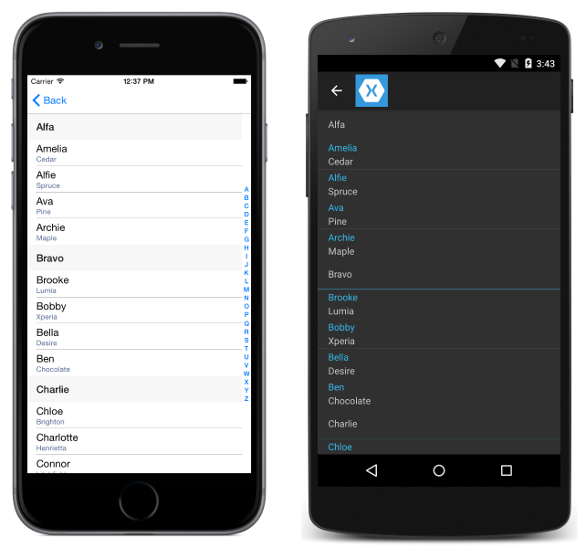
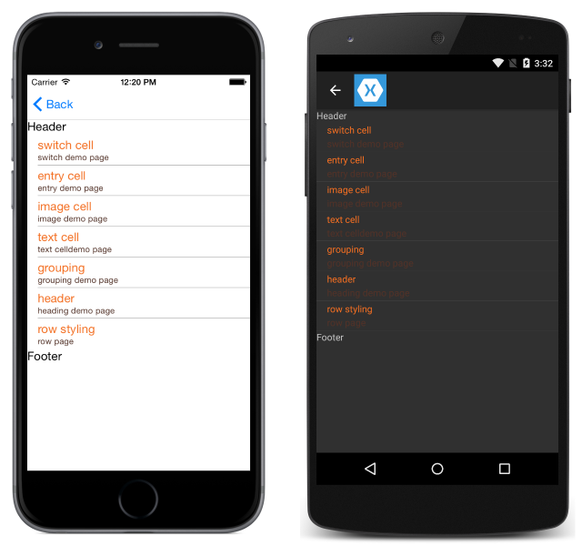
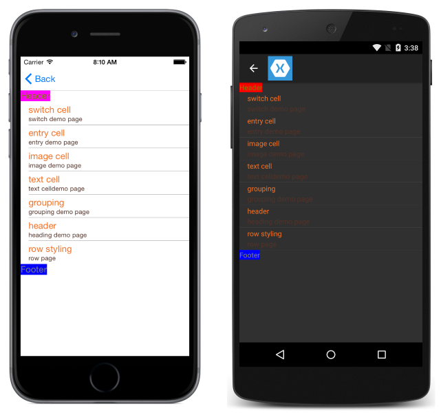
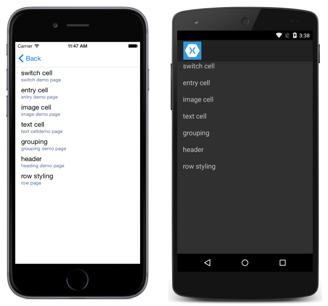
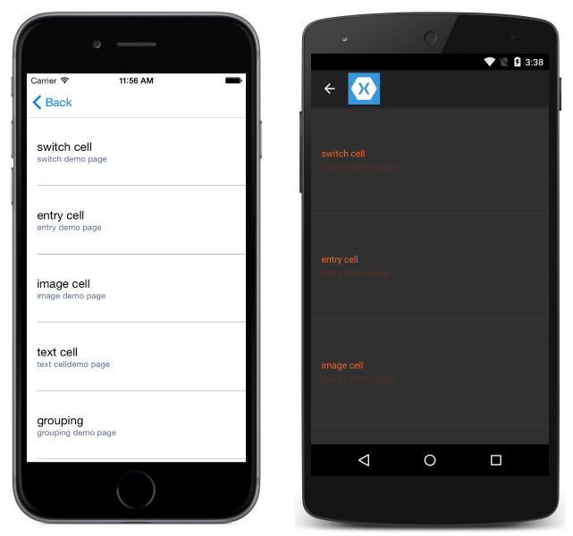
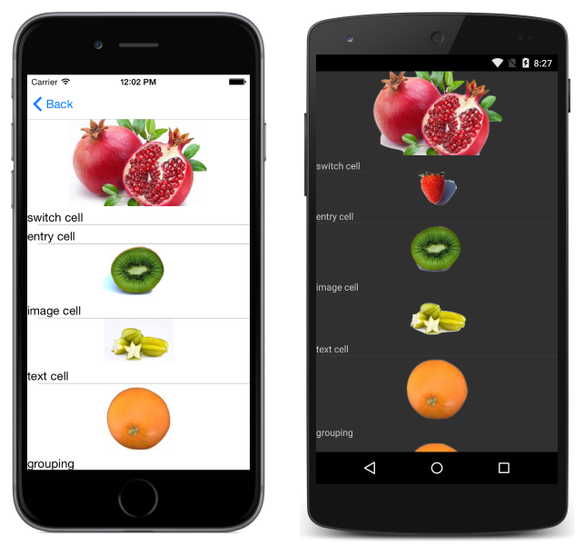
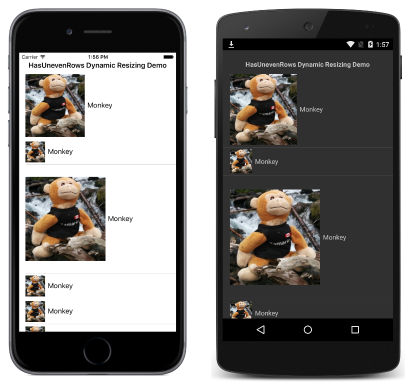

# List Appearance

`ListView` has options for controlling the presentation of the overall list, in addition to the underlying `ViewCell`s. Options include:

- [**Grouping**](#Grouping) &ndash; group items in ListView for easier navigation and improved organization.
- [**Headers and Footers**](#Headers_and_Footers) &ndash; display information at the beginning and end of the view that scrolls with the other items.
- [**Row Separators**](#Row_Separators) &ndash; show or hide separator lines between items.
- [**Variable Height Rows**](#Row_Heights) &ndash; by default all rows are the same height, but this can be changed to allow rows with differing heights to be displayed.

<a name="Grouping" />

## Grouping
Often, large sets of data can become unwieldy when presented in a continuously scrolling list. Enabling grouping can improve the user experience in these cases by better organizing the content and activating platform-specific controls that make navigating data easier.

When grouping is activated for a `ListView`, a header row is added for each group.

To enable grouping:

- Create a list of lists (a list of groups, each group being a list of elements).
- Set the `ListView`'s `ItemsSource` to that list.
- Set `IsGroupingEnabled` to true.
- Set [`GroupDisplayBinding`](http://developer.xamarin.com/api/property/Xamarin.Forms.ListView.GroupDisplayBinding/) to bind to the property of the groups that is being used as the title of the group.
- [Optional] Set [`GroupShortNameBinding`](http://developer.xamarin.com/api/property/Xamarin.Forms.ListView.GroupShortNameBinding/) to bind to the property of the groups that is being used as the short name for the group. The short name is used for the jump lists (right-side column on iOS).

Start by creating a class for the groups:

```csharp
public class PageTypeGroup : List<PageModel>
	{
		public string Title { get; set; }
		public string ShortName { get; set; } //will be used for jump lists
		public string Subtitle { get; set; }
		private PageTypeGroup(string title, string shortName)
		{
			Title = title;
			ShortName = shortName;
		}

		public static IList<PageTypeGroup> All { private set; get; }
	}
```

In the above code, `All` is the list that will be given to our ListView as the
binding source. `Title` and `ShortName` are the properties that will be used for group headings.

At this stage, `All` is an empty list. Add a static constructor so that the list
will be populated at program start:

```csharp
static PageTypeGroup()
{
	List<PageTypeGroup> Groups = new List<PageTypeGroup> {
			new PageTypeGroup ("Alfa", "A"){
				new PageModel("Amelia", "Cedar", new switchCellPage(),""),
				new PageModel("Alfie", "Spruce", new switchCellPage(), "grapefruit.jpg"),
				new PageModel("Ava", "Pine", new switchCellPage(), "grapefruit.jpg"),
				new PageModel("Archie", "Maple", new switchCellPage(), "grapefruit.jpg")
			},
			new PageTypeGroup ("Bravo", "B"){
				new PageModel("Brooke", "Lumia", new switchCellPage(),""),
				new PageModel("Bobby", "Xperia", new switchCellPage(), "grapefruit.jpg"),
				new PageModel("Bella", "Desire", new switchCellPage(), "grapefruit.jpg"),
				new PageModel("Ben", "Chocolate", new switchCellPage(), "grapefruit.jpg")
			}
		}
		All = Groups; //set the publicly accessible list
}
```

In the above code we can also call `Add` on elements of `groups`,
which are instances of type `PageTypeGroup`. This is possible because
`PageTypeGroup` inherits from `List<PageModel>`. This is an example of the
list of lists pattern noted above.

Here is the XAML for displaying the grouped list:

```xaml
<?xml version="1.0" encoding="UTF-8"?>
<ContentPage xmlns="http://xamarin.com/schemas/2014/forms"
xmlns:x="http://schemas.microsoft.com/winfx/2009/xaml"
x:Class="DemoListView.GroupingViewPage"
	<ContentPage.Content>
		<ListView  x:Name="GroupedView"
		GroupDisplayBinding="{Binding Title}"
		GroupShortNameBinding="{Binding ShortName}"
		IsGroupingEnabled="true">
			<ListView.ItemTemplate>
				<DataTemplate>
					<TextCell Text="{Binding Title}"
					 Detail="{Binding Subtitle}" />
				</DataTemplate>
			</ListView.ItemTemplate>
		</ListView>
	</ContentPage.Content>
</ContentPage>
```

This results in the following:



Note that we have:

- Set `GroupShortNameBinding` to the `ShortName` property defined in our group class
- Set `GroupDisplayBinding` to the `Title` property defined in our group class
- Set `IsGroupingEnabled` to true
- Changed the `ListView`'s `ItemsSource` to the grouped list

### Customizing Grouping

If grouping has been enabled in the list, the group header can also be customized.

Similar to how the `ListView` has an `ItemTemplate` for defining how rows are
displayed, `ListView` has a `GroupHeaderTemplate`.

An example of customizing the group header in XAML is shown here:

```xaml
<?xml version="1.0" encoding="UTF-8"?>
<ContentPage xmlns="http://xamarin.com/schemas/2014/forms"
xmlns:x="http://schemas.microsoft.com/winfx/2009/xaml"
x:Class="DemoListView.GroupingViewPage">
	<ContentPage.Content>
		<ListView x:Name="GroupedView"
		 GroupDisplayBinding="{Binding Title}"
		 GroupShortNameBinding="{Binding ShortName}"
		 IsGroupingEnabled="true">
			<ListView.ItemTemplate>
				<DataTemplate>
					<TextCell Text="{Binding Title}"
					Detail="{Binding Subtitle}"
					TextColor="#f35e20"
					DetailColor="#503026" />
				</DataTemplate>
			</ListView.ItemTemplate>
			<!-- Group Header Customization-->
			<ListView.GroupHeaderTemplate>
				<DataTemplate>
					<TextCell Text="{Binding Title}"
					Detail="{Binding ShortName}"
					TextColor="#f35e20"
					DetailColor="#503026" />
				</DataTemplate>
			</ListView.GroupHeaderTemplate>
			<!-- End Group Header Customization
		</ListView>
	</ContentPage.Content>
</ContentPage>
```

<a name="Headers_and_Footers" />

## Headers and Footers
It is possible for a ListView to present a header and footer that scroll with the elements of the list. The header and footer can be strings of text or a more complicated layout. Note that this is separate from [section groups](#Grouping).

You can set the `Header` and/or `Footer` to a simple string value,
or you can set them to a more complex layout.
There are also `HeaderTemplate` and
`FooterTemplate` properties that let you create more complex
layouts for the header and footer that support data binding.

To create a simple header/footer, just set the Header or Footer properties to the text you want to display. In code:

```csharp
ListView HeaderList = new ListView() {
	Header = "Header",
	Footer = "Footer"
	};
```

In XAML:

```xaml
<ListView  x:Name="HeaderList"  Header="Header" Footer="Footer"></ListView>
```



To create a customized header and footer, define the Header and Footer views:

```xaml
<ListView.Header>
	<StackLayout Orientation="Horizontal">
		<Label Text="Header"
		TextColor="Olive"
		BackgroundColor="Red" />
	</StackLayout>
</ListView.Header>
<ListView.Footer>
	<StackLayout Orientation="Horizontal">
		<Label Text="Footer"
		TextColor="Gray"
		BackgroundColor="Blue" />
	</StackLayout>
</ListView.Footer>
```



<a name="Row_Separators" />

## Row Separators
Separator lines are displayed between `ListView` elements by default on iOS and Android. If you'd prefer to hide the separator lines on iOS and Android, set the `SeparatorVisibility` property on your ListView. The options for `SeparatorVisibility` are:

* **Default** - shows a separator line on iOS and Android.
* **None** - hides the separator on all platforms.

Default Visibility:

C#:

```csharp
SepratorDemoListView.SeparatorVisibility = SeparatorVisibility.Default;
```

XAML:

```xaml
<ListView x:Name="SeparatorDemoListView" SeparatorVisibility="Default" />
```


None:

C#:

```csharp
SepratorDemoListView.SeparatorVisibility = SeparatorVisibility.None;
```

XAML:

```xaml
<ListView x:Name="SeparatorDemoListView" SeparatorVisibility="None" />
```



You can also set the color of the separator line via the `SeparatorColor` property:

C#:

```csharp
SepratorDemoListView.SeparatorColor = Color.Green;
```

XAML:

```xaml
<ListView x:Name="SeparatorDemoListView" SeparatorColor="Green" />
```


> [!NOTE]
> Setting either of these properties on Android after loading the `ListView` incurs a large performance penalty.

<a name="Row_Heights" />

## Row Heights
All rows in a ListView have the same height by default. ListView has two properties that can be used to change that behavior:

- `HasUnevenRows` &ndash; `true`/`false` value, rows have varying heights if set to `true`. Defaults to `false`.
- `RowHeight` &ndash; sets the height of each row when `HasUnevenRows` is `false`.

You can set the height of all rows by setting the `RowHeight` property on the `ListView`.

### Custom Fixed Row Height

C#:

```csharp
RowHeightDemoListView.RowHeight = 100;
```

XAML:

```xaml
<ListView x:Name="RowHeightDemoListView" RowHeight="100" />
```




### Uneven Rows

If you'd like individual rows to have different heights, you can set the
`HasUnevenRows` property to `true`.
Note that row heights don't have to be manually set once `HasUnevenRows` has
been set to `true`, because the heights will be automatically calculated by Xamarin.Forms.


C#:

```csharp
RowHeightDemoListView.HasUnevenRows = true;
```

XAML:

```xaml
<ListView x:Name="RowHeightDemoListView" HasUnevenRows="true" />
```



### Runtime Resizing of Rows

Individual `ListView` rows can be programmatically resized at runtime, provided that the `HasUnevenRows` property is set to `true`. The [`Cell.ForceUpdateSize`](https://developer.xamarin.com/api/member/Xamarin.Forms.Cell.ForceUpdateSize()/) method updates a cell's size, even when it isn't currently visible, as demonstrated in the following code example:

```csharp
void OnImageTapped (object sender, EventArgs args)
{
	var image = sender as Image;
	var viewCell = image.Parent.Parent as ViewCell;

	if (image.HeightRequest < 250) {
		image.HeightRequest = image.Height + 100;
		viewCell.ForceUpdateSize ();
	}
}
```

The `OnImageTapped` event handler is executed in response to an [`Image`](https://developer.xamarin.com/api/type/Xamarin.Forms.Image/) in a cell being tapped, and increases the size of the `Image` displayed in the cell so that it's easily viewed.



Note that there is a strong possibility of performance degradation if this feature is overused.


## Related Links

- [Grouping (sample)](https://developer.xamarin.com/samples/xamarin-forms/UserInterface/ListView/Grouping)
- [Custom Renderer View (sample)](https://developer.xamarin.com/samples/xamarin-forms/WorkingWithListviewNative/)
- [Dynamic Resizing of Rows (sample)](https://developer.xamarin.com/samples/xamarin-forms/UserInterface/ListView/DynamicUnevenListCells/)
- [1.4 release notes](http://forums.xamarin.com/discussion/35451/xamarin-forms-1-4-0-released/)
- [1.3 release notes](http://forums.xamarin.com/discussion/29934/xamarin-forms-1-3-0-released/)
