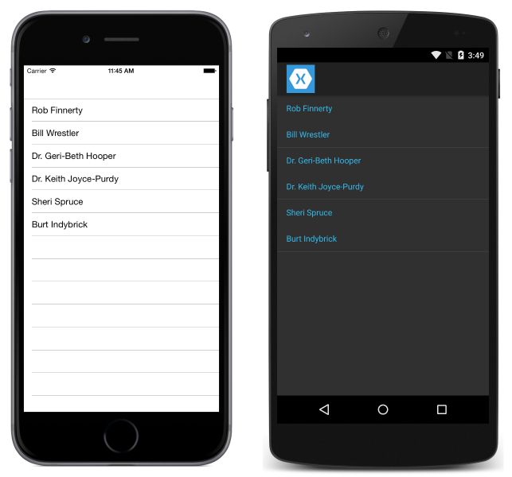

# ListView Data Sources

[ Download the sample](https://developer.xamarin.com/samples/xamarin-forms/UserInterface/ListView/SwitchEntryTwoBinding)

A [`ListView`](xref:Xamarin.Forms.ListView) is used for displaying lists of data. We'll learn about populating a ListView with data, and how we can bind to the selected item.

- **[Setting ItemsSource](#ItemsSource)** &ndash; uses a simple list or array.
- **[Data Binding](#Data_Binding)** &ndash; establishes a relationship between a model and the ListView. Binding is ideal for the MVVM pattern.

## ItemsSource

A [`ListView`](xref:Xamarin.Forms.ListView) is populated with data using the [`ItemsSource`](xref:Xamarin.Forms.ItemsView`1.ItemsSource) property, which can accept any collection implementing `IEnumerable`. The simplest way to populate a `ListView` involves using an array of strings:

```xaml
<ListView>
      <ListView.ItemsSource>
          <x:Array Type="{x:Type x:String}">
            <x:String>mono</x:String>
            <x:String>monodroid</x:String>
            <x:String>monotouch</x:String>
            <x:String>monorail</x:String>
            <x:String>monodevelop</x:String>
            <x:String>monotone</x:String>
            <x:String>monopoly</x:String>
            <x:String>monomodal</x:String>
            <x:String>mononucleosis</x:String>
          </x:Array>
      </ListView.ItemsSource>
</ListView>
```

The equivalent C# code is:

```csharp
var listView = new ListView();
listView.ItemsSource = new string[]
{
  "mono",
  "monodroid",
  "monotouch",
  "monorail",
  "monodevelop",
  "monotone",
  "monopoly",
  "monomodal",
  "mononucleosis"
};

//monochrome will not appear in the list because it was added
//after the list was populated.
listView.ItemsSource.Add("monochrome");
```


The above approach will populate the `ListView` with a list of strings. By default, `ListView` will call `ToString` and display the result in a `TextCell` for each row. To customize how data is displayed, see [Cell Appearance](~/xamarin-forms/user-interface/listview/customizing-cell-appearance.md).

Because `ItemsSource` has been sent to an array, the content will not update as the underlying list or array changes. If you want the ListView to automatically update as items are added, removed and changed in the underlying list, you'll need to use an `ObservableCollection`. [`ObservableCollection`](xref:System.Collections.ObjectModel.ObservableCollection`1) is defined in `System.Collections.ObjectModel` and is just like `List`, except that it can notify `ListView` of any changes:

```csharp
ObservableCollection<Employees> employeeList = new ObservableCollection<Employess>();
listView.ItemsSource = employeeList;

//Mr. Mono will be added to the ListView because it uses an ObservableCollection
employeeList.Add(new Employee(){ DisplayName="Mr. Mono"});
```

<a name="Data_Binding" />

## Data Binding
Data binding is the "glue" that binds the properties of a user interface object to the properties of some CLR object, such as a class in your ViewModel. Data binding is useful because it simplifies the development of user interfaces by replacing a lot of boring boilerplate code.

Data binding works by keeping objects in sync as their bound values change. Instead of having to write event handlers for every time a control's value changes, you establish the binding and enable binding in your ViewModel.

For more information on data binding, see [Data Binding Basics](~/xamarin-forms/xaml/xaml-basics/data-binding-basics.md) which is part four of the [Xamarin.Forms XAML Basics article series](~/xamarin-forms/xaml/xaml-basics/index.md).

### Binding Cells
Properties of cells (and children of cells) can be bound to properties of objects in the `ItemsSource`. For example, a ListView could be used to present a list of employees.

The employee class:

```csharp
public class Employee{
    public string DisplayName {get; set;}
}
```

`ObservableCollection<Employee>` is created and set as the `ListView`'s `ItemsSource`:

```csharp
ObservableCollection<Employee> employees = new ObservableCollection<Employee>();
public EmployeeListPage()
{
  //defined in XAML to follow
  EmployeeView.ItemsSource = employees;
  ...
}
```

The list is populated with data:

```csharp
public EmployeeListPage()
{
  ...
  employees.Add(new Employee{ DisplayName="Rob Finnerty"});
  employees.Add(new Employee{ DisplayName="Bill Wrestler"});
  employees.Add(new Employee{ DisplayName="Dr. Geri-Beth Hooper"});
  employees.Add(new Employee{ DisplayName="Dr. Keith Joyce-Purdy"});
  employees.Add(new Employee{ DisplayName="Sheri Spruce"});
  employees.Add(new Employee{ DisplayName="Burt Indybrick"});
}
```

The following snippet demonstrates a `ListView` bound to a list of employees:

```xaml
<?xml version="1.0" encoding="utf-8" ?>
<ContentPage xmlns="http://xamarin.com/schemas/2014/forms"
xmlns:x="http://schemas.microsoft.com/winfx/2006/xaml"
xmlns:constants="clr-namespace:XamarinFormsSample;assembly=XamarinFormsXamlSample"
x:Class="XamarinFormsXamlSample.Views.EmployeeListPage"
Title="Employee List">
  <ListView x:Name="EmployeeView">
    <ListView.ItemTemplate>
      <DataTemplate>
        <TextCell Text="{Binding DisplayName}" />
      </DataTemplate>
    </ListView.ItemTemplate>
  </ListView>
</ContentPage>
```

Note that the binding was setup in code for simplicity, although it could have been bound in XAML.

The previous bit of XAML defines a `ContentPage` that contains a `ListView`. The data source of the `ListView` is set via the `ItemsSource` attribute. The layout of each row in the `ItemsSource`is defined within the `ListView.ItemTemplate` element.

This is the result:



### Binding SelectedItem

Often you'll want to bind to the selected item of a `ListView`, rather than use an event handler to respond to changes. To do this in XAML, bind the `SelectedItem` property:

```xaml
<ListView x:Name="listView"
 SelectedItem="{Binding Source={x:Reference SomeLabel},
 Path=Text}">
 …
</ListView>
```

Assuming `listView`'s `ItemsSource` is a list of strings, `SomeLabel` will have its text property bound to the `SelectedItem`.

## Related Links

- [Two Way Binding (sample)](https://developer.xamarin.com/samples/xamarin-forms/UserInterface/ListView/SwitchEntryTwoBinding)
