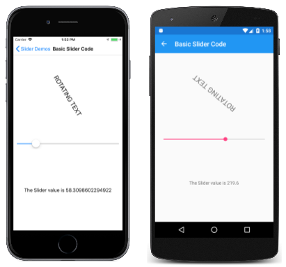
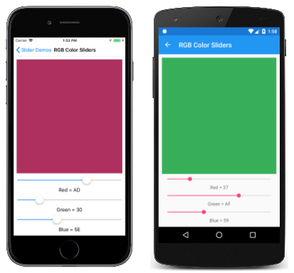
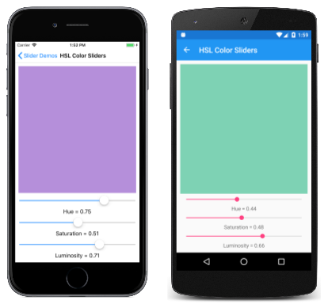

# Using Slider

_Use a Slider for selecting from a range of continuous values._

The Xamarin.Forms [`Slider`](https://developer.xamarin.com/api/type/Xamarin.Forms.Slider/) is a horizontal bar that can be manipulated by the user to select a `double` value from a continuous range. 

The `Slider` defines three properties of type `double`:

- [`Minimum`](https://developer.xamarin.com/api/property/Xamarin.Forms.Slider.Minimum/) is the minimum of the range, with a default value of 0.
- [`Maximum`](https://developer.xamarin.com/api/property/Xamarin.Forms.Slider.Maximum/) is the maximum of the range, with a default value of 1.
- [`Value`](https://developer.xamarin.com/api/property/Xamarin.Forms.Slider.Value/) is the slider's value, which can range between `Minimum` and `Maximum` and has a default value of 0.

All three properties are backed by `BindableProperty` objects. The `Value` property has a default binding mode of `BindingMode.TwoWay`, which means that it's suitable as a binding source in an application that uses the [Model-View-ViewModel (MVVM)](~/xamarin-forms/enterprise-application-patterns/mvvm.md) architecture. 

> [!WARNING]
> Internally, the `Slider` ensures that `Minimum` is less than `Maximum`. If `Minimum` or `Maximum` are ever set so that `Minimum` is not less than `Maximum`, an exception is raised. See the [**Precautions**](#precautions) section below for more information on setting the `Minimum` and `Maximum` properties.

The `Slider` coerces the `Value` property so that it is between `Minimum` and `Maximum`, inclusive. If the `Minimum` property is set to a value greater than the `Value` property, the `Slider` sets the `Value` property to `Minimum`. Similarly, if `Maximum` is set to a value less than `Value`, then `Slider` sets the `Value` property to `Maximum`. 

`Slider` defines a [`ValueChanged`](https://developer.xamarin.com/api/event/Xamarin.Forms.Slider.ValueChanged/) event that is fired when the `Value` changes, either through user manipulation of the `Slider` or when the program sets the `Value` property directly. A `ValueChanged` event is also fired when the `Value` property is coerced as described in the previous paragraph. 

The [`ValueChangedEventArgs`](https://developer.xamarin.com/api/type/Xamarin.Forms.ValueChangedEventArgs/) object that accompanies the `ValueChanged` event has two properties, both of type `double`: [`OldValue`](https://developer.xamarin.com/api/property/Xamarin.Forms.ValueChangedEventArgs.OldValue/) and [`NewValue`](https://developer.xamarin.com/api/property/Xamarin.Forms.ValueChangedEventArgs.NewValue/). At the time the event is fired, the value of `NewValue` is the same as the `Value` property of the `Slider` object.

> [!WARNING]
> Do not use unconstrained horizontal layout options of `Center`, `Start`, or `End` with `Slider`. On both Android and the UWP, the `Slider` collapses to a bar of zero length, and on iOS, the bar is very short. Keep the default `HorizontalOptions` setting of `Fill`, and don't use a width of `Auto` when putting `Slider` in a `Grid` layout.

## Basic Slider code and markup

The [**SliderDemos**](https://developer.xamarin.com/samples/xamarin-forms/UserInterface/SliderDemos) sample begins with three pages that are functionally identical, but are implemented in different ways. The first page uses only C# code, the second uses XAML with an event handler in code, and the third is able to avoid the event handler by using data binding in the XAML file.

### Creating a Slider in code

The **Basic Slider Code** page in the [**SliderDemos**](https://developer.xamarin.com/samples/xamarin-forms/UserInterface/SliderDemos) sample shows show to create a `Slider` and two `Label` objects in code:

```csharp
public class BasicSliderCodePage : ContentPage
{
    public BasicSliderCodePage()
    {
        Label rotationLabel = new Label
        {
            Text = "ROTATING TEXT",
            FontSize = Device.GetNamedSize(NamedSize.Large, typeof(Label)),
            HorizontalOptions = LayoutOptions.Center,
            VerticalOptions = LayoutOptions.CenterAndExpand
        };

        Label displayLabel = new Label
        {
            Text = "(uninitialized)",
            HorizontalOptions = LayoutOptions.Center,
            VerticalOptions = LayoutOptions.CenterAndExpand
        };

        Slider slider = new Slider
        {
            Maximum = 360
        };
        slider.ValueChanged += (sender, args) =>
        {
            rotationLabel.Rotation = slider.Value;
            displayLabel.Text = String.Format("The Slider value is {0}", args.NewValue);
        };

        Title = "Basic Slider Code";
        Padding = new Thickness(10, 0);
        Content = new StackLayout
        {
            Children =
            {
                rotationLabel,
                slider,
                displayLabel
            }
        };
    }
}
```

The `Slider` is initialized to have a `Maximum` property of 360. The `ValueChanged` handler of the `Slider` uses the `Value` property of the `slider` object to set the `Rotation` property of the first `Label` and uses the `String.Format` method with the `NewValue` property of the event arguments to set the `Text` property of the second `Label`. These two approaches to obtain the current value of the `Slider` are interchangeable. 

Here's the program running on iOS, Android, and Universal Windows Platform (UWP) devices:

[](slider-images/BasicSliderCode-Large.png#lightbox)

The second `Label` displays the text "(uninitialized)" until the `Slider` is manipulated, which cases the first `ValueChanged` event to be fired. Notice that the number of decimal places that are displayed is different for the three platforms. These differences are related to the platform implementations of the `Slider` and are discussed later in this article in the section [Platform implementation differences](#implementations).

### Creating a Slider in XAML

The **Basic Slider XAML** page is functionally the same as **Basic Slider Code** but implemented mostly in XAML:

```xaml
<ContentPage xmlns="http://xamarin.com/schemas/2014/forms"
             xmlns:x="http://schemas.microsoft.com/winfx/2009/xaml"
             x:Class="SliderDemos.BasicSliderXamlPage"
             Title="Basic Slider XAML"
             Padding="10, 0">
    <StackLayout>
        <Label x:Name="rotatingLabel" 
               Text="ROTATING TEXT"
               FontSize="Large"
               HorizontalOptions="Center"
               VerticalOptions="CenterAndExpand" />

        <Slider Maximum="360"
                ValueChanged="OnSliderValueChanged" />

        <Label x:Name="displayLabel"
               Text="(uninitialized)"
               HorizontalOptions="Center"
               VerticalOptions="CenterAndExpand" />
    </StackLayout>
</ContentPage>
```

The code-behind file contains the handler for the `ValueChanged` event:

```csharp
public partial class BasicSliderXamlPage : ContentPage
{
    public BasicSliderXamlPage()
    {
        InitializeComponent();
    }

    void OnSliderValueChanged(object sender, ValueChangedEventArgs args)
    {
        double value = args.NewValue;
        rotatingLabel.Rotation = value;
        displayLabel.Text = String.Format("The Slider value is {0}", value);
    }
}
```

It's also possible for the event handler to obtain the `Slider` that is firing the event through the `sender` argument. The `Value` property contains the current value:

```csharp
double value = ((Slider)sender).Value;
```

If the `Slider` object were given a name in the XAML file with an `x:Name` attribute (for example, "slider"), then the event handler could reference that object directly:

```csharp
double value = slider.Value;
```

### Data binding the Slider

The **Basic Slider Bindings** page shows how to write a nearly equivalent program that eliminates the `Value` event handler by using [Data Binding](~/xamarin-forms/app-fundamentals/data-binding/index.md):

```xaml
<ContentPage xmlns="http://xamarin.com/schemas/2014/forms"
             xmlns:x="http://schemas.microsoft.com/winfx/2009/xaml"
             x:Class="SliderDemos.BasicSliderBindingsPage"
             Title="Basic Slider Bindings"
             Padding="10, 0">
    <StackLayout>
        <Label Text="ROTATING TEXT"
               Rotation="{Binding Source={x:Reference slider}, 
                                  Path=Value}"
               FontSize="Large"
               HorizontalOptions="Center"
               VerticalOptions="CenterAndExpand" />

        <Slider x:Name="slider"
                Maximum="360" />

        <Label x:Name="displayLabel"
               Text="{Binding Source={x:Reference slider}, 
                              Path=Value, 
                              StringFormat='The Slider value is {0:F0}'}"
               HorizontalOptions="Center"
               VerticalOptions="CenterAndExpand" />
    </StackLayout>
</ContentPage>
```

The `Rotation` property of the first `Label` is bound to the `Value` property of the `Slider`, as is the `Text` property of the second `Label` with a `StringFormat` specification. The **Basic Slider Bindings** page functions a little differently from the two previous pages: When the page first appears, the second `Label` displays the text string with the value. This is a benefit of using data binding. To display text without data binding, you'd need to specifically initialize the `Text` property of the `Label` or simulate a firing of the `ValueChanged` event by calling the event handler from the class constructor.

<a name="precautions" />

## Precautions

The value of the `Minimum` property must always be less than the value of the `Maximum` property. The following code snippet causes the `Slider` to raise an exception:

```csharp
// Throws an exception!
Slider slider = new Slider
{
    Minimum = 10,
    Maximum = 20
};
```

The C# compiler generates code that sets these two properties in sequence, and when the `Minimum` property is set to 10, it is greater than the default `Maximum` value of 1. You can avoid the exception in this case by setting the `Maximum` property first:

```csharp
Slider slider = new Slider
{
    Maximum = 20,
    Minimum = 10
};
```

Setting `Maximum` to 20 is not a problem because it is greater than the default `Minimum` setting of 0. When `Minimum` is set, the value is less than the `Maximum` value of 20.

The same problem exists in XAML. Set the properties in an order that ensures that `Maximum` is always greater than `Minimum`:

```xaml
<Slider Maximum="20"
        Minimum="10" ... />
```

You can set the `Minimum` and `Maximum` values to negative numbers, but only in an order where `Minimum` is always less than `Maximum`:

```xaml
<Slider Minimum="-20"
        Maximum="-10" ... />
```

The `Value` property is always greater than or equal to the `Minimum` value and less than or equal to `Maximum`. If `Value` is set to a value outside that range, the value will be coerced to lie within the range, but no exception is raised. For example, this code will *not* raise an exception:

```csharp
Slider slider = new Slider
{
    Value = 10
};
```

Instead, the `Value` property is coerced to the `Maximum` value of 1.

Here's a code snippet shown above: 

```csharp
Slider slider = new Slider
{
    Maximum = 20,
    Minimum = 10
};
```

When `Minimum` is set to 10, then `Value` is also set to 10. 

If a `ValueChanged` event handler has been attached at the time that the `Value` property is coerced to something other than its default value of 0, then a `ValueChanged` event is fired. Here's a snippet of XAML: 

```xaml
<Slider ValueChanged="OnSliderValueChanged"
        Maximum="20"
        Minimum="10" />
```

When `Minimum` is set to 10, `Value` is also set to 10, and the `ValueChanged` event is fired. This might occur before the rest of the page has been constructed, and the handler might attempt to reference other elements on the page that have not yet been created. You might want to add some code to the `ValueChanged` handler that checks for `null` values of other elements on the page. Or, you can set the `ValueChanged` event handler after the `Slider` values have been initialized.

<a name="implementations" />

## Platform implementation differences

The screenshots shown earlier display the value of the `Slider` with a different number of decimal points. This relates to how the `Slider` is implemented on the Android and UWP platforms.

### The Android implementation 

The Android implementation of `Slider` is based on the Android [`SeekBar`](https://developer.xamarin.com/api/type/Android.Widget.SeekBar/) and always sets the [`Max`](https://developer.xamarin.com/api/property/Android.Widget.ProgressBar.Max/) property to 1000. This means that the `Slider` on Android has only 1,001 discrete values. If you set the `Slider` to have a `Minimum` of 0 and a `Maximum` of 5000, then as the `Slider` is manipulated, the `Value` property has values of 0, 5, 10, 15, and so forth. 

### The UWP implementation

The UWP implementation of `Slider` is based on the UWP [`Slider`](/uwp/api/windows.ui.xaml.controls.slider) control. The `StepFrequency` property of the UWP `Slider` is set to the difference of the `Maximum` and `Minimum` properties divided by 10, but not greater than 1. 

For example, for the default range of 0 to 1, the `StepFrequency` property is set to 0.1. As the `Slider` is manipulated, the `Value` property is restricted to 0, 0.1, 0.2, 0.3, 0.4, 0.5, 0.6, 0.7, 0.8, 0.9, and 1.0. (This is evident in the last page in the [**SliderDemos**](https://developer.xamarin.com/samples/xamarin-forms/UserInterface/SliderDemos) sample.) When the difference between the `Maximum` and `Minimum` properties is 10 or greater, then `StepFrequency` is set to 1, and the `Value` property has integral values. 

### The StepSlider solution

A more versatile `StepSlider` is discussed in [Chapter 27. Custom renderers](https://xamarin.azureedge.net/developer/xamarin-forms-book/XamarinFormsBook-Ch27-Apr2016.pdf) of the book *Creating Mobile Apps with Xamarin.Forms*. The `StepSlider` is similar to `Slider` but adds a `Steps` property to specify the number of values between `Minimum` and `Maximum`.

## Sliders for color selection

The final two pages in the [**SliderDemos**](https://developer.xamarin.com/samples/xamarin-forms/UserInterface/SliderDemos) sample both use three `Slider` instances for color selection. The first page handles all the interactions in the code-behind file, while the second page shows how to use data binding with a ViewModel. 

### Handling Sliders in the code-behind file 

The **RGB Color Sliders** page instantiates a `BoxView` to display a color, three `Slider` instances to select the red, green, and blue components of the color, and three `Label` elements for displaying those color values:

```xaml
<ContentPage xmlns="http://xamarin.com/schemas/2014/forms"
             xmlns:x="http://schemas.microsoft.com/winfx/2009/xaml"
             x:Class="SliderDemos.RgbColorSlidersPage"
             Title="RGB Color Sliders">
    <ContentPage.Resources>
        <ResourceDictionary>
            <Style TargetType="Slider">
                <Setter Property="Maximum" Value="255" />
            </Style>
            
            <Style TargetType="Label">
                <Setter Property="HorizontalTextAlignment" Value="Center" />
            </Style>
        </ResourceDictionary>
    </ContentPage.Resources>

    <StackLayout Margin="10">
        <BoxView x:Name="boxView"
                 Color="Black"
                 VerticalOptions="FillAndExpand" />

        <Slider x:Name="redSlider"
                ValueChanged="OnSliderValueChanged" />

        <Label x:Name="redLabel" />

        <Slider x:Name="greenSlider" 
                ValueChanged="OnSliderValueChanged" />

        <Label x:Name="greenLabel" />

        <Slider x:Name="blueSlider" 
                ValueChanged="OnSliderValueChanged" />

        <Label x:Name="blueLabel" />
    </StackLayout>
</ContentPage>
```

A `Style` gives all three `Slider` elements a range of 0 to 255. The `Slider` elements share the same `ValueChanged` handler, which is implemented in the code-behind file:

```csharp
public partial class RgbColorSlidersPage : ContentPage
{
    public RgbColorSlidersPage()
    {
        InitializeComponent();
    }

    void OnSliderValueChanged(object sender, ValueChangedEventArgs args)
    {
        if (sender == redSlider)
        {
            redLabel.Text = String.Format("Red = {0:X2}", (int)args.NewValue);
        }
        else if (sender == greenSlider)
        {
            greenLabel.Text = String.Format("Green = {0:X2}", (int)args.NewValue);
        }
        else if (sender == blueSlider)
        {
            blueLabel.Text = String.Format("Blue = {0:X2}", (int)args.NewValue);
        }

        boxView.Color = Color.FromRgb((int)redSlider.Value,
                                      (int)greenSlider.Value,
                                      (int)blueSlider.Value);
    }
}
```

The first section sets the `Text` property of one of the `Label` instances to a short text string indicating the value of the `Slider` in hexadecimal. Then, all three `Slider` instances are accessed to create a `Color` value from the RGB components:

[](slider-images/RgbColorSliders-Large.png#lightbox)

### Binding the Slider to a ViewModel

The **HSL Color Sliders** page shows how to use a ViewModel to perform the calculations used to create a `Color` value from hue, saturation, and luminosity values. Like all ViewModels, the `HSLColorViewModel` class implements the `INotifyPropertyChanged` interface, and fires a `PropertyChanged` event whenever one of the properties changes:

```csharp
public class HslColorViewModel : INotifyPropertyChanged
{
    Color color;

    public event PropertyChangedEventHandler PropertyChanged;

    public double Hue
    {
        set
        {
            if (color.Hue != value)
            {
                Color = Color.FromHsla(value, color.Saturation, color.Luminosity);
            }
        }
        get 
        {
            return color.Hue;
        }
    }

    public double Saturation
    {
        set
        {
            if (color.Saturation != value)
            {
                Color = Color.FromHsla(color.Hue, value, color.Luminosity);
            }
        }
        get
        {
            return color.Saturation;
        }
    }

    public double Luminosity
    {
        set
        {
            if (color.Luminosity != value)
            {
                Color = Color.FromHsla(color.Hue, color.Saturation, value);
            }
        }
        get
        {
            return color.Luminosity;
        }
    }

    public Color Color
    {
        set
        {
            if (color != value)
            {
                color = value;
                PropertyChanged?.Invoke(this, new PropertyChangedEventArgs("Hue"));
                PropertyChanged?.Invoke(this, new PropertyChangedEventArgs("Saturation"));
                PropertyChanged?.Invoke(this, new PropertyChangedEventArgs("Luminosity"));
                PropertyChanged?.Invoke(this, new PropertyChangedEventArgs("Color"));
            }
        }
        get
        {
            return color;
        }
    }
}
```

ViewModels and the `INotifyPropertyChanged` interface are discussed in the article [Data Binding](~/xamarin-forms/app-fundamentals/data-binding/index.md).

The **HslColorSlidersPage.xaml** file instantiates the `HslColorViewModel` and sets it to the page's `BindingContext` property. This allows all the elements in the XAML file to bind to properties in the ViewModel:

```xaml
<ContentPage xmlns="http://xamarin.com/schemas/2014/forms"
             xmlns:x="http://schemas.microsoft.com/winfx/2009/xaml"
             xmlns:local="clr-namespace:SliderDemos"
             x:Class="SliderDemos.HslColorSlidersPage"
             Title="HSL Color Sliders">

    <ContentPage.BindingContext>
        <local:HslColorViewModel Color="Chocolate" />
    </ContentPage.BindingContext>

    <ContentPage.Resources>
        <ResourceDictionary>
            <Style TargetType="Label">
                <Setter Property="HorizontalTextAlignment" Value="Center" />
            </Style>
        </ResourceDictionary>
    </ContentPage.Resources>

    <StackLayout Margin="10">
        <BoxView Color="{Binding Color}"
                 VerticalOptions="FillAndExpand" />

        <Slider Value="{Binding Hue}" />
        <Label Text="{Binding Hue, StringFormat='Hue = {0:F2}'}" />

        <Slider Value="{Binding Saturation}" />
        <Label Text="{Binding Saturation, StringFormat='Saturation = {0:F2}'}" />

        <Slider Value="{Binding Luminosity}" />
        <Label Text="{Binding Luminosity, StringFormat='Luminosity = {0:F2}'}" />
    </StackLayout>
</ContentPage> 
```

As the `Slider` elements are manipulated, the `BoxView` and `Label` elements are updated from the ViewModel:

[](slider-images/HslColorSliders-Large.png#lightbox)

The `StringFormat` component of the `Binding` markup extension is set for a format of "F2" to display two decimal places. (String formatting in data bindings is discussed in the article [String Formatting](~/xamarin-forms/app-fundamentals/data-binding/string-formatting.md).) However, the UWP version of the program is limited to values of 0, 0.1, 0.2, ... 0.9, and 1.0. This is a direct result of the implementation of the UWP `Slider` as described above in the section [Platform implementation differences](#implementations).

## Related Links

- [Slider Demos sample](https://developer.xamarin.com/samples/xamarin-forms/UserInterface/SliderDemos)
- [Slider API](https://developer.xamarin.com/api/type/Xamarin.Forms.Slider/)
