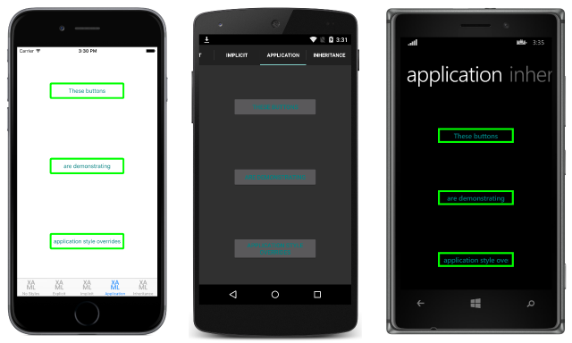

# Global Styles

_Styles can be made available globally by adding them to the application's resource dictionary. This helps to avoid duplication of styles across pages or controls._

## Creating a Global Style in XAML

By default, all Xamarin.Forms applications created from a template use the **App** class to implement the [`Application`](https://developer.xamarin.com/api/type/Xamarin.Forms.Application/) subclass. To declare a [`Style`](https://developer.xamarin.com/api/type/Xamarin.Forms.Style/) at the application level, in the application's [`ResourceDictionary`](https://developer.xamarin.com/api/type/Xamarin.Forms.ResourceDictionary/) using XAML, the default **App** class must be replaced with a XAML **App** class and associated code-behind. For more information, see [Working with the App Class](~/xamarin-forms/app-fundamentals/application-class.md).

The following code example shows a [`Style`](https://developer.xamarin.com/api/type/Xamarin.Forms.Style/) declared at the application level:

```xaml
<Application xmlns="http://xamarin.com/schemas/2014/forms" xmlns:x="http://schemas.microsoft.com/winfx/2009/xaml" x:Class="Styles.App">
	<Application.Resources>
		<ResourceDictionary>
			<Style x:Key="buttonStyle" TargetType="Button">
				<Setter Property="HorizontalOptions" Value="Center" />
				<Setter Property="VerticalOptions" Value="CenterAndExpand" />
				<Setter Property="BorderColor" Value="Lime" />
				<Setter Property="BorderRadius" Value="5" />
				<Setter Property="BorderWidth" Value="5" />
				<Setter Property="WidthRequest" Value="200" />
				<Setter Property="TextColor" Value="Teal" />
			</Style>
		</ResourceDictionary>
	</Application.Resources>
</Application>
```

This [`ResourceDictionary`](https://developer.xamarin.com/api/type/Xamarin.Forms.ResourceDictionary/) defines a single *explicit* style, `buttonStyle`, which will be used to set the appearance of [`Button`](https://developer.xamarin.com/api/type/Xamarin.Forms.Button/) instances. However, global styles can be *explicit* or *implicit*.

The following code example shows a XAML page applying the `buttonStyle` to the page's [`Button`](https://developer.xamarin.com/api/type/Xamarin.Forms.Button/) instances:

```xaml
<ContentPage xmlns="http://xamarin.com/schemas/2014/forms" xmlns:x="http://schemas.microsoft.com/winfx/2009/xaml" x:Class="Styles.ApplicationStylesPage" Title="Application" Icon="xaml.png">
	<ContentPage.Content>
		<StackLayout Padding="0,20,0,0">
			<Button Text="These buttons" Style="{StaticResource buttonStyle}" />
			<Button Text="are demonstrating" Style="{StaticResource buttonStyle}" />
			<Button Text="application style overrides" Style="{StaticResource buttonStyle}" />
		</StackLayout>
	</ContentPage.Content>
</ContentPage>
```

This results in the appearance shown in the following screenshots:

[](application-images/application-styles-1-large.png "Global Styles Example")

For information about creating styles in a page's [`ResourceDictionary`](https://developer.xamarin.com/api/type/Xamarin.Forms.ResourceDictionary/), see [Explicit Styles](~/xamarin-forms/user-interface/styles/explicit.md) and [Implicit Styles](~/xamarin-forms/user-interface/styles/implicit.md).

### Overriding Styles

Styles lower in the view hierarchy take precedence over those defined higher up. For example, setting a [`Style`](https://developer.xamarin.com/api/type/Xamarin.Forms.Style/) that sets [`Button.TextColor`](https://developer.xamarin.com/api/property/Xamarin.Forms.Button.TextColor/) to `Red` at the application level will be overridden by a page level style that sets `Button.TextColor` to `Green`. Similarly, a page level style will be overridden by a control level style. In addition, if `Button.TextColor` is set directly on a control property, this will take precedence over any styles. This precedence is demonstrated in the following code example:

```xaml
<ContentPage xmlns="http://xamarin.com/schemas/2014/forms" xmlns:x="http://schemas.microsoft.com/winfx/2009/xaml" x:Class="Styles.ApplicationStylesPage" Title="Application" Icon="xaml.png">
	<ContentPage.Resources>
		<ResourceDictionary>
			<Style x:Key="buttonStyle" TargetType="Button">
			    ...
				<Setter Property="TextColor" Value="Red" />
			</Style>
		</ResourceDictionary>
	</ContentPage.Resources>
	<ContentPage.Content>
		<StackLayout Padding="0,20,0,0">
			<StackLayout.Resources>
				<ResourceDictionary>
					<Style x:Key="buttonStyle" TargetType="Button">
					    ...
						<Setter Property="TextColor" Value="Blue" />
					</Style>
				</ResourceDictionary>
			</StackLayout.Resources>
			<Button Text="These buttons" Style="{StaticResource buttonStyle}" />
			<Button Text="are demonstrating" Style="{StaticResource buttonStyle}" />
			<Button Text="application style overrides" Style="{StaticResource buttonStyle}" />
		</StackLayout>
	</ContentPage.Content>
</ContentPage>
```

The original `buttonStyle`, defined at application level, is overridden by the `buttonStyle` instance defined at page level. In addition, the page level style is overridden by the control level `buttonStyle`. Therefore, the [`Button`](https://developer.xamarin.com/api/type/Xamarin.Forms.Button/) instances are displayed with blue text, as shown in the following screenshots:

[](application-images/application-styles-2-large.png "Overriding Styles Example")

## Creating a Global Style in C&#35;

[`Style`](https://developer.xamarin.com/api/type/Xamarin.Forms.Style/) instances can be added to the application's [`Resources`](https://developer.xamarin.com/api/property/Xamarin.Forms.VisualElement.Resources/) collection in C# by creating a new [`ResourceDictionary`](https://developer.xamarin.com/api/type/Xamarin.Forms.ResourceDictionary/), and then by adding the `Style` instances to the `ResourceDictionary`, as shown in the following code example:

```csharp
public class App : Application
{
	public App ()
	{
		var buttonStyle = new Style (typeof(Button)) {
			Setters = {
				...
				new Setter { Property = Button.TextColorProperty,	Value = Color.Teal }
			}
		};

		Resources = new ResourceDictionary ();
		Resources.Add ("buttonStyle", buttonStyle);
		...
	}
	...
}
```

The constructor defines a single *explicit* style for applying to [`Button`](https://developer.xamarin.com/api/type/Xamarin.Forms.Button/) instances throughout the application. *Explicit* [`Style`](https://developer.xamarin.com/api/type/Xamarin.Forms.Style/) instances are added to the [`ResourceDictionary`](https://developer.xamarin.com/api/type/Xamarin.Forms.ResourceDictionary/) using the [`Add`](https://developer.xamarin.com/api/member/Xamarin.Forms.ResourceDictionary.Add/p/System.String/System.Object/) method, specifying a `key` string to refer to the `Style` instance. The `Style` instance can then be applied to any controls of the correct type in the application. However, global styles can be *explicit* or *implicit*.

The following code example shows a C# page applying the `buttonStyle` to the page's [`Button`](https://developer.xamarin.com/api/type/Xamarin.Forms.Button/) instances:

```csharp
public class ApplicationStylesPageCS : ContentPage
{
	public ApplicationStylesPageCS ()
	{
		...
		Content = new StackLayout {
			Children = {
				new Button { Text = "These buttons", Style = (Style)Application.Current.Resources ["buttonStyle"] },
				new Button { Text = "are demonstrating", Style = (Style)Application.Current.Resources ["buttonStyle"] },
				new Button { Text = "application styles", Style = (Style)Application.Current.Resources ["buttonStyle"]
				}
			}
		};
	}
}
```

The `buttonStyle` is applied to the [`Button`](https://developer.xamarin.com/api/type/Xamarin.Forms.Button/) instances by setting their [`Style`](https://developer.xamarin.com/api/property/Xamarin.Forms.VisualElement.Style/) properties, and controls the appearance of the `Button` instances.

## Summary

Styles can be made available globally by adding them to the application's [`ResourceDictionary`](https://developer.xamarin.com/api/type/Xamarin.Forms.ResourceDictionary/). This helps to avoid duplication of styles across pages or controls.


## Related Links

- [XAML Markup Extensions](~/xamarin-forms/xaml/xaml-basics/xaml-markup-extensions.md)
- [Basic Styles (sample)](https://developer.xamarin.com/samples/xamarin-forms/UserInterface/Styles/BasicStyles/)
- [Working with Styles (sample)](https://developer.xamarin.com/samples/xamarin-forms/WorkingWithStyles/)
- [ResourceDictionary](https://developer.xamarin.com/api/type/Xamarin.Forms.ResourceDictionary/)
- [Style](https://developer.xamarin.com/api/type/Xamarin.Forms.Style/)
- [Setter](https://developer.xamarin.com/api/type/Xamarin.Forms.Setter/)
