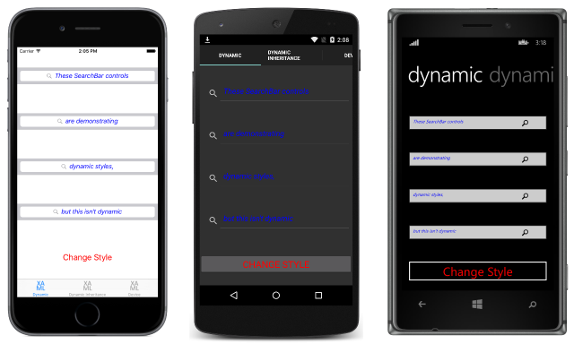
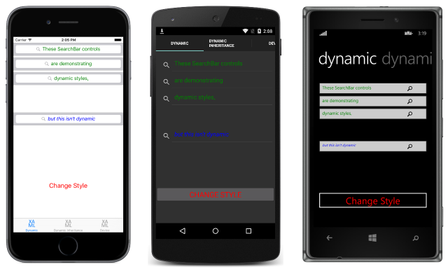
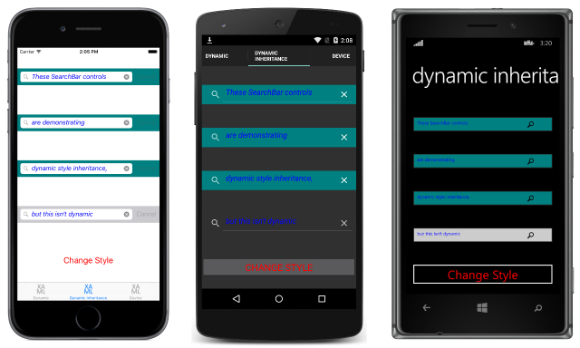
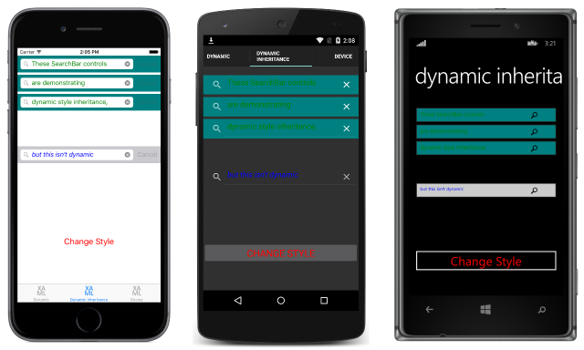

# Dynamic Styles

_Styles do not respond to property changes, and remain unchanged for the duration of an application. For example, after assigning a Style to a visual element, if one of the Setter instances is modified, removed, or a new Setter instance added, the changes won't be applied to the visual element. However, applications can respond to style changes dynamically at runtime by using dynamic resources._

The `DynamicResource` markup extension is similar to the `StaticResource` markup extension in that both use a dictionary key to fetch a value from a [`ResourceDictionary`](https://developer.xamarin.com/api/type/Xamarin.Forms.ResourceDictionary/). However, while the `StaticResource` performs a single dictionary lookup, the `DynamicResource` maintains a link to the dictionary key. Therefore, if the dictionary entry associated with the key is replaced, the change is applied to the visual element. This enables runtime style changes to be made in an application.

The following code example demonstrates *dynamic* styles in a XAML page:

```xaml
<ContentPage xmlns="http://xamarin.com/schemas/2014/forms" xmlns:x="http://schemas.microsoft.com/winfx/2009/xaml" x:Class="Styles.DynamicStylesPage" Title="Dynamic" Icon="xaml.png">
	<ContentPage.Resources>
		<ResourceDictionary>
			<Style x:Key="baseStyle" TargetType="View">
			  ...
			</Style>
			<Style x:Key="blueSearchBarStyle"
			       TargetType="SearchBar"
                   BasedOn="{StaticResource baseStyle}">
			  ...
			</Style>
			<Style x:Key="greenSearchBarStyle"
			       TargetType="SearchBar">
			  ...
			</Style>
			...
		</ResourceDictionary>
	</ContentPage.Resources>
	<ContentPage.Content>
		<StackLayout Padding="0,20,0,0">
			<SearchBar Placeholder="These SearchBar controls"
			           Style="{DynamicResource searchBarStyle}" />
			...
		</StackLayout>
	</ContentPage.Content>
</ContentPage>
```

The [`SearchBar`](https://developer.xamarin.com/api/type/Xamarin.Forms.SearchBar/) instances use the `DynamicResource` markup extension to reference a [`Style`](https://developer.xamarin.com/api/type/Xamarin.Forms.Style/) named `searchBarStyle`, which is not defined in the XAML. However, because the [`Style`](https://developer.xamarin.com/api/property/Xamarin.Forms.VisualElement.Style/) properties of the `SearchBar` instances are set using a `DynamicResource`, the missing dictionary key doesn't result in an exception being thrown.

Instead, in the code-behind file, the constructor creates a [`ResourceDictionary`](https://developer.xamarin.com/api/type/Xamarin.Forms.ResourceDictionary/) entry with the key `searchBarStyle`, as shown in the following code example:

```csharp
public partial class DynamicStylesPage : ContentPage
{
	bool originalStyle = true;

	public DynamicStylesPage ()
	{
		InitializeComponent ();
		Resources ["searchBarStyle"] = Resources ["blueSearchBarStyle"];
	}

	void OnButtonClicked (object sender, EventArgs e)
	{
		if (originalStyle) {
			Resources ["searchBarStyle"] = Resources ["greenSearchBarStyle"];
			originalStyle = false;
		} else {
			Resources ["searchBarStyle"] = Resources ["blueSearchBarStyle"];
			originalStyle = true;
		}
	}
}
```

When the `OnButtonClicked` event handler is executed, `searchBarStyle` will switch between `blueSearchBarStyle` and `greenSearchBarStyle`. This results in the appearance shown in the following screenshots:

[](dynamic-images/dynamic-style-blue-large.png#lightbox "Blue Dynamic Style Example")
[](dynamic-images/dynamic-style-green-large.png#lightbox "Green Dynamic Style Example")

The following code example demonstrates the equivalent page in C#:

```csharp
public class DynamicStylesPageCS : ContentPage
{
	bool originalStyle = true;

	public DynamicStylesPageCS ()
	{
		...
		var baseStyle = new Style (typeof(View)) {
			...
		};
		var blueSearchBarStyle = new Style (typeof(SearchBar)) {
			...
		};
		var greenSearchBarStyle = new Style (typeof(SearchBar)) {
			...
		};
		...
		var searchBar1 = new SearchBar { Placeholder = "These SearchBar controls" };
		searchBar1.SetDynamicResource (VisualElement.StyleProperty, "searchBarStyle");
		...
		Resources = new ResourceDictionary ();
		Resources.Add ("blueSearchBarStyle", blueSearchBarStyle);
		Resources.Add ("greenSearchBarStyle", greenSearchBarStyle);
		Resources ["searchBarStyle"] = Resources ["blueSearchBarStyle"];

		Content = new StackLayout {
			Children = { searchBar1, searchBar2, searchBar3, searchBar4,	button	}
		};
	}
	...
}
```

In C#, the [`SearchBar`](https://developer.xamarin.com/api/type/Xamarin.Forms.SearchBar/) instances use the [`SetDynamicResource`](https://developer.xamarin.com/api/member/Xamarin.Forms.Element.SetDynamicResource/) method to reference `searchBarStyle`. The `OnButtonClicked` event handler code is identical to the XAML example, and when executed, `searchBarStyle` will switch between `blueSearchBarStyle` and `greenSearchBarStyle`.

<a name="dynamic-style-inheritance">

## Dynamic Style Inheritance

Deriving a style from a dynamic style can't be achieved using the [`Style.BasedOn`](https://developer.xamarin.com/api/property/Xamarin.Forms.Style.BasedOn/) property. Instead, the [`Style`](https://developer.xamarin.com/api/type/Xamarin.Forms.Style/) class includes the [`BaseResourceKey`](https://developer.xamarin.com/api/property/Xamarin.Forms.Style.BaseResourceKey/) property, which can be set to a dictionary key whose value might dynamically change.

The following code example demonstrates *dynamic* style inheritance in a XAML page:

```xaml
<ContentPage xmlns="http://xamarin.com/schemas/2014/forms" xmlns:x="http://schemas.microsoft.com/winfx/2009/xaml" x:Class="Styles.DynamicStylesInheritancePage" Title="Dynamic Inheritance" Icon="xaml.png">
	<ContentPage.Resources>
		<ResourceDictionary>
			<Style x:Key="baseStyle" TargetType="View">
			  ...
			</Style>
			<Style x:Key="blueSearchBarStyle" TargetType="SearchBar" BasedOn="{StaticResource baseStyle}">
			  ...
			</Style>
			<Style x:Key="greenSearchBarStyle" TargetType="SearchBar">
			  ...
			</Style>
			<Style x:Key="tealSearchBarStyle" TargetType="SearchBar" BaseResourceKey="searchBarStyle">
			  ...
			</Style>
			...
		</ResourceDictionary>
	</ContentPage.Resources>
	<ContentPage.Content>
		<StackLayout Padding="0,20,0,0">
			<SearchBar Text="These SearchBar controls" Style="{StaticResource tealSearchBarStyle}" />
			...
		</StackLayout>
	</ContentPage.Content>
</ContentPage>
```

The [`SearchBar`](https://developer.xamarin.com/api/type/Xamarin.Forms.SearchBar/) instances use the `StaticResource` markup extension to reference a [`Style`](https://developer.xamarin.com/api/type/Xamarin.Forms.Style/) named `tealSearchBarStyle`. This `Style` sets some additional properties and uses the [`BaseResourceKey`](https://developer.xamarin.com/api/property/Xamarin.Forms.Style.BaseResourceKey/) property to reference `searchBarStyle`. The `DynamicResource` markup extension is not required because `tealSearchBarStyle` will not change, except for the `Style` it derives from. Therefore, `tealSearchBarStyle` maintains a link to `searchBarStyle` and is altered when the base style changes.

In the code-behind file, the constructor creates a [`ResourceDictionary`](https://developer.xamarin.com/api/type/Xamarin.Forms.ResourceDictionary/) entry with the key `searchBarStyle`, as per the previous example that demonstrated dynamic styles. When the `OnButtonClicked` event handler is executed, `searchBarStyle` will switch between `blueSearchBarStyle` and `greenSearchBarStyle`. This results in the appearance shown in the following screenshots:

[](dynamic-images/dynamic-style-inheritance-blue-large.png#lightbox "Blue Dynamic Style Inheritance Example")
[](dynamic-images/dynamic-style-inheritance-green-large.png#lightbox "Green Dynamic Style Inheritance Example")

The following code example demonstrates the equivalent page in C#:

```csharp
public class DynamicStylesInheritancePageCS : ContentPage
{
	bool originalStyle = true;

	public DynamicStylesInheritancePageCS ()
	{
		...
		var baseStyle = new Style (typeof(View)) {
			...
		};
		var blueSearchBarStyle = new Style (typeof(SearchBar)) {
			...
		};
		var greenSearchBarStyle = new Style (typeof(SearchBar)) {
			...
		};
		var tealSearchBarStyle = new Style (typeof(SearchBar)) {
			BaseResourceKey = "searchBarStyle",
			...
		};
		...
		Resources = new ResourceDictionary ();
		Resources.Add ("blueSearchBarStyle", blueSearchBarStyle);
		Resources.Add ("greenSearchBarStyle", greenSearchBarStyle);
		Resources ["searchBarStyle"] = Resources ["blueSearchBarStyle"];

		Content = new StackLayout {
			Children = {
				new SearchBar { Text = "These SearchBar controls", Style = tealSearchBarStyle },
				...
			}
		};
	}
	...
}
```

The `tealSearchBarStyle` is assigned directly to the [`Style`](https://developer.xamarin.com/api/property/Xamarin.Forms.VisualElement.Style/) property of the [`SearchBar`](https://developer.xamarin.com/api/type/Xamarin.Forms.SearchBar/) instances. This `Style` sets some additional properties, and uses the [`BaseResourceKey`](https://developer.xamarin.com/api/property/Xamarin.Forms.Style.BaseResourceKey/) property to reference `searchBarStyle`. The [`SetDynamicResource`](https://developer.xamarin.com/api/member/Xamarin.Forms.Element.SetDynamicResource/) method isn't required here because `tealSearchBarStyle` will not change, except for the `Style` it derives from. Therefore, `tealSearchBarStyle` maintains a link to `searchBarStyle` and is altered when the base style changes.

## Summary

Styles do not respond to property changes, and remain unchanged for the duration of an application. However, applications can respond to style changes dynamically at runtime by using dynamic resources. In addition, *dynamic* styles can be derived from with the [`BaseResourceKey`](https://developer.xamarin.com/api/property/Xamarin.Forms.Style.BaseResourceKey/) property.


## Related Links

- [XAML Markup Extensions](~/xamarin-forms/xaml/xaml-basics/xaml-markup-extensions.md)
- [Dynamic Styles (sample)](https://developer.xamarin.com/samples/xamarin-forms/UserInterface/Styles/DynamicStyles/)
- [Working with Styles (sample)](https://developer.xamarin.com/samples/xamarin-forms/WorkingWithStyles/)
- [ResourceDictionary](https://developer.xamarin.com/api/type/Xamarin.Forms.ResourceDictionary/)
- [Style](https://developer.xamarin.com/api/type/Xamarin.Forms.Style/)
- [Setter](https://developer.xamarin.com/api/type/Xamarin.Forms.Setter/)
