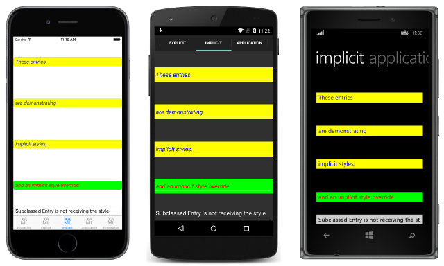

# Implicit Styles

_An implicit style is one that's used by all controls of the same TargetType, without requiring each control to reference the style._

## Creating an Implicit Style in XAML

To declare a [`Style`](https://developer.xamarin.com/api/type/Xamarin.Forms.Style/) at the page level, a [`ResourceDictionary`](https://developer.xamarin.com/api/type/Xamarin.Forms.ResourceDictionary/) must be added to the page and then one or more `Style` declarations can be included in the `ResourceDictionary`. A `Style` is made *implicit* by not specifying an `x:Key` attribute. The style will then be applied to visual elements that match the `TargetType` exactly, but not to elements that are derived from the `TargetType` value.

The following code example shows an *implicit* style declared in XAML in a page's `ResourceDictionary`, and applied to the page's [`Entry`](https://developer.xamarin.com/api/type/Xamarin.Forms.Entry/) instances:

```xaml
<ContentPage xmlns="http://xamarin.com/schemas/2014/forms" xmlns:x="http://schemas.microsoft.com/winfx/2009/xaml" xmlns:local="clr-namespace:Styles;assembly=Styles" x:Class="Styles.ImplicitStylesPage" Title="Implicit" Icon="xaml.png">
	<ContentPage.Resources>
		<ResourceDictionary>
			<Style TargetType="Entry">
				<Setter Property="HorizontalOptions" Value="Fill" />
				<Setter Property="VerticalOptions" Value="CenterAndExpand" />
				<Setter Property="BackgroundColor" Value="Yellow" />
				<Setter Property="FontAttributes" Value="Italic" />
				<Setter Property="TextColor" Value="Blue" />
			</Style>
		</ResourceDictionary>
	</ContentPage.Resources>
	<ContentPage.Content>
		<StackLayout Padding="0,20,0,0">
			<Entry Text="These entries" />
			<Entry Text="are demonstrating" />
			<Entry Text="implicit styles," />
			<Entry Text="and an implicit style override" BackgroundColor="Lime" TextColor="Red" />
			<local:CustomEntry Text="Subclassed Entry is not receiving the style" />
		</StackLayout>
	</ContentPage.Content>
</ContentPage>
```

The [`ResourceDictionary`](https://developer.xamarin.com/api/type/Xamarin.Forms.ResourceDictionary/) defines a single *implicit* style that's applied to the page's [`Entry`](https://developer.xamarin.com/api/type/Xamarin.Forms.Entry/) instances. The `Style` is used to display blue text on a yellow background, while also setting other appearance options. The `Style` is added to the page's [`ResourceDictionary`](https://developer.xamarin.com/api/type/Xamarin.Forms.ResourceDictionary/) without specifying an `x:Key` attribute. Therefore, the `Style` is applied to all the `Entry` instances implicitly as they match the [`TargetType`](https://developer.xamarin.com/api/property/Xamarin.Forms.Style.TargetType/) property of the `Style` exactly. However, the `Style` is not applied to the `CustomEntry` instance, which is a subclassed `Entry`. This results in the appearance shown in the following screenshots:

[](implicit-images/implicit-styles-large.png#lightbox "Implicit Styles Example")

In addition, the fourth [`Entry`](https://developer.xamarin.com/api/type/Xamarin.Forms.Entry/) overrides the [`BackgroundColor`](https://developer.xamarin.com/api/property/Xamarin.Forms.VisualElement.BackgroundColor/) and [`TextColor`](https://developer.xamarin.com/api/property/Xamarin.Forms.Entry.TextColor/) properties of the implicit style to different `Color` values.

### Creating an Implicit Style at the Control Level

In addition to creating *implicit* styles at the page level, they can also be created at the control level, as shown in the following code example:

```xaml
<ContentPage xmlns="http://xamarin.com/schemas/2014/forms" xmlns:x="http://schemas.microsoft.com/winfx/2009/xaml" xmlns:local="clr-namespace:Styles;assembly=Styles" x:Class="Styles.ImplicitStylesPage" Title="Implicit" Icon="xaml.png">
	<ContentPage.Content>
		<StackLayout Padding="0,20,0,0">
			<StackLayout.Resources>
				<ResourceDictionary>
					<Style TargetType="Entry">
						<Setter Property="HorizontalOptions" Value="Fill" />
						...
					</Style>
				</ResourceDictionary>
			</StackLayout.Resources>
			<Entry Text="These entries" />
			...
		</StackLayout>
	</ContentPage.Content>
</ContentPage>
```

In this example, the *implicit* [`Style`](https://developer.xamarin.com/api/type/Xamarin.Forms.Style/) is assigned to the [`Resources`](https://developer.xamarin.com/api/property/Xamarin.Forms.VisualElement.Resources/) collection of the [`StackLayout`](https://developer.xamarin.com/api/type/Xamarin.Forms.StackLayout/) control. The *implicit* style can then be applied to the control and its children.

For information about creating styles in an application's [`ResourceDictionary`](https://developer.xamarin.com/api/type/Xamarin.Forms.ResourceDictionary/), see [Global Styles](~/xamarin-forms/user-interface/styles/application.md).

## Creating an Implicit Style in C&#35;

[`Style`](https://developer.xamarin.com/api/type/Xamarin.Forms.Style/) instances can be added to a page's [`Resources`](https://developer.xamarin.com/api/property/Xamarin.Forms.VisualElement.Resources/) collection in C# by creating a new [`ResourceDictionary`](https://developer.xamarin.com/api/type/Xamarin.Forms.ResourceDictionary/), and then by adding the `Style` instances to the `ResourceDictionary`, as shown in the following code example:

```csharp
public class ImplicitStylesPageCS : ContentPage
{
	public ImplicitStylesPageCS ()
	{
		var entryStyle = new Style (typeof(Entry)) {
			Setters = {
				...
				new Setter { Property = Entry.TextColorProperty, Value = Color.Blue }
			}
		};

		...
		Resources = new ResourceDictionary ();
		Resources.Add (entryStyle);

		Content = new StackLayout {
			Children = {
				new Entry { Text = "These entries" },
				new Entry { Text = "are demonstrating" },
				new Entry { Text = "implicit styles," },
				new Entry { Text = "and an implicit style override", BackgroundColor = Color.Lime, TextColor = Color.Red },
				new CustomEntry  { Text = "Subclassed Entry is not receiving the style" }
			}
		};
	}
}
```

The constructor defines a single *implicit* style that's applied to the page's [`Entry`](https://developer.xamarin.com/api/type/Xamarin.Forms.Entry/) instances. The `Style` is used to display blue text on a yellow background, while also setting other appearance options. The `Style` is added to the page's [`ResourceDictionary`](https://developer.xamarin.com/api/type/Xamarin.Forms.ResourceDictionary/) without specifying a `key` string. Therefore, the `Style` is applied to all the `Entry` instances implicitly as they match the [`TargetType`](https://developer.xamarin.com/api/property/Xamarin.Forms.Style.TargetType/) property of the `Style` exactly. However, the `Style` is not applied to the `CustomEntry` instance, which is a subclassed `Entry`.

## Summary

An *implicit* style is one that's used by all visual elements of the same [`TargetType`](https://developer.xamarin.com/api/property/Xamarin.Forms.Style.TargetType/), without requiring each control to reference the style. A `Style` is made *implicit* by not specifying an `x:Key` attribute. Instead, the `x:Key` attribute will automatically become the value of the [`TargetType`](https://developer.xamarin.com/api/property/Xamarin.Forms.Style.TargetType/) property.


## Related Links

- [XAML Markup Extensions](~/xamarin-forms/xaml/xaml-basics/xaml-markup-extensions.md)
- [Basic Styles (sample)](https://developer.xamarin.com/samples/xamarin-forms/UserInterface/Styles/BasicStyles/)
- [Working with Styles (sample)](https://developer.xamarin.com/samples/xamarin-forms/WorkingWithStyles/)
- [ResourceDictionary](https://developer.xamarin.com/api/type/Xamarin.Forms.ResourceDictionary/)
- [Style](https://developer.xamarin.com/api/type/Xamarin.Forms.Style/)
- [Setter](https://developer.xamarin.com/api/type/Xamarin.Forms.Setter/)
