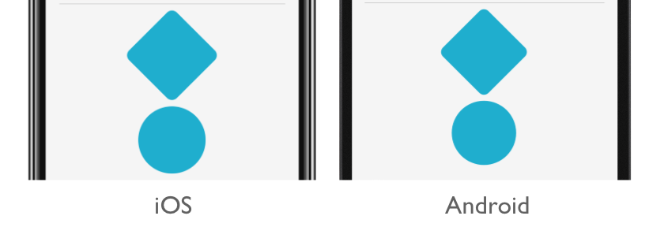

# Xamarin.Forms Style Classes

[ Download the sample](https://developer.xamarin.com/samples/xamarin-forms/UserInterface/Styles/BasicStyles/)

_Xamarin.Forms style classes enable multiple styles to be applied to a control, without resorting to style inheritance._

## Create style classes

A style class can be created by setting the [`Class`](xref:Xamarin.Forms.Style.Class) property on a [`Style`](xref:Xamarin.Forms.Style) to a `string` that represents the class name. The advantage this offers, over defining an explicit style using the `x:Key` attribute, is that multiple style classes can be applied to a [`VisualElement`](xref:Xamarin.Forms.VisualElement).

> [!IMPORTANT]
> Multiple styles can share the same class name, provided they target different types. This enables multiple style classes, that are identically named, to target different types.

The following example shows three [`BoxView`](xref:Xamarin.Forms.BoxView) style classes, and a [`VisualElement`](xref:Xamarin.Forms.VisualElement) style class:

```xaml
<ContentPage ...>
    <ContentPage.Resources>
        <Style TargetType="BoxView"
               Class="Separator">
            <Setter Property="BackgroundColor"
                    Value="#CCCCCC" />
            <Setter Property="HeightRequest"
                    Value="1" />
        </Style>

        <Style TargetType="BoxView"
               Class="Rounded">
            <Setter Property="BackgroundColor"
                    Value="#1FAECE" />
            <Setter Property="HorizontalOptions"
                    Value="Start" />
            <Setter Property="CornerRadius"
                    Value="10" />
        </Style>    

        <Style TargetType="BoxView"
               Class="Circle">
            <Setter Property="BackgroundColor"
                    Value="#1FAECE" />
            <Setter Property="WidthRequest"
                    Value="100" />
            <Setter Property="HeightRequest"
                    Value="100" />
            <Setter Property="HorizontalOptions"
                    Value="Start" />
            <Setter Property="CornerRadius"
                    Value="50" />
        </Style>

        <Style TargetType="VisualElement"
               Class="Rotated"
               ApplyToDerivedTypes="true">
            <Setter Property="Rotation"
                    Value="45" />
        </Style>        
    </ContentPage.Resources>
</ContentPage>
```

The `Separator`, `Rounded`, and `Circle` style classes each set [`BoxView`](xref:Xamarin.Forms.BoxView) properties to specific values.

The `Rotated` style class has a [`TargetType`](xref:Xamarin.Forms.Style.TargetType) of [`VisualElement`](xref:Xamarin.Forms.VisualElement), which means it can only be applied to `VisualElement` instances. However, its [`ApplyToDerivedTypes`](xref:Xamarin.Forms.Style.ApplyToDerivedTypes) property is set to `true`, which ensures that it can be applied to any controls that derive from `VisualElement`, such as [`BoxView`](xref:Xamarin.Forms.BoxView). For more information about applying a style to a derived type, see [Apply a style to derived types](implicit.md#apply-a-style-to-derived-types).

The equivalent C# code is:

```csharp
var separatorBoxViewStyle = new Style(typeof(BoxView))
{
    Class = "Separator",
    Setters =
    {
        new Setter
        {
            Property = VisualElement.BackgroundColorProperty,
            Value = Color.FromHex("#CCCCCC")
        },
        new Setter
        {
            Property = VisualElement.HeightRequestProperty,
            Value = 1
        }
    }
};

var roundedBoxViewStyle = new Style(typeof(BoxView))
{
    Class = "Rounded",
    Setters =
    {
        new Setter
        {
            Property = VisualElement.BackgroundColorProperty,
            Value = Color.FromHex("#1FAECE")
        },
        new Setter
        {
            Property = View.HorizontalOptionsProperty,
            Value = LayoutOptions.Start
        },
        new Setter
        {
            Property = BoxView.CornerRadiusProperty,
            Value = 10
        }
    }
};

var circleBoxViewStyle = new Style(typeof(BoxView))
{
    Class = "Circle",
    Setters =
    {
        new Setter
        {
            Property = VisualElement.BackgroundColorProperty,
            Value = Color.FromHex("#1FAECE")
        },
        new Setter
        {
            Property = VisualElement.WidthRequestProperty,
            Value = 100
        },
        new Setter
        {
            Property = VisualElement.HeightRequestProperty,
            Value = 100
        },
        new Setter
        {
            Property = View.HorizontalOptionsProperty,
            Value = LayoutOptions.Start
        },
        new Setter
        {
            Property = BoxView.CornerRadiusProperty,
            Value = 50
        }
    }
};

var rotatedVisualElementStyle = new Style(typeof(VisualElement))
{
    Class = "Rotated",
    ApplyToDerivedTypes = true,
    Setters =
    {
        new Setter
        {
            Property = VisualElement.RotationProperty,
            Value = 45
        }
    }
};

Resources = new ResourceDictionary
{
    separatorBoxViewStyle,
    roundedBoxViewStyle,
    circleBoxViewStyle,
    rotatedVisualElementStyle
};
```

## Consume style classes

Style classes can be consumed by setting the [`StyleClass`](xref:Xamarin.Forms.VisualElement.StyleClass) property of the control, which is of type `IList<string>`, to a list of style class names. The style classes will be applied, provided that the type of the control matches the [`TargetType`](xref:Xamarin.Forms.Style.TargetType) of the style classes.

The following example shows three [`BoxView`](xref:Xamarin.Forms.BoxView) instances, each set to different style classes:

```xaml
<ContentPage ...>
    <ContentPage.Resources>
        ...
    </ContentPage.Resources>
    <StackLayout Margin="20">
        <BoxView StyleClass="Separator" />       
        <BoxView WidthRequest="100"
                 HeightRequest="100"
                 HorizontalOptions="Center"
                 StyleClass="Rounded, Rotated" />
        <BoxView HorizontalOptions="Center"
                 StyleClass="Circle" />
    </StackLayout>
</ContentPage>    
```

In this example, the first [`BoxView`](xref:Xamarin.Forms.BoxView) is styled to be a line separator, while the third `BoxView` is circular. The second `BoxView` has two style classes applied to it, which give it rounded corners and rotate it 45 degrees:



> [!IMPORTANT]
> Multiple style classes can be applied to a control because the [`StyleClass`](xref:Xamarin.Forms.VisualElement.StyleClass) property is of type `IList<string>`. When this occurs, style classes are applied in ascending list order. Therefore, when multiple style classes set identical properties, the property in the style class that's later in the list will take precedence.

The equivalent C# code is:

```csharp
...
Content = new StackLayout
{
    Children =
    {
        new BoxView { StyleClass = new [] { "Separator" } },
        new BoxView { WidthRequest = 100, HeightRequest = 100, HorizontalOptions = LayoutOptions.Center, StyleClass = new [] { "Rounded", "Rotated" } },
        new BoxView { HorizontalOptions = LayoutOptions.Center, StyleClass = new [] { "Circle" } }
    }
};
```

## Related links

- [Basic Styles (sample)](https://developer.xamarin.com/samples/xamarin-forms/UserInterface/Styles/BasicStyles/)
