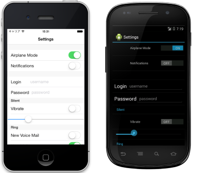
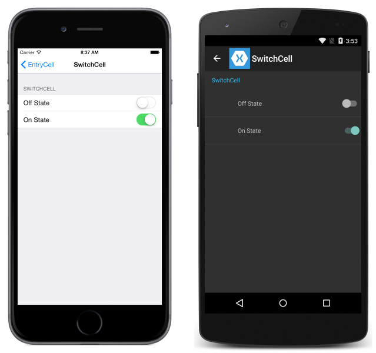
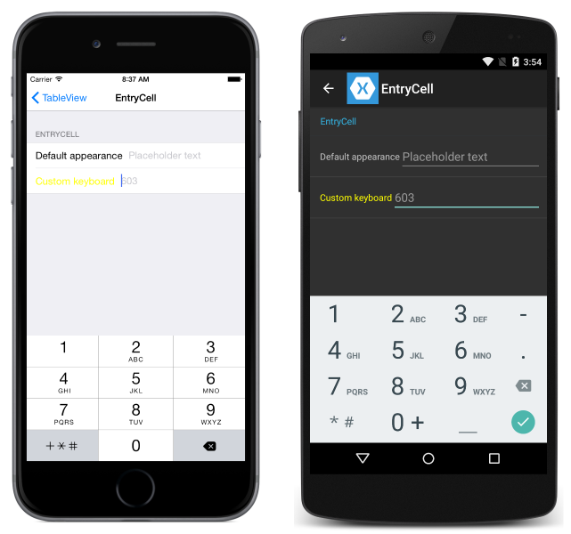
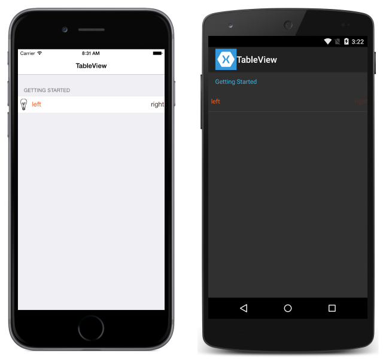

# Xamarin.Forms TableView

[TableView](xref:Xamarin.Forms.TableView) is a view for displaying scrollable lists of data or choices where there are rows that don't share the same template. Unlike [ListView](~/xamarin-forms/user-interface/listview/index.md), TableView does not have the concept of an `ItemsSource`, so items must be added as children manually.

This guide is composed of the following sections:

- **[Use Cases](#Use_Cases)** &ndash; when to use TableView instead of ListView or a custom view.
- **[TableView Structure](#TableView_Structure)** &ndash; the hierarchy of views that is needed within a TableView.
- **[TableView Appearance](#TableView_Appearance)** &ndash; the customization options for TableView.
- **[Built-In Cells](#Built-In_Cells)** &ndash; built-in cell options, including [EntryCell](#EntryCell) and [SwitchCell](#SwitchCell).
- **[Custom Cells](#Custom_Cells)** &ndash; how to make your own custom cells.



<a name="Use_Cases" />

## Use Cases

TableView is useful when:

- presenting a list of settings,
- collecting data in a form, or
- showing data that is presented differently from row to row (e.g. numbers, percentages and images).

TableView handles scrolling and laying out rows in attractive sections, a common need for the above scenarios. The `TableView` control uses each platform's underlying equivalent view when available, creating a native look for each platform.

<a name="TableView_Structure" />

## TableView Structure

Elements in a `TableView` are organized into sections. At the root of the `TableView` is the `TableRoot`, which is parent to one or more `TableSections`:

```csharp
Content = new TableView {
    Root = new TableRoot {
        new TableSection...
    },
    Intent = TableIntent.Settings
};
```

Each `TableSection` consists of a heading and one or more ViewCells. Here we see the `TableSection`'s `Title` property set to *"Ring"* in the constructor:

```csharp
var section = new TableSection ("Ring") { //TableSection constructor takes title as an optional parameter
    new SwitchCell {Text = "New Voice Mail"},
    new SwitchCell {Text = "New Mail", On = true}
};
```

To accomplish the same layout as above in XAML:

```xaml
<TableView Intent="Settings">
    <TableRoot>
        <TableSection Title="Ring">
            <SwitchCell Text="New Voice Mail" />
      <SwitchCell Text="New Mail" On="true" />
        </TableSection>
    </TableRoot>
</TableView>
```

<a name="TableView_Appearance" />

## TableView Appearance

TableView exposes the `Intent` property, which is an enumeration of the following options:

- **Data** &ndash; for use when displaying data entries. Note that [ListView](~/xamarin-forms/user-interface/listview/index.md) may be a better option for scrolling lists of data.
- **Form** &ndash; for use when the TableView is acting as a Form.
- **Menu** &ndash; for use when presenting a menu of selections.
- **Settings** &ndash; for use when displaying a list of configuration settings.

The `TableIntent` you choose may impact how the `TableView` appears on each platform. Even if there are not clear differences, it is a best practice to select the `TableIntent` that most closely matches how you intend to use the table.

<a name="Built-In_Cells" />

## Built-In Cells

Xamarin.Forms comes with built-in cells for collecting and displaying information. Although ListView and TableView can use all of the same cells, the following are the most relevant for a TableView scenario:

- **SwitchCell** &ndash; for presenting and capturing a true/false state, along with a text label.
- **EntryCell** &ndash; for presenting and capturing text.

See [ListView Cell Appearance](~/xamarin-forms/user-interface/listview/customizing-cell-appearance.md) for a detailed description of [TextCell](~/xamarin-forms/user-interface/listview/customizing-cell-appearance.md#TextCell) and [ImageCell](~/xamarin-forms/user-interface/listview/customizing-cell-appearance.md#ImageCell).

<a name="switchcell" />

### SwitchCell
[`SwitchCell`](xref:Xamarin.Forms.SwitchCell) is the control to use for presenting and capturing an on/off or `true`/`false` state.

SwitchCells have one line of text to edit and an on/off property. Both of these properties are bindable.

- `Text` &ndash; text to display beside the switch.
- `On` &ndash; whether the switch is displayed as on or off.

Note that the `SwitchCell` exposes the `OnChanged` event, allowing you to respond to changes in the cell's state.



<a name="entrycell" />

### EntryCell
[`EntryCell`](xref:Xamarin.Forms.EntryCell) is useful when you need to display text data that the user can edit. `EntryCell`s offer the following properties that can be customized:

- `Keyboard` &ndash; The keyboard to display while editing. There are options for things like numeric values, email, phone numbers, etc. [See the API docs](xref:Xamarin.Forms.Keyboard).
- `Label` &ndash; The label text to display to the right of the text entry field.
- `LabelColor` &ndash; The color of the label text.
- `Placeholder` &ndash; Text to display in the entry field when it is null or empty. This text disappears when text entry begins.
- `Text` &ndash; The text in the entry field.
- `HorizontalTextAlignment` &ndash; The horizontal alignment of the text. Can be center, left, or right aligned. [See the API docs](xref:Xamarin.Forms.TextAlignment).

Note that `EntryCell` exposes the `Completed` event, which is fired when the user hits 'done' on the keyboard while editing text.



<a name="Custom_Cells" />

## Custom Cells
When the built-in cells aren't enough, custom cells can be used to present and capture data in the way that makes sense for your app. For example, you may want to present a slider to allow a user to choose the opacity of an image.

All custom cells must derive from [`ViewCell`](xref:Xamarin.Forms.ViewCell), the same base class that all of the built-in cell types use.

This is an example of a custom cell:



### XAML
The XAML to create the above layout is below:

```xaml
<?xml version="1.0" encoding="UTF-8"?>
<ContentPage xmlns="http://xamarin.com/schemas/2014/forms" xmlns:x="http://schemas.microsoft.com/winfx/2009/xaml" x:Class="DemoTableView.TablePage" Title="TableView">
    <ContentPage.Content>
        <TableView Intent="Settings">
            <TableRoot>
                <TableSection Title="Getting Started">
                    <ViewCell>
                        <StackLayout Orientation="Horizontal">
                            <Image Source="bulb.png" />
                            <Label Text="left"
                              TextColor="#f35e20" />
                            <Label Text="right"
                              HorizontalOptions="EndAndExpand"
                              TextColor="#503026" />
                        </StackLayout>
                    </ViewCell>
                </TableSection>
            </TableRoot>
        </TableView>
    </ContentPage.Content>
</ContentPage>

```

The XAML above is doing a lot. Let's break it down:

- The root element under the `TableView` is the `TableRoot`.
- There is a `TableSection` immediately underneath the `TableRoot`.
- The `ViewCell` is defined directly under the TableSection. Unlike `ListView`, `TableView` does not require that custom (or any) cells are defined in an `ItemTemplate`.
- A StackLayout is used to manage the layout of the custom cell. Any layout could be used here.

### C&num;

Because `TableView` works with static data, or data that is manually changed, it does not have the concept of an item template. Instead, custom cells can be manually created and put into the table. Note that the technique of creating a custom cell that inherits from `ViewCell`, then adding it to the `TableView` like you would a built-in cell, is also supported.
Here is the c# code to accomplish the layout above:

```csharp
var table = new TableView();
table.Intent = TableIntent.Settings;
var layout = new StackLayout() { Orientation = StackOrientation.Horizontal };
layout.Children.Add (new Image() {Source = "bulb.png"});
layout.Children.Add (new Label() {
    Text = "left",
    TextColor = Color.FromHex("#f35e20"),
    VerticalOptions = LayoutOptions.Center
});
layout.Children.Add (new Label () {
    Text = "right",
    TextColor = Color.FromHex ("#503026"),
    VerticalOptions = LayoutOptions.Center,
    HorizontalOptions = LayoutOptions.EndAndExpand
});
table.Root = new TableRoot () {
    new TableSection("Getting Started") {
        new ViewCell() {View = layout}
    }
};

Content = table;
```

The C# above is doing a lot. Let's break it down:

- The root element under the `TableView` is the `TableRoot`.
- There is a `TableSection` immediately underneath the `TableRoot`.
- The `ViewCell` is defined directly under the TableSection. Unlike `ListView`, `TableView` does not require that custom (or any) cells are defined in an `ItemTemplate`.
- A StackLayout is used to manage the layout of the custom cell. Any layout could be used here.

Note that a class for the custom cell is never defined. Instead, the `ViewCell`'s view property is set for a particular instance of `ViewCell`.


## Related Links

- [TableView (sample)](https://developer.xamarin.com/samples/xamarin-forms/UserInterface/TableView)
