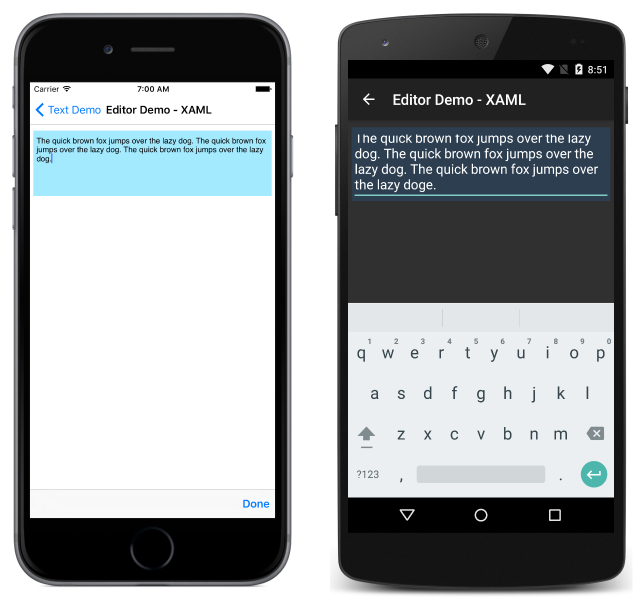

# Editor

_Multi-line text input_

The `Editor` control is used to accept multi-line input. This article will cover:

- **[Customization](#customization)** &ndash; keyboard and color options.
- **[Interactivity](#interactivity)** &ndash; events that can be listened for to provide interactivity.

## Customization

### Setting and Reading Text

Editor, like other text-presenting views, exposes the `Text` property. `Text` can be used to set and read the text presented by the `Editor`. The following example demonstrates setting text in XAML:

```xaml
<Editor Text="I am an Editor" />
```

In C#:

```csharp
var MyEditor = new Editor { Text = "I am an Editor" };
```

To read text, access the `Text` property in C#:

```csharp
var text = MyEditor.Text;
```

### Keyboards

The keyboard that is presented when users interact with an `Editor` can be set programmatically via the [``Keyboard``](https://developer.xamarin.com/api/type/Xamarin.Forms.Keyboard/) property.

The options for the keyboard type are:

- **Default** &ndash; the default keyboard
- **Chat** &ndash; used for texting & places where emoji are useful
- **Email** &ndash; used when entering email addresses
- **Numeric** &ndash; used when entering numbers
- **Telephone** &ndash; used when entering telephone numbers
- **Url** &ndash; used for entering file paths & web addresses

There is an [example of each keyboard](https://developer.xamarin.com/recipes/cross-platform/xamarin-forms/choose-keyboard-for-entry/)
in our Recipes section.

### Colors

`Editor` can be set to use a custom background color via the `BackgroundColor` property. Special care is necessary to ensure that colors will be usable on each platform. Because each platform has different defaults for text color, you may need to set a custom background color for each platform. See [Working with Platform Tweaks](~/xamarin-forms/platform/device.md) for more information about optimizing the UI for each platform.

In C#:

```csharp
public partial class EditorPage : ContentPage
{
	public EditorPage ()
	{
		InitializeComponent ();
		var layout = new StackLayout { Padding = new Thickness(5,10) };
		this.Content = layout;
		//dark blue on UWP & Android, light blue on iOS
		var editor = new Editor { BackgroundColor = Device.RuntimePlatform == Device.iOS ? Color.FromHex("#A4EAFF") : Color.FromHex("#2c3e50") };
		layout.Children.Add(editor);
	}
}
```

In XAML:

```xaml
<?xml version="1.0" encoding="UTF-8"?>
<ContentPage xmlns="http://xamarin.com/schemas/2014/forms"
    xmlns:x="http://schemas.microsoft.com/winfx/2009/xaml"
    x:Class="TextSample.EditorPage"
    Title="Editor Demo">
    <ContentPage.Content>
        <StackLayout Padding="5,10">
            <Editor>
                <Editor.BackgroundColor>
                    <OnPlatform x:TypeArguments="x:Color">
                        <On Platform="iOS" Value="#a4eaff" />
                        <On Platform="Android, UWP" Value="#2c3e50" />
                    </OnPlatform>
                </Editor.BackgroundColor>
            </Editor>
        </StackLayout>
    </ContentPage.Content>
</ContentPage>
```



Make sure that the background and text colors you choose are usable on each platform and don't obscure any placeholder text.

## Interactivity

`Editor` exposes two events:

- [TextChanged](http://developer.xamarin.com/api/event/Xamarin.Forms.Editor.TextChanged/) &ndash; raised when the text changes in the editor. Provides the text before and after the change.
- [Completed](http://developer.xamarin.com/api/event/Xamarin.Forms.Editor.Completed/) &ndash; raised when the user has ended input by pressing the return key on the keyboard.

### Completed

The `Completed` event is used to react to the completion of an interaction with an `Editor`. `Completed` is raised when the user ends input with a field by entering the return key on the keyboard. The handler for the event is a generic event handler, taking the sender and `EventArgs`:

```csharp
void EditorCompleted (object sender, EventArgs e)
{
	var text = ((Editor)sender).Text; // sender is cast to an Editor to enable reading the `Text` property of the view.
}
```

The completed event can be subscribed to in code and XAML:

In C#:

```csharp
public partial class EditorPage : ContentPage
{
	public EditorPage ()
	{
		InitializeComponent ();
		var layout = new StackLayout { Padding = new Thickness(5,10) };
		this.Content = layout;
		var editor = new Editor ();
		editor.Completed += EditorCompleted;
		layout.Children.Add(editor);
	}
}
```

In XAML:

```xaml
<?xml version="1.0" encoding="UTF-8"?>
<ContentPage xmlns="http://xamarin.com/schemas/2014/forms"
xmlns:x="http://schemas.microsoft.com/winfx/2009/xaml"
x:Class="TextSample.EditorPage"
Title="Editor Demo">
	<ContentPage.Content>
		<StackLayout Padding="5,10">
			<Editor Completed="EditorCompleted" />
		</StackLayout>
	</ContentPage.Content>
</Contentpage>
```

### TextChanged

The `TextChanged` event is used to react to a change in the content of a field.

`TextChanged` is raised whenever the `Text` of the `Editor` changes. The handler for the event takes an instance of `TextChangedEventArgs`. `TextChangedEventArgs` provides access to the old and new values of the `Editor` `Text` via the `OldTextValue` and `NewTextValue` properties:

```csharp
void EditorTextChanged (object sender, TextChangedEventArgs e)
{
	var oldText = e.OldTextValue;
	var newText = e.NewTextValue;
}
```

The completed event can be subscribed to in code and XAML:

In code:

```csharp
public partial class EditorPage : ContentPage
{
	public EditorPage ()
	{
		InitializeComponent ();
		var layout = new StackLayout { Padding = new Thickness(5,10) };
		this.Content = layout;
		var editor = new Editor ();
		editor.TextChanged += EditorTextChanged;
		layout.Children.Add(editor);
	}
}
```

In XAML:

```xaml
<?xml version="1.0" encoding="UTF-8"?>
<ContentPage xmlns="http://xamarin.com/schemas/2014/forms"
xmlns:x="http://schemas.microsoft.com/winfx/2009/xaml"
x:Class="TextSample.EditorPage"
Title="Editor Demo">
	<ContentPage.Content>
		<StackLayout Padding="5,10">
			<Editor TextChanged="EditorTextChanged" />
		</StackLayout>
	</ContentPage.Content>
</ContentPage>
```


## Related Links

- [Text (sample)](https://developer.xamarin.com/samples/xamarin-forms/UserInterface/Text)
- [Editor API](https://developer.xamarin.com/api/type/Xamarin.Forms.Editor/)
