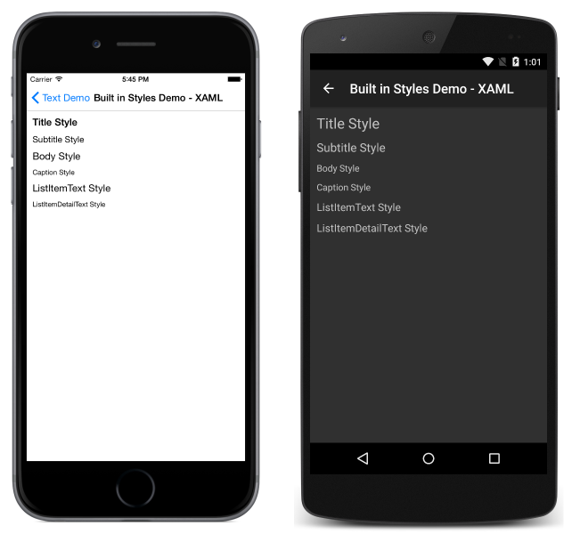
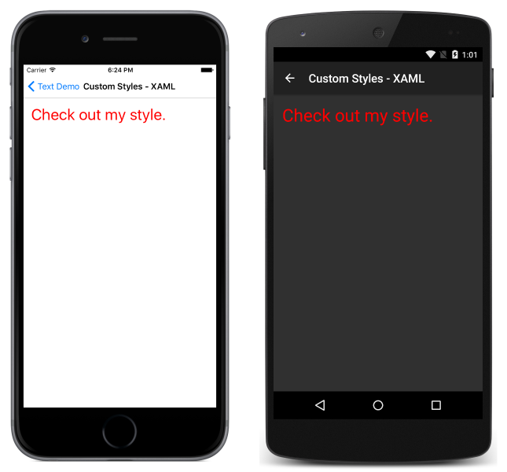
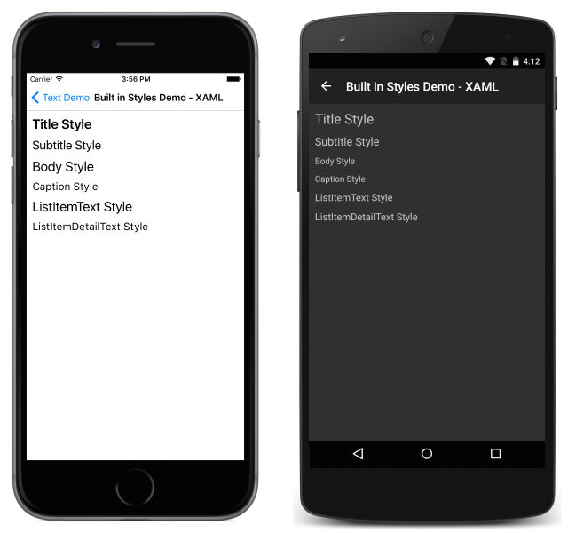
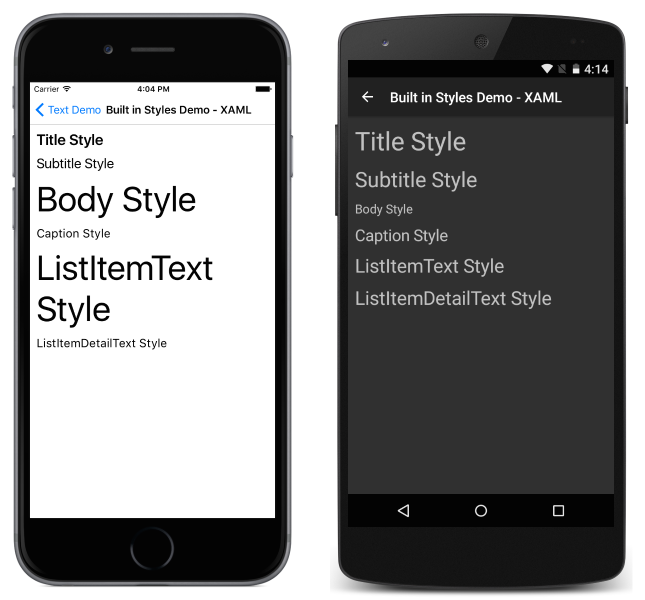

# Styles

_Style text in Xamarin.Forms_


Styles can be used to adjust the appearance of labels, entries, and editors. Styles can be defined once and used by many views, but a style can only be used with views of one type.
Styles can be given a `Key` and applied selectively using a specific
	control's `Style` property.

This article covers the following topics:

- **[Built-In Styles](#Built-In_Styles)** &ndash; use built-in styles to style text-based views throughout your app.
- **[Custom Styles](#Custom_Styles)** &ndash; define custom styles when the built-in options aren't enough.
- **[Applying Styles](#Applying_Styles)** &ndash; apply both custom and built-in styles to your views.
- **[Accessibility](#Accessibility)** &ndash; ensure that text respects accessibility settings.

<a name="Built-In_Styles" />

## Built-In Styles

Xamarin.Forms includes several [built-in](http://developer.xamarin.com/api/type/Xamarin.Forms.Device+Styles/) styles for common scenarios:

- `BodyStyle`
- `CaptionStyle`
- `ListItemDetailTextStyle`
- `ListItemTextStyle`
- `SubtitleStyle`
- `TitleStyle`

To apply one of the built-in styles, use the `DynamicResource` markup extension to specify the style:

```xaml
<Label Text="I'm a Title" Style="{DynamicResource TitleStyle}"/>
```

In C#, built-in styles are selected from `Device.Styles`:

```csharp
label.Style = Device.Styles.TitleStyle;
```



<a name="Custom_Styles" />

## Custom Styles

Styles consist of setters and setters consist of properties and the values the properties will be set to.

In C#, a custom style for a label with red text of size 30 would be defined as follows:

```csharp
var LabelStyle = new Style (typeof(Label)) {
	Setters = {
		new Setter {Property = Label.TextColorProperty, Value = Color.Red},
		new Setter {Property = Label.FontSizeProperty, Value = 30}
    }
};

var label = new Label { Text = "Check out my style.", Style = LabelStyle };
```

In XAML:

```xaml
<ContentPage.Resources>
	<ResourceDictionary>
		<Style x:Key="LabelStyle" TargetType="Label">
			<Setter Property="TextColor" Value="Red"/>
			<Setter Property="FontSize" Value="30"/>
		</Style>
	</ResourceDictionary>
</ContentPage.Resources>

<ContentPage.Content>
	<StackLayout>
		<Label Text="Check out my style." Style="{StaticResource LabelStyle}" />
	</StackLayout>
</ContentPage.Content>
```

Note that resources (including all styles) are defined within `ContentPage.Resources`, which is a sibling of the more familiar `ContentPage.Content` element.



<a name="Applying_Styles" />

## Applying Styles

Once a style has been created, it can be applied to any view matching its `TargetType`.

In XAML, custom styles are applied to views by supplying their `Style` property with a `StaticResource` markup extension referencing the desired style:

```xaml
<Label Text="Check out my style." Style="{StaticResource LabelStyle}" />
```

In C#, styles can either be applied directly to a view or added to and retrieved from a page's `ResourceDictionary`. To add directly:

```csharp
var label = new Label { Text = "Check out my style.", Style = LabelStyle };
```

To add and retrieve from the page's `ResourceDictionary`:

```csharp
this.Resources.Add ("LabelStyle", LabelStyle);
label.Style = (Style)Resources["LabelStyle"];
```

Built-in styles are applied differently, because they need to respond to accessibility settings. To apply built-in styles in XAML, the `DynamicResource` markup extension is used:

```xaml
<Label Text="I'm a Title" Style="{DynamicResource TitleStyle}"/>
```

In C#, built-in styles are selected from `Device.Styles`:

```csharp
label.Style = Device.Styles.TitleStyle;
```

## Accessibility

The built-in styles exist to make it easier to respect accessibility preferences. When using any of the built-in styles, font sizes will automatically increase if a user sets their accessibility preferences accordingly.

Consider the following example of the same page of views styled with the built-in styles with accessibility settings enabled and disabled:

Disabled:



Enabled:



To ensure accessibility, make sure that built-in styles are used as the basis for any text-related styles within your app, and that you are using styles consistently. See [Styles](~/xamarin-forms/user-interface/styles/index.md) for more details on extending and working with styles in general.


## Related Links

- [Creating Mobile Apps with Xamarin.Forms, Chapter 12](https://developer.xamarin.com/r/xamarin-forms/book/chapter12.pdf)
- [Styles](~/xamarin-forms/user-interface/styles/index.md)
- [Text (sample)](https://developer.xamarin.com/samples/xamarin-forms/UserInterface/Text)
- [Style](https://developer.xamarin.com/api/type/Xamarin.Forms.Style/)
