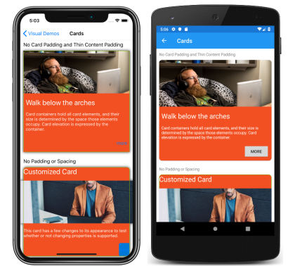
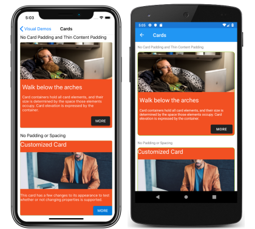

# Xamarin.Forms Material Visual

Xamarin.Forms Material Visual can be used to create Xamarin.Forms applications that look identical, or largely identical, on iOS and Android. This is achieved by using additional renderers that implement a material appearance, with applications opting into the appearance through the `Visual` property:

```xaml
<ContentPage ...
             Visual="Material">
    ...
</ContentPage>
```

The equivalent C# code is:

```csharp
ContentPage contentPage = new ContentPage();
contentPage.Visual = VisualMarker.Material;
```

> [!IMPORTANT]
> The `Visual` property is defined in the `VisualElement` class, with views inheriting the `Visual` property value from their parents. Therefore, setting the `Visual` property on a `ContentPage` ensures that any supported views in the page will use that visual appearance. In addition, the `Visual` property can be overridden on a view.

Material renderers are currently included for the following views on iOS and Android:

- [`Button`](xref:Xamarin.Forms.Button)
- [`Entry`](xref:Xamarin.Forms.Entry)
- [`Frame`](xref:Xamarin.Forms.Frame)
- [`ProgressBar`](xref:Xamarin.Forms.ProgressBar)
- [`DatePicker`](xref:Xamarin.Forms.DatePicker)
- [`TimePicker`](xref:Xamarin.Forms.TimePicker)
- [`Picker`](xref:Xamarin.Forms.Picker)
- [`ActivityIndicator`](xref:Xamarin.Forms.ActivityIndicator)
- [`Editor`](xref:Xamarin.Forms.Editor)
- [`Slider`](xref:Xamarin.Forms.Slider)
- [`Stepper`](xref:Xamarin.Forms.Stepper)

Functionally, the material renderers are no different to the default renderers.

On iOS and Android, your platform project must have the [Xamarin.Forms.Visual.Material](https://www.nuget.org/packages/https://www.nuget.org/packages/Xamarin.Forms.Visual.Material/) NuGet package installed. After installing the NuGet package, initialization code is required in each platform project, *after* the `Xamarin.Forms.Forms.Init` method call. For iOS, use the following code:

```csharp
global::Xamarin.Forms.Forms.Init();
FormsMaterial.Init();
```

On Android, you must pass the same parameters that are passed to `Forms.Init`:

```csharp
global::Xamarin.Forms.Forms.Init(this, bundle);
FormsMaterial.Init(this, bundle);
```

> [!IMPORTANT]
> On Android, material only works with TargetFramework 9.0 (API 28). In addition, your platform project must use v28 of the support libraries, and its theme needs to inherit from a Material Components theme or continue to inherit from an AppCompat theme. For more information, see [Getting started with Material Components for Android](https://github.com/material-components/material-components-android/blob/master/docs/getting-started.md).

The following screenshots show a user interface that includes the four views for which material renderers exist, but rendered using the default renderers:

[](material-visual-images/default-renderers-large.png#lightbox)

The following screenshots show the same user interface rendered using the material renderers:

[](material-visual-images/material-renderers-large.png#lightbox)

> [!NOTE]
> With material renderers the rendered controls remain native controls, and therefore there will still be user interface differences between platforms for areas such as fonts, shadows, colors, and elevation.

## Material renderers

Material renderers can be customized, just like the default renderers, by using the following base classes:

- `MaterialButtonRenderer`
- `MaterialEntryRenderer`
- `MaterialFrameRenderer`
- `MaterialProgressBarRenderer`
- `MaterialDatePickerRenderer`
- `MaterialTimePickerRenderer`
- `MaterialPickerRenderer`
- `MaterialActivityIndicatorRenderer`
- `MaterialEditorRenderer`
- `MaterialSliderRenderer`
- `MaterialStepperRenderer`

The following code shows an example of customizing the `MaterialProgressBarRenderer` class:

```csharp
using Xamarin.Forms.Material.Android;

[assembly: ExportRenderer(typeof(ProgressBar), typeof(CustomMaterialProgressBarRenderer), new[] { typeof(VisualMarker.MaterialVisual) })]
namespace MyApp.Android
{
    public class CustomMaterialProgressBarRenderer : MaterialProgressBarRenderer
    {
        ...
    }
}
```

## Related links

- [Custom Renderers](~/xamarin-forms/app-fundamentals/custom-renderer/index.md)
