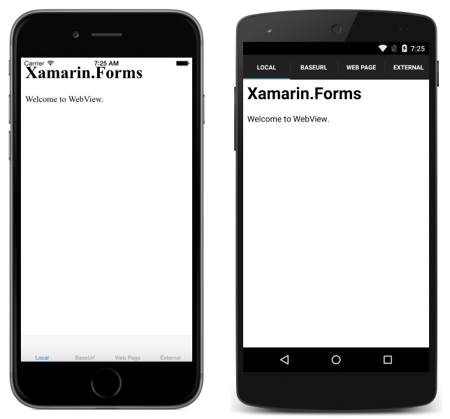
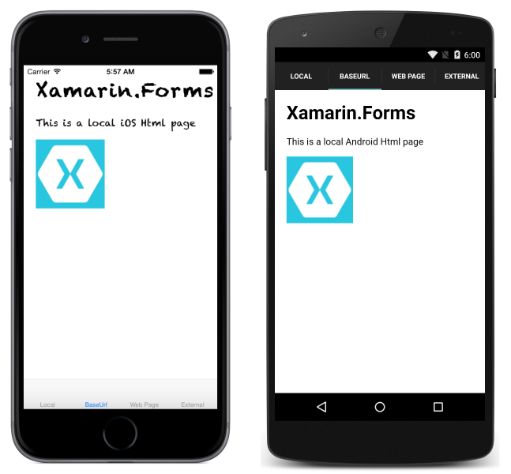
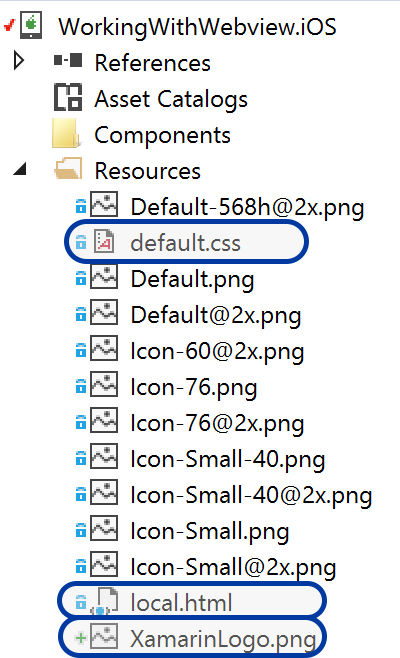
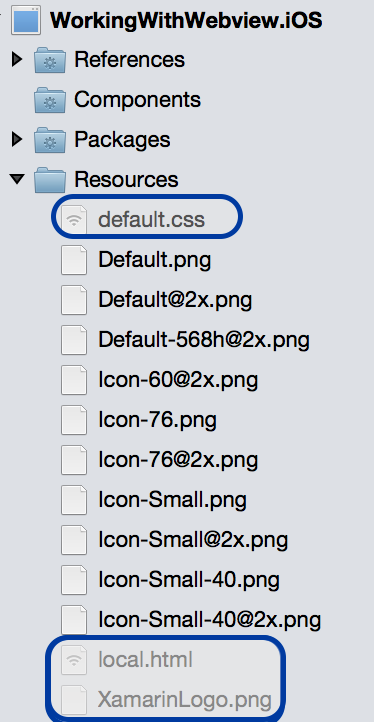
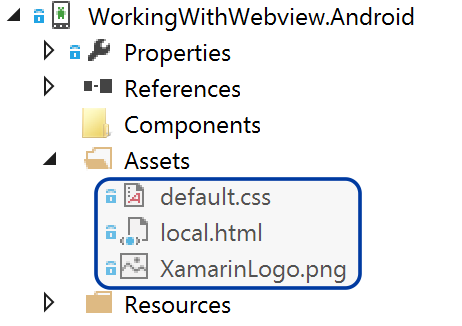
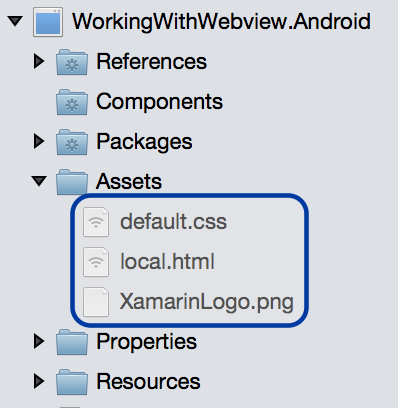
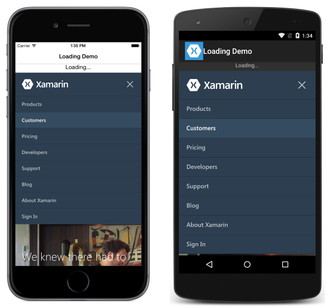
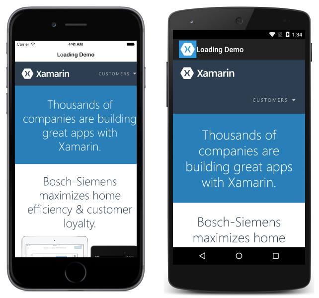

# Xamarin.Forms WebView

[`WebView`](xref:Xamarin.Forms.WebView) is a view for displaying web and HTML content in your app. Unlike `OpenUri`, which takes the user to the web browser on the device, `WebView` displays the HTML content inside your app.


## Content

`WebView` supports the following types of content:

- HTML & CSS websites &ndash; WebView has full support for websites written using HTML & CSS, including JavaScript support.
- Documents &ndash; Because WebView is implemented using native components on each platform, WebView is capable of showing documents that are viewable on each platform. That means that PDF files work on iOS and Android.
- HTML strings &ndash; WebView can show HTML strings from memory.
- Local Files &ndash; WebView can present any of the content types above embedded in the app.

> [!NOTE]
> `WebView` on Windows does not support Silverlight, Flash or any ActiveX controls, even if they are supported by Internet Explorer on that platform.

### Websites

To display a website from the internet, set the `WebView`'s [`Source`](xref:Xamarin.Forms.WebViewSource) property to a string URL:

```csharp
var browser = new WebView {
  Source = "http://xamarin.com"
};
```

> [!NOTE]
> URLs must be fully formed with the protocol specified (i.e. it must have "http://" or "https://" prepended to it).

#### iOS and ATS

Since version 9, iOS will only allow your application to communicate with servers that implement best-practice security by default. Values must be set in `Info.plist` to enable communication with insecure servers.

> [!NOTE]
> If your application requires a connection to an insecure website, you should always enter the domain as an exception using `NSExceptionDomains` instead of turning ATS off completely using `NSAllowsArbitraryLoads`. `NSAllowsArbitraryLoads` should only be used in extreme emergency situations.

The following demonstrates how to enable a specific domain (in this case xamarin.com) to bypass ATS requirements:

```xml
<key>NSAppTransportSecurity</key>
    <dict>
        <key>NSExceptionDomains</key>
        <dict>
            <key>xamarin.com</key>
            <dict>
                <key>NSIncludesSubdomains</key>
                <true/>
                <key>NSTemporaryExceptionAllowsInsecureHTTPLoads</key>
                <true/>
                <key>NSTemporaryExceptionMinimumTLSVersion</key>
                <string>TLSv1.1</string>
            </dict>
        </dict>
    </dict>
```

It is best practice to only enable some domains to bypass ATS, allowing you to use trusted sites while benefitting from the additional security on untrusted domains. The following demonstrates the less secure method of disabling ATS for the app:

```xml
<key>NSAppTransportSecurity</key>
    <dict>
        <key>NSAllowsArbitraryLoads </key>
        <true/>
    </dict>
```

See [App Transport Security](~/ios/app-fundamentals/ats.md) for more information about this new feature in iOS 9.

### HTML Strings

If you want to present a string of HTML defined dynamically in code, you'll need to create an instance of [`HtmlWebViewSource`](xref:Xamarin.Forms.HtmlWebViewSource):

```csharp
var browser = new WebView();
var htmlSource = new HtmlWebViewSource();
htmlSource.Html = @"<html><body>
  <h1>Xamarin.Forms</h1>
  <p>Welcome to WebView.</p>
  </body></html>";
browser.Source = htmlSource;
```



In the above code, `@` is used to mark the HTML as a string literal, meaning all the usual escape characters are ignored.

### Local HTML Content

WebView can display content from HTML, CSS and Javascript embedded within the app. For example:

```html
<html>
  <head>
    <title>Xamarin Forms</title>
  </head>
  <body>
    <h1>Xamrin.Forms</h1>
    <p>This is an iOS web page.</p>
    
  </body>
</html>
```

CSS:

```css
html,body {
  margin:0;
  padding:10;
}
body,p,h1 {
  font-family: Chalkduster;
}
```

Note that the fonts specified in the above CSS will need to be customized for each platform, as not every platform has the same fonts.

To display local content using a `WebView`, you'll need to open the HTML file like any other, then load the contents as a string into the `Html` property of an `HtmlWebViewSource`. For more information on opening files, see [Working with Files](~/xamarin-forms/app-fundamentals/files.md).

The following screenshots show the result of displaying local content on each platform:



Although the first page has been loaded, the `WebView` has no knowledge of where the HTML came from. That is a problem when dealing with pages that reference local resources. Examples of when that might happen include when local pages link to each other, a page makes use of a separate JavaScript file, or a page links to a CSS stylesheet.  

To solve this, you need to tell the `WebView` where to find files on the filesystem. Do that by setting the `BaseUrl` property on the `HtmlWebViewSource` used by the `WebView`.

Because the filesystem on each of the operating systems is different, you need to determine that URL on each platform. Xamarin.Forms exposes the `DependencyService` for resolving dependencies at runtime on each platform.

To use the `DependencyService`, first define an interface that can be implemented on each platform:

```csharp
public interface IBaseUrl { string Get(); }
```

Note that until the interface is implemented on each platform, the app will not run. In the common project, make sure that you remember to set the `BaseUrl` using the `DependencyService`:

```csharp
var source = new HtmlWebViewSource();
source.BaseUrl = DependencyService.Get<IBaseUrl>().Get();
```

Implementations of the interface for each platform must then be provided.

#### iOS

On iOS, the web content should be located in the project's root directory or **Resources** directory with build action *BundleResource*, as demonstrated below:

# [Visual Studio](#tab/windows)



# [Visual Studio for Mac](#tab/macos)



-----

The `BaseUrl` should be set to the path of the main bundle:

```csharp
[assembly: Dependency (typeof (BaseUrl_iOS))]
namespace WorkingWithWebview.iOS{
  public class BaseUrl_iOS : IBaseUrl {
    public string Get() {
      return NSBundle.MainBundle.BundlePath;
    }
  }
}
```

#### Android

On Android, place HTML, CSS, and images in the Assets folder with build action *AndroidAsset* as demonstrated below:

# [Visual Studio](#tab/windows)



# [Visual Studio for Mac](#tab/macos)



-----

On Android, the `BaseUrl` should be set to `"file:///android_asset/"`:

```csharp
[assembly: Dependency (typeof(BaseUrl_Android))]
namespace WorkingWithWebview.Android {
  public class BaseUrl_Android : IBaseUrl {
    public string Get() {
      return "file:///android_asset/";
    }
  }
}
```

On Android, files in the **Assets** folder can also be accessed through the current Android context, which is exposed by the `MainActivity.Instance` property:

```csharp
var assetManager = MainActivity.Instance.Assets;
using (var streamReader = new StreamReader (assetManager.Open ("local.html"))) {
  var html = streamReader.ReadToEnd ();
}
```

#### Universal Windows Platform

On Universal Windows Platform (UWP) projects, place HTML, CSS and images in the project root with the build action set to *Content*.

The `BaseUrl` should be set to `"ms-appx-web:///"`:

```csharp
[assembly: Dependency(typeof(BaseUrl))]
namespace WorkingWithWebview.UWP
{
    public class BaseUrl : IBaseUrl
    {
        public string Get()
        {
            return "ms-appx-web:///";
        }
    }
}
```

## Navigation

WebView supports navigation through several methods and properties that it makes available:

- **GoForward()** &ndash; if `CanGoForward` is true, calling `GoForward` navigates forward to the next visited page.
- **GoBack()** &ndash; if `CanGoBack` is true, calling `GoBack` will navigate to the last visited page.
- **CanGoBack** &ndash; `true` if there are pages to navigate back to, `false` if the browser is at the starting URL.
- **CanGoForward** &ndash; `true` if the user has navigated backwards and can move forward to a page that was already visited.

Within pages, `WebView` does not support multi-touch gestures. It is important to make sure that content is mobile-optimized and appears without the need for zooming.

It is common for applications to show a link within a `WebView`, rather than the device's browser. In those situations, it is useful to allow normal navigation, but when the user hits back while they are on the starting link, the app should return to the normal app view.

Use the built-in navigation methods and properties to enable this scenario.

Start by creating the page for the browser view:

```xaml
<?xml version="1.0" encoding="UTF-8"?>
<ContentPage xmlns="http://xamarin.com/schemas/2014/forms"
xmlns:x="http://schemas.microsoft.com/winfx/2009/xaml"
x:Class="WebViewDemo.InAppDemo"
Title="In App Browser">
    <ContentPage.Content>
        <StackLayout>
            <StackLayout Orientation="Horizontal" Padding="10,10">
                <Button Text="Back" HorizontalOptions="StartAndExpand" Clicked="backClicked" />
                <Button Text="Forward" HorizontalOptions="End" Clicked="forwardClicked" />
            </StackLayout>
            <WebView x:Name="Browser" WidthRequest="1000" HeightRequest="1000" />
        </StackLayout>
    </ContentPage.Content>
</ContentPage>
```

In our code-behind:

```csharp
public partial class InAppDemo : ContentPage
{
  //sets the URL for the browser in the page at creation
    public InAppDemo (string URL)
    {
        InitializeComponent ();
        Browser.Source = URL;
    }


    private void backClicked(object sender, EventArgs e)
    {
    // Check to see if there is anywhere to go back to
        if (Browser.CanGoBack) {
            Browser.GoBack ();
        } else { // If not, leave the view
            Navigation.PopAsync ();
        }
    }

    private void forwardClicked(object sender, EventArgs e)
    {
        if (Browser.CanGoForward) {
            Browser.GoForward ();
        }
    }
}
```

That's it!


## Events

WebView raises two events to help you respond to changes in state:

- **Navigating** &ndash; event raised when the WebView begins loading a new page.
- **Navigated** &ndash; event raised when the page is loaded and navigation has stopped.

If you anticipate using webpages that take a long time to load, consider using those events to implement a status indicator. For example the XAML looks like this:

```xaml
<?xml version="1.0" encoding="UTF-8"?>
<ContentPage xmlns="http://xamarin.com/schemas/2014/forms"
xmlns:x="http://schemas.microsoft.com/winfx/2009/xaml"
x:Class="WebViewDemo.LoadingDemo" Title="Loading Demo">
  <ContentPage.Content>
    <StackLayout>
      <Label x:Name="LoadingLabel"
        Text="Loading..."
        HorizontalOptions="Center"
        IsVisible="false" />
      <WebView x:Name="Browser"
      HeightRequest="1000"
      WidthRequest="1000"
      Navigating="webOnNavigating"
      Navigated="webOnEndNavigating" />
    </StackLayout>
  </ContentPage.Content>
</ContentPage>
```

The two event handlers:

```csharp
void webOnNavigating (object sender, WebNavigatingEventArgs e)
{
    LoadingLabel.IsVisible = true;
}

void webOnEndNavigating (object sender, WebNavigatedEventArgs e)
{
    LoadingLabel.IsVisible = false;
}
```

This results in the following output (loading):



Finished Loading:



## Performance

The popular web browsers now adopt technologies like hardware accelerated rendering and JavaScript compilation. On iOS, by default, the Xamarin.Forms `WebView` is implemented by the `UIWebView` class, and many of these technologies are unavailable in this implementation. However, an application can opt-in to using the iOS `WkWebView` class to implement the Xamarin.Forms `WebView`, which supports faster browsing. This can be achieved by adding the following code to the **AssemblyInfo.cs** file in the iOS platform project for the application:

```csharp
// Opt-in to using WkWebView instead of UIWebView.
[assembly: ExportRenderer(typeof(WebView), typeof(Xamarin.Forms.Platform.iOS.WkWebViewRenderer))]
```

`WebView` on Android by default is about as fast as the built-in browser.

The [UWP WebView](https://docs.microsoft.com/windows/uwp/design/controls-and-patterns/web-view) uses the Microsoft Edge rendering engine. Desktop and tablet devices should see the same performance as using the Edge browser itself.

## Permissions

In order for `WebView` to work, you must make sure that permissions are set for each platform. Note that on some platforms, `WebView` will work in debug mode, but not when built for release. That is because some permissions, like those for internet access on Android, are set by default by Visual Studio for Mac when in debug mode.

- **UWP** &ndash; requires the Internet (Client & Server) capability when displaying network content.
- **Android** &ndash; requires `INTERNET`  only when displaying content from the network. Local content requires no special permissions.
- **iOS** &ndash; requires no special permissions.

## Layout

Unlike most other Xamarin.Forms views, `WebView` requires that `HeightRequest` and `WidthRequest` are specified when contained in StackLayout or RelativeLayout. If you fail to specify those properties, the `WebView` will not render.

The following examples demonstrate layouts that result in working, rendering `WebView`s:

StackLayout with WidthRequest & HeightRequest:

```xaml
<StackLayout>
    <Label Text="test" />
    <WebView Source="http://www.xamarin.com/"
        HeightRequest="1000"
        WidthRequest="1000" />
</StackLayout>
```

RelativeLayout with WidthRequest & HeightRequest:

```xaml
<RelativeLayout>
    <Label Text="test"
        RelativeLayout.XConstraint= "{ConstraintExpression
                                      Type=Constant, Constant=10}"
        RelativeLayout.YConstraint= "{ConstraintExpression
                                      Type=Constant, Constant=20}" />
    <WebView Source="http://www.xamarin.com/"
        RelativeLayout.XConstraint="{ConstraintExpression Type=Constant,
                                     Constant=10}"
        RelativeLayout.YConstraint="{ConstraintExpression Type=Constant,
                                     Constant=50}"
        WidthRequest="1000" HeightRequest="1000" />
</RelativeLayout>
```

AbsoluteLayout *without* WidthRequest & HeightRequest:

```xaml
<AbsoluteLayout>
    <Label Text="test" AbsoluteLayout.LayoutBounds="0,0,100,100" />
    <WebView Source="http://www.xamarin.com/"
      AbsoluteLayout.LayoutBounds="0,150,500,500" />
</AbsoluteLayout>
```

Grid *without* WidthRequest & HeightRequest. Grid is one of the few layouts that does not require specifying requested heights and widths.:

```xaml
<Grid>
    <Grid.RowDefinitions>
        <RowDefinition Height="100" />
        <RowDefinition Height="*" />
    </Grid.RowDefinitions>
    <Label Text="test" Grid.Row="0" />
    <WebView Source="http://www.xamarin.com/" Grid.Row="1" />
</Grid>
```

## Invoking JavaScript

The [`WebView`](xref:Xamarin.Forms.WebView) includes the ability to invoke a JavaScript function from C#, and return any result to the calling C# code. This is accomplished with the [`WebView.EvaluateJavaScriptAsync`](xref:Xamarin.Forms.WebView.EvaluateJavaScriptAsync*) method, which is shown in the following example from the [WebView](https://developer.xamarin.com/samples/xamarin-forms/UserInterface/WebView) sample:

```csharp
var numberEntry = new Entry { Text = "5" };
var resultLabel = new Label();
var webView = new WebView();
...

int number = int.Parse(numberEntry.Text);
string result = await webView.EvaluateJavaScriptAsync($"factorial({number})");
resultLabel.Text = $"Factorial of {number} is {result}.";
```

The [`WebView.EvaluateJavaScriptAsync`](xref:Xamarin.Forms.WebView.EvaluateJavaScriptAsync*) method evaluates the JavaScript that's specified as the argument, and returns any result as a `string`. In this example, the `factorial` JavaScript function is invoked, which returns the factorial of `number` as a result. This JavaScript function is defined in the local HTML file that the [`WebView`](xref:Xamarin.Forms.WebView) loads, and is shown in the following example:

```html
<html>
<body>
<script type="text/javascript">
function factorial(num) {
        if (num === 0 || num === 1)
            return 1;
        for (var i = num - 1; i >= 1; i--) {
            num *= i;
        }
        return num;
}
</script>
</body>
</html>
```

## Related Links

- [Working with WebView (sample)](https://developer.xamarin.com/samples/xamarin-forms/WorkingWithWebview/)
- [WebView (sample)](https://developer.xamarin.com/samples/xamarin-forms/UserInterface/WebView)
