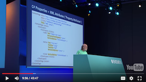

# eXtensible Application Markup Language (XAML)

_XAML is a declarative markup language that can be used to define user interfaces. The user interface is defined in an XML file using the XAML syntax, while runtime behavior is defined in a separate code-behind file._

[Evolve 2016: Becoming a XAML Master](https://evolve.xamarin.com/session/56e201d2bad314273ca4d813)

> [!NOTE]
> Try out the [XAML Standard Preview](standard/index.md)

<a name="xaml" />

## [XAML Basics](xaml-basics/index.md)

XAML allows developers to define user interfaces in Xamarin.Forms applications using markup rather than code. XAML is never required in a Xamarin.Forms program but it is toolable, and is often more visually coherent and more succinct than equivalent code. XAML is particularly well suited for use with the popular Model-View-ViewModel (MVVM) application architecture: XAML defines the View that is linked to ViewModel code through XAML-based data bindings.

## [XAML Compilation](xamlc.md)

XAML can be optionally compiled directly into intermediate language (IL) with the XAML compiler (XAMLC). This articles describes how to use XAMLC, and its benefits.

## [XAML Previewer](xaml-previewer.md)

The [XAML Previewer](~/xamarin-forms/xaml/xaml-previewer.md) announced at Xamarin Evolve 2016 is available for testing in the Alpha channel.

## [XAML Namespaces](namespaces.md)

XAML uses the `xmlns` XML attribute for namespace declarations. This article introduces the XAML namespace syntax, and demonstrates how to declare a XAML namespace to access a type.

## [XAML Markup Extensions](markup-extensions/index.md)

XAML includes markup extensions for setting attributes to values or objects beyond what can be expressed with simple strings. These include referencing constants, static properties and fields, resource dictionaries, and data bindings.

## [Passing Arguments](passing-arguments.md)

XAML can be used to pass arguments to non-default constructors or to factory methods. This article demonstrates using the XAML attributes that can be used to pass arguments to constructors, to call factory methods, and to specify the type of a generic argument.

## [Bindable Properties](bindable-properties.md)

In Xamarin.Forms, the functionality of common language runtime (CLR) properties is extended by bindable properties. A bindable property is a special type of property, where the property's value is tracked by the Xamarin.Forms property system. This article provides an introduction to bindable properties, and demonstrates how to create and consume them.

## [Attached Properties](attached-properties.md)

An attached property is a special type of bindable property, defined in one class but attached to other objects, and recognizable in XAML as an attribute that contains a class and a property name separated by a period. This article provides an introduction to attached properties, and demonstrates how to create and consume them.

## [Resource Dictionaries](resource-dictionaries.md)

XAML resources are definitions of objects that can be used more than once. A [`ResourceDictionary`](https://developer.xamarin.com/api/type/Xamarin.Forms.ResourceDictionary/) allows resources to be defined in a single location, and re-used throughout a Xamarin.Forms application. This article demonstrates how to create and consume a `ResourceDictionary`, and how to merge one `ResourceDictionary` into another.
