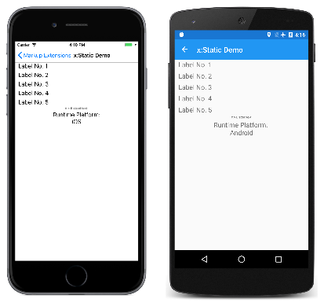
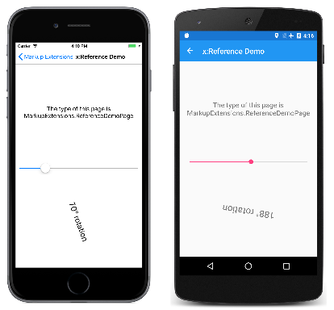
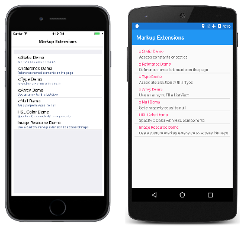
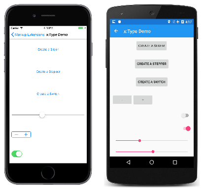
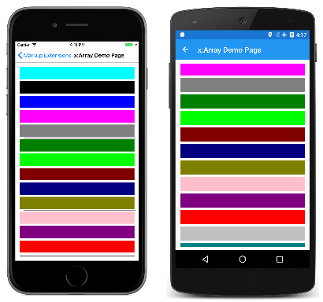
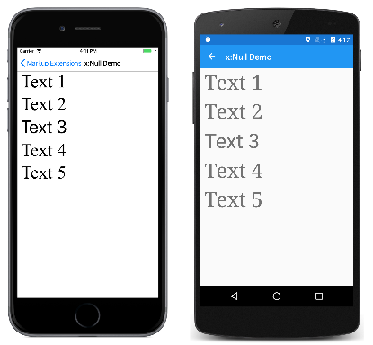

# Consuming XAML Markup Extensions

XAML markup extensions help enhance the power and flexibility of XAML by allowing element attributes to be set from a variety of sources. Several XAML markup extensions are part of the XAML 2009 specification. These appear in XAML files with the customary `x` namespace prefix, and are commonly referred to with this prefix. These are described in the sections below:

- [`x:Static`](#static) &ndash; reference static properties, fields, or enumeration members.
- [`x:Reference`](#reference) &ndash; reference named elements on the page.
- [`x:Type`](#type) &ndash; set an attribute to a `System.Type` object.
- [`x:Array`](#array) &ndash; construct an array of objects of a particular type.
- [`x:Null`](#null) &ndash; set an attribute to a `null` value.

Additional XAML markup extensions have historically been supported by other XAML implementations, and are also supported by Xamarin.Forms. These are described more fully in other articles:

- `StaticResource` &ndash; reference objects from a resource dictionary, as described in the article  [**Resource Dictionaries**](~/xamarin-forms/xaml/resource-dictionaries.md).
- `DynamicResource` &ndash; respond to changes in objects in a resource dictionary, as described in the article [**Dynamic Styles**](~/xamarin-forms/user-interface/styles/dynamic.md).
- `Binding` &ndash; establish a link between properties of two objects, as described in the article [**Data Binding**](~/xamarin-forms/app-fundamentals/data-binding/index.md).
- `TemplateBinding` &ndash; performs data binding from a control template, as discussed in the article [**Binding from a Control Template**](/guides/xamarin-forms/application-fundamentals/templates/control-templates/template-binding/).

The [`RelativeLayout`](xref:Xamarin.Forms.RelativeLayout) layout makes use of the custom markup extension [`ConstraintExpression`](xref:Xamarin.Forms.ConstraintExpression). This markup extension is described in the article [**RelativeLayout**](~/xamarin-forms/user-interface/layouts/relative-layout.md).

<a name="static" />

## x:Static Markup Extension

The `x:Static` markup extension is supported by the [`StaticExtension`](xref:Xamarin.Forms.Xaml.StaticExtension) class. The class has a single property named [`Member`](xref:Xamarin.Forms.Xaml.StaticExtension.Member) of type `string` that you set to the name of a public constant, static property, static field, or enumeration member.

One common way to use `x:Static` is to first define a class with some constants or static variables, such as this tiny `AppConstants` class in the [**MarkupExtensions**](https://developer.xamarin.com/samples/xamarin-forms/XAML/MarkupExtensions/) program:

```csharp
static class AppConstants
{
    public static double NormalFontSize = 18;
}
```

The **x:Static Demo** page demonstrates several ways to use the `x:Static` markup extension. The most verbose approach instantiates the `StaticExtension` class between `Label.FontSize` property-element tags:

```xaml
<ContentPage xmlns="http://xamarin.com/schemas/2014/forms"
             xmlns:x="http://schemas.microsoft.com/winfx/2009/xaml"
             xmlns:sys="clr-namespace:System;assembly=mscorlib"
             xmlns:local="clr-namespace:MarkupExtensions"
             x:Class="MarkupExtensions.StaticDemoPage"
             Title="x:Static Demo">
    <StackLayout Margin="10, 0">
        <Label Text="Label No. 1">
            <Label.FontSize>
                <x:StaticExtension Member="local:AppConstants.NormalFontSize" />
            </Label.FontSize>
        </Label>

        ···

    </StackLayout>
</ContentPage>
```

The XAML parser also allows the `StaticExtension` class to be abbreviated as `x:Static`:

```xaml
<Label Text="Label No. 2">
    <Label.FontSize>
        <x:Static Member="local:AppConstants.NormalFontSize" />
    </Label.FontSize>
</Label>
```

This can be simplified even further, but the change introduces some new syntax: It consists of putting the `StaticExtension` class and the member setting in curly braces. The resulting expression is set directly to the `FontSize` attribute:

```xaml
<Label Text="Label No. 3"
       FontSize="{x:StaticExtension Member=local:AppConstants.NormalFontSize}" />
```

Notice that there are *no* quotation marks within the curly braces. The `Member` property of `StaticExtension` is no longer an XML attribute. It is instead part of the expression for the markup extension.

Just as you can abbreviate `x:StaticExtension` to `x:Static` when you use it as an object element, you can also abbreviate it in the expression within curly braces:

```xaml
<Label Text="Label No. 4"
       FontSize="{x:Static Member=local:AppConstants.NormalFontSize}" />
```

The `StaticExtension` class has a `ContentProperty` attribute referencing the property `Member`, which marks this property as the class's default content property. For XAML markup extensions expressed with curly braces, you can eliminate the `Member=` part of the expression:

```xaml
<Label Text="Label No. 5"
       FontSize="{x:Static local:AppConstants.NormalFontSize}" />
```

This is the most common form of the `x:Static` markup extension.

The **Static Demo** page contains two other examples. The root tag of the XAML file contains an XML namespace declaration for the .NET `System` namespace:

```xaml
xmlns:sys="clr-namespace:System;assembly=mscorlib"
```

This allows the `Label` font size to be set to the static field `Math.PI`. That results in rather small text, so the `Scale` property is set to `Math.E`:

```xaml
<Label Text="&#x03C0; &#x00D7; E sized text"
       FontSize="{x:Static sys:Math.PI}"
       Scale="{x:Static sys:Math.E}"
       HorizontalOptions="Center" />
```

The final example displays the `Device.RuntimePlatform` value. The `Environment.NewLine` static property is used to insert a new-line character between the two `Span` objects:

```xaml
<Label HorizontalTextAlignment="Center"
       FontSize="{x:Static local:AppConstants.NormalFontSize}">
    <Label.FormattedText>
        <FormattedString>
            <Span Text="Runtime Platform: " />
            <Span Text="{x:Static sys:Environment.NewLine}" />
            <Span Text="{x:Static Device.RuntimePlatform}" />
        </FormattedString>
    </Label.FormattedText>
</Label>
```

Here's the sample running on all three platforms:

[](consuming-images/staticdemo-large.png#lightbox "x:Static Demo")

<a name="reference" />

## x:Reference Markup Extension

The `x:Reference` markup extension is supported by the [`ReferenceExtension`](xref:Xamarin.Forms.Xaml.ReferenceExtension) class. The class has a single property named [`Name`](xref:Xamarin.Forms.Xaml.ReferenceExtension.Name) of type `string` that you set to the name of an element on the page that has been given a name with `x:Name`. This `Name` property is the content property of `ReferenceExtension`, so `Name=` is not required when `x:Reference` appears in curly braces.

The `x:Reference` markup extension is used exclusively with data bindings, which are described in more detail in the article [**Data Binding**](~/xamarin-forms/app-fundamentals/data-binding/index.md).

The **x:Reference Demo** page shows two uses of `x:Reference` with data bindings, the first where it's used to set the `Source` property of the `Binding` object, and the second where it's used to set the `BindingContext` property for two data bindings:

```xaml
<ContentPage xmlns="http://xamarin.com/schemas/2014/forms"
             xmlns:x="http://schemas.microsoft.com/winfx/2009/xaml"
             x:Class="MarkupExtensions.ReferenceDemoPage"
             x:Name="page"
             Title="x:Reference Demo">

    <StackLayout Margin="10, 0">

        <Label Text="{Binding Source={x:Reference page},
                              StringFormat='The type of this page is {0}'}"
               FontSize="18"
               VerticalOptions="CenterAndExpand"
               HorizontalTextAlignment="Center" />

        <Slider x:Name="slider"
                Maximum="360"
                VerticalOptions="Center" />

        <Label BindingContext="{x:Reference slider}"
               Text="{Binding Value, StringFormat='{0:F0}&#x00B0; rotation'}"
               Rotation="{Binding Value}"
               FontSize="24"
               HorizontalOptions="Center"
               VerticalOptions="CenterAndExpand" />

    </StackLayout>
</ContentPage>
```

Both `x:Reference` expressions use the abbreviated version of the `ReferenceExtension` class name and eliminate the `Name=` part of the expression. In the first example, the `x:Reference` markup extension is embedded in the `Binding` markup extension. Notice that the `Source` and `StringFormat` settings are separated by commas. Here's the program running on all three platforms:

[](consuming-images/referencedemo-large.png#lightbox "x:Reference Demo")

<a name="type" />

## x:Type Markup Extension

The `x:Type` markup extension is the XAML equivalent of the C# [`typeof`](/dotnet/csharp/language-reference/keywords/typeof/) keyword. It is supported by the [`TypeExtension`](xref:Xamarin.Forms.Xaml.TypeExtension) class, which defines one property named [`TypeName`](xref:Xamarin.Forms.Xaml.TypeExtension.TypeName) of type `string` that is set to a class or structure name. The `x:Type` markup extension returns the [`System.Type`](xref:System.Type) object of that class or structure. `TypeName` is the content property of `TypeExtension`, so `TypeName=` is not required when `x:Type` appears with curly braces.

Within Xamarin.Forms, there are several properties that have arguments of type `Type`. Examples include the [`TargetType`](xref:Xamarin.Forms.Style.TargetType) property of `Style`, and the [x:TypeArguments](~/xamarin-forms/xaml/passing-arguments.md#generic_type_arguments) attribute used to specify arguments in generic classes. However, the XAML parser performs the `typeof` operation automatically, and the `x:Type` markup extension is not used in these cases.

One place where `x:Type` *is* required is with the `x:Array` markup extension, which is described in the [next section](#array).

The `x:Type` markup extension is also useful when constructing a menu where each menu item corresponds to an object of a particular type. You can associate a `Type` object with each menu item, and then instantiate the object when the menu item is selected.

This is how the navigation menu in `MainPage` in the **Markup Extensions** program works. The **MainPage.xaml** file contains a `TableView` with each `TextCell` corresponding to a particular page in the program:

```xaml
<ContentPage xmlns="http://xamarin.com/schemas/2014/forms"
             xmlns:x="http://schemas.microsoft.com/winfx/2009/xaml"
             xmlns:local="clr-namespace:MarkupExtensions"
             x:Class="MarkupExtensions.MainPage"
             Title="Markup Extensions"
             Padding="10">
    <TableView Intent="Menu">
        <TableRoot>
            <TableSection>
                <TextCell Text="x:Static Demo"
                          Detail="Access constants or statics"
                          Command="{Binding NavigateCommand}"
                          CommandParameter="{x:Type local:StaticDemoPage}" />

                <TextCell Text="x:Reference Demo"
                          Detail="Reference named elements on the page"
                          Command="{Binding NavigateCommand}"
                          CommandParameter="{x:Type local:ReferenceDemoPage}" />

                <TextCell Text="x:Type Demo"
                          Detail="Associate a Button with a Type"
                          Command="{Binding NavigateCommand}"
                          CommandParameter="{x:Type local:TypeDemoPage}" />

                <TextCell Text="x:Array Demo"
                          Detail="Use an array to fill a ListView"
                          Command="{Binding NavigateCommand}"
                          CommandParameter="{x:Type local:ArrayDemoPage}" />

                ···                          

        </TableRoot>
    </TableView>
</ContentPage>
```

Here's the opening main page in **Markup Extensions**:

[](consuming-images/mainpage-large.png#lightbox "Main Page")

Each `CommandParameter` property is set to an `x:Type` markup extension that references one of the other pages. The `Command` property is bound to a property named `NavigateCommand`. This property is defined in the `MainPage` code-behind file:

```csharp
public partial class MainPage : ContentPage
{
    public MainPage()
    {
        InitializeComponent();

        NavigateCommand = new Command<Type>(async (Type pageType) =>
        {
            Page page = (Page)Activator.CreateInstance(pageType);
            await Navigation.PushAsync(page);
        });

        BindingContext = this;
    }

    public ICommand NavigateCommand { private set; get; }
}
```

The `NavigateCommand` property is a `Command` object that implements an execute command with an argument of type `Type` &mdash; the value of `CommandParameter`. The method uses `Activator.CreateInstance` to instantiate the page and then navigates to it. The constructor concludes by setting the `BindingContext` of the page to itself, which enables the `Binding` on `Command` to work. See the [**Data Binding**](~/xamarin-forms/app-fundamentals/data-binding/index.md) article and particularly the [**Commanding**](~/xamarin-forms/app-fundamentals/data-binding/commanding.md) article for more details about this type of code.

The **x:Type Demo** page uses a similar technique to instantiate Xamarin.Forms elements and to add them to a `StackLayout`. The XAML file initially consists of three `Button` elements with their `Command` properties set to a `Binding` and the `CommandParameter` properties set to types of three Xamarin.Forms views:

```xaml
<ContentPage xmlns="http://xamarin.com/schemas/2014/forms"
             xmlns:x="http://schemas.microsoft.com/winfx/2009/xaml"
             x:Class="MarkupExtensions.TypeDemoPage"
             Title="x:Type Demo">

    <StackLayout x:Name="stackLayout"
                 Padding="10, 0">

        <Button Text="Create a Slider"
                HorizontalOptions="Center"
                VerticalOptions="CenterAndExpand"
                Command="{Binding CreateCommand}"
                CommandParameter="{x:Type Slider}" />

        <Button Text="Create a Stepper"
                HorizontalOptions="Center"
                VerticalOptions="CenterAndExpand"
                Command="{Binding CreateCommand}"
                CommandParameter="{x:Type Stepper}" />

        <Button Text="Create a Switch"
                HorizontalOptions="Center"
                VerticalOptions="CenterAndExpand"
                Command="{Binding CreateCommand}"
                CommandParameter="{x:Type Switch}" />
    </StackLayout>
</ContentPage>
```

The code-behind file defines and initializes the `CreateCommand` property:

```csharp
public partial class TypeDemoPage : ContentPage
{
    public TypeDemoPage()
    {
        InitializeComponent();

        CreateCommand = new Command<Type>((Type viewType) =>
        {
            View view = (View)Activator.CreateInstance(viewType);
            view.VerticalOptions = LayoutOptions.CenterAndExpand;
            stackLayout.Children.Add(view);
        });

        BindingContext = this;
    }

    public ICommand CreateCommand { private set; get; }
}
```

The method that is executed when a `Button` is pressed creates a new instance of the argument, sets its `VerticalOptions` property, and adds it to the `StackLayout`. The three `Button` elements then share the page with dynamically created views:

[](consuming-images/typedemo-large.png#lightbox "x:Type Demo")

<a name="array" />

## x:Array Markup Extension

The `x:Array` markup extension allows you to define an array in markup. It is supported by the [`ArrayExtension`](xref:Xamarin.Forms.Xaml.ArrayExtension) class, which defines two properties:

- `Type` of type `Type`, which indicates the type of the elements in the array.
- `Items` of type `IList`, which is a collection of the items themselves. This is the content property of `ArrayExtension`.

The `x:Array` markup extension itself never appears in curly braces. Instead, `x:Array` start and end tags delimit the list of items. Set the `Type` property to an `x:Type` markup extension.

The **x:Array Demo** page shows how to use `x:Array` to add items to a `ListView` by setting the `ItemsSource` property to an array:

```xaml
<ContentPage xmlns="http://xamarin.com/schemas/2014/forms"
             xmlns:x="http://schemas.microsoft.com/winfx/2009/xaml"
             x:Class="MarkupExtensions.ArrayDemoPage"
             Title="x:Array Demo Page">
    <ListView Margin="10">
        <ListView.ItemsSource>
            <x:Array Type="{x:Type Color}">
                <Color>Aqua</Color>
                <Color>Black</Color>
                <Color>Blue</Color>
                <Color>Fuchsia</Color>
                <Color>Gray</Color>
                <Color>Green</Color>
                <Color>Lime</Color>
                <Color>Maroon</Color>
                <Color>Navy</Color>
                <Color>Olive</Color>
                <Color>Pink</Color>
                <Color>Purple</Color>
                <Color>Red</Color>
                <Color>Silver</Color>
                <Color>Teal</Color>
                <Color>White</Color>
                <Color>Yellow</Color>
            </x:Array>
        </ListView.ItemsSource>

        <ListView.ItemTemplate>
            <DataTemplate>
                <ViewCell>
                    <BoxView Color="{Binding}"
                             Margin="3" />    
                </ViewCell>
            </DataTemplate>
        </ListView.ItemTemplate>
    </ListView>
</ContentPage>        
```

The `ViewCell` creates a simple `BoxView` for each color entry:

[](consuming-images/arraydemo-large.png#lightbox "x:Array Demo")

There are several ways to specify the individual `Color` items in this array. You can use an `x:Static` markup extension:

```xaml
<x:Static Member="Color.Blue" />
```

Or, you can use `StaticResource` to retrieve a color from a resource dictionary:

```xaml
<StaticResource Key="myColor" />
```

Towards the end of this article, you'll see a custom XAML markup extension that also creates a new color value:

```xaml
<local:HslColor H="0.5" S="1.0" L="0.5" />
```

When defining arrays of common types like strings or numbers, use the tags listed in the [**Passing Constructor Arguments**](~/xamarin-forms/xaml/passing-arguments.md#constructor_arguments) article to delimit the values.

<a name="null" />

## x:Null Markup Extension

The `x:Null` markup extension is supported by the [`NullExtension`](xref:Xamarin.Forms.Xaml.NullExtension) class. It has no properties and is simply the XAML equivalent of the C# [`null`](/dotnet/csharp/language-reference/keywords/null/) keyword.

The `x:Null` markup extension is rarely needed and seldom used, but if you do find a need for it, you'll be glad that it exists.

The **x:Null Demo** page illustrates one scenario when `x:Null` might be convenient. Suppose that you define an implicit `Style` for `Label` that includes a `Setter` that sets the `FontFamily` property to a platform-dependent family name:

```xaml
<ContentPage xmlns="http://xamarin.com/schemas/2014/forms"
             xmlns:x="http://schemas.microsoft.com/winfx/2009/xaml"
             x:Class="MarkupExtensions.NullDemoPage"
             Title="x:Null Demo">
    <ContentPage.Resources>
        <ResourceDictionary>
            <Style TargetType="Label">
                <Setter Property="FontSize" Value="48" />
                <Setter Property="FontFamily">
                    <Setter.Value>
                        <OnPlatform x:TypeArguments="x:String">
                            <On Platform="iOS" Value="Times New Roman" />
                            <On Platform="Android" Value="serif" />
                            <On Platform="UWP" Value="Times New Roman" />
                        </OnPlatform>
                    </Setter.Value>
                </Setter>
            </Style>
        </ResourceDictionary>
    </ContentPage.Resources>

    <ContentPage.Content>
        <StackLayout Padding="10, 0">
            <Label Text="Text 1" />
            <Label Text="Text 2" />

            <Label Text="Text 3"
                   FontFamily="{x:Null}" />

            <Label Text="Text 4" />
            <Label Text="Text 5" />
        </StackLayout>
    </ContentPage.Content>
</ContentPage>   
```

Then you discover that for one of the `Label` elements, you want all the property settings in the implicit `Style` except for the `FontFamily`, which you want to be the default value. You could define another `Style` for that purpose but a simpler approach is simply to set the `FontFamily` property of the particular `Label` to `x:Null`, as demonstrated in the center `Label`.

Here's the program running on the three platforms:

[](consuming-images/nulldemo-large.png#lightbox "x:Null Demo")

Notice that four of the `Label` elements have a serif font, but the center `Label` has the  default sans-serif font.

## Define Your Own Markup Extensions

If you've encountered a need for a XAML markup extension that isn't available in Xamarin.Forms, you can [create your own](creating.md).


## Related Links

- [Markup Extensions (sample)](https://developer.xamarin.com/samples/xamarin-forms/XAML/MarkupExtensions/)
- [XAML markup extensions chapter from Xamarin.Forms book](~/xamarin-forms/creating-mobile-apps-xamarin-forms/summaries/chapter10.md)
- [Resource Dictionaries](~/xamarin-forms/xaml/resource-dictionaries.md)
- [Dynamic Styles](~/xamarin-forms/user-interface/styles/dynamic.md)
- [Data Binding](~/xamarin-forms/app-fundamentals/data-binding/index.md)
