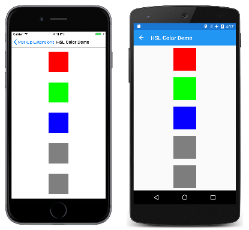
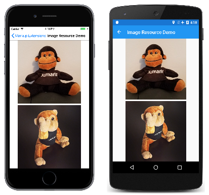

# Creating XAML Markup Extensions

On the programmatic level, a XAML markup extension is a class that implements the [`IMarkupExtension`](https://developer.xamarin.com/api/type/Xamarin.Forms.Xaml.IMarkupExtension/) or [`IMarkupExtension<T>`](https://developer.xamarin.com/api/type/Xamarin.Forms.Xaml.IMarkupExtension%3CT%3E/) interface. You can explore the source code of the standard markup extensions described below in the [**MarkupExtensions** directory](https://github.com/xamarin/Xamarin.Forms/tree/master/Xamarin.Forms.Xaml/MarkupExtensions) of the Xamarin.Forms GitHub repository. 

It's also possible to define your own custom XAML markup extensions by deriving from `IMarkupExtension` or `IMarkupExtension<T>`. Use the generic form if the markup extension obtains a value of a particular type. This is the case with several of the Xamarin.Forms markup extensions:

- `TypeExtension` derives from `IMarkupExtension<Type>`
- `ArrayExtension` derives from `IMarkupExtension<Array>`
- `DynamicResourceExtension` derives from `IMarkupExtension<DynamicResource>`
- `BindingExtension` derives from `IMarkupExtension<BindingBase>`
- `ConstraintExpression` derives from `IMarkupExtension<Constraint>`

The two `IMarkupExtension` interfaces define only one method each, named `ProvideValue`: 

```csharp
public interface IMarkupExtension
{
	object ProvideValue(IServiceProvider serviceProvider);
}

public interface IMarkupExtension<out T> : IMarkupExtension
{
	new T ProvideValue(IServiceProvider serviceProvider);
}
```

Since `IMarkupExtension<T>` derives from `IMarkupExtension` and includes the `new` keyword on `ProvideValue`, it contains both `ProvideValue` methods.

Very often, XAML markup extensions define properties that contribute to the return value. (The obvious exception is `NullExtension`, in which `ProvideValue` simply returns `null`.) The `ProvideValue` method has a single argument of type `IServiceProvider` that will be discussed later in this article.

## A Markup Extension for Specifying Color

The following XAML markup extension allows you to construct a `Color` value using hue, saturation, and luminosity components. It defines four properties for the four components of the color, including an alpha component that is initialized to 1. The class derives from `IMarkupExtension<Color>` to indicate a `Color` return value:

```csharp
public class HslColorExtension : IMarkupExtension<Color>
{
    public double H { set; get; }

    public double S { set; get; }

    public double L { set; get; }

    public double A { set; get; } = 1.0;

    public Color ProvideValue(IServiceProvider serviceProvider)
    {
        return Color.FromHsla(H, S, L, A);
    }

    object IMarkupExtension.ProvideValue(IServiceProvider serviceProvider)
    {
        return (this as IMarkupExtension<Color>).ProvideValue(serviceProvider);
    }
}
```

Because `IMarkupExtension<T>` derives from `IMarkupExtension`, the class must contain two `ProvideValue` methods, one that returns `Color` and another that returns `object`, but the second method can simply call the first method.

The **HSL Color Demo** page shows a variety of ways that `HslColorExtension` can appear in a XAML file to specify the color for a `BoxView`:

```xaml
<ContentPage xmlns="http://xamarin.com/schemas/2014/forms"
             xmlns:x="http://schemas.microsoft.com/winfx/2009/xaml"
             xmlns:local="clr-namespace:MarkupExtensions"
             x:Class="MarkupExtensions.HslColorDemoPage"
             Title="HSL Color Demo">

    <ContentPage.Resources>
        <ResourceDictionary>
            <Style TargetType="BoxView">
                <Setter Property="WidthRequest" Value="80" />
                <Setter Property="HeightRequest" Value="80" />
                <Setter Property="HorizontalOptions" Value="Center" />
                <Setter Property="VerticalOptions" Value="CenterAndExpand" />
            </Style>
        </ResourceDictionary>
    </ContentPage.Resources>
    
    <StackLayout>
        <BoxView>
            <BoxView.Color>
                <local:HslColorExtension H="0" S="1" L="0.5" A="1" />
            </BoxView.Color>
        </BoxView>

        <BoxView>
            <BoxView.Color>
                <local:HslColor H="0.33" S="1" L="0.5" />
            </BoxView.Color>
        </BoxView>

        <BoxView Color="{local:HslColorExtension H=0.67, S=1, L=0.5}" />

        <BoxView Color="{local:HslColor H=0, S=0, L=0.5}" />

        <BoxView Color="{local:HslColor A=0.5}" />
    </StackLayout>
</ContentPage>
```

Notice that when `HslColorExtension` is an XML tag, the four properties are set as attributes, but when it appears between curly braces, the four properties are separated by commas without quotation marks. The default values for `H`, `S`, and `L` are 0, and the default value of `A` is 1, so those properties can be omitted if you want them set to default values. The last example shows an example where the luminosity is 0, which normally results in black, but the alpha channel is 0.5, so it is half transparent and appears gray against the white background of the page:

[](creating-images/hslcolordemo-large.png#lightbox "HSL Color Demo")

## A Markup Extension for Accessing Bitmaps

The argument to `ProvideValue` is an object that implements the [`IServiceProvider`](https://developer.xamarin.com/api/type/System.IServiceProvider/) interface, which is defined in the .NET `System` namespace. This interface has one member, a method named `GetService` with a `Type` argument. 

The `ImageResourceExtension` class shown below shows one possible use of `IServiceProvider` and `GetService` to obtain an `IXmlLineInfoProvider` object that can provide line and character information indicating where a particular error was detected. In this case, an exception is raised when the `Source` property has not been set:

```csharp
[ContentProperty("Source")]
class ImageResourceExtension : IMarkupExtension<ImageSource>
{
    public string Source { set; get; }

    public ImageSource ProvideValue(IServiceProvider serviceProvider)
    {
        if (String.IsNullOrEmpty(Source))
        {
            IXmlLineInfoProvider lineInfoProvider = serviceProvider.GetService(typeof(IXmlLineInfoProvider)) as IXmlLineInfoProvider;
            IXmlLineInfo lineInfo = (lineInfoProvider != null) ? lineInfoProvider.XmlLineInfo : new XmlLineInfo();
            throw new XamlParseException("ImageResourceExtension requires Source property to be set", lineInfo);
        }

        string assemblyName = GetType().GetTypeInfo().Assembly.GetName().Name;

        return ImageSource.FromResource(assemblyName + "." + Source);
    }

    object IMarkupExtension.ProvideValue(IServiceProvider serviceProvider)
    {
        return (this as IMarkupExtension<ImageSource>).ProvideValue(serviceProvider);
    }
}
```

`ImageResourceExtension` is helpful when a XAML file needs to access an image file stored as an embedded resource in the .NET Standard library project. It uses the `Source` property to call the static `ImageSource.FromResource` method. This method requires a fully-qualified resource name, which consists of the assembly name, the folder name, and the filename separated by periods. The `ImageResourceExtension` doesn't need the assembly name portion because it obtains the assembly name using reflection and prepends it to the `Source` property. Regardless, `ImageSource.FromResource` must be called from the assembly that contains the bitmap, which means that this XAML resource extension cannot be part of an external library unless the images are also in that library. (See the [**Embedded Images**](~/xamarin-forms/user-interface/images.md#embedded_images) article for more information on accessing bitmaps stored as embedded resources.) 

Although `ImageResourceExtension` requires the `Source` property to be set, the `Source` property is indicated in an attribute as the content property of the class. This means that the `Source=` part of the expression in curly braces can be omitted. In the **Image Resource Demo** page, the `Image` elements fetch two images using the folder name and the filename separated by periods:

```xaml
<ContentPage xmlns="http://xamarin.com/schemas/2014/forms"
             xmlns:x="http://schemas.microsoft.com/winfx/2009/xaml"
             xmlns:local="clr-namespace:MarkupExtensions"
             x:Class="MarkupExtensions.ImageResourceDemoPage"
             Title="Image Resource Demo">
    <Grid>
        <Grid.RowDefinitions>
            <RowDefinition Height="*" />
            <RowDefinition Height="*" />
        </Grid.RowDefinitions>
        
        <Image Source="{local:ImageResource Images.SeatedMonkey.jpg}"
               Grid.Row="0" />

        <Image Source="{local:ImageResource Images.FacePalm.jpg}"
               Grid.Row="1" />

    </Grid>
</ContentPage>
```

Here's the program running on all three platforms:

[](creating-images/imageresourcedemo-large.png#lightbox "Image Resource Demo")

## Service Providers

By using the `IServiceProvider` argument to `ProvideValue`, XAML markup extensions can get access to helpful information about the XAML file in which they're being used. But to use the `IServiceProvider` argument successfully, you need to know what kind of services are available in particular contexts. The best way to get an understanding of this feature is by studying the source code of existing XAML markup extensions in the [**MarkupExtensions** folder](https://github.com/xamarin/Xamarin.Forms/tree/master/Xamarin.Forms.Xaml/MarkupExtensions) in the Xamarin.Forms repository on GitHub. Be aware that some types of services are internal to Xamarin.Forms.

In some XAML markup extensions, this service might be useful:

```csharp
 IProvideValueTarget provideValueTarget = serviceProvider.GetService(typeof(IProvideValueTarget)) as IProvideValueTarget;
```

The `IProvideValueTarget` interface defines two properties, `TargetObject` and `TargetProperty`. When this information is obtained in the `ImageResourceExtension` class, `TargetObject` is the `Image` and `TargetProperty` is a `BindableProperty` object for the `Source` property of `Image`. This is the property on which the XAML markup extension has been set.

The `GetService` call with an argument of `typeof(IProvideValueTarget)` actually returns an object of type `SimpleValueTargetProvider`, which is defined in the `Xamarin.Forms.Xaml.Internals` namespace. If you cast the return value of `GetService` to that type, you can also access a `ParentObjects` property, which is an array that contains the `Image` element, the `Grid` parent, and the `ImageResourceDemoPage` parent of the `Grid`.

## Conclusion

XAML markup extensions play a vital role in XAML by extending the ability to set attributes from a variety of sources. Moreover, if the existing XAML markup extensions don't provide exactly what you need, you can also write your own. 


## Related Links

- [Markup Extensions (sample)](https://developer.xamarin.com/samples/xamarin-forms/XAML/MarkupExtensions/)
- [XAML markup extensions chapter from Xamarin.Forms book](~/xamarin-forms/creating-mobile-apps-xamarin-forms/summaries/chapter10.md)
