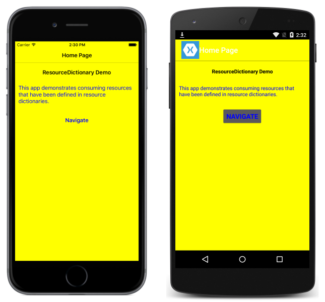
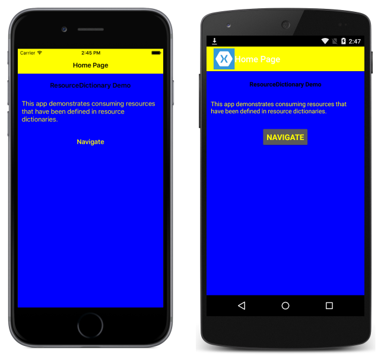

# Resource Dictionaries

_XAML resources are definitions of objects that can be used more than once. A ResourceDictionary allows resources to be defined in a single location, and re-used throughout a Xamarin.Forms application. This article explains how to create and consume a ResourceDictionary, and how to merge resource dictionaries._

## Overview

A [`ResourceDictionary`](https://developer.xamarin.com/api/type/Xamarin.Forms.ResourceDictionary/) is a repository for resources that are used by a Xamarin.Forms application. Typical resources that are stored in a `ResourceDictionary` include [styles](~/xamarin-forms/user-interface/styles/index.md), [control templates](~/xamarin-forms/app-fundamentals/templates/control-templates/index.md), [data templates](~/xamarin-forms/app-fundamentals/templates/data-templates/index.md), colors, and converters.

In XAML, resources are defined in a [`ResourceDictionary`](https://developer.xamarin.com/api/type/Xamarin.Forms.ResourceDictionary/) and then retrieved and applied to elements by using the `StaticResource` markup extension. In C#, resources are defined in a `ResourceDictionary` and then retrieved and applied to elements by using a string-based indexer. However, there's little advantage to using a `ResourceDictionary` in C#, as resources can easily be directly assigned to properties of visual elements without having to first retrieve them from a `ResourceDictionary`.

## Creating and Consuming a ResourceDictionary

Resources can be defined in a [`ResourceDictionary`](https://developer.xamarin.com/api/type/Xamarin.Forms.ResourceDictionary/) that's attached to the [`Resources`](https://developer.xamarin.com/api/property/Xamarin.Forms.VisualElement.Resources/) collection of a page or control, or to the [`Resources`](https://developer.xamarin.com/api/property/Xamarin.Forms.Application.Resources/) collection of the application. Choosing where to define a [`ResourceDictionary`](https://developer.xamarin.com/api/type/Xamarin.Forms.ResourceDictionary/) impacts where it can be used:

- Resources in a [`ResourceDictionary`](https://developer.xamarin.com/api/type/Xamarin.Forms.ResourceDictionary/) defined at the control level can only be applied to the control and to its children.
- Resources in a [`ResourceDictionary`](https://developer.xamarin.com/api/type/Xamarin.Forms.ResourceDictionary/) defined at the page level can only be applied to the page and to its children.
- Resources in a [`ResourceDictionary`](https://developer.xamarin.com/api/type/Xamarin.Forms.ResourceDictionary/) defined at the application level can be applied throughout the application.

The following XAML code example shows resources defined in an application level [`ResourceDictionary`](https://developer.xamarin.com/api/type/Xamarin.Forms.ResourceDictionary/):

```xaml
<Application ...>
	<Application.Resources>
		<ResourceDictionary>
			<Color x:Key="PageBackgroundColor">Yellow</Color>
			<Color x:Key="HeadingTextColor">Black</Color>
			<Color x:Key="NormalTextColor">Blue</Color>
			<Style x:Key="LabelPageHeadingStyle" TargetType="Label">
				<Setter Property="FontAttributes" Value="Bold" />
				<Setter Property="HorizontalOptions" Value="Center" />
				<Setter Property="TextColor" Value="{StaticResource HeadingTextColor}" />
			</Style>
		</ResourceDictionary>
	</Application.Resources>
</Application>
```

This [`ResourceDictionary`](https://developer.xamarin.com/api/type/Xamarin.Forms.ResourceDictionary/) defines three [`Color`](https://developer.xamarin.com/api/type/Xamarin.Forms.Color/) resources and a [`Style`](https://developer.xamarin.com/api/type/Xamarin.Forms.Style/) resource. For more information about creating a XAML `App` class, see [App Class](~/xamarin-forms/app-fundamentals/application-class.md).

Each resource has a key that is specified using the `x:Key` attribute, which gives it a descriptive key in the `ResourceDictionary`. The key is used to retrieve a resource from the [`ResourceDictionary`](https://developer.xamarin.com/api/type/Xamarin.Forms.ResourceDictionary/) by the `StaticResource` markup extension, as demonstrated in the following XAML code example that shows additional resources defined in a control level `ResourceDictionary`:

```xaml
<StackLayout Margin="0,20,0,0">
  <StackLayout.Resources>
    <ResourceDictionary>
      <Style x:Key="LabelNormalStyle" TargetType="Label">
        <Setter Property="TextColor" Value="{StaticResource NormalTextColor}" />
      </Style>
      <Style x:Key="MediumBoldText" TargetType="Button">
        <Setter Property="FontSize" Value="Medium" />
        <Setter Property="FontAttributes" Value="Bold" />
      </Style>
    </ResourceDictionary>
  </StackLayout.Resources>
  <Label Text="ResourceDictionary Demo" Style="{StaticResource LabelPageHeadingStyle}" />
	<Label Text="This app demonstrates consuming resources that have been defined in resource dictionaries."
		   Margin="10,20,10,0"
		   Style="{StaticResource LabelNormalStyle}" />
	<Button Text="Navigate"
			Clicked="OnNavigateButtonClicked"
			TextColor="{StaticResource NormalTextColor}"
			Margin="0,20,0,0"
			HorizontalOptions="Center"
			Style="{StaticResource MediumBoldText}" />
</StackLayout>
```

The first [`Label`](https://developer.xamarin.com/api/type/Xamarin.Forms.Label/) instance retrieves and consumes the `LabelPageHeadingStyle` resource defined in the application level [`ResourceDictionary`](https://developer.xamarin.com/api/type/Xamarin.Forms.ResourceDictionary/), with the second `Label` instance retrieving and consuming the `LabelNormalStyle` resource defined in the control level `ResourceDictionary`. Similarly, the [`Button`](https://developer.xamarin.com/api/type/Xamarin.Forms.Button/) instance retrieves and consumes the `NormalTextColor` resource defined in the application level `ResourceDictionary`, and the `MediumBoldText` resource defined in the control level `ResourceDictionary`. This results in the appearance shown in the following screenshots:

[](resource-dictionaries-images/screenshots.png#lightbox "Consuming ResourceDictionary Resources")

> [!NOTE]
> Resources that are specific to a single page shouldn't be included in an application level resource dictionary, as such resources will then be parsed at application startup instead of when required by a page. For more information, see [Reduce the Application Resource Dictionary Size](~/xamarin-forms/deploy-test/performance.md).

## Overriding Resources

When [`ResourceDictionary`](https://developer.xamarin.com/api/type/Xamarin.Forms.ResourceDictionary/) resources share `x:Key` attribute values, resources defined lower in the view hierarchy will take precedence over those defined higher up. For example, setting the `PageBackgroundColor` resource to `Blue` at the application level will be overridden by a page level `PageBackgroundColor` resource set to `Yellow`. Similarly, a page level `PageBackgroundColor` resource will be overridden by a control level `PageBackgroundColor` resource. This precedence is demonstrated by the following XAML code example:

```xaml
<ContentPage ... BackgroundColor="{StaticResource PageBackgroundColor}">
	<ContentPage.Resources>
		<ResourceDictionary>
			<Color x:Key="PageBackgroundColor">Blue</Color>
			<Color x:Key="NormalTextColor">Yellow</Color>
		</ResourceDictionary>
	</ContentPage.Resources>
	<StackLayout Margin="0,20,0,0">
		...
		<Label Text="ResourceDictionary Demo" Style="{StaticResource LabelPageHeadingStyle}" />
		<Label Text="This app demonstrates consuming resources that have been defined in resource dictionaries."
			   Margin="10,20,10,0"
			   Style="{StaticResource LabelNormalStyle}" />
		<Button Text="Navigate"
				Clicked="OnNavigateButtonClicked"
				TextColor="{StaticResource NormalTextColor}"
				Margin="0,20,0,0"
				HorizontalOptions="Center"
				Style="{StaticResource MediumBoldText}" />
	</StackLayout>
</ContentPage>
```

The original `PageBackgroundColor` and `NormalTextColor` instances, defined at the application level, are overridden by the `PageBackgroundColor` and `NormalTextColor` instances defined at page level. Therefore, the page background color becomes blue, and the text on the page becomes yellow, as demonstrated in the following screenshots:

[](resource-dictionaries-images/overridding-screenshots.png#lightbox "Overriding ResourceDictionary Resources")

However, note that the background bar of the [`NavigationPage`](https://developer.xamarin.com/api/type/Xamarin.Forms.NavigationPage/) is still yellow, because the  [`BarBackgroundColor`](https://developer.xamarin.com/api/property/Xamarin.Forms.NavigationPage.BarBackgroundColor/) property is set to the value of the `PageBackgroundColor` resource defined in the application level [`ResourceDictionary`](https://developer.xamarin.com/api/type/Xamarin.Forms.ResourceDictionary/).

## Merged Resource Dictionaries

Merged resource dictionaries combine one or more [`ResourceDictionary`](https://developer.xamarin.com/api/type/Xamarin.Forms.ResourceDictionary/) instances into another. This is accomplished by setting the `ResourceDictionary.MergedDictionaries` property to one or more resource dictionaries that will be merged into the application, page, or control level `ResourceDictionary`.

> [!IMPORTANT]
> The [`ResourceDictionary`](https://developer.xamarin.com/api/type/Xamarin.Forms.ResourceDictionary/) type also has a [`MergedWith`](https://developer.xamarin.com/api/property/Xamarin.Forms.ResourceDictionary.MergedWith/) property that can be used to merge a single `ResourceDictionary` into another, with the `ResourceDictionary` specified as the value of the `MergedWith` property being merged into the current `ResourceDictionary` instance. When merging via the `MergedWith` property, any resources in the current `ResourceDictionary` that share `x:Key` attribute values with resources in the `ResourceDictionary` to be merged, will be replaced. However, the `MergedWith` property will be deprecated in a future release of Xamarin.Forms. Therefore, it's recommended to use the `MergedDictionaries` property to merge `ResourceDictionary` instances.

The following XAML code example shows a [`ResourceDictionary`](https://developer.xamarin.com/api/type/Xamarin.Forms.ResourceDictionary/) named `MyResourceDictionary` that contains a single resource:

```xaml
<ResourceDictionary xmlns="http://xamarin.com/schemas/2014/forms"
                    xmlns:x="http://schemas.microsoft.com/winfx/2009/xaml"
                    x:Class="ResourceDictionaryDemo.MyResourceDictionary">
    <DataTemplate x:Key="PersonDataTemplate">
        <ViewCell>
            <Grid>
                <Grid.ColumnDefinitions>
                    <ColumnDefinition Width="0.5*" />
                    <ColumnDefinition Width="0.2*" />
                    <ColumnDefinition Width="0.3*" />
                </Grid.ColumnDefinitions>
                <Label Text="{Binding Name}" TextColor="{StaticResource NormalTextColor}" FontAttributes="Bold" />
                <Label Grid.Column="1" Text="{Binding Age}" TextColor="{StaticResource NormalTextColor}" />
                <Label Grid.Column="2" Text="{Binding Location}" TextColor="{StaticResource NormalTextColor}" HorizontalTextAlignment="End" />
            </Grid>
        </ViewCell>
    </DataTemplate>
</ResourceDictionary>
```

`MyResourceDictionary` can be merged into any application, page, or control level `ResourceDictionary`. The following XAML code example shows it being merged into a page level `ResourceDictionary` using the `MergedDictionaries` property:

```xaml
<ContentPage ...>
	<ContentPage.Resources>
        <ResourceDictionary>
            <ResourceDictionary.MergedDictionaries>
                <local:MyResourceDictionary />
                <!-- Add more resource dictionaries here -->
            </ResourceDictionary.MergedDictionaries>
        </ResourceDictionary>
	</ContentPage.Resources>
    ...
</ContentPage>
```

When merged [`ResourceDictionary`](https://developer.xamarin.com/api/type/Xamarin.Forms.ResourceDictionary/) resources share identical `x:Key` attribute values, Xamarin.Forms uses the following resource precedence:

1. The resources local to the resource dictionary.
1. The resources contained in the resource dictionary that was merged via the [`MergedWith`](https://developer.xamarin.com/api/property/Xamarin.Forms.ResourceDictionary.MergedWith/) property.
1. The resources contained in the resource dictionaries that were merged via the `MergedDictionaries` collection, in the order they are listed in the `MergedDictionaries` property.

> [!NOTE]
> Searching resource dictionaries can be a computationally intensive task if an application contains multiple, large resource dictionaries. Therefore, ensure that each page in an application only uses resource dictionaries that are appropriate to the page, to avoid unnecessary searching.

## Summary

This article explained how to create and consume a [`ResourceDictionary`](https://developer.xamarin.com/api/type/Xamarin.Forms.ResourceDictionary/), and how to merge resource dictionaries. A `ResourceDictionary` allows resources to be defined in a single location, and re-used throughout a Xamarin.Forms application.


## Related Links

- [Resource Dictionaries (sample)](https://developer.xamarin.com/samples/xamarin-forms/xaml/resourcedictionaries/)
- [Styles](~/xamarin-forms/user-interface/styles/index.md)
- [ResourceDictionary](https://developer.xamarin.com/api/type/Xamarin.Forms.ResourceDictionary/)
