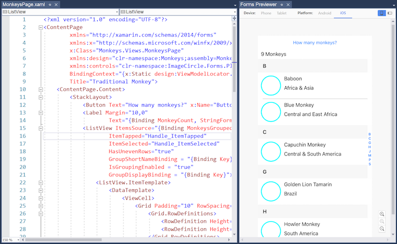
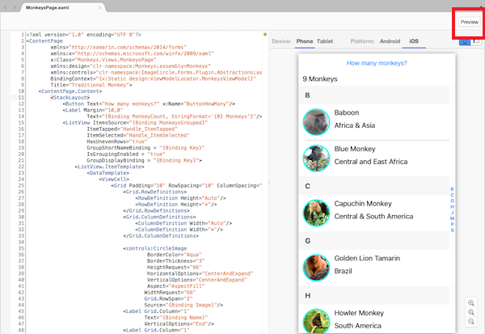

# XAML Previewer for Xamarin.Forms

_See your Xamarin.Forms layouts rendered as you type!_

## Requirements

Projects require the latest Xamarin.Forms NuGet package for the XAML Previewer to work. Previewing Android apps requires [JDK 1.8 x64](http://www.oracle.com/technetwork/java/javase/downloads/jdk8-downloads-2133151.html).

There is more information in the [release notes](https://developer.xamarin.com/releases/studio/xamarin.studio_6.2/xamarin.studio_6.2/#Xamarin_Forms_Previewer).

## Getting Started

# [Visual Studio](#tab/vswin)

Use the **View > Other Windows > Xamarin.Forms Previewer** menu in Visual Studio
to open the preview window. Use the **Window > New Vertical Tab Group**
menu to position it side-by-side.

[](xaml-previewer-images/xamlp-list-vs.png#lightbox "Forms Previewer in Visual Studio")

# [Visual Studio for Mac](#tab/vsmac)

The **Preview** button can be displayed on the editor by right-clicking a XAML file, and selecting **Open With > Forms Previewer**. The preview pane can then be shown or hidden by pressing the **Preview** button in the top-right corner of any XAML document window:

[](xaml-previewer-images/xamlp-list.png#lightbox "Forms Previewer in Visual Studio for Mac")

-----

## XAML Preview Options

The options along the top of the preview pane are:

* **Phone** – render in a phone-size screen
* **Tablet** – render in a tablet-size screen (note there are zoom controls at the bottom-right of the pane)
* **Android** – show the Android version of the screen
* **iOS** – show the iOS version of the screen
* Portait (icon) – uses portrait orientation for the preview
* Landscape (icon) – uses landscape orientation for the preview

## Adding Design-Time Data

Some layouts may be hard to visualize without any data bound to the user interface
controls. To make the preview more useful, assign some static data to the
controls by hardcoding a binding context (either in the code-behind or using XAML).

Refer to James Montemagno's [blog post on adding design-time data](http://motzcod.es/post/143702671962/xamarinforms-xaml-previewer-design-time-data)
to see how to bind to a static ViewModel in XAML.

## Detecting Design Mode

The static [`DesignMode.IsDesignModeEnabled`](xref:Xamarin.Forms.DesignMode.IsDesignModeEnabled) property can be examined to determine whether the application is running in the previewer. This allows you to specify code that will only execute when the application is running in the previewer:

```csharp
if (DesignMode.IsDesignModeEnabled)
{
  // Previewer only code  
}
```

## Troubleshooting

Check the issues below, and the [Xamarin Forums](https://forums.xamarin.com/categories/xamarin-forms),
if you encounter problems.

### XAML Preview isn't showing

Check the following:

* Project should be built (compiled) before attempting to preview XAML files.
* The Designer Agent must be set-up the first time you preview a XAML file - a progress indicator will appear in the Previewer, along with progress messages, until this is ready.
* Try closing and re-opening the XAML file.

### Invalid XAML: The Android project needs to built before preview can be created

The XAML Previewer requires that the project be built before rendering a page.
If the error below appears at the top of the preview pane, re-build the
application and try again.


